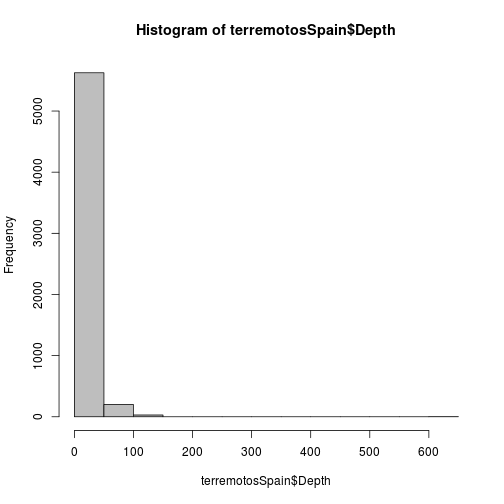
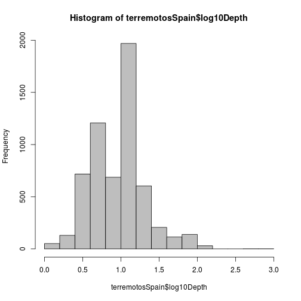
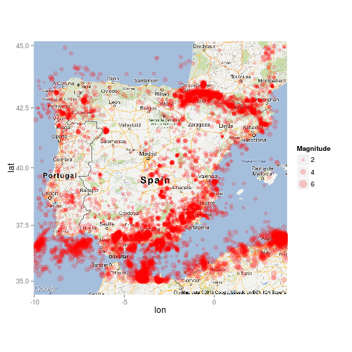

Terremotos Peninsula Iberica
========================== 

Terremotos producidos en la Peninsula Iberica 

******
#### Abril 2013
#### Guillermo Santos Garcia [@gsantosgo](http://twitter.com/gsantosgo)
#### This script is licensed under the GPLv2 license http://www.gnu.org/licenses/gpl.html
----------------------------------------------------------------
Note: This analysis was created on a Ubuntu 12.0.4 (RStudio 2.5.13). 
------

## Preliminaries

#### Set Working Directory

```r
getwd()
```

```
## [1] "/home/gsantos/R/RStats/Data Analysis"
```

```r
WORKING_DIR <- "~/R/RStats/Data Analysis/"
DATASET_FILE <- "./data/terremotosSpain.rda"
FIGURES_DIR <- "./figures/"
setwd(WORKING_DIR)
getwd()
```

```
## [1] "/home/gsantos/R/RStats/Data Analysis"
```

```r
# Figures Label
opts_chunk$set(echo = FALSE, fig.path = "figures/plot-ts-", cache = TRUE)
```


### Load libraries/data/create new variables


```
## [1] "C"
```

```
## [1] "es_ES.UTF-8"
```


------

## Exploratory analysis

### Get minimum and maximum times and date downloaded (Methods/Data Collection)


```
## [1] "2000-03-23 14:33:36 CET"
```

```
## [1] "2013-03-23 02:57:39 CET"
```

```
## [1] "Mon Apr 29 21:05:19 2013"
```


### Find number of missing values/check ranges (Results paragraph 1)


```
## [1] 31126
```

```
##                           DateTime       Latitude      Longitude     
##  2000-03-23T14:33:36.110+00:00:   1   Min.   :35.0   Min.   :-9.990  
##  2000-03-24T01:39:20.310+00:00:   1   1st Qu.:36.6   1st Qu.:-4.337  
##  2000-03-24T01:59:46.800+00:00:   1   Median :37.2   Median :-2.847  
##  2000-03-25T07:28:07.000+00:00:   1   Mean   :38.7   Mean   :-2.510  
##  2000-03-25T18:48:17.970+00:00:   1   3rd Qu.:42.3   3rd Qu.:-0.342  
##  2000-03-25T20:39:20.060+00:00:   1   Max.   :45.0   Max.   : 5.000  
##  (Other)                      :9985                                  
##      Depth        Magnitude       MagType       NbStations   
##  Min.   :  0    Min.   :0.30   mblg   :5341   Min.   :  3.0  
##  1st Qu.:  5    1st Qu.:2.00   ml     :2791   1st Qu.:  6.0  
##  Median : 10    Median :2.40   m      :1470   Median : 10.0  
##  Mean   : 12    Mean   :2.46          : 198   Mean   : 17.7  
##  3rd Qu.: 11    3rd Qu.:2.90   mb     : 128   3rd Qu.: 19.0  
##  Max.   :630    Max.   :6.80   md     :  37   Max.   :786.0  
##  NA's   :4134   NA's   :198    (Other):  26   NA's   :146    
##       Gap          Distance         RMS       Source    
##  Min.   : 14    Min.   :4      Min.   :0      pde:9990  
##  1st Qu.:107    1st Qu.:4      1st Qu.:1      us :   1  
##  Median :193    Median :4      Median :1                
##  Mean   :187    Mean   :4      Mean   :1                
##  3rd Qu.:266    3rd Qu.:4      3rd Qu.:1                
##  Max.   :355    Max.   :4      Max.   :2                
##  NA's   :3366   NA's   :9990   NA's   :9158             
##                     EventID        Version           log10Depth  
##  pde20000323143336110_3 :   1   Min.   :1.36e+12   Min.   :0     
##  pde20000324013920310_2 :   1   1st Qu.:1.36e+12   1st Qu.:1     
##  pde20000324015946800_4 :   1   Median :1.36e+12   Median :1     
##  pde20000325072807000_11:   1   Mean   :1.36e+12   Mean   :1     
##  pde20000325184817970_0 :   1   3rd Qu.:1.36e+12   3rd Qu.:1     
##  pde20000325203920060_2 :   1   Max.   :1.36e+12   Max.   :3     
##  (Other)                :9985                      NA's   :4134  
##       time                    
##  Min.   :2000-03-23 14:33:36  
##  1st Qu.:2002-07-07 20:36:03  
##  Median :2003-09-21 19:14:35  
##  Mean   :2003-11-03 22:12:05  
##  3rd Qu.:2004-06-09 07:44:35  
##  Max.   :2013-03-23 02:57:39  
## 
```


### Look at patterns over time 
  


### Look at distribution of magnitudes (Results paragraph 2)

```
## [1] 0.7514
```

```
## [1] 0.2184
```

Most earthquakes are small (< 3) or medium (>3 and < 5)


### Look at distribution of depths (Results paragraph 2)

  


### Map of Spain 

```
## Warning: bounding box given to google - spatial extent only approximate.
```

```
## converting bounding box to center/zoom specification. (experimental)
```

```
## Map from URL :
## http://maps.googleapis.com/maps/api/staticmap?center=40,-3&zoom=6&size=%20640x640&scale=%202&maptype=roadmap&sensor=false
```

```
## Google Maps API Terms of Service : http://developers.google.com/maps/terms
```

```
## Warning: Removed 381 rows containing missing values (geom_point).
```

 

