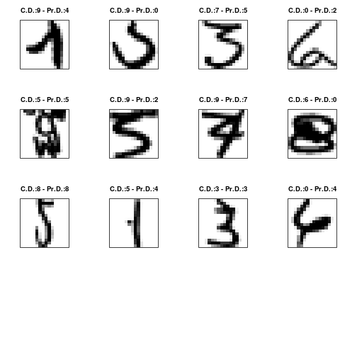

 Madrid Java User Group (Madrid JUG)


Handwritten Digit Recognition (CLASSIFICATION PROBLEM)
========================================================
This is a classification problem (machine learning)

  Dataset ZipCode (Dimensions)
  http://www-stat.stanford.edu/~tibs/ElemStatLearn/datasets/zip.info

Normalized handwritten digits, automatically scanned from envelopes by 
the U.S. Postal Service. The original scanned digits are binary and 
of different sizes and orientations; the images here have been deslanted 
and size normalized, resulting in 16 x 16 grayscale images (Le Cun et al., 1990).

The data are in two gzipped files, and each line consists of the digit id (0-9) followed 
by the 256 grayscale values.

  001 002 003 004 ... 015 016  
  017 018 019 020 ... 031 032   
  033 034 035 036 ... 037 038   
   |   |   |   |  ...  |   |  
  209 210 211 212 ... 223 224   
  225 226 227 228 ... 239 240   
  241 242 243 244 ... 255 256   
******
#### May 9, 2013
#### Jose Maria Gomez Hidalgo [@jmgomez](http://twitter.com/jmgomez)
#### Guillermo Santos Garcia [@gsantosgo](http://twitter.com/gsantosgo)
#### This script is licensed under the GPLv2 license http://www.gnu.org/licenses/gpl.html
----------------------------------------------------------------

## Preliminaries
### Set Working Directory

```r
getwd()
```

```
## [1] "/home/gsantos/R/RStats/MadridJUG-DataMining"
```

```r
WORKING_DIR <- "~/R/RStats/MadridJUG-DataMining/"
# WORKING_DIR <- 'C:/Users/gsantos/R/RStats/MadridJUG-DataMining'
DATASET_DIR <- "./data/"
FIGURES_DIR <- "./figures/"
COLORS <- c("white", "black")
setwd(WORKING_DIR)
getwd()
```

```
## [1] "/home/gsantos/R/RStats/MadridJUG-DataMining"
```


### Load libraries/data/create new variables


```r
### Load Libraries
### install.packages(c('knitr','RColorBrewer','ElemStatLearn','foreign','tree''RWeka','rpart','maptree','e1071'))
library(knitr)  # Markdown
library(RColorBrewer)
library(ElemStatLearn)
library(foreign)  # For reading and writing data stored by statistical packages such as Minitab,S,SAS,SPSS
library(tree)
library(maptree)
```

```
## Loading required package: cluster
```

```
## Loading required package: rpart
```

```r
library(rpart)  # Recursive Partitioning and Regression Trees (RPart)
library(RWeka)  # Weka
```

```
## Attaching package: 'RWeka'
```

```
## The following object(s) are masked from 'package:foreign':
## 
## read.arff, write.arff
```

```r
library(FNN)  # Fast k-Nearest Neighbors (kNN)
library(e1071)  # Support Vector Machine (SVM)
```

```
## Loading required package: class
```

```
## Attaching package: 'class'
```

```
## The following object(s) are masked from 'package:FNN':
## 
## knn, knn.cv
```

```r

### Set Color colorRampPalette(COLORS) ( 4 ) ## (n)
CUSTOM_COLORS <- colorRampPalette(colors = COLORS)
CUSTOM_COLORS_PLOT <- colorRampPalette(brewer.pal(10, "Set3"))
# Figures Label
opts_chunk$set(fig.path = "figures/plot-handwritten")
# opts_chunk$set(echo=FALSE, fig.path='figures/plot-hw-', cache=TRUE)

### Load data
DATASET.train <- as.data.frame(zip.train)
DATASET.test <- as.data.frame(zip.test)
```


------

## Exploratory analysis

### Look at the TRAINING data set 


```r
head(DATASET.train)
```

```
##   V1 V2 V3 V4     V5     V6     V7     V8     V9    V10    V11    V12
## 1  6 -1 -1 -1 -1.000 -1.000 -1.000 -1.000 -0.631  0.862 -0.167 -1.000
## 2  5 -1 -1 -1 -0.813 -0.671 -0.809 -0.887 -0.671 -0.853 -1.000 -1.000
## 3  4 -1 -1 -1 -1.000 -1.000 -1.000 -1.000 -1.000 -1.000 -0.996  0.147
## 4  7 -1 -1 -1 -1.000 -1.000 -0.273  0.684  0.960  0.450 -0.067 -0.679
## 5  3 -1 -1 -1 -1.000 -1.000 -0.928 -0.204  0.751  0.466  0.234 -0.809
## 6  6 -1 -1 -1 -1.000 -1.000 -0.397  0.983 -0.535 -1.000 -1.000 -1.000
##      V13    V14    V15    V16 V17 V18 V19 V20    V21    V22    V23    V24
## 1 -1.000 -1.000 -1.000 -1.000  -1  -1  -1  -1 -1.000 -1.000 -1.000 -0.992
## 2 -0.774 -0.180  0.052 -0.241  -1  -1  -1  -1  0.392  1.000  0.857  0.727
## 3  1.000 -0.189 -1.000 -1.000  -1  -1  -1  -1 -1.000 -1.000 -1.000 -1.000
## 4 -1.000 -1.000 -1.000 -1.000  -1  -1  -1  -1 -1.000 -0.114  0.974  0.917
## 5 -1.000 -1.000 -1.000 -1.000  -1  -1  -1  -1 -1.000 -0.370  0.739  1.000
## 6 -1.000 -1.000 -1.000 -1.000  -1  -1  -1  -1 -1.000 -1.000  0.692  0.536
##      V25    V26    V27    V28    V29    V30    V31    V32 V33 V34 V35 V36
## 1  0.297  1.000  0.307 -1.000 -1.000 -1.000 -1.000 -1.000  -1  -1  -1  -1
## 2  1.000  0.805  0.613  0.613  0.860  1.000  1.000  0.396  -1  -1  -1  -1
## 3 -1.000 -1.000 -0.882  1.000  0.390 -0.811 -1.000 -1.000  -1  -1  -1  -1
## 4  0.734  0.994  1.000  0.973  0.391 -0.421 -0.976 -1.000  -1  -1  -1  -1
## 5  1.000  1.000  1.000  0.644 -0.890 -1.000 -1.000 -1.000  -1  -1  -1  -1
## 6 -0.767 -1.000 -1.000 -1.000 -1.000 -1.000 -1.000 -1.000  -1  -1  -1  -1
##      V37    V38    V39    V40    V41    V42    V43    V44    V45 V46
## 1 -1.000 -1.000 -1.000 -0.410  1.000  0.986 -0.565 -1.000 -1.000  -1
## 2 -0.548  1.000  1.000  1.000  1.000  1.000  1.000  1.000  1.000   1
## 3 -1.000 -1.000 -1.000 -1.000 -1.000 -1.000 -0.715  1.000  0.029  -1
## 4 -0.323  0.991  0.622 -0.738 -1.000 -0.639  0.023  0.871  1.000   1
## 5 -1.000  0.616  1.000  0.688 -0.455 -0.731  0.659  1.000 -0.287  -1
## 6 -1.000 -0.921  0.928 -0.118 -1.000 -1.000 -1.000 -1.000 -1.000  -1
##      V47    V48    V49 V50 V51 V52    V53    V54    V55    V56 V57    V58
## 1 -1.000 -1.000 -1.000  -1  -1  -1 -1.000 -1.000 -0.683  0.825   1  0.562
## 2  1.000  0.875 -0.957  -1  -1  -1 -0.786  0.961  1.000  1.000   1  0.727
## 3 -1.000 -1.000 -1.000  -1  -1  -1 -1.000 -0.888 -0.912 -1.000  -1 -1.000
## 4 -0.432 -1.000 -1.000  -1  -1  -1  0.409  1.000  0.000 -1.000  -1 -1.000
## 5 -1.000 -1.000 -1.000  -1  -1  -1 -1.000 -0.376 -0.186 -0.874  -1 -1.000
## 6 -1.000 -1.000 -1.000  -1  -1  -1 -1.000 -0.394  1.000 -0.596  -1 -1.000
##      V59    V60    V61    V62    V63   V64 V65 V66 V67    V68    V69
## 1 -1.000 -1.000 -1.000 -1.000 -1.000 -1.00  -1  -1  -1 -1.000 -1.000
## 2  0.403  0.403  0.171 -0.314 -0.314 -0.94  -1  -1  -1 -1.000 -0.298
## 3 -0.549  1.000  0.361 -1.000 -1.000 -1.00  -1  -1  -1 -1.000 -0.938
## 4 -1.000 -0.842  0.714  1.000 -0.534 -1.00  -1  -1  -1 -0.879  0.965
## 5 -0.014  1.000 -0.253 -1.000 -1.000 -1.00  -1  -1  -1 -1.000 -1.000
## 6 -1.000 -1.000 -1.000 -1.000 -1.000 -1.00  -1  -1  -1 -1.000 -1.000
##      V70    V71    V72    V73    V74    V75    V76    V77    V78    V79
## 1 -0.938  0.540  1.000  0.778 -0.715 -1.000 -1.000 -1.000 -1.000 -1.000
## 2  1.000  1.000  1.000  0.440  0.056 -0.755 -1.000 -1.000 -1.000 -1.000
## 3  0.694  0.057 -1.000 -1.000 -1.000 -0.382  1.000  0.511 -1.000 -1.000
## 4  1.000 -0.713 -1.000 -1.000 -1.000 -1.000 -0.606  0.977  0.695 -0.906
## 5 -1.000 -1.000 -1.000 -1.000 -0.978  0.501  1.000 -0.540 -1.000 -1.000
## 6  0.060  0.900 -0.951 -1.000 -1.000 -1.000 -0.647  0.455 -0.333 -1.000
##   V80 V81 V82 V83    V84    V85    V86    V87    V88    V89    V90    V91
## 1  -1  -1  -1  -1 -1.000 -1.000  0.100  1.000  0.922 -0.439 -1.000 -1.000
## 2  -1  -1  -1  -1 -1.000  0.366  1.000  1.000  1.000  1.000  1.000  0.889
## 3  -1  -1  -1  -1 -1.000 -0.311  1.000 -0.043 -1.000 -1.000 -1.000 -0.648
## 4  -1  -1  -1  -1 -0.528  1.000  0.931 -0.888 -1.000 -1.000 -1.000 -0.949
## 5  -1  -1  -1  -1 -1.000 -1.000 -1.000 -0.998 -0.341  0.296  0.371  1.000
## 6  -1  -1  -1  -1 -1.000 -1.000  0.259  0.676 -1.000 -1.000 -1.000 -0.984
##      V92    V93    V94 V95 V96 V97 V98 V99  V100   V101   V102   V103
## 1 -1.000 -1.000 -1.000  -1  -1  -1  -1  -1 -1.00 -0.257  0.950  1.000
## 2 -0.081 -0.920 -1.000  -1  -1  -1  -1  -1 -1.00 -0.396  0.886  0.974
## 3  1.000  0.644 -1.000  -1  -1  -1  -1  -1 -1.00  0.489  1.000 -0.493
## 4  0.559  0.984 -0.363  -1  -1  -1  -1  -1 -0.97 -0.266 -0.555 -1.000
## 5  0.417 -0.989 -1.000  -1  -1  -1  -1  -1 -1.00 -1.000 -1.000 -0.008
## 6  0.677  0.981  0.551  -1  -1  -1  -1  -1 -1.00 -0.994  0.699  0.305
##     V104   V105  V106   V107   V108   V109   V110 V111 V112 V113 V114 V115
## 1 -0.162 -1.000 -1.00 -1.000 -0.987 -0.714 -0.832   -1   -1   -1   -1   -1
## 2  0.851  0.851  0.95  1.000  1.000  0.539 -0.754   -1   -1   -1   -1   -1
## 3 -1.000 -1.000 -1.00 -0.564  1.000  0.693 -1.000   -1   -1   -1   -1   -1
## 4 -1.000 -1.000 -1.00 -0.186  1.000  0.488 -1.000   -1   -1   -1   -1   -1
## 5  1.000  1.000  1.00  1.000  0.761 -0.731 -1.000   -1   -1   -1   -1   -1
## 6 -1.000 -1.000 -1.00 -0.499  1.000 -0.092  0.751   -1   -1   -1   -1   -1
##     V116   V117   V118   V119   V120 V121   V122   V123  V124   V125
## 1 -0.797  0.909  1.000  0.300 -0.961   -1 -1.000 -0.550 0.485  0.996
## 2 -1.000 -1.000 -0.886 -0.505 -1.000   -1 -0.649  0.405 1.000  1.000
## 3 -0.966  0.988  1.000 -0.893 -1.000   -1 -1.000 -0.397 1.000  0.903
## 4 -1.000 -1.000 -1.000 -1.000 -1.000   -1 -1.000  0.697 0.992 -0.458
## 5 -1.000 -1.000 -1.000  0.242  1.000    1  0.319  0.259 1.000  0.742
## 6 -1.000 -0.923  0.966 -0.107 -1.000   -1 -1.000 -0.300 0.854 -0.382
##     V126   V127 V128 V129 V130 V131   V132   V133   V134   V135   V136
## 1  0.867  0.092   -1   -1   -1   -1  0.278  1.000  0.877 -0.824 -1.000
## 2  0.653 -0.838   -1   -1   -1   -1 -1.000 -1.000 -1.000 -1.000 -1.000
## 3 -0.977 -1.000   -1   -1   -1   -1 -0.559  1.000  1.000 -0.297 -1.000
## 4 -1.000 -1.000   -1   -1   -1   -1 -1.000 -1.000 -1.000 -1.000 -1.000
## 5 -0.757 -1.000   -1   -1   -1   -1 -1.000 -1.000 -1.000 -0.975 -0.467
## 6  0.617 -1.000   -1   -1   -1   -1 -1.000 -0.409  1.000 -0.529 -1.000
##     V137   V138   V139   V140   V141   V142   V143   V144 V145  V146
## 1 -0.905  0.145  0.977  1.000  1.000  1.000  0.990 -0.745   -1 -1.00
## 2 -1.000 -1.000 -1.000 -0.550  0.993  1.000  0.618 -0.869   -1 -0.96
## 3 -1.000 -1.000 -0.611  1.000  0.873 -0.698 -0.552 -1.000   -1 -1.00
## 4 -1.000 -0.341  1.000  0.608 -1.000 -1.000 -1.000 -1.000   -1 -1.00
## 5 -0.989 -1.000 -1.000 -0.171  0.998  0.669 -0.945 -1.000   -1 -1.00
## 6 -1.000 -1.000  0.048  0.614 -0.268  0.544 -1.000 -1.000   -1 -1.00
##     V147   V148   V149   V150   V151   V152   V153   V154   V155   V156
## 1 -0.950  0.847  1.000  0.327 -1.000 -1.000  0.355  1.000  0.655 -0.109
## 2 -0.512  0.134 -0.343 -0.796 -1.000 -1.000 -1.000 -1.000 -1.000 -1.000
## 3 -1.000 -0.126  1.000  1.000  0.766 -0.764 -1.000 -1.000 -0.577  1.000
## 4 -1.000 -1.000 -1.000 -1.000 -1.000 -1.000 -1.000  0.471  0.998 -0.416
## 5 -1.000 -1.000 -1.000 -1.000 -1.000 -1.000 -1.000 -1.000 -1.000 -1.000
## 6 -1.000 -1.000  0.050  0.971 -0.839 -1.000 -1.000 -1.000  0.172  0.526
##     V157   V158   V159   V160 V161   V162  V163   V164   V165   V166
## 1 -0.185  1.000  0.988 -0.723   -1 -1.000 -0.63  1.000  1.000  0.068
## 2 -0.432  0.994  1.000  0.223   -1  0.426  1.00  1.000  1.000  0.214
## 3  0.933  0.484 -0.197 -1.000   -1 -1.000 -1.00 -0.818 -0.355  0.334
## 4 -1.000 -1.000 -1.000 -1.000   -1 -1.000 -1.00 -1.000 -1.000 -1.000
## 5  0.228  1.000  0.038 -1.000   -1 -1.000 -1.00 -1.000 -1.000 -1.000
## 6 -0.003  0.307 -1.000 -1.000   -1 -1.000 -1.00 -1.000  0.398  0.459
##     V167   V168   V169   V170   V171   V172   V173   V174   V175   V176
## 1 -0.925  0.113  0.960  0.308 -0.884 -1.000 -0.075  1.000  0.641 -0.995
## 2 -1.000 -1.000 -1.000 -1.000 -1.000 -1.000 -1.000  0.292  1.000  0.967
## 3  1.000  0.868 -0.289 -0.677 -0.596  1.000  1.000  1.000 -0.581 -1.000
## 4 -1.000 -1.000 -0.644  0.963  0.590 -0.999 -1.000 -1.000 -1.000 -1.000
## 5 -1.000 -1.000 -1.000 -1.000 -1.000 -1.000 -0.826  0.918  0.933 -0.794
## 6 -1.000 -1.000 -1.000 -1.000  0.372  0.555  0.520 -0.045 -1.000 -1.000
##    V177   V178   V179   V180   V181   V182   V183 V184   V185   V186
## 1 -1.00 -1.000 -0.677  1.000  1.000  0.753  0.341    1  0.707 -0.942
## 2 -0.88  0.449  1.000  0.896 -0.094 -0.750 -1.000   -1 -1.000 -1.000
## 3 -1.00 -1.000 -1.000 -1.000 -1.000 -0.954  0.118    1  1.000  1.000
## 4 -1.00 -1.000 -1.000 -1.000 -1.000 -1.000 -1.000   -1  0.061  1.000
## 5 -1.00 -1.000 -1.000 -0.666  0.337  0.224 -0.908   -1 -1.000 -1.000
## 6 -1.00 -1.000 -1.000 -1.000  0.671  0.176 -1.000   -1 -1.000 -1.000
##     V187   V188   V189   V190   V191   V192   V193   V194   V195   V196
## 1 -1.000 -1.000  0.545  1.000  0.027 -1.000 -1.000 -1.000 -0.903  0.792
## 2 -1.000 -1.000 -1.000 -0.627  1.000  1.000  0.198 -0.105  1.000  1.000
## 3  1.000  1.000  0.973 -0.092 -0.995 -1.000 -1.000 -1.000 -1.000 -1.000
## 4 -0.079 -1.000 -1.000 -1.000 -1.000 -1.000 -1.000 -1.000 -1.000 -1.000
## 5 -1.000 -1.000 -1.000  0.418  1.000 -0.258 -1.000 -1.000 -0.246  1.000
## 6  0.236  0.934  0.971 -0.712 -1.000 -1.000 -1.000 -1.000 -1.000 -1.000
##     V197   V198   V199   V200   V201   V202   V203   V204   V205   V206
## 1  1.000  1.000  1.000  1.000  0.536  0.184  0.812  0.837  0.978  0.864
## 2  1.000  0.639 -0.168 -0.314 -0.446 -1.000 -1.000 -0.999 -0.337  0.147
## 3 -1.000 -1.000 -0.993 -0.464  0.046  0.290  0.457  1.000  0.721 -1.000
## 4 -1.000 -1.000 -1.000 -1.000  0.773  0.958 -0.714 -1.000 -1.000 -1.000
## 5  1.000  0.355 -0.958 -1.000 -1.000 -1.000 -1.000 -1.000 -1.000 -0.077
## 6  0.763  0.084 -1.000 -1.000 -1.000 -1.000  0.073  1.000  0.265 -1.000
##     V207   V208   V209   V210   V211   V212   V213   V214   V215   V216
## 1 -0.630 -1.000 -1.000 -1.000 -1.000 -0.452  0.828  1.000  1.000  1.000
## 2  0.996  1.000  0.667 -0.808  0.065  0.993  1.000  1.000  1.000  1.000
## 3 -1.000 -1.000 -1.000 -1.000 -1.000 -1.000 -1.000 -1.000 -1.000 -1.000
## 4 -1.000 -1.000 -1.000 -1.000 -1.000 -1.000 -1.000 -1.000 -1.000 -0.545
## 5  1.000  0.344 -1.000 -1.000  0.075  1.000  1.000  0.649  0.256 -0.200
## 6 -1.000 -1.000 -1.000 -1.000 -1.000 -1.000  0.563  0.210 -1.000 -1.000
##     V217   V218   V219   V220   V221   V222 V223   V224   V225 V226   V227
## 1  1.000  1.000  1.000  1.000  1.000  0.135   -1 -1.000 -1.000   -1 -1.000
## 2  0.996  0.970  0.970  0.970  0.998  1.000    1  1.000  0.109   -1 -1.000
## 3 -1.000 -1.000 -0.426  1.000  0.555 -1.000   -1 -1.000 -1.000   -1 -1.000
## 4  0.989  0.432 -1.000 -1.000 -1.000 -1.000   -1 -1.000 -1.000   -1 -1.000
## 5 -0.351 -0.733 -0.733 -0.733 -0.433  0.649    1  0.093 -1.000   -1 -0.959
## 6 -0.930 -0.127  0.890  0.935 -0.845 -1.000   -1 -1.000 -1.000   -1 -1.000
##     V228   V229   V230   V231   V232   V233   V234   V235   V236   V237
## 1 -1.000 -0.483  0.813  1.000  1.000  1.000  1.000  1.000  1.000  0.219
## 2 -0.830 -0.242  0.350  0.800  1.000  1.000  1.000  1.000  1.000  1.000
## 3 -1.000 -1.000 -1.000 -1.000 -1.000 -1.000 -1.000  0.024  1.000  0.388
## 4 -1.000 -1.000 -1.000 -1.000 -0.348  1.000  0.798 -0.935 -1.000 -1.000
## 5 -0.062  0.821  1.000  1.000  1.000  1.000  1.000  1.000  1.000  1.000
## 6 -1.000  0.093  0.793 -0.205  0.214  0.746  0.918  0.692  0.954 -0.882
##     V238   V239   V240  V241 V242 V243 V244   V245   V246   V247   V248
## 1 -0.943 -1.000 -1.000 -1.00   -1   -1   -1 -1.000 -0.974 -0.429  0.304
## 2  1.000  1.000  0.616 -0.93   -1   -1   -1 -1.000 -1.000 -0.858 -0.671
## 3 -1.000 -1.000 -1.000 -1.00   -1   -1   -1 -1.000 -1.000 -1.000 -1.000
## 4 -1.000 -1.000 -1.000 -1.00   -1   -1   -1 -1.000 -1.000 -1.000 -0.318
## 5  1.000  0.583 -0.843 -1.00   -1   -1   -1 -0.877 -0.326  0.174  0.466
## 6 -1.000 -1.000 -1.000 -1.00   -1   -1   -1 -0.898  0.323  1.000  0.803
##     V249   V250   V251   V252   V253   V254   V255   V256 V257
## 1  0.823  1.000  0.482 -0.474 -0.991 -1.000 -1.000 -1.000   -1
## 2 -0.671 -0.033  0.761  0.762  0.126 -0.095 -0.671 -0.828   -1
## 3 -1.000 -1.000 -0.109  1.000 -0.179 -1.000 -1.000 -1.000   -1
## 4  1.000  0.536 -0.987 -1.000 -1.000 -1.000 -1.000 -1.000   -1
## 5  0.639  1.000  1.000  0.791  0.439 -0.199 -0.883 -1.000   -1
## 6  0.015 -0.862 -0.871 -0.437 -1.000 -1.000 -1.000 -1.000   -1
```

```r
dim(DATASET.train)
```

```
## [1] 7291  257
```

```r
nrow(DATASET.train)
```

```
## [1] 7291
```

```r
ncol(DATASET.train)
```

```
## [1] 257
```

```r
colnames(DATASET.train)
```

```
##   [1] "V1"   "V2"   "V3"   "V4"   "V5"   "V6"   "V7"   "V8"   "V9"   "V10" 
##  [11] "V11"  "V12"  "V13"  "V14"  "V15"  "V16"  "V17"  "V18"  "V19"  "V20" 
##  [21] "V21"  "V22"  "V23"  "V24"  "V25"  "V26"  "V27"  "V28"  "V29"  "V30" 
##  [31] "V31"  "V32"  "V33"  "V34"  "V35"  "V36"  "V37"  "V38"  "V39"  "V40" 
##  [41] "V41"  "V42"  "V43"  "V44"  "V45"  "V46"  "V47"  "V48"  "V49"  "V50" 
##  [51] "V51"  "V52"  "V53"  "V54"  "V55"  "V56"  "V57"  "V58"  "V59"  "V60" 
##  [61] "V61"  "V62"  "V63"  "V64"  "V65"  "V66"  "V67"  "V68"  "V69"  "V70" 
##  [71] "V71"  "V72"  "V73"  "V74"  "V75"  "V76"  "V77"  "V78"  "V79"  "V80" 
##  [81] "V81"  "V82"  "V83"  "V84"  "V85"  "V86"  "V87"  "V88"  "V89"  "V90" 
##  [91] "V91"  "V92"  "V93"  "V94"  "V95"  "V96"  "V97"  "V98"  "V99"  "V100"
## [101] "V101" "V102" "V103" "V104" "V105" "V106" "V107" "V108" "V109" "V110"
## [111] "V111" "V112" "V113" "V114" "V115" "V116" "V117" "V118" "V119" "V120"
## [121] "V121" "V122" "V123" "V124" "V125" "V126" "V127" "V128" "V129" "V130"
## [131] "V131" "V132" "V133" "V134" "V135" "V136" "V137" "V138" "V139" "V140"
## [141] "V141" "V142" "V143" "V144" "V145" "V146" "V147" "V148" "V149" "V150"
## [151] "V151" "V152" "V153" "V154" "V155" "V156" "V157" "V158" "V159" "V160"
## [161] "V161" "V162" "V163" "V164" "V165" "V166" "V167" "V168" "V169" "V170"
## [171] "V171" "V172" "V173" "V174" "V175" "V176" "V177" "V178" "V179" "V180"
## [181] "V181" "V182" "V183" "V184" "V185" "V186" "V187" "V188" "V189" "V190"
## [191] "V191" "V192" "V193" "V194" "V195" "V196" "V197" "V198" "V199" "V200"
## [201] "V201" "V202" "V203" "V204" "V205" "V206" "V207" "V208" "V209" "V210"
## [211] "V211" "V212" "V213" "V214" "V215" "V216" "V217" "V218" "V219" "V220"
## [221] "V221" "V222" "V223" "V224" "V225" "V226" "V227" "V228" "V229" "V230"
## [231] "V231" "V232" "V233" "V234" "V235" "V236" "V237" "V238" "V239" "V240"
## [241] "V241" "V242" "V243" "V244" "V245" "V246" "V247" "V248" "V249" "V250"
## [251] "V251" "V252" "V253" "V254" "V255" "V256" "V257"
```

```r
summary(DATASET.train)
```

```
##        V1            V2               V3               V4        
##  Min.   :0.0   Min.   :-1.000   Min.   :-1.000   Min.   :-1.000  
##  1st Qu.:1.0   1st Qu.:-1.000   1st Qu.:-1.000   1st Qu.:-1.000  
##  Median :4.0   Median :-1.000   Median :-1.000   Median :-1.000  
##  Mean   :3.9   Mean   :-0.996   Mean   :-0.981   Mean   :-0.951  
##  3rd Qu.:7.0   3rd Qu.:-1.000   3rd Qu.:-1.000   3rd Qu.:-1.000  
##  Max.   :9.0   Max.   : 0.638   Max.   : 1.000   Max.   : 1.000  
##        V5               V6               V7               V8        
##  Min.   :-1.000   Min.   :-1.000   Min.   :-1.000   Min.   :-1.000  
##  1st Qu.:-1.000   1st Qu.:-1.000   1st Qu.:-1.000   1st Qu.:-1.000  
##  Median :-1.000   Median :-1.000   Median :-1.000   Median :-0.719  
##  Mean   :-0.888   Mean   :-0.773   Mean   :-0.610   Mean   :-0.369  
##  3rd Qu.:-1.000   3rd Qu.:-0.962   3rd Qu.:-0.391   3rd Qu.: 0.255  
##  Max.   : 1.000   Max.   : 1.000   Max.   : 1.000   Max.   : 1.000  
##        V9               V10               V11              V12        
##  Min.   :-1.0000   Min.   :-1.0000   Min.   :-1.000   Min.   :-1.000  
##  1st Qu.:-0.9990   1st Qu.:-0.9500   1st Qu.:-1.000   1st Qu.:-1.000  
##  Median : 0.0610   Median : 0.0020   Median :-0.561   Median :-0.995  
##  Mean   :-0.0458   Mean   :-0.0526   Mean   :-0.285   Mean   :-0.504  
##  3rd Qu.: 0.6960   3rd Qu.: 0.6745   3rd Qu.: 0.438   3rd Qu.:-0.012  
##  Max.   : 1.0000   Max.   : 1.0000   Max.   : 1.000   Max.   : 1.000  
##       V13              V14              V15              V16        
##  Min.   :-1.000   Min.   :-1.000   Min.   :-1.000   Min.   :-1.000  
##  1st Qu.:-1.000   1st Qu.:-1.000   1st Qu.:-1.000   1st Qu.:-1.000  
##  Median :-1.000   Median :-1.000   Median :-1.000   Median :-1.000  
##  Mean   :-0.686   Mean   :-0.815   Mean   :-0.906   Mean   :-0.966  
##  3rd Qu.:-0.685   3rd Qu.:-1.000   3rd Qu.:-1.000   3rd Qu.:-1.000  
##  Max.   : 1.000   Max.   : 1.000   Max.   : 1.000   Max.   : 1.000  
##       V17              V18              V19              V20        
##  Min.   :-1.000   Min.   :-1.000   Min.   :-1.000   Min.   :-1.000  
##  1st Qu.:-1.000   1st Qu.:-1.000   1st Qu.:-1.000   1st Qu.:-1.000  
##  Median :-1.000   Median :-1.000   Median :-1.000   Median :-1.000  
##  Mean   :-0.993   Mean   :-0.990   Mean   :-0.951   Mean   :-0.865  
##  3rd Qu.:-1.000   3rd Qu.:-1.000   3rd Qu.:-1.000   3rd Qu.:-1.000  
##  Max.   : 0.752   Max.   : 0.776   Max.   : 1.000   Max.   : 1.000  
##       V21              V22              V23              V24        
##  Min.   :-1.000   Min.   :-1.000   Min.   :-1.000   Min.   :-1.000  
##  1st Qu.:-1.000   1st Qu.:-1.000   1st Qu.:-1.000   1st Qu.:-0.904  
##  Median :-1.000   Median :-1.000   Median :-0.429   Median : 0.387  
##  Mean   :-0.696   Mean   :-0.434   Mean   :-0.143   Mean   : 0.131  
##  3rd Qu.:-0.881   3rd Qu.: 0.254   3rd Qu.: 0.876   3rd Qu.: 1.000  
##  Max.   : 1.000   Max.   : 1.000   Max.   : 1.000   Max.   : 1.000  
##       V25              V26               V27              V28         
##  Min.   :-1.000   Min.   :-1.0000   Min.   :-1.000   Min.   :-1.0000  
##  1st Qu.:-0.101   1st Qu.:-0.0535   1st Qu.:-0.849   1st Qu.:-1.0000  
##  Median : 0.855   Median : 0.8210   Median : 0.410   Median :-0.1570  
##  Mean   : 0.412   Mean   : 0.4148   Mean   : 0.149   Mean   :-0.0743  
##  3rd Qu.: 1.000   3rd Qu.: 1.0000   3rd Qu.: 1.000   3rd Qu.: 0.9165  
##  Max.   : 1.000   Max.   : 1.0000   Max.   : 1.000   Max.   : 1.0000  
##       V29              V30              V31            V32        
##  Min.   :-1.000   Min.   :-1.000   Min.   :-1.0   Min.   :-1.000  
##  1st Qu.:-1.000   1st Qu.:-1.000   1st Qu.:-1.0   1st Qu.:-1.000  
##  Median :-0.952   Median :-1.000   Median :-1.0   Median :-1.000  
##  Mean   :-0.347   Mean   :-0.614   Mean   :-0.8   Mean   :-0.918  
##  3rd Qu.: 0.515   3rd Qu.:-0.584   3rd Qu.:-1.0   3rd Qu.:-1.000  
##  Max.   : 1.000   Max.   : 1.000   Max.   : 1.0   Max.   : 1.000  
##       V33              V34              V35              V36        
##  Min.   :-1.000   Min.   :-1.000   Min.   :-1.000   Min.   :-1.000  
##  1st Qu.:-1.000   1st Qu.:-1.000   1st Qu.:-1.000   1st Qu.:-1.000  
##  Median :-1.000   Median :-1.000   Median :-1.000   Median :-1.000  
##  Mean   :-0.979   Mean   :-0.983   Mean   :-0.927   Mean   :-0.801  
##  3rd Qu.:-1.000   3rd Qu.:-1.000   3rd Qu.:-1.000   3rd Qu.:-1.000  
##  Max.   : 0.997   Max.   : 0.938   Max.   : 1.000   Max.   : 1.000  
##       V37              V38              V39               V40         
##  Min.   :-1.000   Min.   :-1.000   Min.   :-1.0000   Min.   :-1.0000  
##  1st Qu.:-1.000   1st Qu.:-1.000   1st Qu.:-1.0000   1st Qu.:-0.8700  
##  Median :-1.000   Median :-0.683   Median :-0.0220   Median : 0.1650  
##  Mean   :-0.550   Mean   :-0.233   Mean   :-0.0235   Mean   : 0.0661  
##  3rd Qu.:-0.242   3rd Qu.: 0.739   3rd Qu.: 0.9560   3rd Qu.: 0.9780  
##  Max.   : 1.000   Max.   : 1.000   Max.   : 1.0000   Max.   : 1.0000  
##       V41              V42              V43               V44         
##  Min.   :-1.000   Min.   :-1.000   Min.   :-1.0000   Min.   :-1.0000  
##  1st Qu.:-0.714   1st Qu.:-0.842   1st Qu.:-0.9670   1st Qu.:-1.0000  
##  Median : 0.539   Median : 0.461   Median :-0.0990   Median :-0.2340  
##  Mean   : 0.211   Mean   : 0.161   Mean   :-0.0353   Mean   :-0.0863  
##  3rd Qu.: 1.000   3rd Qu.: 1.000   3rd Qu.: 0.8970   3rd Qu.: 0.9070  
##  Max.   : 1.000   Max.   : 1.000   Max.   : 1.0000   Max.   : 1.0000  
##       V45              V46              V47             V48      
##  Min.   :-1.000   Min.   :-1.000   Min.   :-1.00   Min.   :-1.0  
##  1st Qu.:-1.000   1st Qu.:-1.000   1st Qu.:-1.00   1st Qu.:-1.0  
##  Median :-0.608   Median :-1.000   Median :-1.00   Median :-1.0  
##  Mean   :-0.214   Mean   :-0.497   Mean   :-0.76   Mean   :-0.9  
##  3rd Qu.: 0.762   3rd Qu.: 0.010   3rd Qu.:-1.00   3rd Qu.:-1.0  
##  Max.   : 1.000   Max.   : 1.000   Max.   : 1.00   Max.   : 1.0  
##       V49              V50              V51              V52        
##  Min.   :-1.000   Min.   :-1.000   Min.   :-1.000   Min.   :-1.000  
##  1st Qu.:-1.000   1st Qu.:-1.000   1st Qu.:-1.000   1st Qu.:-1.000  
##  Median :-1.000   Median :-1.000   Median :-1.000   Median :-1.000  
##  Mean   :-0.972   Mean   :-0.977   Mean   :-0.909   Mean   :-0.749  
##  3rd Qu.:-1.000   3rd Qu.:-1.000   3rd Qu.:-1.000   3rd Qu.:-0.985  
##  Max.   : 0.937   Max.   : 0.862   Max.   : 1.000   Max.   : 1.000  
##       V53              V54              V55              V56        
##  Min.   :-1.000   Min.   :-1.000   Min.   :-1.000   Min.   :-1.000  
##  1st Qu.:-1.000   1st Qu.:-1.000   1st Qu.:-1.000   1st Qu.:-1.000  
##  Median :-1.000   Median :-0.613   Median :-0.369   Median :-0.454  
##  Mean   :-0.464   Mean   :-0.190   Mean   :-0.130   Mean   :-0.177  
##  3rd Qu.: 0.113   3rd Qu.: 0.853   3rd Qu.: 0.901   3rd Qu.: 0.780  
##  Max.   : 1.000   Max.   : 1.000   Max.   : 1.000   Max.   : 1.000  
##       V57              V58              V59              V60        
##  Min.   :-1.000   Min.   :-1.000   Min.   :-1.000   Min.   :-1.000  
##  1st Qu.:-1.000   1st Qu.:-1.000   1st Qu.:-1.000   1st Qu.:-1.000  
##  Median :-0.352   Median :-0.544   Median :-0.645   Median :-0.473  
##  Mean   :-0.113   Mean   :-0.178   Mean   :-0.271   Mean   :-0.177  
##  3rd Qu.: 0.949   3rd Qu.: 0.878   3rd Qu.: 0.556   3rd Qu.: 0.815  
##  Max.   : 1.000   Max.   : 1.000   Max.   : 1.000   Max.   : 1.000  
##       V61              V62              V63              V64      
##  Min.   :-1.000   Min.   :-1.000   Min.   :-1.000   Min.   :-1.0  
##  1st Qu.:-1.000   1st Qu.:-1.000   1st Qu.:-1.000   1st Qu.:-1.0  
##  Median :-0.571   Median :-1.000   Median :-1.000   Median :-1.0  
##  Mean   :-0.185   Mean   :-0.435   Mean   :-0.727   Mean   :-0.9  
##  3rd Qu.: 0.851   3rd Qu.: 0.233   3rd Qu.:-0.972   3rd Qu.:-1.0  
##  Max.   : 1.000   Max.   : 1.000   Max.   : 1.000   Max.   : 1.0  
##       V65              V66              V67             V68        
##  Min.   :-1.000   Min.   :-1.000   Min.   :-1.00   Min.   :-1.000  
##  1st Qu.:-1.000   1st Qu.:-1.000   1st Qu.:-1.00   1st Qu.:-1.000  
##  Median :-1.000   Median :-1.000   Median :-1.00   Median :-1.000  
##  Mean   :-0.977   Mean   :-0.974   Mean   :-0.89   Mean   :-0.705  
##  3rd Qu.:-1.000   3rd Qu.:-1.000   3rd Qu.:-1.00   3rd Qu.:-0.920  
##  Max.   : 0.908   Max.   : 0.901   Max.   : 1.00   Max.   : 1.000  
##       V69              V70              V71              V72        
##  Min.   :-1.000   Min.   :-1.000   Min.   :-1.000   Min.   :-1.000  
##  1st Qu.:-1.000   1st Qu.:-1.000   1st Qu.:-1.000   1st Qu.:-1.000  
##  Median :-1.000   Median :-0.726   Median :-0.714   Median :-0.840  
##  Mean   :-0.424   Mean   :-0.217   Mean   :-0.241   Mean   :-0.333  
##  3rd Qu.: 0.290   3rd Qu.: 0.841   3rd Qu.: 0.751   3rd Qu.: 0.480  
##  Max.   : 1.000   Max.   : 1.000   Max.   : 1.000   Max.   : 1.000  
##       V73              V74              V75              V76        
##  Min.   :-1.000   Min.   :-1.000   Min.   :-1.000   Min.   :-1.000  
##  1st Qu.:-1.000   1st Qu.:-1.000   1st Qu.:-1.000   1st Qu.:-1.000  
##  Median :-0.945   Median :-0.947   Median :-0.811   Median :-0.629  
##  Mean   :-0.304   Mean   :-0.340   Mean   :-0.348   Mean   :-0.200  
##  3rd Qu.: 0.707   3rd Qu.: 0.561   3rd Qu.: 0.366   3rd Qu.: 0.831  
##  Max.   : 1.000   Max.   : 1.000   Max.   : 1.000   Max.   : 1.000  
##       V77              V78              V79              V80        
##  Min.   :-1.000   Min.   :-1.000   Min.   :-1.000   Min.   :-1.000  
##  1st Qu.:-1.000   1st Qu.:-1.000   1st Qu.:-1.000   1st Qu.:-1.000  
##  Median :-0.585   Median :-1.000   Median :-1.000   Median :-1.000  
##  Mean   :-0.182   Mean   :-0.416   Mean   :-0.704   Mean   :-0.893  
##  3rd Qu.: 0.865   3rd Qu.: 0.348   3rd Qu.:-0.951   3rd Qu.:-1.000  
##  Max.   : 1.000   Max.   : 1.000   Max.   : 1.000   Max.   : 1.000  
##       V81              V82              V83              V84        
##  Min.   :-1.000   Min.   :-1.000   Min.   :-1.000   Min.   :-1.000  
##  1st Qu.:-1.000   1st Qu.:-1.000   1st Qu.:-1.000   1st Qu.:-1.000  
##  Median :-1.000   Median :-1.000   Median :-1.000   Median :-1.000  
##  Mean   :-0.981   Mean   :-0.970   Mean   :-0.863   Mean   :-0.670  
##  3rd Qu.:-1.000   3rd Qu.:-1.000   3rd Qu.:-1.000   3rd Qu.:-0.877  
##  Max.   : 0.997   Max.   : 0.993   Max.   : 1.000   Max.   : 1.000  
##       V85              V86              V87              V88        
##  Min.   :-1.000   Min.   :-1.000   Min.   :-1.000   Min.   :-1.000  
##  1st Qu.:-1.000   1st Qu.:-1.000   1st Qu.:-1.000   1st Qu.:-1.000  
##  Median :-1.000   Median :-0.836   Median :-0.846   Median :-0.903  
##  Mean   :-0.423   Mean   :-0.255   Mean   :-0.278   Mean   :-0.366  
##  3rd Qu.: 0.340   3rd Qu.: 0.761   3rd Qu.: 0.687   3rd Qu.: 0.383  
##  Max.   : 1.000   Max.   : 1.000   Max.   : 1.000   Max.   : 1.000  
##       V89              V90              V91              V92        
##  Min.   :-1.000   Min.   :-1.000   Min.   :-1.000   Min.   :-1.000  
##  1st Qu.:-1.000   1st Qu.:-1.000   1st Qu.:-1.000   1st Qu.:-1.000  
##  Median :-0.943   Median :-0.925   Median :-0.727   Median :-0.604  
##  Mean   :-0.334   Mean   :-0.315   Mean   :-0.289   Mean   :-0.197  
##  3rd Qu.: 0.566   3rd Qu.: 0.655   3rd Qu.: 0.558   3rd Qu.: 0.834  
##  Max.   : 1.000   Max.   : 1.000   Max.   : 1.000   Max.   : 1.000  
##       V93              V94              V95              V96        
##  Min.   :-1.000   Min.   :-1.000   Min.   :-1.000   Min.   :-1.000  
##  1st Qu.:-1.000   1st Qu.:-1.000   1st Qu.:-1.000   1st Qu.:-1.000  
##  Median :-0.766   Median :-1.000   Median :-1.000   Median :-1.000  
##  Mean   :-0.230   Mean   :-0.450   Mean   :-0.701   Mean   :-0.876  
##  3rd Qu.: 0.809   3rd Qu.: 0.179   3rd Qu.:-0.973   3rd Qu.:-1.000  
##  Max.   : 1.000   Max.   : 1.000   Max.   : 1.000   Max.   : 1.000  
##       V97              V98              V99              V100       
##  Min.   :-1.000   Min.   :-1.000   Min.   :-1.000   Min.   :-1.000  
##  1st Qu.:-1.000   1st Qu.:-1.000   1st Qu.:-1.000   1st Qu.:-1.000  
##  Median :-1.000   Median :-1.000   Median :-1.000   Median :-1.000  
##  Mean   :-0.978   Mean   :-0.960   Mean   :-0.831   Mean   :-0.650  
##  3rd Qu.:-1.000   3rd Qu.:-1.000   3rd Qu.:-1.000   3rd Qu.:-0.846  
##  Max.   : 0.998   Max.   : 0.997   Max.   : 1.000   Max.   : 1.000  
##       V101             V102             V103             V104       
##  Min.   :-1.000   Min.   :-1.000   Min.   :-1.000   Min.   :-1.000  
##  1st Qu.:-1.000   1st Qu.:-1.000   1st Qu.:-1.000   1st Qu.:-1.000  
##  Median :-1.000   Median :-0.921   Median :-0.859   Median :-0.827  
##  Mean   :-0.443   Mean   :-0.294   Mean   :-0.283   Mean   :-0.319  
##  3rd Qu.: 0.280   3rd Qu.: 0.678   3rd Qu.: 0.675   3rd Qu.: 0.520  
##  Max.   : 1.000   Max.   : 1.000   Max.   : 1.000   Max.   : 1.000  
##       V105             V106             V107             V108       
##  Min.   :-1.000   Min.   :-1.000   Min.   :-1.000   Min.   :-1.000  
##  1st Qu.:-1.000   1st Qu.:-1.000   1st Qu.:-1.000   1st Qu.:-1.000  
##  Median :-0.836   Median :-0.726   Median :-0.519   Median :-0.583  
##  Mean   :-0.240   Mean   :-0.185   Mean   :-0.199   Mean   :-0.190  
##  3rd Qu.: 0.812   3rd Qu.: 0.916   3rd Qu.: 0.787   3rd Qu.: 0.851  
##  Max.   : 1.000   Max.   : 1.000   Max.   : 1.000   Max.   : 1.000  
##       V109             V110             V111             V112      
##  Min.   :-1.000   Min.   :-1.000   Min.   :-1.000   Min.   :-1.00  
##  1st Qu.:-1.000   1st Qu.:-1.000   1st Qu.:-1.000   1st Qu.:-1.00  
##  Median :-0.890   Median :-1.000   Median :-1.000   Median :-1.00  
##  Mean   :-0.290   Mean   :-0.494   Mean   :-0.698   Mean   :-0.85  
##  3rd Qu.: 0.693   3rd Qu.: 0.004   3rd Qu.:-0.962   3rd Qu.:-1.00  
##  Max.   : 1.000   Max.   : 1.000   Max.   : 1.000   Max.   : 1.00  
##       V113             V114             V115             V116       
##  Min.   :-1.000   Min.   :-1.000   Min.   :-1.000   Min.   :-1.000  
##  1st Qu.:-1.000   1st Qu.:-1.000   1st Qu.:-1.000   1st Qu.:-1.000  
##  Median :-1.000   Median :-1.000   Median :-1.000   Median :-1.000  
##  Mean   :-0.961   Mean   :-0.943   Mean   :-0.808   Mean   :-0.642  
##  3rd Qu.:-1.000   3rd Qu.:-1.000   3rd Qu.:-1.000   3rd Qu.:-0.851  
##  Max.   : 0.994   Max.   : 0.977   Max.   : 1.000   Max.   : 1.000  
##       V117             V118             V119             V120       
##  Min.   :-1.000   Min.   :-1.000   Min.   :-1.000   Min.   :-1.000  
##  1st Qu.:-1.000   1st Qu.:-1.000   1st Qu.:-1.000   1st Qu.:-1.000  
##  Median :-1.000   Median :-0.999   Median :-0.959   Median :-0.808  
##  Mean   :-0.461   Mean   :-0.345   Mean   :-0.330   Mean   :-0.315  
##  3rd Qu.: 0.209   3rd Qu.: 0.601   3rd Qu.: 0.590   3rd Qu.: 0.494  
##  Max.   : 1.000   Max.   : 1.000   Max.   : 1.000   Max.   : 1.000  
##       V121             V122             V123             V124       
##  Min.   :-1.000   Min.   :-1.000   Min.   :-1.000   Min.   :-1.000  
##  1st Qu.:-1.000   1st Qu.:-1.000   1st Qu.:-1.000   1st Qu.:-1.000  
##  Median :-0.684   Median :-0.380   Median :-0.345   Median :-0.579  
##  Mean   :-0.188   Mean   :-0.121   Mean   :-0.138   Mean   :-0.186  
##  3rd Qu.: 0.912   3rd Qu.: 0.955   3rd Qu.: 0.841   3rd Qu.: 0.852  
##  Max.   : 1.000   Max.   : 1.000   Max.   : 1.000   Max.   : 1.000  
##       V125             V126             V127             V128       
##  Min.   :-1.000   Min.   :-1.000   Min.   :-1.000   Min.   :-1.000  
##  1st Qu.:-1.000   1st Qu.:-1.000   1st Qu.:-1.000   1st Qu.:-1.000  
##  Median :-0.909   Median :-1.000   Median :-1.000   Median :-1.000  
##  Mean   :-0.319   Mean   :-0.502   Mean   :-0.674   Mean   :-0.818  
##  3rd Qu.: 0.571   3rd Qu.:-0.019   3rd Qu.:-0.904   3rd Qu.:-1.000  
##  Max.   : 1.000   Max.   : 1.000   Max.   : 1.000   Max.   : 1.000  
##       V129             V130             V131             V132       
##  Min.   :-1.000   Min.   :-1.000   Min.   :-1.000   Min.   :-1.000  
##  1st Qu.:-1.000   1st Qu.:-1.000   1st Qu.:-1.000   1st Qu.:-1.000  
##  Median :-1.000   Median :-1.000   Median :-1.000   Median :-1.000  
##  Mean   :-0.938   Mean   :-0.923   Mean   :-0.788   Mean   :-0.633  
##  3rd Qu.:-1.000   3rd Qu.:-1.000   3rd Qu.:-1.000   3rd Qu.:-0.785  
##  Max.   : 0.991   Max.   : 0.999   Max.   : 1.000   Max.   : 1.000  
##       V133             V134             V135             V136       
##  Min.   :-1.000   Min.   :-1.000   Min.   :-1.000   Min.   :-1.000  
##  1st Qu.:-1.000   1st Qu.:-1.000   1st Qu.:-1.000   1st Qu.:-1.000  
##  Median :-1.000   Median :-1.000   Median :-1.000   Median :-0.962  
##  Mean   :-0.486   Mean   :-0.413   Mean   :-0.431   Mean   :-0.395  
##  3rd Qu.: 0.054   3rd Qu.: 0.382   3rd Qu.: 0.256   3rd Qu.: 0.290  
##  Max.   : 1.000   Max.   : 1.000   Max.   : 1.000   Max.   : 1.000  
##       V137             V138             V139             V140       
##  Min.   :-1.000   Min.   :-1.000   Min.   :-1.000   Min.   :-1.000  
##  1st Qu.:-1.000   1st Qu.:-1.000   1st Qu.:-1.000   1st Qu.:-1.000  
##  Median :-0.822   Median :-0.322   Median :-0.293   Median :-0.600  
##  Mean   :-0.221   Mean   :-0.115   Mean   :-0.117   Mean   :-0.196  
##  3rd Qu.: 0.878   3rd Qu.: 0.934   3rd Qu.: 0.865   3rd Qu.: 0.834  
##  Max.   : 1.000   Max.   : 1.000   Max.   : 1.000   Max.   : 1.000  
##       V141             V142             V143             V144       
##  Min.   :-1.000   Min.   :-1.000   Min.   :-1.000   Min.   :-1.000  
##  1st Qu.:-1.000   1st Qu.:-1.000   1st Qu.:-1.000   1st Qu.:-1.000  
##  Median :-0.918   Median :-1.000   Median :-1.000   Median :-1.000  
##  Mean   :-0.331   Mean   :-0.471   Mean   :-0.622   Mean   :-0.777  
##  3rd Qu.: 0.551   3rd Qu.: 0.128   3rd Qu.:-0.704   3rd Qu.:-1.000  
##  Max.   : 1.000   Max.   : 1.000   Max.   : 1.000   Max.   : 1.000  
##       V145             V146             V147            V148       
##  Min.   :-1.000   Min.   :-1.000   Min.   :-1.00   Min.   :-1.000  
##  1st Qu.:-1.000   1st Qu.:-1.000   1st Qu.:-1.00   1st Qu.:-1.000  
##  Median :-1.000   Median :-1.000   Median :-1.00   Median :-1.000  
##  Mean   :-0.916   Mean   :-0.909   Mean   :-0.76   Mean   :-0.606  
##  3rd Qu.:-1.000   3rd Qu.:-1.000   3rd Qu.:-1.00   3rd Qu.:-0.627  
##  Max.   : 0.988   Max.   : 1.000   Max.   : 1.00   Max.   : 1.000  
##       V149              V150             V151             V152        
##  Min.   :-1.0000   Min.   :-1.000   Min.   :-1.000   Min.   :-1.0000  
##  1st Qu.:-1.0000   1st Qu.:-1.000   1st Qu.:-1.000   1st Qu.:-1.0000  
##  Median :-1.0000   Median :-1.000   Median :-1.000   Median :-1.0000  
##  Mean   :-0.4984   Mean   :-0.477   Mean   :-0.523   Mean   :-0.4760  
##  3rd Qu.: 0.0145   3rd Qu.: 0.113   3rd Qu.:-0.102   3rd Qu.: 0.0435  
##  Max.   : 1.0000   Max.   : 1.000   Max.   : 1.000   Max.   : 1.0000  
##       V153             V154             V155             V156       
##  Min.   :-1.000   Min.   :-1.000   Min.   :-1.000   Min.   :-1.000  
##  1st Qu.:-1.000   1st Qu.:-1.000   1st Qu.:-1.000   1st Qu.:-1.000  
##  Median :-0.930   Median :-0.269   Median :-0.314   Median :-0.717  
##  Mean   :-0.273   Mean   :-0.108   Mean   :-0.121   Mean   :-0.249  
##  3rd Qu.: 0.790   3rd Qu.: 0.911   3rd Qu.: 0.884   3rd Qu.: 0.696  
##  Max.   : 1.000   Max.   : 1.000   Max.   : 1.000   Max.   : 1.000  
##       V157             V158             V159             V160       
##  Min.   :-1.000   Min.   :-1.000   Min.   :-1.000   Min.   :-1.000  
##  1st Qu.:-1.000   1st Qu.:-1.000   1st Qu.:-1.000   1st Qu.:-1.000  
##  Median :-0.955   Median :-1.000   Median :-1.000   Median :-1.000  
##  Mean   :-0.356   Mean   :-0.435   Mean   :-0.573   Mean   :-0.744  
##  3rd Qu.: 0.464   3rd Qu.: 0.273   3rd Qu.:-0.406   3rd Qu.:-1.000  
##  Max.   : 1.000   Max.   : 1.000   Max.   : 1.000   Max.   : 1.000  
##       V161             V162             V163             V164       
##  Min.   :-1.000   Min.   :-1.000   Min.   :-1.000   Min.   :-1.000  
##  1st Qu.:-1.000   1st Qu.:-1.000   1st Qu.:-1.000   1st Qu.:-1.000  
##  Median :-1.000   Median :-1.000   Median :-1.000   Median :-1.000  
##  Mean   :-0.906   Mean   :-0.897   Mean   :-0.724   Mean   :-0.567  
##  3rd Qu.:-1.000   3rd Qu.:-1.000   3rd Qu.:-1.000   3rd Qu.:-0.375  
##  Max.   : 0.997   Max.   : 0.990   Max.   : 1.000   Max.   : 1.000  
##       V165             V166             V167             V168       
##  Min.   :-1.000   Min.   :-1.000   Min.   :-1.000   Min.   :-1.000  
##  1st Qu.:-1.000   1st Qu.:-1.000   1st Qu.:-1.000   1st Qu.:-1.000  
##  Median :-1.000   Median :-1.000   Median :-1.000   Median :-1.000  
##  Mean   :-0.478   Mean   :-0.496   Mean   :-0.570   Mean   :-0.517  
##  3rd Qu.: 0.118   3rd Qu.: 0.034   3rd Qu.:-0.333   3rd Qu.:-0.090  
##  Max.   : 1.000   Max.   : 1.000   Max.   : 1.000   Max.   : 1.000  
##       V169             V170              V171             V172       
##  Min.   :-1.000   Min.   :-1.0000   Min.   :-1.000   Min.   :-1.000  
##  1st Qu.:-1.000   1st Qu.:-1.0000   1st Qu.:-1.000   1st Qu.:-1.000  
##  Median :-0.915   Median :-0.1570   Median :-0.412   Median :-0.864  
##  Mean   :-0.283   Mean   :-0.0755   Mean   :-0.155   Mean   :-0.320  
##  3rd Qu.: 0.756   3rd Qu.: 0.9485   3rd Qu.: 0.824   3rd Qu.: 0.535  
##  Max.   : 1.000   Max.   : 1.0000   Max.   : 1.000   Max.   : 1.000  
##       V173             V174             V175             V176       
##  Min.   :-1.000   Min.   :-1.000   Min.   :-1.000   Min.   :-1.000  
##  1st Qu.:-1.000   1st Qu.:-1.000   1st Qu.:-1.000   1st Qu.:-1.000  
##  Median :-0.983   Median :-1.000   Median :-1.000   Median :-1.000  
##  Mean   :-0.356   Mean   :-0.381   Mean   :-0.530   Mean   :-0.735  
##  3rd Qu.: 0.509   3rd Qu.: 0.506   3rd Qu.:-0.155   3rd Qu.:-1.000  
##  Max.   : 1.000   Max.   : 1.000   Max.   : 1.000   Max.   : 1.000  
##       V177             V178             V179             V180        
##  Min.   :-1.000   Min.   :-1.000   Min.   :-1.000   Min.   :-1.0000  
##  1st Qu.:-1.000   1st Qu.:-1.000   1st Qu.:-1.000   1st Qu.:-1.0000  
##  Median :-1.000   Median :-1.000   Median :-1.000   Median :-1.0000  
##  Mean   :-0.914   Mean   :-0.904   Mean   :-0.711   Mean   :-0.5216  
##  3rd Qu.:-1.000   3rd Qu.:-1.000   3rd Qu.:-1.000   3rd Qu.:-0.0985  
##  Max.   : 0.969   Max.   : 0.966   Max.   : 1.000   Max.   : 1.0000  
##       V181             V182             V183             V184        
##  Min.   :-1.000   Min.   :-1.000   Min.   :-1.000   Min.   :-1.0000  
##  1st Qu.:-1.000   1st Qu.:-1.000   1st Qu.:-1.000   1st Qu.:-1.0000  
##  Median :-1.000   Median :-1.000   Median :-1.000   Median :-1.0000  
##  Mean   :-0.421   Mean   :-0.458   Mean   :-0.562   Mean   :-0.5104  
##  3rd Qu.: 0.400   3rd Qu.: 0.211   3rd Qu.:-0.304   3rd Qu.:-0.0725  
##  Max.   : 1.000   Max.   : 1.000   Max.   : 1.000   Max.   : 1.0000  
##       V185             V186              V187             V188       
##  Min.   :-1.000   Min.   :-1.0000   Min.   :-1.000   Min.   :-1.000  
##  1st Qu.:-1.000   1st Qu.:-1.0000   1st Qu.:-1.000   1st Qu.:-1.000  
##  Median :-0.774   Median :-0.0970   Median :-0.482   Median :-0.861  
##  Mean   :-0.247   Mean   :-0.0564   Mean   :-0.198   Mean   :-0.331  
##  3rd Qu.: 0.789   3rd Qu.: 0.9710   3rd Qu.: 0.707   3rd Qu.: 0.471  
##  Max.   : 1.000   Max.   : 1.0000   Max.   : 1.000   Max.   : 1.000  
##       V189             V190             V191             V192       
##  Min.   :-1.000   Min.   :-1.000   Min.   :-1.000   Min.   :-1.000  
##  1st Qu.:-1.000   1st Qu.:-1.000   1st Qu.:-1.000   1st Qu.:-1.000  
##  Median :-0.945   Median :-1.000   Median :-1.000   Median :-1.000  
##  Mean   :-0.305   Mean   :-0.331   Mean   :-0.526   Mean   :-0.758  
##  3rd Qu.: 0.674   3rd Qu.: 0.680   3rd Qu.:-0.121   3rd Qu.:-1.000  
##  Max.   : 1.000   Max.   : 1.000   Max.   : 1.000   Max.   : 1.000  
##       V193             V194             V195            V196        
##  Min.   :-1.000   Min.   :-1.000   Min.   :-1.00   Min.   :-1.0000  
##  1st Qu.:-1.000   1st Qu.:-1.000   1st Qu.:-1.00   1st Qu.:-1.0000  
##  Median :-1.000   Median :-1.000   Median :-1.00   Median :-1.0000  
##  Mean   :-0.931   Mean   :-0.930   Mean   :-0.75   Mean   :-0.5253  
##  3rd Qu.:-1.000   3rd Qu.:-1.000   3rd Qu.:-1.00   3rd Qu.:-0.0935  
##  Max.   : 0.965   Max.   : 0.975   Max.   : 1.00   Max.   : 1.0000  
##       V197             V198             V199             V200       
##  Min.   :-1.000   Min.   :-1.000   Min.   :-1.000   Min.   :-1.000  
##  1st Qu.:-1.000   1st Qu.:-1.000   1st Qu.:-1.000   1st Qu.:-1.000  
##  Median :-1.000   Median :-1.000   Median :-1.000   Median :-0.898  
##  Mean   :-0.356   Mean   :-0.347   Mean   :-0.447   Mean   :-0.407  
##  3rd Qu.: 0.603   3rd Qu.: 0.598   3rd Qu.: 0.211   3rd Qu.: 0.203  
##  Max.   : 1.000   Max.   : 1.000   Max.   : 1.000   Max.   : 1.000  
##       V201             V202              V203             V204       
##  Min.   :-1.000   Min.   :-1.0000   Min.   :-1.000   Min.   :-1.000  
##  1st Qu.:-1.000   1st Qu.:-1.0000   1st Qu.:-1.000   1st Qu.:-1.000  
##  Median :-0.359   Median : 0.1330   Median :-0.372   Median :-0.667  
##  Mean   :-0.125   Mean   : 0.0203   Mean   :-0.160   Mean   :-0.220  
##  3rd Qu.: 0.925   3rd Qu.: 0.9840   3rd Qu.: 0.720   3rd Qu.: 0.798  
##  Max.   : 1.000   Max.   : 1.0000   Max.   : 1.000   Max.   : 1.000  
##       V205             V206             V207             V208       
##  Min.   :-1.000   Min.   :-1.000   Min.   :-1.000   Min.   :-1.000  
##  1st Qu.:-1.000   1st Qu.:-1.000   1st Qu.:-1.000   1st Qu.:-1.000  
##  Median :-0.784   Median :-1.000   Median :-1.000   Median :-1.000  
##  Mean   :-0.208   Mean   :-0.337   Mean   :-0.584   Mean   :-0.816  
##  3rd Qu.: 0.883   3rd Qu.: 0.669   3rd Qu.:-0.436   3rd Qu.:-1.000  
##  Max.   : 1.000   Max.   : 1.000   Max.   : 1.000   Max.   : 1.000  
##       V209             V210             V211             V212      
##  Min.   :-1.000   Min.   :-1.000   Min.   :-1.000   Min.   :-1.00  
##  1st Qu.:-1.000   1st Qu.:-1.000   1st Qu.:-1.000   1st Qu.:-1.00  
##  Median :-1.000   Median :-1.000   Median :-1.000   Median :-1.00  
##  Mean   :-0.950   Mean   :-0.958   Mean   :-0.834   Mean   :-0.62  
##  3rd Qu.:-1.000   3rd Qu.:-1.000   3rd Qu.:-1.000   3rd Qu.:-0.58  
##  Max.   : 0.987   Max.   : 0.979   Max.   : 1.000   Max.   : 1.00  
##       V213             V214             V215             V216       
##  Min.   :-1.000   Min.   :-1.000   Min.   :-1.000   Min.   :-1.000  
##  1st Qu.:-1.000   1st Qu.:-1.000   1st Qu.:-1.000   1st Qu.:-1.000  
##  Median :-1.000   Median :-0.802   Median :-0.633   Median :-0.236  
##  Mean   :-0.370   Mean   :-0.217   Mean   :-0.197   Mean   :-0.106  
##  3rd Qu.: 0.529   3rd Qu.: 0.872   3rd Qu.: 0.844   3rd Qu.: 0.798  
##  Max.   : 1.000   Max.   : 1.000   Max.   : 1.000   Max.   : 1.000  
##       V217             V218             V219              V220        
##  Min.   :-1.000   Min.   :-1.000   Min.   :-1.0000   Min.   :-1.0000  
##  1st Qu.:-0.766   1st Qu.:-0.521   1st Qu.:-0.8960   1st Qu.:-1.0000  
##  Median : 0.428   Median : 0.567   Median : 0.0650   Median :-0.1840  
##  Mean   : 0.172   Mean   : 0.256   Mean   : 0.0375   Mean   :-0.0768  
##  3rd Qu.: 1.000   3rd Qu.: 1.000   3rd Qu.: 0.9660   3rd Qu.: 0.9710  
##  Max.   : 1.000   Max.   : 1.000   Max.   : 1.0000   Max.   : 1.0000  
##       V221             V222             V223             V224       
##  Min.   :-1.000   Min.   :-1.000   Min.   :-1.000   Min.   :-1.000  
##  1st Qu.:-1.000   1st Qu.:-1.000   1st Qu.:-1.000   1st Qu.:-1.000  
##  Median :-0.837   Median :-1.000   Median :-1.000   Median :-1.000  
##  Mean   :-0.222   Mean   :-0.471   Mean   :-0.723   Mean   :-0.882  
##  3rd Qu.: 0.855   3rd Qu.: 0.141   3rd Qu.:-0.954   3rd Qu.:-1.000  
##  Max.   : 1.000   Max.   : 1.000   Max.   : 1.000   Max.   : 1.000  
##       V225             V226             V227             V228       
##  Min.   :-1.000   Min.   :-1.000   Min.   :-1.000   Min.   :-1.000  
##  1st Qu.:-1.000   1st Qu.:-1.000   1st Qu.:-1.000   1st Qu.:-1.000  
##  Median :-1.000   Median :-1.000   Median :-1.000   Median :-1.000  
##  Mean   :-0.965   Mean   :-0.982   Mean   :-0.926   Mean   :-0.805  
##  3rd Qu.:-1.000   3rd Qu.:-1.000   3rd Qu.:-1.000   3rd Qu.:-1.000  
##  Max.   : 0.948   Max.   : 0.946   Max.   : 1.000   Max.   : 1.000  
##       V229             V230             V231              V232       
##  Min.   :-1.000   Min.   :-1.000   Min.   :-1.0000   Min.   :-1.000  
##  1st Qu.:-1.000   1st Qu.:-1.000   1st Qu.:-1.0000   1st Qu.:-0.834  
##  Median :-1.000   Median :-0.980   Median :-0.1510   Median : 0.500  
##  Mean   :-0.583   Mean   :-0.297   Mean   :-0.0652   Mean   : 0.181  
##  3rd Qu.:-0.383   3rd Qu.: 0.672   3rd Qu.: 0.9790   3rd Qu.: 1.000  
##  Max.   : 1.000   Max.   : 1.000   Max.   : 1.0000   Max.   : 1.000  
##       V233             V234             V235             V236       
##  Min.   :-1.000   Min.   :-1.000   Min.   :-1.000   Min.   :-1.000  
##  1st Qu.: 0.127   1st Qu.: 0.135   1st Qu.:-0.934   1st Qu.:-1.000  
##  Median : 0.946   Median : 0.933   Median : 0.443   Median :-0.647  
##  Mean   : 0.490   Mean   : 0.486   Mean   : 0.138   Mean   :-0.180  
##  3rd Qu.: 1.000   3rd Qu.: 1.000   3rd Qu.: 1.000   3rd Qu.: 0.890  
##  Max.   : 1.000   Max.   : 1.000   Max.   : 1.000   Max.   : 1.000  
##       V237             V238             V239             V240       
##  Min.   :-1.000   Min.   :-1.000   Min.   :-1.000   Min.   :-1.000  
##  1st Qu.:-1.000   1st Qu.:-1.000   1st Qu.:-1.000   1st Qu.:-1.000  
##  Median :-1.000   Median :-1.000   Median :-1.000   Median :-1.000  
##  Mean   :-0.475   Mean   :-0.720   Mean   :-0.869   Mean   :-0.939  
##  3rd Qu.: 0.103   3rd Qu.:-0.904   3rd Qu.:-1.000   3rd Qu.:-1.000  
##  Max.   : 1.000   Max.   : 1.000   Max.   : 1.000   Max.   : 1.000  
##       V241             V242             V243             V244       
##  Min.   :-1.000   Min.   :-1.000   Min.   :-1.000   Min.   :-1.000  
##  1st Qu.:-1.000   1st Qu.:-1.000   1st Qu.:-1.000   1st Qu.:-1.000  
##  Median :-1.000   Median :-1.000   Median :-1.000   Median :-1.000  
##  Mean   :-0.980   Mean   :-0.997   Mean   :-0.983   Mean   :-0.951  
##  3rd Qu.:-1.000   3rd Qu.:-1.000   3rd Qu.:-1.000   3rd Qu.:-1.000  
##  Max.   : 0.853   Max.   : 0.376   Max.   : 1.000   Max.   : 1.000  
##       V245             V246             V247             V248       
##  Min.   :-1.000   Min.   :-1.000   Min.   :-1.000   Min.   :-1.000  
##  1st Qu.:-1.000   1st Qu.:-1.000   1st Qu.:-1.000   1st Qu.:-1.000  
##  Median :-1.000   Median :-1.000   Median :-1.000   Median :-0.353  
##  Mean   :-0.878   Mean   :-0.734   Mean   :-0.502   Mean   :-0.199  
##  3rd Qu.:-1.000   3rd Qu.:-0.781   3rd Qu.: 0.012   3rd Qu.: 0.554  
##  Max.   : 1.000   Max.   : 1.000   Max.   : 1.000   Max.   : 1.000  
##       V249             V250             V251             V252       
##  Min.   :-1.000   Min.   :-1.000   Min.   :-1.000   Min.   :-1.000  
##  1st Qu.:-0.661   1st Qu.:-0.738   1st Qu.:-1.000   1st Qu.:-1.000  
##  Median : 0.368   Median : 0.336   Median :-0.579   Median :-1.000  
##  Mean   : 0.140   Mean   : 0.116   Mean   :-0.314   Mean   :-0.654  
##  3rd Qu.: 0.835   3rd Qu.: 0.815   3rd Qu.: 0.346   3rd Qu.:-0.504  
##  Max.   : 1.000   Max.   : 1.000   Max.   : 1.000   Max.   : 1.000  
##       V253             V254             V255             V256       
##  Min.   :-1.000   Min.   :-1.000   Min.   :-1.000   Min.   :-1.000  
##  1st Qu.:-1.000   1st Qu.:-1.000   1st Qu.:-1.000   1st Qu.:-1.000  
##  Median :-1.000   Median :-1.000   Median :-1.000   Median :-1.000  
##  Mean   :-0.838   Mean   :-0.922   Mean   :-0.957   Mean   :-0.979  
##  3rd Qu.:-1.000   3rd Qu.:-1.000   3rd Qu.:-1.000   3rd Qu.:-1.000  
##  Max.   : 1.000   Max.   : 1.000   Max.   : 1.000   Max.   : 1.000  
##       V257       
##  Min.   :-1.000  
##  1st Qu.:-1.000  
##  Median :-1.000  
##  Mean   :-0.995  
##  3rd Qu.:-1.000  
##  Max.   : 0.592
```

```r
sapply(DATASET.train[1, ], class)
```

```
##        V1        V2        V3        V4        V5        V6        V7 
## "numeric" "numeric" "numeric" "numeric" "numeric" "numeric" "numeric" 
##        V8        V9       V10       V11       V12       V13       V14 
## "numeric" "numeric" "numeric" "numeric" "numeric" "numeric" "numeric" 
##       V15       V16       V17       V18       V19       V20       V21 
## "numeric" "numeric" "numeric" "numeric" "numeric" "numeric" "numeric" 
##       V22       V23       V24       V25       V26       V27       V28 
## "numeric" "numeric" "numeric" "numeric" "numeric" "numeric" "numeric" 
##       V29       V30       V31       V32       V33       V34       V35 
## "numeric" "numeric" "numeric" "numeric" "numeric" "numeric" "numeric" 
##       V36       V37       V38       V39       V40       V41       V42 
## "numeric" "numeric" "numeric" "numeric" "numeric" "numeric" "numeric" 
##       V43       V44       V45       V46       V47       V48       V49 
## "numeric" "numeric" "numeric" "numeric" "numeric" "numeric" "numeric" 
##       V50       V51       V52       V53       V54       V55       V56 
## "numeric" "numeric" "numeric" "numeric" "numeric" "numeric" "numeric" 
##       V57       V58       V59       V60       V61       V62       V63 
## "numeric" "numeric" "numeric" "numeric" "numeric" "numeric" "numeric" 
##       V64       V65       V66       V67       V68       V69       V70 
## "numeric" "numeric" "numeric" "numeric" "numeric" "numeric" "numeric" 
##       V71       V72       V73       V74       V75       V76       V77 
## "numeric" "numeric" "numeric" "numeric" "numeric" "numeric" "numeric" 
##       V78       V79       V80       V81       V82       V83       V84 
## "numeric" "numeric" "numeric" "numeric" "numeric" "numeric" "numeric" 
##       V85       V86       V87       V88       V89       V90       V91 
## "numeric" "numeric" "numeric" "numeric" "numeric" "numeric" "numeric" 
##       V92       V93       V94       V95       V96       V97       V98 
## "numeric" "numeric" "numeric" "numeric" "numeric" "numeric" "numeric" 
##       V99      V100      V101      V102      V103      V104      V105 
## "numeric" "numeric" "numeric" "numeric" "numeric" "numeric" "numeric" 
##      V106      V107      V108      V109      V110      V111      V112 
## "numeric" "numeric" "numeric" "numeric" "numeric" "numeric" "numeric" 
##      V113      V114      V115      V116      V117      V118      V119 
## "numeric" "numeric" "numeric" "numeric" "numeric" "numeric" "numeric" 
##      V120      V121      V122      V123      V124      V125      V126 
## "numeric" "numeric" "numeric" "numeric" "numeric" "numeric" "numeric" 
##      V127      V128      V129      V130      V131      V132      V133 
## "numeric" "numeric" "numeric" "numeric" "numeric" "numeric" "numeric" 
##      V134      V135      V136      V137      V138      V139      V140 
## "numeric" "numeric" "numeric" "numeric" "numeric" "numeric" "numeric" 
##      V141      V142      V143      V144      V145      V146      V147 
## "numeric" "numeric" "numeric" "numeric" "numeric" "numeric" "numeric" 
##      V148      V149      V150      V151      V152      V153      V154 
## "numeric" "numeric" "numeric" "numeric" "numeric" "numeric" "numeric" 
##      V155      V156      V157      V158      V159      V160      V161 
## "numeric" "numeric" "numeric" "numeric" "numeric" "numeric" "numeric" 
##      V162      V163      V164      V165      V166      V167      V168 
## "numeric" "numeric" "numeric" "numeric" "numeric" "numeric" "numeric" 
##      V169      V170      V171      V172      V173      V174      V175 
## "numeric" "numeric" "numeric" "numeric" "numeric" "numeric" "numeric" 
##      V176      V177      V178      V179      V180      V181      V182 
## "numeric" "numeric" "numeric" "numeric" "numeric" "numeric" "numeric" 
##      V183      V184      V185      V186      V187      V188      V189 
## "numeric" "numeric" "numeric" "numeric" "numeric" "numeric" "numeric" 
##      V190      V191      V192      V193      V194      V195      V196 
## "numeric" "numeric" "numeric" "numeric" "numeric" "numeric" "numeric" 
##      V197      V198      V199      V200      V201      V202      V203 
## "numeric" "numeric" "numeric" "numeric" "numeric" "numeric" "numeric" 
##      V204      V205      V206      V207      V208      V209      V210 
## "numeric" "numeric" "numeric" "numeric" "numeric" "numeric" "numeric" 
##      V211      V212      V213      V214      V215      V216      V217 
## "numeric" "numeric" "numeric" "numeric" "numeric" "numeric" "numeric" 
##      V218      V219      V220      V221      V222      V223      V224 
## "numeric" "numeric" "numeric" "numeric" "numeric" "numeric" "numeric" 
##      V225      V226      V227      V228      V229      V230      V231 
## "numeric" "numeric" "numeric" "numeric" "numeric" "numeric" "numeric" 
##      V232      V233      V234      V235      V236      V237      V238 
## "numeric" "numeric" "numeric" "numeric" "numeric" "numeric" "numeric" 
##      V239      V240      V241      V242      V243      V244      V245 
## "numeric" "numeric" "numeric" "numeric" "numeric" "numeric" "numeric" 
##      V246      V247      V248      V249      V250      V251      V252 
## "numeric" "numeric" "numeric" "numeric" "numeric" "numeric" "numeric" 
##      V253      V254      V255      V256      V257 
## "numeric" "numeric" "numeric" "numeric" "numeric"
```


### Look at the TEST data set 


```r
head(DATASET.test)
```

```
##   V1 V2 V3 V4     V5   V6     V7     V8     V9    V10    V11    V12    V13
## 1  9 -1 -1 -1 -1.000 -1.0 -0.948 -0.561  0.148  0.384  0.904  0.290 -0.782
## 2  6 -1 -1 -1 -1.000 -1.0 -1.000 -1.000 -1.000 -1.000 -1.000 -1.000 -1.000
## 3  3 -1 -1 -1 -0.593  0.7  1.000  1.000  1.000  1.000  0.853  0.075 -0.925
## 4  6 -1 -1 -1 -1.000 -1.0 -1.000 -1.000 -1.000 -1.000 -1.000 -1.000 -1.000
## 5  6 -1 -1 -1 -1.000 -1.0 -1.000 -1.000 -0.858 -0.106  0.802 -0.210 -1.000
## 6  0 -1 -1 -1 -1.000 -1.0 -1.000  0.195  1.000  0.054 -1.000 -1.000 -1.000
##   V14 V15 V16 V17 V18 V19    V20    V21    V22    V23    V24    V25    V26
## 1  -1  -1  -1  -1  -1  -1 -1.000 -1.000 -0.748  0.588  1.000  1.000  0.991
## 2  -1  -1  -1  -1  -1  -1 -1.000 -1.000 -1.000 -0.783 -0.973 -1.000 -1.000
## 3  -1  -1  -1  -1  -1  -1 -0.553  0.998  1.000  1.000  1.000  1.000  1.000
## 4  -1  -1  -1  -1  -1  -1 -1.000 -1.000 -1.000 -1.000 -1.000 -1.000 -1.000
## 5  -1  -1  -1  -1  -1  -1 -1.000 -1.000 -1.000 -1.000 -0.854  0.597  1.000
## 6  -1  -1  -1  -1  -1  -1 -1.000 -1.000 -1.000 -0.801  0.790  1.000  0.856
##      V27    V28    V29    V30    V31 V32 V33 V34 V35    V36    V37    V38
## 1  0.915  1.000  0.931 -0.476 -1.000  -1  -1  -1  -1 -1.000 -0.787  0.794
## 2 -1.000 -1.000 -1.000 -1.000 -1.000  -1  -1  -1  -1 -1.000 -1.000 -0.364
## 3  1.000  1.000  0.961 -0.076 -0.999  -1  -1  -1  -1  0.228  1.000  0.849
## 4 -1.000 -1.000 -1.000 -1.000 -1.000  -1  -1  -1  -1 -1.000 -1.000 -1.000
## 5  0.798 -0.388 -1.000 -1.000 -1.000  -1  -1  -1  -1 -1.000 -1.000 -1.000
## 6 -0.282 -0.831 -1.000 -1.000 -1.000  -1  -1  -1  -1 -1.000 -1.000 -0.937
##      V39    V40    V41    V42    V43    V44    V45    V46    V47 V48 V49
## 1  1.000  0.727 -0.178 -0.693 -0.786 -0.624  0.834  0.756 -0.822  -1  -1
## 2  0.789 -0.371 -1.000 -1.000 -1.000 -1.000 -1.000 -1.000 -1.000  -1  -1
## 3 -0.150 -0.705 -1.000 -0.850 -0.333 -0.072  0.929  1.000 -0.451  -1  -1
## 4 -0.417 -0.330 -1.000 -1.000 -1.000 -1.000 -1.000 -1.000 -1.000  -1  -1
## 5 -0.481  0.600  1.000  0.653 -0.780 -1.000 -1.000 -1.000 -1.000  -1  -1
## 6  0.498  1.000  0.975 -0.232  0.932  0.926 -0.069 -0.965 -1.000  -1  -1
##   V50 V51    V52    V53    V54    V55    V56    V57    V58    V59 V60
## 1  -1  -1 -0.922  0.810  1.000  0.010 -0.928 -1.000 -1.000 -1.000  -1
## 2  -1  -1 -1.000 -0.467  0.963  0.609 -0.986 -1.000 -1.000 -1.000  -1
## 3  -1  -1 -0.586  0.777 -0.524 -1.000 -1.000 -1.000 -1.000 -1.000  -1
## 4  -1  -1 -1.000 -0.883  0.447  0.999  0.775 -1.000 -1.000 -1.000  -1
## 5  -1  -1 -1.000 -1.000 -0.386  0.913  1.000  0.658 -0.825 -1.000  -1
## 6  -1  -1 -1.000 -1.000  0.070  1.000  1.000  0.446 -0.953 -0.385   1
##      V61    V62    V63    V64 V65 V66 V67    V68    V69    V70    V71
## 1 -0.390  1.000  0.271 -1.000  -1  -1  -1  0.012  1.000  0.248 -1.000
## 2 -1.000 -1.000 -1.000 -1.000  -1  -1  -1 -0.875  0.605  0.960 -0.351
## 3  0.344  1.000  0.544 -0.999  -1  -1  -1 -1.000 -1.000 -1.000 -1.000
## 4 -1.000 -1.000 -1.000 -1.000  -1  -1  -1 -0.589  0.803  1.000  0.602
## 5 -1.000 -1.000 -1.000 -1.000  -1  -1  -1 -1.000 -0.373  0.939  0.999
## 6  1.000  0.276 -0.895 -1.000  -1  -1  -1 -1.000 -0.423  0.960  1.000
##      V72    V73 V74    V75    V76    V77 V78    V79    V80 V81 V82    V83
## 1 -1.000 -1.000  -1 -1.000 -0.402  0.326   1  0.801 -0.998  -1  -1 -0.981
## 2 -1.000 -1.000  -1 -1.000 -1.000 -1.000  -1 -1.000 -1.000  -1  -1 -1.000
## 3 -1.000 -1.000  -1 -1.000 -0.803  0.930   1  0.650 -0.999  -1  -1 -1.000
## 4  0.257 -1.000  -1 -1.000 -1.000 -1.000  -1 -1.000 -1.000  -1  -1 -0.588
## 5  0.129 -0.835  -1 -1.000 -1.000 -1.000  -1 -1.000 -1.000  -1  -1 -1.000
## 6  0.762 -0.799  -1 -0.987 -0.238  0.941   1 -0.288 -1.000  -1  -1 -1.000
##      V84    V85    V86    V87    V88 V89 V90    V91    V92    V93    V94
## 1  0.645  1.000 -0.687 -1.000 -1.000  -1  -1 -0.792  0.976  1.000  1.000
## 2  0.050  1.000  0.096 -1.000 -1.000  -1  -1 -1.000 -1.000 -1.000 -1.000
## 3 -1.000 -1.000 -1.000 -1.000 -1.000  -1  -1 -0.579  0.821  1.000  1.000
## 4  0.862  0.981  0.150 -0.980 -1.000  -1  -1 -1.000 -1.000 -0.969 -0.437
## 5 -0.340  0.986  1.000  0.007 -1.000  -1  -1 -1.000 -1.000 -1.000 -1.000
## 6 -0.989  0.321  1.000  0.924 -0.512  -1  -1 -1.000 -1.000 -0.015  1.000
##      V95    V96    V97    V98    V99   V100   V101   V102   V103 V104
## 1  0.413 -0.976 -1.000 -1.000 -0.993  0.834  0.897 -0.951 -1.000   -1
## 2 -1.000 -1.000 -1.000 -1.000 -0.582  0.970  0.532 -0.922 -1.000   -1
## 3 -0.131 -1.000 -1.000 -1.000 -1.000 -1.000 -1.000 -1.000 -1.000   -1
## 4 -0.295 -0.295 -0.939 -0.651  0.863  0.965 -0.219 -1.000 -1.000   -1
## 5 -1.000 -1.000 -1.000 -1.000 -0.741  0.763  1.000  0.119 -0.986   -1
## 6  0.906 -0.758 -1.000 -1.000 -1.000 -0.530  0.992  1.000 -0.055   -1
##     V105   V106   V107   V108   V109   V110   V111   V112   V113   V114
## 1 -1.000 -0.831  0.140  1.000  1.000  0.302 -0.889 -1.000 -1.000 -1.000
## 2 -1.000 -1.000 -1.000 -1.000 -0.602  0.307  0.718  0.718 -0.373 -0.998
## 3 -0.621  0.156  0.934  1.000  1.000  0.575 -0.933 -1.000 -1.000 -1.000
## 4 -1.000 -1.000 -0.946 -0.592  0.488  1.000  1.000  1.000  0.251  0.338
## 5 -1.000 -1.000 -1.000 -1.000 -1.000 -1.000 -1.000 -1.000 -1.000 -1.000
## 6 -1.000 -1.000 -1.000 -1.000 -0.651  0.810  1.000  0.206 -1.000 -1.000
##     V115   V116   V117   V118   V119   V120   V121   V122   V123   V124
## 1 -1.000  0.356  0.794 -0.836 -1.000 -0.445  0.074  0.833  1.000  1.000
## 2  0.723  1.000 -0.431 -1.000 -1.000 -1.000 -1.000 -1.000 -0.817 -0.136
## 3 -1.000 -1.000 -1.000 -0.952 -0.176  0.602  1.000  1.000  1.000  0.952
## 4  1.000  0.054 -1.000 -1.000 -1.000 -1.000 -1.000 -0.698  0.628  1.000
## 5  0.271  1.000  0.879 -0.871 -1.000 -1.000 -1.000 -1.000 -1.000 -1.000
## 6 -1.000  0.424  1.000  0.868 -0.717 -1.000 -1.000 -1.000 -1.000 -1.000
##     V125   V126   V127   V128   V129   V130   V131   V132   V133  V134
## 1  0.696 -0.881 -1.000 -1.000 -1.000 -1.000 -1.000 -0.368  0.955  1.00
## 2  0.808  1.000  1.000  1.000  0.697 -0.670  0.965  0.659 -1.000 -1.00
## 3 -0.093 -1.000 -1.000 -1.000 -1.000 -1.000 -1.000 -1.000 -1.000 -0.41
## 4  1.000  0.673  0.059  0.890  0.995  0.995  0.878 -0.814 -1.000 -1.00
## 5 -1.000 -1.000 -1.000 -1.000 -1.000 -0.620  0.933  0.983 -0.349 -1.00
## 6 -0.989  0.721  1.000 -0.125 -1.000 -1.000 -0.944  0.867  1.000  0.00
##   V135 V136 V137   V138   V139   V140   V141   V142   V143   V144   V145
## 1    1    1    1  0.905  1.000  1.000 -0.262 -1.000 -1.000 -1.000 -1.000
## 2   -1   -1   -1 -0.512  0.738  1.000  0.839 -0.336 -0.977  0.433  0.878
## 3    1    1    1  1.000  1.000  0.792 -0.715 -1.000 -1.000 -1.000 -1.000
## 4   -1   -1   -1  0.388  1.000  0.711 -0.501 -0.926 -0.672  0.963  0.473
## 5   -1   -1   -1 -1.000 -1.000 -0.930 -0.356  0.552  0.647  0.618 -0.633
## 6   -1   -1   -1 -1.000 -1.000 -1.000 -1.000  0.579  1.000  0.344 -1.000
##     V146   V147   V148   V149   V150   V151   V152   V153   V154   V155
## 1 -1.000 -1.000 -1.000 -0.507  0.451  0.692  0.692 -0.007 -0.237  1.000
## 2  0.161  1.000 -0.102 -1.000 -1.000 -1.000 -1.000 -0.643  0.870  0.970
## 3 -1.000 -1.000 -1.000 -1.000 -1.000 -0.345  0.333 -0.050 -0.333 -0.172
## 4  0.989  0.775 -1.000 -1.000 -1.000 -1.000 -1.000 -1.000  0.677  1.000
## 5  0.148  1.000  0.549 -1.000 -1.000 -1.000 -1.000 -1.000 -0.853 -0.172
## 6 -1.000 -0.111  0.996  0.978 -0.604 -1.000 -1.000 -1.000 -1.000 -1.000
##     V156   V157   V158   V159   V160   V161   V162   V163   V164   V165
## 1  0.882 -0.795 -1.000 -1.000 -1.000 -1.000 -1.000 -1.000 -1.000 -1.000
## 2  0.264 -0.971 -1.000 -0.399  1.000  0.117  0.835  0.968 -0.701 -1.000
## 3  0.606  0.950 -0.101 -1.000 -1.000 -1.000 -1.000 -1.000 -1.000 -1.000
## 4 -0.654 -1.000 -1.000  0.122  1.000 -0.357  0.970  0.922 -0.506 -0.994
## 5  0.666  1.000  1.000  1.000  1.000  0.821  0.861  1.000  0.086 -1.000
## 6 -1.000 -1.000  0.111  1.000  0.013 -1.000 -1.000  0.406  1.000  0.988
##     V166 V167 V168   V169   V170   V171   V172   V173   V174   V175   V176
## 1 -1.000   -1   -1 -1.000  0.155  1.000  0.436 -1.000 -1.000 -1.000 -1.000
## 2 -1.000   -1   -1  0.198  1.000  0.052 -1.000 -1.000 -0.291  0.876  0.790
## 3 -1.000   -1   -1 -1.000 -1.000 -1.000 -0.838  0.548  1.000 -0.266 -1.000
## 4 -1.000   -1   -1 -1.000  0.440  0.262 -0.996 -0.985 -0.323  0.986  0.668
## 5 -1.000   -1   -1 -0.280  0.878  1.000  1.000  0.806 -0.097 -0.191  1.000
## 6 -0.861   -1   -1 -1.000 -1.000 -1.000 -1.000 -1.000  0.253  1.000  0.460
##     V177   V178   V179   V180   V181   V182   V183   V184   V185   V186
## 1 -1.000 -1.000 -1.000 -1.000 -1.000 -1.000 -1.000 -1.000 -0.991  0.703
## 2 -0.819  0.392  0.962 -0.461 -1.000 -1.000 -1.000 -0.948  0.820  1.000
## 3 -1.000 -1.000 -1.000 -1.000 -1.000 -1.000 -1.000 -1.000 -1.000 -1.000
## 4 -0.954  0.053  1.000  1.000  0.499  0.038  0.179 -0.215 -0.215 -0.215
## 5  0.695  0.909  1.000 -0.666 -1.000 -1.000 -1.000 -0.316  0.999  1.000
## 6 -1.000 -1.000  0.148  1.000  0.811 -0.888 -1.000 -1.000 -1.000 -1.000
##     V187   V188   V189   V190   V191   V192   V193   V194   V195   V196
## 1  1.000 -0.025 -1.000 -1.000 -1.000 -1.000 -1.000 -1.000 -1.000 -1.000
## 2 -0.168 -0.475  0.280  0.968  0.880 -0.613 -1.000 -0.551  0.854  0.980
## 3 -1.000 -1.000 -0.285  1.000  0.729 -1.000 -1.000 -1.000 -1.000 -0.611
## 4 -0.215  0.184  0.637  1.000  0.443 -0.741 -1.000 -0.979  0.189  0.942
## 5  0.712 -0.530 -0.995 -0.859  0.569  1.000 -0.267  0.955  1.000 -0.552
## 6 -1.000 -1.000 -0.872  0.456  1.000  0.171 -1.000 -1.000 -0.465  0.913
##     V197   V198   V199   V200   V201   V202   V203   V204   V205   V206
## 1 -1.000 -1.000 -1.000 -1.000 -0.833  0.959  1.000 -0.629 -1.000 -1.000
## 2  0.498  0.324  0.324  0.328  0.998  1.000  0.970  0.995  0.976  0.250
## 3 -0.944 -1.000 -1.000 -1.000 -1.000 -1.000 -1.000 -0.556  0.943  1.000
## 4  1.000  1.000  1.000  1.000  1.000  1.000  1.000  1.000  0.896  0.177
## 5 -1.000 -1.000 -1.000  0.646  1.000  0.317 -0.926 -1.000 -0.849  0.598
## 6  1.000  0.281 -0.754 -1.000 -1.000 -1.000 -0.740 -0.436  0.657  1.000
##     V207   V208  V209   V210   V211   V212   V213   V214   V215   V216
## 1 -1.000 -1.000 -1.00 -1.000 -1.000 -1.000 -1.000 -1.000 -1.000 -1.000
## 2 -0.642 -1.000 -1.00 -1.000 -0.640  0.661  0.971  1.000  1.000  1.000
## 3  0.779 -0.943 -1.00 -1.000 -0.943  0.779  0.555 -0.333 -0.333 -0.333
## 4 -0.911 -1.000 -1.00 -1.000 -1.000 -0.723 -0.451 -0.081 -0.611 -0.021
## 5  1.000  0.169 -0.97  0.631  1.000  0.754  0.046 -0.244 -0.661  0.984
## 6  1.000  0.008 -1.00 -1.000 -1.000 -0.006  0.976  1.000  0.868  0.744
##     V217   V218   V219   V220   V221 V222   V223   V224 V225   V226   V227
## 1 -0.600  0.998  0.841 -0.932 -1.000   -1 -1.000 -1.000   -1 -1.000 -1.000
## 2  0.950  0.774  0.774  0.302 -0.522   -1 -1.000 -1.000   -1 -1.000 -1.000
## 3 -0.166  0.389  1.000  1.000  1.000    1  0.497 -1.000   -1 -1.000 -1.000
## 4 -0.414 -0.021 -0.182 -0.648 -0.780   -1 -1.000 -1.000   -1 -1.000 -1.000
## 5  1.000  0.142 -0.584  0.075  0.833    1  0.123 -0.963   -1 -0.537  0.896
## 6  0.744  0.744  0.850  1.000  1.000    1  0.782 -0.736   -1 -1.000 -1.000
##     V228   V229   V230   V231   V232   V233 V234   V235 V236  V237   V238
## 1 -1.000 -1.000 -1.000 -1.000 -1.000 -0.424    1  0.732   -1 -1.00 -1.000
## 2 -1.000 -0.663 -0.606 -0.606 -0.606 -0.688   -1 -1.000   -1 -1.00 -1.000
## 3  0.507  1.000  1.000  1.000  1.000  1.000    1  1.000    1  0.83  0.053
## 4 -1.000 -1.000 -1.000 -1.000 -1.000 -1.000   -1 -1.000   -1 -1.00 -1.000
## 5  1.000  1.000  1.000  1.000  1.000  1.000    1  1.000    1  0.83 -0.387
## 6 -1.000 -0.310  0.686  1.000  1.000  1.000    1  1.000    1  1.00  0.602
##     V239 V240 V241 V242   V243   V244   V245   V246   V247   V248   V249
## 1 -1.000   -1   -1   -1 -1.000 -1.000 -1.000 -1.000 -1.000 -1.000 -0.908
## 2 -1.000   -1   -1   -1 -1.000 -1.000 -1.000 -1.000 -1.000 -1.000 -1.000
## 3 -0.946   -1   -1   -1 -1.000 -0.941  0.059  0.615  1.000  1.000  0.717
## 4 -1.000   -1   -1   -1 -1.000 -1.000 -1.000 -1.000 -1.000 -1.000 -1.000
## 5 -0.976   -1   -1   -1 -0.697 -0.108  0.312  0.901  0.901  0.901  0.901
## 6 -0.906   -1   -1   -1 -1.000 -1.000 -1.000 -0.903  0.009  0.224  1.000
##     V250   V251   V252   V253   V254 V255 V256 V257
## 1  0.430  0.622 -0.973 -1.000 -1.000   -1   -1   -1
## 2 -1.000 -1.000 -1.000 -1.000 -1.000   -1   -1   -1
## 3  0.333  0.162 -0.393 -1.000 -1.000   -1   -1   -1
## 4 -1.000 -1.000 -1.000 -1.000 -1.000   -1   -1   -1
## 5  0.901  0.290 -0.369 -0.867 -1.000   -1   -1   -1
## 6  0.988  0.187  0.139 -0.641 -0.812   -1   -1   -1
```

```r
dim(DATASET.test)
```

```
## [1] 2007  257
```

```r
nrow(DATASET.test)
```

```
## [1] 2007
```

```r
ncol(DATASET.test)
```

```
## [1] 257
```

```r
colnames(DATASET.test)
```

```
##   [1] "V1"   "V2"   "V3"   "V4"   "V5"   "V6"   "V7"   "V8"   "V9"   "V10" 
##  [11] "V11"  "V12"  "V13"  "V14"  "V15"  "V16"  "V17"  "V18"  "V19"  "V20" 
##  [21] "V21"  "V22"  "V23"  "V24"  "V25"  "V26"  "V27"  "V28"  "V29"  "V30" 
##  [31] "V31"  "V32"  "V33"  "V34"  "V35"  "V36"  "V37"  "V38"  "V39"  "V40" 
##  [41] "V41"  "V42"  "V43"  "V44"  "V45"  "V46"  "V47"  "V48"  "V49"  "V50" 
##  [51] "V51"  "V52"  "V53"  "V54"  "V55"  "V56"  "V57"  "V58"  "V59"  "V60" 
##  [61] "V61"  "V62"  "V63"  "V64"  "V65"  "V66"  "V67"  "V68"  "V69"  "V70" 
##  [71] "V71"  "V72"  "V73"  "V74"  "V75"  "V76"  "V77"  "V78"  "V79"  "V80" 
##  [81] "V81"  "V82"  "V83"  "V84"  "V85"  "V86"  "V87"  "V88"  "V89"  "V90" 
##  [91] "V91"  "V92"  "V93"  "V94"  "V95"  "V96"  "V97"  "V98"  "V99"  "V100"
## [101] "V101" "V102" "V103" "V104" "V105" "V106" "V107" "V108" "V109" "V110"
## [111] "V111" "V112" "V113" "V114" "V115" "V116" "V117" "V118" "V119" "V120"
## [121] "V121" "V122" "V123" "V124" "V125" "V126" "V127" "V128" "V129" "V130"
## [131] "V131" "V132" "V133" "V134" "V135" "V136" "V137" "V138" "V139" "V140"
## [141] "V141" "V142" "V143" "V144" "V145" "V146" "V147" "V148" "V149" "V150"
## [151] "V151" "V152" "V153" "V154" "V155" "V156" "V157" "V158" "V159" "V160"
## [161] "V161" "V162" "V163" "V164" "V165" "V166" "V167" "V168" "V169" "V170"
## [171] "V171" "V172" "V173" "V174" "V175" "V176" "V177" "V178" "V179" "V180"
## [181] "V181" "V182" "V183" "V184" "V185" "V186" "V187" "V188" "V189" "V190"
## [191] "V191" "V192" "V193" "V194" "V195" "V196" "V197" "V198" "V199" "V200"
## [201] "V201" "V202" "V203" "V204" "V205" "V206" "V207" "V208" "V209" "V210"
## [211] "V211" "V212" "V213" "V214" "V215" "V216" "V217" "V218" "V219" "V220"
## [221] "V221" "V222" "V223" "V224" "V225" "V226" "V227" "V228" "V229" "V230"
## [231] "V231" "V232" "V233" "V234" "V235" "V236" "V237" "V238" "V239" "V240"
## [241] "V241" "V242" "V243" "V244" "V245" "V246" "V247" "V248" "V249" "V250"
## [251] "V251" "V252" "V253" "V254" "V255" "V256" "V257"
```

```r
summary(DATASET.test)
```

```
##        V1             V2               V3               V4        
##  Min.   :0.00   Min.   :-1.000   Min.   :-1.000   Min.   :-1.000  
##  1st Qu.:1.00   1st Qu.:-1.000   1st Qu.:-1.000   1st Qu.:-1.000  
##  Median :4.00   Median :-1.000   Median :-1.000   Median :-1.000  
##  Mean   :3.85   Mean   :-0.997   Mean   :-0.978   Mean   :-0.949  
##  3rd Qu.:6.00   3rd Qu.:-1.000   3rd Qu.:-1.000   3rd Qu.:-1.000  
##  Max.   :9.00   Max.   :-0.130   Max.   : 1.000   Max.   : 1.000  
##        V5               V6               V7               V8        
##  Min.   :-1.000   Min.   :-1.000   Min.   :-1.000   Min.   :-1.000  
##  1st Qu.:-1.000   1st Qu.:-1.000   1st Qu.:-1.000   1st Qu.:-1.000  
##  Median :-1.000   Median :-1.000   Median :-1.000   Median :-0.714  
##  Mean   :-0.883   Mean   :-0.772   Mean   :-0.590   Mean   :-0.354  
##  3rd Qu.:-1.000   3rd Qu.:-0.942   3rd Qu.:-0.306   3rd Qu.: 0.308  
##  Max.   : 1.000   Max.   : 1.000   Max.   : 1.000   Max.   : 1.000  
##        V9               V10               V11              V12        
##  Min.   :-1.0000   Min.   :-1.0000   Min.   :-1.000   Min.   :-1.000  
##  1st Qu.:-1.0000   1st Qu.:-0.9970   1st Qu.:-1.000   1st Qu.:-1.000  
##  Median : 0.0350   Median :-0.0430   Median :-0.652   Median :-1.000  
##  Mean   :-0.0618   Mean   :-0.0762   Mean   :-0.309   Mean   :-0.518  
##  3rd Qu.: 0.7045   3rd Qu.: 0.6700   3rd Qu.: 0.423   3rd Qu.:-0.036  
##  Max.   : 1.0000   Max.   : 1.0000   Max.   : 1.000   Max.   : 1.000  
##       V13              V14              V15              V16        
##  Min.   :-1.000   Min.   :-1.000   Min.   :-1.000   Min.   :-1.000  
##  1st Qu.:-1.000   1st Qu.:-1.000   1st Qu.:-1.000   1st Qu.:-1.000  
##  Median :-1.000   Median :-1.000   Median :-1.000   Median :-1.000  
##  Mean   :-0.703   Mean   :-0.836   Mean   :-0.914   Mean   :-0.964  
##  3rd Qu.:-0.734   3rd Qu.:-1.000   3rd Qu.:-1.000   3rd Qu.:-1.000  
##  Max.   : 1.000   Max.   : 1.000   Max.   : 1.000   Max.   : 1.000  
##       V17              V18              V19             V20        
##  Min.   :-1.000   Min.   :-1.000   Min.   :-1.00   Min.   :-1.000  
##  1st Qu.:-1.000   1st Qu.:-1.000   1st Qu.:-1.00   1st Qu.:-1.000  
##  Median :-1.000   Median :-1.000   Median :-1.00   Median :-1.000  
##  Mean   :-0.993   Mean   :-0.987   Mean   :-0.95   Mean   :-0.863  
##  3rd Qu.:-1.000   3rd Qu.:-1.000   3rd Qu.:-1.00   3rd Qu.:-1.000  
##  Max.   : 0.553   Max.   : 0.964   Max.   : 1.00   Max.   : 1.000  
##       V21              V22              V23              V24        
##  Min.   :-1.000   Min.   :-1.000   Min.   :-1.000   Min.   :-1.000  
##  1st Qu.:-1.000   1st Qu.:-1.000   1st Qu.:-1.000   1st Qu.:-0.899  
##  Median :-1.000   Median :-1.000   Median :-0.419   Median : 0.422  
##  Mean   :-0.685   Mean   :-0.422   Mean   :-0.142   Mean   : 0.138  
##  3rd Qu.:-0.868   3rd Qu.: 0.277   3rd Qu.: 0.909   3rd Qu.: 1.000  
##  Max.   : 1.000   Max.   : 1.000   Max.   : 1.000   Max.   : 1.000  
##       V25              V26              V27              V28        
##  Min.   :-1.000   Min.   :-1.000   Min.   :-1.000   Min.   :-1.000  
##  1st Qu.:-0.148   1st Qu.:-0.148   1st Qu.:-0.882   1st Qu.:-1.000  
##  Median : 0.873   Median : 0.840   Median : 0.361   Median :-0.308  
##  Mean   : 0.410   Mean   : 0.395   Mean   : 0.143   Mean   :-0.102  
##  3rd Qu.: 1.000   3rd Qu.: 1.000   3rd Qu.: 1.000   3rd Qu.: 0.925  
##  Max.   : 1.000   Max.   : 1.000   Max.   : 1.000   Max.   : 1.000  
##       V29              V30              V31              V32        
##  Min.   :-1.000   Min.   :-1.000   Min.   :-1.000   Min.   :-1.000  
##  1st Qu.:-1.000   1st Qu.:-1.000   1st Qu.:-1.000   1st Qu.:-1.000  
##  Median :-0.995   Median :-1.000   Median :-1.000   Median :-1.000  
##  Mean   :-0.366   Mean   :-0.638   Mean   :-0.819   Mean   :-0.916  
##  3rd Qu.: 0.496   3rd Qu.:-0.675   3rd Qu.:-1.000   3rd Qu.:-1.000  
##  Max.   : 1.000   Max.   : 1.000   Max.   : 1.000   Max.   : 1.000  
##       V33              V34              V35              V36      
##  Min.   :-1.000   Min.   :-1.000   Min.   :-1.000   Min.   :-1.0  
##  1st Qu.:-1.000   1st Qu.:-1.000   1st Qu.:-1.000   1st Qu.:-1.0  
##  Median :-1.000   Median :-1.000   Median :-1.000   Median :-1.0  
##  Mean   :-0.979   Mean   :-0.979   Mean   :-0.926   Mean   :-0.8  
##  3rd Qu.:-1.000   3rd Qu.:-1.000   3rd Qu.:-1.000   3rd Qu.:-1.0  
##  Max.   : 0.901   Max.   : 0.925   Max.   : 1.000   Max.   : 1.0  
##       V37              V38              V39               V40        
##  Min.   :-1.000   Min.   :-1.000   Min.   :-1.0000   Min.   :-1.000  
##  1st Qu.:-1.000   1st Qu.:-1.000   1st Qu.:-1.0000   1st Qu.:-0.816  
##  Median :-1.000   Median :-0.625   Median : 0.0730   Median : 0.257  
##  Mean   :-0.534   Mean   :-0.204   Mean   : 0.0148   Mean   : 0.111  
##  3rd Qu.:-0.185   3rd Qu.: 0.815   3rd Qu.: 0.9910   3rd Qu.: 1.000  
##  Max.   : 1.000   Max.   : 1.000   Max.   : 1.0000   Max.   : 1.000  
##       V41              V42              V43               V44         
##  Min.   :-1.000   Min.   :-1.000   Min.   :-1.0000   Min.   :-1.0000  
##  1st Qu.:-0.691   1st Qu.:-0.799   1st Qu.:-0.9135   1st Qu.:-1.0000  
##  Median : 0.632   Median : 0.556   Median : 0.0610   Median :-0.1470  
##  Mean   : 0.237   Mean   : 0.189   Mean   : 0.0323   Mean   :-0.0571  
##  3rd Qu.: 1.000   3rd Qu.: 1.000   3rd Qu.: 0.9680   3rd Qu.: 0.9525  
##  Max.   : 1.000   Max.   : 1.000   Max.   : 1.0000   Max.   : 1.0000  
##       V45              V46               V47              V48        
##  Min.   :-1.000   Min.   :-1.0000   Min.   :-1.000   Min.   :-1.000  
##  1st Qu.:-1.000   1st Qu.:-1.0000   1st Qu.:-1.000   1st Qu.:-1.000  
##  Median :-0.660   Median :-1.0000   Median :-1.000   Median :-1.000  
##  Mean   :-0.217   Mean   :-0.5030   Mean   :-0.749   Mean   :-0.893  
##  3rd Qu.: 0.800   3rd Qu.:-0.0495   3rd Qu.:-1.000   3rd Qu.:-1.000  
##  Max.   : 1.000   Max.   : 1.0000   Max.   : 1.000   Max.   : 1.000  
##       V49              V50              V51              V52        
##  Min.   :-1.000   Min.   :-1.000   Min.   :-1.000   Min.   :-1.000  
##  1st Qu.:-1.000   1st Qu.:-1.000   1st Qu.:-1.000   1st Qu.:-1.000  
##  Median :-1.000   Median :-1.000   Median :-1.000   Median :-1.000  
##  Mean   :-0.973   Mean   :-0.977   Mean   :-0.903   Mean   :-0.734  
##  3rd Qu.:-1.000   3rd Qu.:-1.000   3rd Qu.:-1.000   3rd Qu.:-0.945  
##  Max.   : 0.997   Max.   : 0.928   Max.   : 1.000   Max.   : 1.000  
##       V53              V54              V55               V56        
##  Min.   :-1.000   Min.   :-1.000   Min.   :-1.0000   Min.   :-1.000  
##  1st Qu.:-1.000   1st Qu.:-1.000   1st Qu.:-1.0000   1st Qu.:-1.000  
##  Median :-1.000   Median :-0.387   Median :-0.1430   Median :-0.283  
##  Mean   :-0.433   Mean   :-0.134   Mean   :-0.0657   Mean   :-0.109  
##  3rd Qu.: 0.233   3rd Qu.: 0.901   3rd Qu.: 0.9470   3rd Qu.: 0.853  
##  Max.   : 1.000   Max.   : 1.000   Max.   : 1.0000   Max.   : 1.000  
##       V57               V58              V59              V60        
##  Min.   :-1.0000   Min.   :-1.000   Min.   :-1.000   Min.   :-1.000  
##  1st Qu.:-1.0000   1st Qu.:-1.000   1st Qu.:-1.000   1st Qu.:-1.000  
##  Median :-0.2000   Median :-0.330   Median :-0.470   Median :-0.374  
##  Mean   :-0.0587   Mean   :-0.105   Mean   :-0.181   Mean   :-0.124  
##  3rd Qu.: 0.9890   3rd Qu.: 0.954   3rd Qu.: 0.758   3rd Qu.: 0.916  
##  Max.   : 1.0000   Max.   : 1.000   Max.   : 1.000   Max.   : 1.000  
##       V61              V62              V63              V64        
##  Min.   :-1.000   Min.   :-1.000   Min.   :-1.000   Min.   :-1.000  
##  1st Qu.:-1.000   1st Qu.:-1.000   1st Qu.:-1.000   1st Qu.:-1.000  
##  Median :-0.420   Median :-1.000   Median :-1.000   Median :-1.000  
##  Mean   :-0.144   Mean   :-0.399   Mean   :-0.704   Mean   :-0.888  
##  3rd Qu.: 0.891   3rd Qu.: 0.397   3rd Qu.:-0.883   3rd Qu.:-1.000  
##  Max.   : 1.000   Max.   : 1.000   Max.   : 1.000   Max.   : 1.000  
##       V65              V66              V67              V68        
##  Min.   :-1.000   Min.   :-1.000   Min.   :-1.000   Min.   :-1.000  
##  1st Qu.:-1.000   1st Qu.:-1.000   1st Qu.:-1.000   1st Qu.:-1.000  
##  Median :-1.000   Median :-1.000   Median :-1.000   Median :-1.000  
##  Mean   :-0.973   Mean   :-0.979   Mean   :-0.873   Mean   :-0.661  
##  3rd Qu.:-1.000   3rd Qu.:-1.000   3rd Qu.:-1.000   3rd Qu.:-0.781  
##  Max.   : 0.930   Max.   : 0.760   Max.   : 1.000   Max.   : 1.000  
##       V69              V70              V71              V72        
##  Min.   :-1.000   Min.   :-1.000   Min.   :-1.000   Min.   :-1.000  
##  1st Qu.:-1.000   1st Qu.:-1.000   1st Qu.:-1.000   1st Qu.:-1.000  
##  Median :-1.000   Median :-0.514   Median :-0.529   Median :-0.692  
##  Mean   :-0.372   Mean   :-0.158   Mean   :-0.177   Mean   :-0.259  
##  3rd Qu.: 0.477   3rd Qu.: 0.919   3rd Qu.: 0.866   3rd Qu.: 0.655  
##  Max.   : 1.000   Max.   : 1.000   Max.   : 1.000   Max.   : 1.000  
##       V73              V74              V75              V76        
##  Min.   :-1.000   Min.   :-1.000   Min.   :-1.000   Min.   :-1.000  
##  1st Qu.:-1.000   1st Qu.:-1.000   1st Qu.:-1.000   1st Qu.:-1.000  
##  Median :-0.873   Median :-0.855   Median :-0.642   Median :-0.547  
##  Mean   :-0.247   Mean   :-0.277   Mean   :-0.282   Mean   :-0.173  
##  3rd Qu.: 0.836   3rd Qu.: 0.702   3rd Qu.: 0.543   3rd Qu.: 0.849  
##  Max.   : 1.000   Max.   : 1.000   Max.   : 1.000   Max.   : 1.000  
##       V77              V78              V79              V80        
##  Min.   :-1.000   Min.   :-1.000   Min.   :-1.000   Min.   :-1.000  
##  1st Qu.:-1.000   1st Qu.:-1.000   1st Qu.:-1.000   1st Qu.:-1.000  
##  Median :-0.478   Median :-1.000   Median :-1.000   Median :-1.000  
##  Mean   :-0.144   Mean   :-0.344   Mean   :-0.655   Mean   :-0.872  
##  3rd Qu.: 0.907   3rd Qu.: 0.627   3rd Qu.:-0.756   3rd Qu.:-1.000  
##  Max.   : 1.000   Max.   : 1.000   Max.   : 1.000   Max.   : 1.000  
##       V81              V82              V83              V84        
##  Min.   :-1.000   Min.   :-1.000   Min.   :-1.000   Min.   :-1.000  
##  1st Qu.:-1.000   1st Qu.:-1.000   1st Qu.:-1.000   1st Qu.:-1.000  
##  Median :-1.000   Median :-1.000   Median :-1.000   Median :-1.000  
##  Mean   :-0.979   Mean   :-0.971   Mean   :-0.829   Mean   :-0.597  
##  3rd Qu.:-1.000   3rd Qu.:-1.000   3rd Qu.:-1.000   3rd Qu.:-0.583  
##  Max.   : 0.818   Max.   : 0.933   Max.   : 1.000   Max.   : 1.000  
##       V85              V86              V87              V88        
##  Min.   :-1.000   Min.   :-1.000   Min.   :-1.000   Min.   :-1.000  
##  1st Qu.:-1.000   1st Qu.:-1.000   1st Qu.:-1.000   1st Qu.:-1.000  
##  Median :-1.000   Median :-0.667   Median :-0.702   Median :-0.746  
##  Mean   :-0.341   Mean   :-0.202   Mean   :-0.232   Mean   :-0.294  
##  3rd Qu.: 0.648   3rd Qu.: 0.811   3rd Qu.: 0.801   3rd Qu.: 0.585  
##  Max.   : 1.000   Max.   : 1.000   Max.   : 1.000   Max.   : 1.000  
##       V89              V90              V91              V92       
##  Min.   :-1.000   Min.   :-1.000   Min.   :-1.000   Min.   :-1.00  
##  1st Qu.:-1.000   1st Qu.:-1.000   1st Qu.:-1.000   1st Qu.:-1.00  
##  Median :-0.852   Median :-0.859   Median :-0.620   Median :-0.54  
##  Mean   :-0.264   Mean   :-0.264   Mean   :-0.248   Mean   :-0.18  
##  3rd Qu.: 0.768   3rd Qu.: 0.756   3rd Qu.: 0.654   3rd Qu.: 0.87  
##  Max.   : 1.000   Max.   : 1.000   Max.   : 1.000   Max.   : 1.00  
##       V93              V94              V95              V96        
##  Min.   :-1.000   Min.   :-1.000   Min.   :-1.000   Min.   :-1.000  
##  1st Qu.:-1.000   1st Qu.:-1.000   1st Qu.:-1.000   1st Qu.:-1.000  
##  Median :-0.678   Median :-1.000   Median :-1.000   Median :-1.000  
##  Mean   :-0.192   Mean   :-0.377   Mean   :-0.631   Mean   :-0.846  
##  3rd Qu.: 0.896   3rd Qu.: 0.507   3rd Qu.:-0.710   3rd Qu.:-1.000  
##  Max.   : 1.000   Max.   : 1.000   Max.   : 1.000   Max.   : 1.000  
##       V97              V98              V99              V100       
##  Min.   :-1.000   Min.   :-1.000   Min.   :-1.000   Min.   :-1.000  
##  1st Qu.:-1.000   1st Qu.:-1.000   1st Qu.:-1.000   1st Qu.:-1.000  
##  Median :-1.000   Median :-1.000   Median :-1.000   Median :-1.000  
##  Mean   :-0.970   Mean   :-0.955   Mean   :-0.798   Mean   :-0.579  
##  3rd Qu.:-1.000   3rd Qu.:-1.000   3rd Qu.:-1.000   3rd Qu.:-0.456  
##  Max.   : 0.797   Max.   : 0.891   Max.   : 1.000   Max.   : 1.000  
##       V101             V102             V103             V104       
##  Min.   :-1.000   Min.   :-1.000   Min.   :-1.000   Min.   :-1.000  
##  1st Qu.:-1.000   1st Qu.:-1.000   1st Qu.:-1.000   1st Qu.:-1.000  
##  Median :-1.000   Median :-0.854   Median :-0.770   Median :-0.740  
##  Mean   :-0.372   Mean   :-0.238   Mean   :-0.252   Mean   :-0.266  
##  3rd Qu.: 0.577   3rd Qu.: 0.830   3rd Qu.: 0.744   3rd Qu.: 0.661  
##  Max.   : 1.000   Max.   : 1.000   Max.   : 1.000   Max.   : 1.000  
##       V105             V106             V107             V108       
##  Min.   :-1.000   Min.   :-1.000   Min.   :-1.000   Min.   :-1.000  
##  1st Qu.:-1.000   1st Qu.:-1.000   1st Qu.:-1.000   1st Qu.:-1.000  
##  Median :-0.665   Median :-0.552   Median :-0.466   Median :-0.523  
##  Mean   :-0.205   Mean   :-0.153   Mean   :-0.169   Mean   :-0.156  
##  3rd Qu.: 0.893   3rd Qu.: 0.950   3rd Qu.: 0.821   3rd Qu.: 0.926  
##  Max.   : 1.000   Max.   : 1.000   Max.   : 1.000   Max.   : 1.000  
##       V109             V110             V111             V112      
##  Min.   :-1.000   Min.   :-1.000   Min.   :-1.000   Min.   :-1.00  
##  1st Qu.:-1.000   1st Qu.:-1.000   1st Qu.:-1.000   1st Qu.:-1.00  
##  Median :-0.735   Median :-1.000   Median :-1.000   Median :-1.00  
##  Mean   :-0.226   Mean   :-0.426   Mean   :-0.643   Mean   :-0.82  
##  3rd Qu.: 0.834   3rd Qu.: 0.295   3rd Qu.:-0.754   3rd Qu.:-1.00  
##  Max.   : 1.000   Max.   : 1.000   Max.   : 1.000   Max.   : 1.00  
##       V113             V114             V115             V116       
##  Min.   :-1.000   Min.   :-1.000   Min.   :-1.000   Min.   :-1.000  
##  1st Qu.:-1.000   1st Qu.:-1.000   1st Qu.:-1.000   1st Qu.:-1.000  
##  Median :-1.000   Median :-1.000   Median :-1.000   Median :-1.000  
##  Mean   :-0.952   Mean   :-0.931   Mean   :-0.773   Mean   :-0.599  
##  3rd Qu.:-1.000   3rd Qu.:-1.000   3rd Qu.:-1.000   3rd Qu.:-0.621  
##  Max.   : 0.976   Max.   : 0.998   Max.   : 1.000   Max.   : 1.000  
##       V117            V118             V119             V120       
##  Min.   :-1.00   Min.   :-1.000   Min.   :-1.000   Min.   :-1.000  
##  1st Qu.:-1.00   1st Qu.:-1.000   1st Qu.:-1.000   1st Qu.:-1.000  
##  Median :-1.00   Median :-0.978   Median :-0.900   Median :-0.768  
##  Mean   :-0.43   Mean   :-0.295   Mean   :-0.298   Mean   :-0.286  
##  3rd Qu.: 0.31   3rd Qu.: 0.768   3rd Qu.: 0.612   3rd Qu.: 0.580  
##  Max.   : 1.00   Max.   : 1.000   Max.   : 1.000   Max.   : 1.000  
##       V121             V122              V123             V124       
##  Min.   :-1.000   Min.   :-1.0000   Min.   :-1.000   Min.   :-1.000  
##  1st Qu.:-1.000   1st Qu.:-1.0000   1st Qu.:-1.000   1st Qu.:-1.000  
##  Median :-0.672   Median :-0.3470   Median :-0.304   Median :-0.468  
##  Mean   :-0.173   Mean   :-0.0959   Mean   :-0.125   Mean   :-0.145  
##  3rd Qu.: 0.961   3rd Qu.: 0.9965   3rd Qu.: 0.904   3rd Qu.: 0.920  
##  Max.   : 1.000   Max.   : 1.0000   Max.   : 1.000   Max.   : 1.000  
##       V125             V126             V127             V128       
##  Min.   :-1.000   Min.   :-1.000   Min.   :-1.000   Min.   :-1.000  
##  1st Qu.:-1.000   1st Qu.:-1.000   1st Qu.:-1.000   1st Qu.:-1.000  
##  Median :-0.783   Median :-1.000   Median :-1.000   Median :-1.000  
##  Mean   :-0.254   Mean   :-0.452   Mean   :-0.637   Mean   :-0.793  
##  3rd Qu.: 0.754   3rd Qu.: 0.189   3rd Qu.:-0.732   3rd Qu.:-1.000  
##  Max.   : 1.000   Max.   : 1.000   Max.   : 1.000   Max.   : 1.000  
##       V129             V130             V131             V132       
##  Min.   :-1.000   Min.   :-1.000   Min.   :-1.000   Min.   :-1.000  
##  1st Qu.:-1.000   1st Qu.:-1.000   1st Qu.:-1.000   1st Qu.:-1.000  
##  Median :-1.000   Median :-1.000   Median :-1.000   Median :-1.000  
##  Mean   :-0.923   Mean   :-0.903   Mean   :-0.746   Mean   :-0.598  
##  3rd Qu.:-1.000   3rd Qu.:-1.000   3rd Qu.:-1.000   3rd Qu.:-0.594  
##  Max.   : 0.995   Max.   : 0.995   Max.   : 1.000   Max.   : 1.000  
##       V133             V134             V135             V136       
##  Min.   :-1.000   Min.   :-1.000   Min.   :-1.000   Min.   :-1.000  
##  1st Qu.:-1.000   1st Qu.:-1.000   1st Qu.:-1.000   1st Qu.:-1.000  
##  Median :-1.000   Median :-1.000   Median :-0.998   Median :-0.892  
##  Mean   :-0.447   Mean   :-0.363   Mean   :-0.387   Mean   :-0.346  
##  3rd Qu.: 0.230   3rd Qu.: 0.592   3rd Qu.: 0.370   3rd Qu.: 0.468  
##  Max.   : 1.000   Max.   : 1.000   Max.   : 1.000   Max.   : 1.000  
##       V137             V138              V139             V140       
##  Min.   :-1.000   Min.   :-1.0000   Min.   :-1.000   Min.   :-1.000  
##  1st Qu.:-1.000   1st Qu.:-1.0000   1st Qu.:-1.000   1st Qu.:-1.000  
##  Median :-0.728   Median :-0.2450   Median :-0.200   Median :-0.517  
##  Mean   :-0.195   Mean   :-0.0916   Mean   :-0.102   Mean   :-0.153  
##  3rd Qu.: 0.919   3rd Qu.: 0.9545   3rd Qu.: 0.877   3rd Qu.: 0.865  
##  Max.   : 1.000   Max.   : 1.0000   Max.   : 1.000   Max.   : 1.000  
##       V141             V142             V143             V144       
##  Min.   :-1.000   Min.   :-1.000   Min.   :-1.000   Min.   :-1.000  
##  1st Qu.:-1.000   1st Qu.:-1.000   1st Qu.:-1.000   1st Qu.:-1.000  
##  Median :-0.836   Median :-1.000   Median :-1.000   Median :-1.000  
##  Mean   :-0.273   Mean   :-0.444   Mean   :-0.602   Mean   :-0.755  
##  3rd Qu.: 0.737   3rd Qu.: 0.260   3rd Qu.:-0.595   3rd Qu.:-1.000  
##  Max.   : 1.000   Max.   : 1.000   Max.   : 1.000   Max.   : 1.000  
##       V145             V146             V147             V148       
##  Min.   :-1.000   Min.   :-1.000   Min.   :-1.000   Min.   :-1.000  
##  1st Qu.:-1.000   1st Qu.:-1.000   1st Qu.:-1.000   1st Qu.:-1.000  
##  Median :-1.000   Median :-1.000   Median :-1.000   Median :-1.000  
##  Mean   :-0.900   Mean   :-0.882   Mean   :-0.708   Mean   :-0.571  
##  3rd Qu.:-1.000   3rd Qu.:-1.000   3rd Qu.:-1.000   3rd Qu.:-0.436  
##  Max.   : 0.989   Max.   : 0.989   Max.   : 1.000   Max.   : 1.000  
##       V149             V150             V151             V152       
##  Min.   :-1.000   Min.   :-1.000   Min.   :-1.000   Min.   :-1.000  
##  1st Qu.:-1.000   1st Qu.:-1.000   1st Qu.:-1.000   1st Qu.:-1.000  
##  Median :-1.000   Median :-1.000   Median :-1.000   Median :-1.000  
##  Mean   :-0.455   Mean   :-0.436   Mean   :-0.475   Mean   :-0.421  
##  3rd Qu.: 0.281   3rd Qu.: 0.286   3rd Qu.: 0.066   3rd Qu.: 0.225  
##  Max.   : 1.000   Max.   : 1.000   Max.   : 1.000   Max.   : 1.000  
##       V153             V154              V155             V156       
##  Min.   :-1.000   Min.   :-1.0000   Min.   :-1.000   Min.   :-1.000  
##  1st Qu.:-1.000   1st Qu.:-1.0000   1st Qu.:-1.000   1st Qu.:-1.000  
##  Median :-0.856   Median :-0.2710   Median :-0.249   Median :-0.600  
##  Mean   :-0.245   Mean   :-0.0988   Mean   :-0.117   Mean   :-0.207  
##  3rd Qu.: 0.870   3rd Qu.: 0.9365   3rd Qu.: 0.873   3rd Qu.: 0.779  
##  Max.   : 1.000   Max.   : 1.0000   Max.   : 1.000   Max.   : 1.000  
##       V157             V158             V159             V160       
##  Min.   :-1.000   Min.   :-1.000   Min.   :-1.000   Min.   :-1.000  
##  1st Qu.:-1.000   1st Qu.:-1.000   1st Qu.:-1.000   1st Qu.:-1.000  
##  Median :-0.890   Median :-1.000   Median :-1.000   Median :-1.000  
##  Mean   :-0.288   Mean   :-0.417   Mean   :-0.552   Mean   :-0.722  
##  3rd Qu.: 0.691   3rd Qu.: 0.352   3rd Qu.:-0.297   3rd Qu.:-1.000  
##  Max.   : 1.000   Max.   : 1.000   Max.   : 1.000   Max.   : 1.000  
##       V161             V162             V163             V164       
##  Min.   :-1.000   Min.   :-1.000   Min.   :-1.000   Min.   :-1.000  
##  1st Qu.:-1.000   1st Qu.:-1.000   1st Qu.:-1.000   1st Qu.:-1.000  
##  Median :-1.000   Median :-1.000   Median :-1.000   Median :-1.000  
##  Mean   :-0.896   Mean   :-0.868   Mean   :-0.675   Mean   :-0.542  
##  3rd Qu.:-1.000   3rd Qu.:-1.000   3rd Qu.:-1.000   3rd Qu.:-0.275  
##  Max.   : 0.996   Max.   : 0.990   Max.   : 1.000   Max.   : 1.000  
##       V165             V166             V167             V168        
##  Min.   :-1.000   Min.   :-1.000   Min.   :-1.000   Min.   :-1.0000  
##  1st Qu.:-1.000   1st Qu.:-1.000   1st Qu.:-1.000   1st Qu.:-1.0000  
##  Median :-1.000   Median :-1.000   Median :-1.000   Median :-1.0000  
##  Mean   :-0.458   Mean   :-0.464   Mean   :-0.532   Mean   :-0.4885  
##  3rd Qu.: 0.202   3rd Qu.: 0.155   3rd Qu.:-0.174   3rd Qu.:-0.0045  
##  Max.   : 1.000   Max.   : 1.000   Max.   : 1.000   Max.   : 1.0000  
##       V169             V170              V171             V172       
##  Min.   :-1.000   Min.   :-1.0000   Min.   :-1.000   Min.   :-1.000  
##  1st Qu.:-1.000   1st Qu.:-1.0000   1st Qu.:-1.000   1st Qu.:-1.000  
##  Median :-0.943   Median :-0.3040   Median :-0.418   Median :-0.682  
##  Mean   :-0.269   Mean   :-0.0963   Mean   :-0.148   Mean   :-0.260  
##  3rd Qu.: 0.801   3rd Qu.: 0.9515   3rd Qu.: 0.881   3rd Qu.: 0.661  
##  Max.   : 1.000   Max.   : 1.0000   Max.   : 1.000   Max.   : 1.000  
##       V173             V174             V175             V176       
##  Min.   :-1.000   Min.   :-1.000   Min.   :-1.000   Min.   :-1.000  
##  1st Qu.:-1.000   1st Qu.:-1.000   1st Qu.:-1.000   1st Qu.:-1.000  
##  Median :-0.931   Median :-1.000   Median :-1.000   Median :-1.000  
##  Mean   :-0.306   Mean   :-0.365   Mean   :-0.521   Mean   :-0.708  
##  3rd Qu.: 0.667   3rd Qu.: 0.532   3rd Qu.:-0.153   3rd Qu.:-1.000  
##  Max.   : 1.000   Max.   : 1.000   Max.   : 1.000   Max.   : 1.000  
##       V177             V178             V179             V180        
##  Min.   :-1.000   Min.   :-1.000   Min.   :-1.000   Min.   :-1.0000  
##  1st Qu.:-1.000   1st Qu.:-1.000   1st Qu.:-1.000   1st Qu.:-1.0000  
##  Median :-1.000   Median :-1.000   Median :-1.000   Median :-1.0000  
##  Mean   :-0.910   Mean   :-0.891   Mean   :-0.677   Mean   :-0.5018  
##  3rd Qu.:-1.000   3rd Qu.:-1.000   3rd Qu.:-0.984   3rd Qu.:-0.0415  
##  Max.   : 0.938   Max.   : 0.909   Max.   : 1.000   Max.   : 1.0000  
##       V181             V182             V183              V184       
##  Min.   :-1.000   Min.   :-1.000   Min.   :-1.0000   Min.   :-1.000  
##  1st Qu.:-1.000   1st Qu.:-1.000   1st Qu.:-1.0000   1st Qu.:-1.000  
##  Median :-1.000   Median :-1.000   Median :-1.0000   Median :-1.000  
##  Mean   :-0.384   Mean   :-0.414   Mean   :-0.5115   Mean   :-0.484  
##  3rd Qu.: 0.504   3rd Qu.: 0.392   3rd Qu.:-0.0935   3rd Qu.: 0.002  
##  Max.   : 1.000   Max.   : 1.000   Max.   : 1.0000   Max.   : 1.000  
##       V185             V186              V187             V188       
##  Min.   :-1.000   Min.   :-1.0000   Min.   :-1.000   Min.   :-1.000  
##  1st Qu.:-1.000   1st Qu.:-1.0000   1st Qu.:-1.000   1st Qu.:-1.000  
##  Median :-0.793   Median :-0.1520   Median :-0.384   Median :-0.723  
##  Mean   :-0.249   Mean   :-0.0704   Mean   :-0.164   Mean   :-0.249  
##  3rd Qu.: 0.806   3rd Qu.: 0.9725   3rd Qu.: 0.807   3rd Qu.: 0.696  
##  Max.   : 1.000   Max.   : 1.0000   Max.   : 1.000   Max.   : 1.000  
##       V189             V190             V191              V192      
##  Min.   :-1.000   Min.   :-1.000   Min.   :-1.0000   Min.   :-1.00  
##  1st Qu.:-1.000   1st Qu.:-1.000   1st Qu.:-1.0000   1st Qu.:-1.00  
##  Median :-0.872   Median :-1.000   Median :-1.0000   Median :-1.00  
##  Mean   :-0.253   Mean   :-0.327   Mean   :-0.5185   Mean   :-0.74  
##  3rd Qu.: 0.806   3rd Qu.: 0.711   3rd Qu.:-0.0835   3rd Qu.:-1.00  
##  Max.   : 1.000   Max.   : 1.000   Max.   : 1.0000   Max.   : 1.00  
##       V193             V194             V195             V196       
##  Min.   :-1.000   Min.   :-1.000   Min.   :-1.000   Min.   :-1.000  
##  1st Qu.:-1.000   1st Qu.:-1.000   1st Qu.:-1.000   1st Qu.:-1.000  
##  Median :-1.000   Median :-1.000   Median :-1.000   Median :-1.000  
##  Mean   :-0.925   Mean   :-0.925   Mean   :-0.728   Mean   :-0.487  
##  3rd Qu.:-1.000   3rd Qu.:-1.000   3rd Qu.:-0.992   3rd Qu.: 0.144  
##  Max.   : 0.986   Max.   : 0.955   Max.   : 1.000   Max.   : 1.000  
##       V197             V198             V199             V200       
##  Min.   :-1.000   Min.   :-1.000   Min.   :-1.000   Min.   :-1.000  
##  1st Qu.:-1.000   1st Qu.:-1.000   1st Qu.:-1.000   1st Qu.:-1.000  
##  Median :-1.000   Median :-0.963   Median :-0.990   Median :-0.853  
##  Mean   :-0.299   Mean   :-0.283   Mean   :-0.386   Mean   :-0.353  
##  3rd Qu.: 0.765   3rd Qu.: 0.788   3rd Qu.: 0.420   3rd Qu.: 0.371  
##  Max.   : 1.000   Max.   : 1.000   Max.   : 1.000   Max.   : 1.000  
##       V201             V202              V203              V204       
##  Min.   :-1.000   Min.   :-1.0000   Min.   :-1.0000   Min.   :-1.000  
##  1st Qu.:-1.000   1st Qu.:-1.0000   1st Qu.:-0.9880   1st Qu.:-1.000  
##  Median :-0.327   Median : 0.2360   Median :-0.1160   Median :-0.465  
##  Mean   :-0.107   Mean   : 0.0467   Mean   :-0.0621   Mean   :-0.141  
##  3rd Qu.: 0.962   3rd Qu.: 0.9970   3rd Qu.: 0.8660   3rd Qu.: 0.925  
##  Max.   : 1.000   Max.   : 1.0000   Max.   : 1.0000   Max.   : 1.000  
##       V205             V206             V207             V208       
##  Min.   :-1.000   Min.   :-1.000   Min.   :-1.000   Min.   :-1.000  
##  1st Qu.:-1.000   1st Qu.:-1.000   1st Qu.:-1.000   1st Qu.:-1.000  
##  Median :-0.684   Median :-1.000   Median :-1.000   Median :-1.000  
##  Mean   :-0.168   Mean   :-0.325   Mean   :-0.576   Mean   :-0.809  
##  3rd Qu.: 0.934   3rd Qu.: 0.684   3rd Qu.:-0.376   3rd Qu.:-1.000  
##  Max.   : 1.000   Max.   : 1.000   Max.   : 1.000   Max.   : 1.000  
##       V209             V210             V211             V212       
##  Min.   :-1.000   Min.   :-1.000   Min.   :-1.000   Min.   :-1.000  
##  1st Qu.:-1.000   1st Qu.:-1.000   1st Qu.:-1.000   1st Qu.:-1.000  
##  Median :-1.000   Median :-1.000   Median :-1.000   Median :-1.000  
##  Mean   :-0.943   Mean   :-0.960   Mean   :-0.839   Mean   :-0.614  
##  3rd Qu.:-1.000   3rd Qu.:-1.000   3rd Qu.:-1.000   3rd Qu.:-0.561  
##  Max.   : 0.887   Max.   : 0.834   Max.   : 1.000   Max.   : 1.000  
##       V213             V214             V215             V216        
##  Min.   :-1.000   Min.   :-1.000   Min.   :-1.000   Min.   :-1.0000  
##  1st Qu.:-1.000   1st Qu.:-1.000   1st Qu.:-1.000   1st Qu.:-0.9945  
##  Median :-1.000   Median :-0.533   Median :-0.416   Median :-0.0880  
##  Mean   :-0.333   Mean   :-0.143   Mean   :-0.133   Mean   :-0.0427  
##  3rd Qu.: 0.652   3rd Qu.: 0.947   3rd Qu.: 0.939   3rd Qu.: 0.8790  
##  Max.   : 1.000   Max.   : 1.000   Max.   : 1.000   Max.   : 1.0000  
##       V217             V218             V219             V220       
##  Min.   :-1.000   Min.   :-1.000   Min.   :-1.000   Min.   :-1.000  
##  1st Qu.:-0.689   1st Qu.:-0.374   1st Qu.:-0.775   1st Qu.:-1.000  
##  Median : 0.572   Median : 0.700   Median : 0.306   Median :-0.043  
##  Mean   : 0.225   Mean   : 0.319   Mean   : 0.136   Mean   :-0.026  
##  3rd Qu.: 1.000   3rd Qu.: 1.000   3rd Qu.: 1.000   3rd Qu.: 1.000  
##  Max.   : 1.000   Max.   : 1.000   Max.   : 1.000   Max.   : 1.000  
##       V221             V222             V223             V224      
##  Min.   :-1.000   Min.   :-1.000   Min.   :-1.000   Min.   :-1.00  
##  1st Qu.:-1.000   1st Qu.:-1.000   1st Qu.:-1.000   1st Qu.:-1.00  
##  Median :-0.749   Median :-1.000   Median :-1.000   Median :-1.00  
##  Mean   :-0.186   Mean   :-0.450   Mean   :-0.715   Mean   :-0.88  
##  3rd Qu.: 0.930   3rd Qu.: 0.258   3rd Qu.:-0.936   3rd Qu.:-1.00  
##  Max.   : 1.000   Max.   : 1.000   Max.   : 1.000   Max.   : 1.00  
##       V225             V226             V227             V228       
##  Min.   :-1.000   Min.   :-1.000   Min.   :-1.000   Min.   :-1.000  
##  1st Qu.:-1.000   1st Qu.:-1.000   1st Qu.:-1.000   1st Qu.:-1.000  
##  Median :-1.000   Median :-1.000   Median :-1.000   Median :-1.000  
##  Mean   :-0.966   Mean   :-0.982   Mean   :-0.934   Mean   :-0.819  
##  3rd Qu.:-1.000   3rd Qu.:-1.000   3rd Qu.:-1.000   3rd Qu.:-1.000  
##  Max.   : 0.720   Max.   : 0.887   Max.   : 1.000   Max.   : 1.000  
##       V229             V230             V231              V232       
##  Min.   :-1.000   Min.   :-1.000   Min.   :-1.0000   Min.   :-1.000  
##  1st Qu.:-1.000   1st Qu.:-1.000   1st Qu.:-1.0000   1st Qu.:-0.806  
##  Median :-1.000   Median :-0.934   Median :-0.0350   Median : 0.583  
##  Mean   :-0.578   Mean   :-0.266   Mean   :-0.0317   Mean   : 0.203  
##  3rd Qu.:-0.349   3rd Qu.: 0.732   3rd Qu.: 1.0000   3rd Qu.: 1.000  
##  Max.   : 1.000   Max.   : 1.000   Max.   : 1.0000   Max.   : 1.000  
##       V233             V234             V235             V236       
##  Min.   :-1.000   Min.   :-1.000   Min.   :-1.000   Min.   :-1.000  
##  1st Qu.: 0.186   1st Qu.: 0.182   1st Qu.:-0.853   1st Qu.:-1.000  
##  Median : 0.974   Median : 0.969   Median : 0.525   Median :-0.552  
##  Mean   : 0.507   Mean   : 0.501   Mean   : 0.178   Mean   :-0.149  
##  3rd Qu.: 1.000   3rd Qu.: 1.000   3rd Qu.: 1.000   3rd Qu.: 0.913  
##  Max.   : 1.000   Max.   : 1.000   Max.   : 1.000   Max.   : 1.000  
##       V237             V238             V239             V240       
##  Min.   :-1.000   Min.   :-1.000   Min.   :-1.000   Min.   :-1.000  
##  1st Qu.:-1.000   1st Qu.:-1.000   1st Qu.:-1.000   1st Qu.:-1.000  
##  Median :-1.000   Median :-1.000   Median :-1.000   Median :-1.000  
##  Mean   :-0.454   Mean   :-0.707   Mean   :-0.863   Mean   :-0.942  
##  3rd Qu.: 0.158   3rd Qu.:-0.898   3rd Qu.:-1.000   3rd Qu.:-1.000  
##  Max.   : 1.000   Max.   : 1.000   Max.   : 1.000   Max.   : 1.000  
##       V241             V242             V243             V244       
##  Min.   :-1.000   Min.   :-1.000   Min.   :-1.000   Min.   :-1.000  
##  1st Qu.:-1.000   1st Qu.:-1.000   1st Qu.:-1.000   1st Qu.:-1.000  
##  Median :-1.000   Median :-1.000   Median :-1.000   Median :-1.000  
##  Mean   :-0.984   Mean   :-0.998   Mean   :-0.985   Mean   :-0.955  
##  3rd Qu.:-1.000   3rd Qu.:-1.000   3rd Qu.:-1.000   3rd Qu.:-1.000  
##  Max.   : 0.677   Max.   : 0.501   Max.   : 0.773   Max.   : 1.000  
##       V245             V246             V247             V248       
##  Min.   :-1.000   Min.   :-1.000   Min.   :-1.000   Min.   :-1.000  
##  1st Qu.:-1.000   1st Qu.:-1.000   1st Qu.:-1.000   1st Qu.:-1.000  
##  Median :-1.000   Median :-1.000   Median :-0.987   Median :-0.337  
##  Mean   :-0.883   Mean   :-0.729   Mean   :-0.472   Mean   :-0.171  
##  3rd Qu.:-1.000   3rd Qu.:-0.745   3rd Qu.: 0.098   3rd Qu.: 0.641  
##  Max.   : 1.000   Max.   : 1.000   Max.   : 1.000   Max.   : 1.000  
##       V249             V250             V251             V252       
##  Min.   :-1.000   Min.   :-1.000   Min.   :-1.000   Min.   :-1.000  
##  1st Qu.:-0.684   1st Qu.:-0.746   1st Qu.:-1.000   1st Qu.:-1.000  
##  Median : 0.333   Median : 0.333   Median :-0.577   Median :-1.000  
##  Mean   : 0.134   Mean   : 0.110   Mean   :-0.315   Mean   :-0.636  
##  3rd Qu.: 0.853   3rd Qu.: 0.805   3rd Qu.: 0.335   3rd Qu.:-0.435  
##  Max.   : 1.000   Max.   : 1.000   Max.   : 1.000   Max.   : 1.000  
##       V253             V254             V255             V256       
##  Min.   :-1.000   Min.   :-1.000   Min.   :-1.000   Min.   :-1.000  
##  1st Qu.:-1.000   1st Qu.:-1.000   1st Qu.:-1.000   1st Qu.:-1.000  
##  Median :-1.000   Median :-1.000   Median :-1.000   Median :-1.000  
##  Mean   :-0.818   Mean   :-0.913   Mean   :-0.961   Mean   :-0.984  
##  3rd Qu.:-0.999   3rd Qu.:-1.000   3rd Qu.:-1.000   3rd Qu.:-1.000  
##  Max.   : 1.000   Max.   : 1.000   Max.   : 1.000   Max.   : 0.992  
##       V257       
##  Min.   :-1.000  
##  1st Qu.:-1.000  
##  Median :-1.000  
##  Mean   :-0.996  
##  3rd Qu.:-1.000  
##  Max.   : 0.563
```

```r
sapply(DATASET.test[1, ], class)
```

```
##        V1        V2        V3        V4        V5        V6        V7 
## "numeric" "numeric" "numeric" "numeric" "numeric" "numeric" "numeric" 
##        V8        V9       V10       V11       V12       V13       V14 
## "numeric" "numeric" "numeric" "numeric" "numeric" "numeric" "numeric" 
##       V15       V16       V17       V18       V19       V20       V21 
## "numeric" "numeric" "numeric" "numeric" "numeric" "numeric" "numeric" 
##       V22       V23       V24       V25       V26       V27       V28 
## "numeric" "numeric" "numeric" "numeric" "numeric" "numeric" "numeric" 
##       V29       V30       V31       V32       V33       V34       V35 
## "numeric" "numeric" "numeric" "numeric" "numeric" "numeric" "numeric" 
##       V36       V37       V38       V39       V40       V41       V42 
## "numeric" "numeric" "numeric" "numeric" "numeric" "numeric" "numeric" 
##       V43       V44       V45       V46       V47       V48       V49 
## "numeric" "numeric" "numeric" "numeric" "numeric" "numeric" "numeric" 
##       V50       V51       V52       V53       V54       V55       V56 
## "numeric" "numeric" "numeric" "numeric" "numeric" "numeric" "numeric" 
##       V57       V58       V59       V60       V61       V62       V63 
## "numeric" "numeric" "numeric" "numeric" "numeric" "numeric" "numeric" 
##       V64       V65       V66       V67       V68       V69       V70 
## "numeric" "numeric" "numeric" "numeric" "numeric" "numeric" "numeric" 
##       V71       V72       V73       V74       V75       V76       V77 
## "numeric" "numeric" "numeric" "numeric" "numeric" "numeric" "numeric" 
##       V78       V79       V80       V81       V82       V83       V84 
## "numeric" "numeric" "numeric" "numeric" "numeric" "numeric" "numeric" 
##       V85       V86       V87       V88       V89       V90       V91 
## "numeric" "numeric" "numeric" "numeric" "numeric" "numeric" "numeric" 
##       V92       V93       V94       V95       V96       V97       V98 
## "numeric" "numeric" "numeric" "numeric" "numeric" "numeric" "numeric" 
##       V99      V100      V101      V102      V103      V104      V105 
## "numeric" "numeric" "numeric" "numeric" "numeric" "numeric" "numeric" 
##      V106      V107      V108      V109      V110      V111      V112 
## "numeric" "numeric" "numeric" "numeric" "numeric" "numeric" "numeric" 
##      V113      V114      V115      V116      V117      V118      V119 
## "numeric" "numeric" "numeric" "numeric" "numeric" "numeric" "numeric" 
##      V120      V121      V122      V123      V124      V125      V126 
## "numeric" "numeric" "numeric" "numeric" "numeric" "numeric" "numeric" 
##      V127      V128      V129      V130      V131      V132      V133 
## "numeric" "numeric" "numeric" "numeric" "numeric" "numeric" "numeric" 
##      V134      V135      V136      V137      V138      V139      V140 
## "numeric" "numeric" "numeric" "numeric" "numeric" "numeric" "numeric" 
##      V141      V142      V143      V144      V145      V146      V147 
## "numeric" "numeric" "numeric" "numeric" "numeric" "numeric" "numeric" 
##      V148      V149      V150      V151      V152      V153      V154 
## "numeric" "numeric" "numeric" "numeric" "numeric" "numeric" "numeric" 
##      V155      V156      V157      V158      V159      V160      V161 
## "numeric" "numeric" "numeric" "numeric" "numeric" "numeric" "numeric" 
##      V162      V163      V164      V165      V166      V167      V168 
## "numeric" "numeric" "numeric" "numeric" "numeric" "numeric" "numeric" 
##      V169      V170      V171      V172      V173      V174      V175 
## "numeric" "numeric" "numeric" "numeric" "numeric" "numeric" "numeric" 
##      V176      V177      V178      V179      V180      V181      V182 
## "numeric" "numeric" "numeric" "numeric" "numeric" "numeric" "numeric" 
##      V183      V184      V185      V186      V187      V188      V189 
## "numeric" "numeric" "numeric" "numeric" "numeric" "numeric" "numeric" 
##      V190      V191      V192      V193      V194      V195      V196 
## "numeric" "numeric" "numeric" "numeric" "numeric" "numeric" "numeric" 
##      V197      V198      V199      V200      V201      V202      V203 
## "numeric" "numeric" "numeric" "numeric" "numeric" "numeric" "numeric" 
##      V204      V205      V206      V207      V208      V209      V210 
## "numeric" "numeric" "numeric" "numeric" "numeric" "numeric" "numeric" 
##      V211      V212      V213      V214      V215      V216      V217 
## "numeric" "numeric" "numeric" "numeric" "numeric" "numeric" "numeric" 
##      V218      V219      V220      V221      V222      V223      V224 
## "numeric" "numeric" "numeric" "numeric" "numeric" "numeric" "numeric" 
##      V225      V226      V227      V228      V229      V230      V231 
## "numeric" "numeric" "numeric" "numeric" "numeric" "numeric" "numeric" 
##      V232      V233      V234      V235      V236      V237      V238 
## "numeric" "numeric" "numeric" "numeric" "numeric" "numeric" "numeric" 
##      V239      V240      V241      V242      V243      V244      V245 
## "numeric" "numeric" "numeric" "numeric" "numeric" "numeric" "numeric" 
##      V246      V247      V248      V249      V250      V251      V252 
## "numeric" "numeric" "numeric" "numeric" "numeric" "numeric" "numeric" 
##      V253      V254      V255      V256      V257 
## "numeric" "numeric" "numeric" "numeric" "numeric"
```


### Find number of missing values/check ranges (TRAINING data set)


```r
sum(is.na(DATASET.train))
```

```
## [1] 0
```


### Find number of missing values/check ranges (TESTING data set)


```r
sum(is.na(DATASET.test))
```

```
## [1] 0
```


### Transformation. Transform Label as Factor (Categorical) and Change Column Names (TRAINING data set)

```r
DATASET.train[, 1] <- as.factor(DATASET.train[, 1])  # As Category
colnames(DATASET.train) <- c("Y", paste("X.", 1:256, sep = ""))
class(DATASET.train[, 1])
```

```
## [1] "factor"
```

```r
levels(DATASET.train[, 1])
```

```
##  [1] "0" "1" "2" "3" "4" "5" "6" "7" "8" "9"
```

```r
sapply(DATASET.train[1, ], class)
```

```
##         Y       X.1       X.2       X.3       X.4       X.5       X.6 
##  "factor" "numeric" "numeric" "numeric" "numeric" "numeric" "numeric" 
##       X.7       X.8       X.9      X.10      X.11      X.12      X.13 
## "numeric" "numeric" "numeric" "numeric" "numeric" "numeric" "numeric" 
##      X.14      X.15      X.16      X.17      X.18      X.19      X.20 
## "numeric" "numeric" "numeric" "numeric" "numeric" "numeric" "numeric" 
##      X.21      X.22      X.23      X.24      X.25      X.26      X.27 
## "numeric" "numeric" "numeric" "numeric" "numeric" "numeric" "numeric" 
##      X.28      X.29      X.30      X.31      X.32      X.33      X.34 
## "numeric" "numeric" "numeric" "numeric" "numeric" "numeric" "numeric" 
##      X.35      X.36      X.37      X.38      X.39      X.40      X.41 
## "numeric" "numeric" "numeric" "numeric" "numeric" "numeric" "numeric" 
##      X.42      X.43      X.44      X.45      X.46      X.47      X.48 
## "numeric" "numeric" "numeric" "numeric" "numeric" "numeric" "numeric" 
##      X.49      X.50      X.51      X.52      X.53      X.54      X.55 
## "numeric" "numeric" "numeric" "numeric" "numeric" "numeric" "numeric" 
##      X.56      X.57      X.58      X.59      X.60      X.61      X.62 
## "numeric" "numeric" "numeric" "numeric" "numeric" "numeric" "numeric" 
##      X.63      X.64      X.65      X.66      X.67      X.68      X.69 
## "numeric" "numeric" "numeric" "numeric" "numeric" "numeric" "numeric" 
##      X.70      X.71      X.72      X.73      X.74      X.75      X.76 
## "numeric" "numeric" "numeric" "numeric" "numeric" "numeric" "numeric" 
##      X.77      X.78      X.79      X.80      X.81      X.82      X.83 
## "numeric" "numeric" "numeric" "numeric" "numeric" "numeric" "numeric" 
##      X.84      X.85      X.86      X.87      X.88      X.89      X.90 
## "numeric" "numeric" "numeric" "numeric" "numeric" "numeric" "numeric" 
##      X.91      X.92      X.93      X.94      X.95      X.96      X.97 
## "numeric" "numeric" "numeric" "numeric" "numeric" "numeric" "numeric" 
##      X.98      X.99     X.100     X.101     X.102     X.103     X.104 
## "numeric" "numeric" "numeric" "numeric" "numeric" "numeric" "numeric" 
##     X.105     X.106     X.107     X.108     X.109     X.110     X.111 
## "numeric" "numeric" "numeric" "numeric" "numeric" "numeric" "numeric" 
##     X.112     X.113     X.114     X.115     X.116     X.117     X.118 
## "numeric" "numeric" "numeric" "numeric" "numeric" "numeric" "numeric" 
##     X.119     X.120     X.121     X.122     X.123     X.124     X.125 
## "numeric" "numeric" "numeric" "numeric" "numeric" "numeric" "numeric" 
##     X.126     X.127     X.128     X.129     X.130     X.131     X.132 
## "numeric" "numeric" "numeric" "numeric" "numeric" "numeric" "numeric" 
##     X.133     X.134     X.135     X.136     X.137     X.138     X.139 
## "numeric" "numeric" "numeric" "numeric" "numeric" "numeric" "numeric" 
##     X.140     X.141     X.142     X.143     X.144     X.145     X.146 
## "numeric" "numeric" "numeric" "numeric" "numeric" "numeric" "numeric" 
##     X.147     X.148     X.149     X.150     X.151     X.152     X.153 
## "numeric" "numeric" "numeric" "numeric" "numeric" "numeric" "numeric" 
##     X.154     X.155     X.156     X.157     X.158     X.159     X.160 
## "numeric" "numeric" "numeric" "numeric" "numeric" "numeric" "numeric" 
##     X.161     X.162     X.163     X.164     X.165     X.166     X.167 
## "numeric" "numeric" "numeric" "numeric" "numeric" "numeric" "numeric" 
##     X.168     X.169     X.170     X.171     X.172     X.173     X.174 
## "numeric" "numeric" "numeric" "numeric" "numeric" "numeric" "numeric" 
##     X.175     X.176     X.177     X.178     X.179     X.180     X.181 
## "numeric" "numeric" "numeric" "numeric" "numeric" "numeric" "numeric" 
##     X.182     X.183     X.184     X.185     X.186     X.187     X.188 
## "numeric" "numeric" "numeric" "numeric" "numeric" "numeric" "numeric" 
##     X.189     X.190     X.191     X.192     X.193     X.194     X.195 
## "numeric" "numeric" "numeric" "numeric" "numeric" "numeric" "numeric" 
##     X.196     X.197     X.198     X.199     X.200     X.201     X.202 
## "numeric" "numeric" "numeric" "numeric" "numeric" "numeric" "numeric" 
##     X.203     X.204     X.205     X.206     X.207     X.208     X.209 
## "numeric" "numeric" "numeric" "numeric" "numeric" "numeric" "numeric" 
##     X.210     X.211     X.212     X.213     X.214     X.215     X.216 
## "numeric" "numeric" "numeric" "numeric" "numeric" "numeric" "numeric" 
##     X.217     X.218     X.219     X.220     X.221     X.222     X.223 
## "numeric" "numeric" "numeric" "numeric" "numeric" "numeric" "numeric" 
##     X.224     X.225     X.226     X.227     X.228     X.229     X.230 
## "numeric" "numeric" "numeric" "numeric" "numeric" "numeric" "numeric" 
##     X.231     X.232     X.233     X.234     X.235     X.236     X.237 
## "numeric" "numeric" "numeric" "numeric" "numeric" "numeric" "numeric" 
##     X.238     X.239     X.240     X.241     X.242     X.243     X.244 
## "numeric" "numeric" "numeric" "numeric" "numeric" "numeric" "numeric" 
##     X.245     X.246     X.247     X.248     X.249     X.250     X.251 
## "numeric" "numeric" "numeric" "numeric" "numeric" "numeric" "numeric" 
##     X.252     X.253     X.254     X.255     X.256 
## "numeric" "numeric" "numeric" "numeric" "numeric"
```


### Transformation. Transform Label as Factor (Categorical) and Change Column Names (TESTING data set)

```r
DATASET.test[, 1] <- as.factor(DATASET.test[, 1])  # As Category
colnames(DATASET.test) <- c("Y", paste("X.", 1:256, sep = ""))
class(DATASET.test[, 1])
```

```
## [1] "factor"
```

```r
levels(DATASET.test[, 1])
```

```
##  [1] "0" "1" "2" "3" "4" "5" "6" "7" "8" "9"
```

```r
sapply(DATASET.test[1, ], class)
```

```
##         Y       X.1       X.2       X.3       X.4       X.5       X.6 
##  "factor" "numeric" "numeric" "numeric" "numeric" "numeric" "numeric" 
##       X.7       X.8       X.9      X.10      X.11      X.12      X.13 
## "numeric" "numeric" "numeric" "numeric" "numeric" "numeric" "numeric" 
##      X.14      X.15      X.16      X.17      X.18      X.19      X.20 
## "numeric" "numeric" "numeric" "numeric" "numeric" "numeric" "numeric" 
##      X.21      X.22      X.23      X.24      X.25      X.26      X.27 
## "numeric" "numeric" "numeric" "numeric" "numeric" "numeric" "numeric" 
##      X.28      X.29      X.30      X.31      X.32      X.33      X.34 
## "numeric" "numeric" "numeric" "numeric" "numeric" "numeric" "numeric" 
##      X.35      X.36      X.37      X.38      X.39      X.40      X.41 
## "numeric" "numeric" "numeric" "numeric" "numeric" "numeric" "numeric" 
##      X.42      X.43      X.44      X.45      X.46      X.47      X.48 
## "numeric" "numeric" "numeric" "numeric" "numeric" "numeric" "numeric" 
##      X.49      X.50      X.51      X.52      X.53      X.54      X.55 
## "numeric" "numeric" "numeric" "numeric" "numeric" "numeric" "numeric" 
##      X.56      X.57      X.58      X.59      X.60      X.61      X.62 
## "numeric" "numeric" "numeric" "numeric" "numeric" "numeric" "numeric" 
##      X.63      X.64      X.65      X.66      X.67      X.68      X.69 
## "numeric" "numeric" "numeric" "numeric" "numeric" "numeric" "numeric" 
##      X.70      X.71      X.72      X.73      X.74      X.75      X.76 
## "numeric" "numeric" "numeric" "numeric" "numeric" "numeric" "numeric" 
##      X.77      X.78      X.79      X.80      X.81      X.82      X.83 
## "numeric" "numeric" "numeric" "numeric" "numeric" "numeric" "numeric" 
##      X.84      X.85      X.86      X.87      X.88      X.89      X.90 
## "numeric" "numeric" "numeric" "numeric" "numeric" "numeric" "numeric" 
##      X.91      X.92      X.93      X.94      X.95      X.96      X.97 
## "numeric" "numeric" "numeric" "numeric" "numeric" "numeric" "numeric" 
##      X.98      X.99     X.100     X.101     X.102     X.103     X.104 
## "numeric" "numeric" "numeric" "numeric" "numeric" "numeric" "numeric" 
##     X.105     X.106     X.107     X.108     X.109     X.110     X.111 
## "numeric" "numeric" "numeric" "numeric" "numeric" "numeric" "numeric" 
##     X.112     X.113     X.114     X.115     X.116     X.117     X.118 
## "numeric" "numeric" "numeric" "numeric" "numeric" "numeric" "numeric" 
##     X.119     X.120     X.121     X.122     X.123     X.124     X.125 
## "numeric" "numeric" "numeric" "numeric" "numeric" "numeric" "numeric" 
##     X.126     X.127     X.128     X.129     X.130     X.131     X.132 
## "numeric" "numeric" "numeric" "numeric" "numeric" "numeric" "numeric" 
##     X.133     X.134     X.135     X.136     X.137     X.138     X.139 
## "numeric" "numeric" "numeric" "numeric" "numeric" "numeric" "numeric" 
##     X.140     X.141     X.142     X.143     X.144     X.145     X.146 
## "numeric" "numeric" "numeric" "numeric" "numeric" "numeric" "numeric" 
##     X.147     X.148     X.149     X.150     X.151     X.152     X.153 
## "numeric" "numeric" "numeric" "numeric" "numeric" "numeric" "numeric" 
##     X.154     X.155     X.156     X.157     X.158     X.159     X.160 
## "numeric" "numeric" "numeric" "numeric" "numeric" "numeric" "numeric" 
##     X.161     X.162     X.163     X.164     X.165     X.166     X.167 
## "numeric" "numeric" "numeric" "numeric" "numeric" "numeric" "numeric" 
##     X.168     X.169     X.170     X.171     X.172     X.173     X.174 
## "numeric" "numeric" "numeric" "numeric" "numeric" "numeric" "numeric" 
##     X.175     X.176     X.177     X.178     X.179     X.180     X.181 
## "numeric" "numeric" "numeric" "numeric" "numeric" "numeric" "numeric" 
##     X.182     X.183     X.184     X.185     X.186     X.187     X.188 
## "numeric" "numeric" "numeric" "numeric" "numeric" "numeric" "numeric" 
##     X.189     X.190     X.191     X.192     X.193     X.194     X.195 
## "numeric" "numeric" "numeric" "numeric" "numeric" "numeric" "numeric" 
##     X.196     X.197     X.198     X.199     X.200     X.201     X.202 
## "numeric" "numeric" "numeric" "numeric" "numeric" "numeric" "numeric" 
##     X.203     X.204     X.205     X.206     X.207     X.208     X.209 
## "numeric" "numeric" "numeric" "numeric" "numeric" "numeric" "numeric" 
##     X.210     X.211     X.212     X.213     X.214     X.215     X.216 
## "numeric" "numeric" "numeric" "numeric" "numeric" "numeric" "numeric" 
##     X.217     X.218     X.219     X.220     X.221     X.222     X.223 
## "numeric" "numeric" "numeric" "numeric" "numeric" "numeric" "numeric" 
##     X.224     X.225     X.226     X.227     X.228     X.229     X.230 
## "numeric" "numeric" "numeric" "numeric" "numeric" "numeric" "numeric" 
##     X.231     X.232     X.233     X.234     X.235     X.236     X.237 
## "numeric" "numeric" "numeric" "numeric" "numeric" "numeric" "numeric" 
##     X.238     X.239     X.240     X.241     X.242     X.243     X.244 
## "numeric" "numeric" "numeric" "numeric" "numeric" "numeric" "numeric" 
##     X.245     X.246     X.247     X.248     X.249     X.250     X.251 
## "numeric" "numeric" "numeric" "numeric" "numeric" "numeric" "numeric" 
##     X.252     X.253     X.254     X.255     X.256 
## "numeric" "numeric" "numeric" "numeric" "numeric"
```


### Write data set in Weka Attribute-Relation File Format (ARFF) files.

```r
# write.arff(DATASET.train, paste0(DATASET_DIR,'zip.train.arff'))
# write.arff(DATASET.test, paste0(DATASET_DIR,'zip.test.arff'))
```


### Display digits of training data set (An average of each digits)

More info http://www.r-bloggers.com/the-essence-of-a-handwritten-digit/

```r
par(mfrow = c(4, 3), pty = "s", mar = c(1, 1, 1, 1), xaxt = "n", yaxt = "n")
images_digits_0_9 <- array(dim = c(10, 16 * 16))
for (digit in 0:9) {
    print(digit)
    images_digits_0_9[digit + 1, ] <- apply(DATASET.train[DATASET.train[, 1] == 
        digit, -1], 2, sum)
    images_digits_0_9[digit + 1, ] <- images_digits_0_9[digit + 1, ]/max(images_digits_0_9[digit + 
        1, ]) * 255
    z <- array(images_digits_0_9[digit + 1, ], dim = c(16, 16))
    z <- z[, 16:1]  ##right side up
    image(1:16, 1:16, z, main = digit, col = CUSTOM_COLORS(256))
}
```

```
## [1] 0
```

```
## [1] 1
```

```
## [1] 2
```

```
## [1] 3
```

```
## [1] 4
```

```
## [1] 5
```

```
## [1] 6
```

```
## [1] 7
```

```
## [1] 8
```

```
## [1] 9
```

 


### Generating PDF file with digits of Training Data Set 

```r
# pdf(file=paste0(FIGURES_DIR,'trainDigit.pdf'),)
par(mfrow = c(4, 4), pty = "s", mar = c(3, 3, 3, 3), xaxt = "n", yaxt = "n")
for (i in 1:10) {
    z <- array(as.vector(as.matrix(DATASET.train[i, -1])), dim = c(16, 16))
    z <- z[, 16:1]  ##right side up
    image(1:16, 1:16, z, main = DATASET.train[i, 1], col = CUSTOM_COLORS(256))
    print(i)
}
```

```
## [1] 1
```

```
## [1] 2
```

```
## [1] 3
```

```
## [1] 4
```

```
## [1] 5
```

```
## [1] 6
```

```
## [1] 7
```

```
## [1] 8
```

```
## [1] 9
```

```
## [1] 10
```

 


### Total Number of Digits (Training Set)

```r
resTable <- table(DATASET.train$Y)
par(mfrow = c(1, 1))
par(mar = c(5, 4, 4, 2) + 0.1)  # increase y-axis margin.
plot <- plot(DATASET.train$Y, col = CUSTOM_COLORS_PLOT(10), main = "Total Number of Digits (Training Set)", 
    ylim = c(0, 1500), ylab = "Examples Number")
text(x = plot, y = resTable + 50, labels = resTable, cex = 0.75)
```

 

```r
par(mfrow = c(1, 1))
percentage <- round(resTable/sum(resTable) * 100)
labels <- paste0(row.names(resTable), " (", percentage, "%) ")  # add percents to labels
pie(resTable, labels = labels, col = CUSTOM_COLORS_PLOT(10), main = "Total Number of Digits (Training Set)")
```

 


### Total Number of Digits (Testing Set)

```r
resTable <- table(DATASET.test$Y)
par(mfrow = c(1, 1))
par(mar = c(5, 4, 4, 2) + 0.1)  # increase y-axis margin.
plot <- plot(DATASET.test$Y, col = CUSTOM_COLORS_PLOT(10), main = "Total Number of Digits (Testing Set)", 
    ylim = c(0, 400), ylab = "Examples Number")
text(x = plot, y = resTable + 20, labels = resTable, cex = 0.75)
```

 

```r
par(mfrow = c(1, 1))
percentage <- round(resTable/sum(resTable) * 100)
labels <- paste0(row.names(resTable), " (", percentage, "%) ")  # add percents to labels
pie(resTable, labels = labels, col = CUSTOM_COLORS_PLOT(10), main = "Total Number of Digits (Testing Set)")
```

 


------

## Classification. Predictive Model. RPart (Recursive Partitioning and Regression Trees) Algorithm 


```r
pc <- proc.time()
model.rpart <- rpart(DATASET.train$Y ~ ., method = "class", data = DATASET.train)
proc.time() - pc
```

```
##    user  system elapsed 
##   15.93    0.14   16.11
```

```r
printcp(model.rpart)
```

```
## 
## Classification tree:
## rpart(formula = DATASET.train$Y ~ ., data = DATASET.train, method = "class")
## 
## Variables actually used in tree construction:
##  [1] X.120 X.121 X.167 X.169 X.198 X.213 X.24  X.246 X.248 X.72  X.76 
## [12] X.88 
## 
## Root node error: 6097/7291 = 0.84
## 
## n= 7291 
## 
##       CP nsplit rel error xerror   xstd
## 1  0.159      0      1.00   1.00 0.0052
## 2  0.087      1      0.84   0.84 0.0064
## 3  0.078      2      0.75   0.76 0.0067
## 4  0.075      3      0.68   0.71 0.0069
## 5  0.065      4      0.60   0.60 0.0070
## 6  0.064      5      0.54   0.49 0.0069
## 7  0.047      6      0.47   0.47 0.0069
## 8  0.042      7      0.42   0.43 0.0067
## 9  0.040      8      0.38   0.39 0.0066
## 10 0.031      9      0.34   0.35 0.0064
## 11 0.013     10      0.31   0.32 0.0062
## 12 0.011     11      0.30   0.31 0.0062
## 13 0.011     12      0.29   0.31 0.0061
## 14 0.010     13      0.28   0.30 0.0061
```

```r

plot(model.rpart, uniform = TRUE, main = "Classification (RPART). Tree of Handwritten Digit Recognition ")
text(model.rpart, all = TRUE, cex = 0.75)
```

 

```r
draw.tree(model.rpart, cex = 0.5, nodeinfo = TRUE, col = gray(0:8/8))
```

 


### Confusion Matrix (RPart)

```r
prediction.rpart <- predict(model.rpart, newdata = DATASET.test, type = "class")
table(`Actual Class` = DATASET.test$Y, `Predicted Class` = prediction.rpart)
```

```
##             Predicted Class
## Actual Class   0   1   2   3   4   5   6   7   8   9
##            0 294   3  31  12   1   2   1   0  15   0
##            1   1 243   2   0   3   1   0   1   5   8
##            2   9   9 111  10  13   2  11   5  24   4
##            3  10   4   2 105   3  22   0   3  16   1
##            4   1  26  11   0 138   1   0   5   5  13
##            5  17  11   6  15   2  89  10   2   7   1
##            6  11   8   4   1   2  10 104   3  27   0
##            7   0   9   6   1  10   1   0 113   3   4
##            8   1   9  11  12   2   3   1   2 120   5
##            9   0  16   2   5   1   0   0   8   7 138
```

```r
error.rate.rpart <- sum(DATASET.test$Y != prediction.rpart)/nrow(DATASET.test)
print(paste0("Accuary (Precision): ", 1 - error.rate.rpart))
```

```
## [1] "Accuary (Precision): 0.724962630792227"
```


### Predict Digit for Example 1 (RPart)

```r
row <- 1
prediction.digit <- as.vector(predict(model.rpart, newdata = DATASET.test[row, 
    ], type = "class"))
print(paste0("Current Digit: ", as.character(DATASET.test$Y[row])))
```

```
## [1] "Current Digit: 9"
```

```r
print(paste0("Predicted Digit: ", prediction.digit))
```

```
## [1] "Predicted Digit: 9"
```

```r
z <- array(as.vector(as.matrix(DATASET.test[row, -1])), dim = c(16, 16))
z <- z[, 16:1]  ##right side up
par(mfrow = c(1, 3), pty = "s", mar = c(1, 1, 1, 1), xaxt = "n", yaxt = "n")
image(1:16, 1:16, z, main = DATASET.test[row, 1], col = CUSTOM_COLORS(256))
```

 


------

## Classification. k-Nearest Neighbors (kNN) Algorithm 


```r
pc <- proc.time()
model.knn <- IBk(DATASET.train$Y ~ ., data = DATASET.train)
proc.time() - pc
```

```
##    user  system elapsed 
##  79.741   0.428  80.968
```

```r
summary(model.knn)
```

```
## 
## === Summary ===
## 
## Correctly Classified Instances        7291              100      %
## Incorrectly Classified Instances         0                0      %
## Kappa statistic                          1     
## Mean absolute error                      0.0002
## Root mean squared error                  0.0004
## Relative absolute error                  0.1381 %
## Root relative squared error              0.1375 %
## Coverage of cases (0.95 level)         100      %
## Mean rel. region size (0.95 level)      10      %
## Total Number of Instances             7291     
## 
## === Confusion Matrix ===
## 
##     a    b    c    d    e    f    g    h    i    j   <-- classified as
##  1194    0    0    0    0    0    0    0    0    0 |    a = 0
##     0 1005    0    0    0    0    0    0    0    0 |    b = 1
##     0    0  731    0    0    0    0    0    0    0 |    c = 2
##     0    0    0  658    0    0    0    0    0    0 |    d = 3
##     0    0    0    0  652    0    0    0    0    0 |    e = 4
##     0    0    0    0    0  556    0    0    0    0 |    f = 5
##     0    0    0    0    0    0  664    0    0    0 |    g = 6
##     0    0    0    0    0    0    0  645    0    0 |    h = 7
##     0    0    0    0    0    0    0    0  542    0 |    i = 8
##     0    0    0    0    0    0    0    0    0  644 |    j = 9
```


### Confusion Matrix (kNN)

```r
prediction.knn <- predict(model.knn, newdata = DATASET.test, type = "class")
table(`Actual Class` = DATASET.test$Y, `Predicted Class` = prediction.knn)
```

```
##             Predicted Class
## Actual Class   0   1   2   3   4   5   6   7   8   9
##            0 355   0   2   0   0   0   0   1   0   1
##            1   0 255   0   0   6   0   2   1   0   0
##            2   6   1 183   2   1   0   0   2   3   0
##            3   3   0   2 154   0   5   0   0   0   2
##            4   0   3   1   0 182   1   2   2   1   8
##            5   2   1   2   4   0 145   2   0   3   1
##            6   0   0   1   0   2   3 164   0   0   0
##            7   0   1   1   1   4   0   0 139   0   1
##            8   5   0   1   6   1   1   0   1 148   3
##            9   0   0   1   0   2   0   0   4   1 169
```

```r
error.rate.knn <- sum(DATASET.test$Y != prediction.knn)/nrow(DATASET.test)
print(paste0("Accuary (Precision): ", 1 - error.rate.knn))
```

```
## [1] "Accuary (Precision): 0.943697060288989"
```


### Predict Digit for Example 1 (kNN)

```r
row <- 1
prediction.digit <- as.vector(predict(model.knn, newdata = DATASET.test[row, 
    ], type = "class"))
print(paste0("Current Digit: ", as.character(DATASET.test$Y[row])))
```

```
## [1] "Current Digit: 9"
```

```r
print(paste0("Predicted Digit: ", prediction.digit))
```

```
## [1] "Predicted Digit: 9"
```

```r
par(mfrow = c(1, 3), pty = "s", mar = c(1, 1, 1, 1), xaxt = "n", yaxt = "n")
z <- array(as.vector(as.matrix(DATASET.test[row, -1])), dim = c(16, 16))
z <- z[, 16:1]  ##right side up
image(1:16, 1:16, z, main = DATASET.test[row, 1], col = CUSTOM_COLORS(256))
```

 


------

## Classification. Fast Nearest Neighbors (FNN) Algorithm 


```r
pc <- proc.time()
# Avoid Name Collision (knn)
model.fnn <- FNN::knn(DATASET.train[, -1], DATASET.test[, -1], DATASET.train$Y, 
    k = 10, algorithm = "cover_tree")
proc.time() - pc
```

```
##    user  system elapsed 
##  18.825   0.048  18.935
```

```r
summary(model.fnn)
```

```
##   0   1   2   3   4   5   6   7   8   9 
## 381 270 190 166 193 154 167 148 151 187
```


### Confusion Matrix (FNN)

```r
table(`Actual Class` = DATASET.test$Y, `Predicted Class` = model.fnn)
```

```
##             Predicted Class
## Actual Class   0   1   2   3   4   5   6   7   8   9
##            0 354   0   2   0   1   0   1   0   0   1
##            1   0 258   0   0   3   0   3   0   0   0
##            2   7   2 180   2   1   0   0   2   4   0
##            3   3   0   2 153   0   6   0   1   0   1
##            4   0   4   2   0 181   0   2   2   0   9
##            5   5   0   1   5   0 143   0   0   1   5
##            6   4   0   2   0   2   1 160   0   1   0
##            7   0   3   1   0   4   1   0 137   0   1
##            8   7   3   0   6   0   2   1   1 144   2
##            9   1   0   0   0   1   1   0   5   1 168
```

```r
error.rate.fnn <- sum(DATASET.test$Y != model.fnn)/nrow(DATASET.test)
print(paste0("Accuary (Precision): ", 1 - error.rate.fnn))
```

```
## [1] "Accuary (Precision): 0.935724962630792"
```


### Predict Digit for Example 1 (FNN)

```r
row <- 1
prediction.digit <- model.fnn[row]
print(paste0("Current Digit: ", as.character(DATASET.test$Y[row])))
```

```
## [1] "Current Digit: 9"
```

```r
print(paste0("Predicted Digit: ", prediction.digit))
```

```
## [1] "Predicted Digit: 9"
```

```r
par(mfrow = c(1, 3), pty = "s", mar = c(1, 1, 1, 1), xaxt = "n", yaxt = "n")
z <- array(as.vector(as.matrix(DATASET.test[row, -1])), dim = c(16, 16))
z <- z[, 16:1]  ##right side up
image(1:16, 1:16, z, main = DATASET.test[row, 1], col = CUSTOM_COLORS(256))
```

 


------

## Classification. Predictive Model. Naive Bayes Algorithm 

```r
pc <- proc.time()
model.naiveBayes <- naiveBayes(DATASET.train$Y ~ ., data = DATASET.train)
proc.time() - pc
```

```
##    user  system elapsed 
##   2.632   0.028   2.705
```

```r
summary(model.naiveBayes)
```

```
##         Length Class  Mode     
## apriori  10    table  numeric  
## tables  256    -none- list     
## levels   10    -none- character
## call      4    -none- call
```


### Confusion Matrix (naiveBayes)

```r
prediction.naiveBayes <- predict(model.naiveBayes, newdata = DATASET.test, type = "class")
table(`Actual Class` = DATASET.test$Y, `Predicted Class` = prediction.naiveBayes)
```

```
##             Predicted Class
## Actual Class   0   1   2   3   4   5   6   7   8   9
##            0 298   1  12   0   4   2  11   1  29   1
##            1   0 253   1   0   1   0   5   0   1   3
##            2   3   0 142   5   3   3  12   1  28   1
##            3   6   0  10  90   1   4   4   1  44   6
##            4   0   2   5   0  66   1   9   2   6 109
##            5   9   1   1   7   2  78  38   1  18   5
##            6   3   1   5   0   0   2 156   0   3   0
##            7   0   1   1   0   4   0   0 127   1  13
##            8   0   1   5   1   2   7   2   0 120  28
##            9   0  10   0   0   3   0   0   7   5 152
```

```r
error.rate.naiveBayes <- sum(DATASET.test$Y != prediction.naiveBayes)/nrow(DATASET.test)
print(paste0("Accuary (Precision): ", 1 - error.rate.naiveBayes))
```

```
## [1] "Accuary (Precision): 0.738415545590434"
```


### Predict Digit for Example 1 (naiveBayes)

```r
# All Prediction for Row 1
row <- 1
prediction.digit <- as.vector(predict(model.naiveBayes, newdata = DATASET.test[row, 
    ], type = "class"))
print(paste0("Current Digit: ", as.character(DATASET.test$Y[row])))
```

```
## [1] "Current Digit: 9"
```

```r
print(paste0("Predicted Digit: ", prediction.digit))
```

```
## [1] "Predicted Digit: 9"
```

```r
z <- array(as.vector(as.matrix(DATASET.test[row, -1])), dim = c(16, 16))
z <- z[, 16:1]  ##right side up
par(mfrow = c(1, 3), pty = "s", mar = c(1, 1, 1, 1), xaxt = "n", yaxt = "n")
image(1:16, 1:16, z, main = DATASET.test[row, 1], col = CUSTOM_COLORS(256))
```

 


------

## Classification. Predictive Model. SVM (Support Vector Machine) Algorithm 

```r
pc <- proc.time()
model.svm <- svm(DATASET.train$Y ~ ., method = "class", data = DATASET.train)
proc.time() - pc
```

```
##    user  system elapsed 
##  67.744   0.396  68.287
```

```r
summary(model.svm)
```

```
## 
## Call:
## svm(formula = DATASET.train$Y ~ ., data = DATASET.train, method = "class")
## 
## 
## Parameters:
##    SVM-Type:  C-classification 
##  SVM-Kernel:  radial 
##        cost:  1 
##       gamma:  0.003906 
## 
## Number of Support Vectors:  2606
## 
##  ( 213 326 319 235 285 63 256 262 401 246 )
## 
## 
## Number of Classes:  10 
## 
## Levels: 
##  0 1 2 3 4 5 6 7 8 9
```

```r
# plot(model.svm, DATASET.train, DATASET.train$Y ~z )
```


### Confusion Matrix (SVM)

```r
prediction.svm <- predict(model.svm, newdata = DATASET.test, type = "class")
table(`Actual Class` = DATASET.test$Y, `Predicted Class` = prediction.svm)
```

```
##             Predicted Class
## Actual Class   0   1   2   3   4   5   6   7   8   9
##            0 351   0   6   0   1   0   0   0   1   0
##            1   0 253   1   0   5   1   3   1   0   0
##            2   2   0 183   4   3   0   1   1   4   0
##            3   0   0   5 146   0  11   0   1   3   0
##            4   0   1   3   0 186   1   2   3   1   3
##            5   3   0   2   3   1 147   0   0   1   3
##            6   4   0   4   0   2   1 158   0   1   0
##            7   0   0   2   0   5   0   0 138   0   2
##            8   4   0   2   3   0   2   1   0 151   3
##            9   0   0   0   0   4   1   0   0   2 170
```

```r
error.rate.svm <- sum(DATASET.test$Y != prediction.svm)/nrow(DATASET.test)
print(paste0("Accuary (Precision): ", 1 - error.rate.svm))
```

```
## [1] "Accuary (Precision): 0.938216243148979"
```


### Predict Digit for Example 1 (SVM)

```r
# All Prediction for Row 1
row <- 1
prediction.digit <- as.vector(predict(model.svm, newdata = DATASET.test[row, 
    ], type = "class"))
print(paste0("Current Digit: ", as.character(DATASET.test$Y[row])))
```

```
## [1] "Current Digit: 9"
```

```r
print(paste0("Predicted Digit: ", prediction.digit))
```

```
## [1] "Predicted Digit: 9"
```

```r
z <- array(as.vector(as.matrix(DATASET.test[row, -1])), dim = c(16, 16))
z <- z[, 16:1]  ##right side up
par(mfrow = c(1, 3), pty = "s", mar = c(1, 1, 1, 1), xaxt = "n", yaxt = "n")
image(1:16, 1:16, z, main = DATASET.test[row, 1], col = CUSTOM_COLORS(256))
```

 


### Errors with Support Vector Machine (SVM)

```r
errors <- as.vector(which(DATASET.test$Y != prediction.svm))
print(paste0("Error Numbers: ", length(errors)))
```

```
## [1] "Error Numbers: 124"
```

```r
predicted <- as.vector(prediction.svm)
par(mfrow = c(4, 4), pty = "s", mar = c(3, 3, 3, 3), xaxt = "n", yaxt = "n")
for (i in 1:length(errors)) {
    z <- array(as.vector(as.matrix(DATASET.test[errors[i], -1])), dim = c(16, 
        16))
    z <- z[, 16:1]  ##right side up
    image(1:16, 1:16, z, main = paste0("C.D.:", as.character(DATASET.test$Y[i]), 
        " - Pr.D.:", predicted[errors[i]]), col = CUSTOM_COLORS(256))
}
```

        

