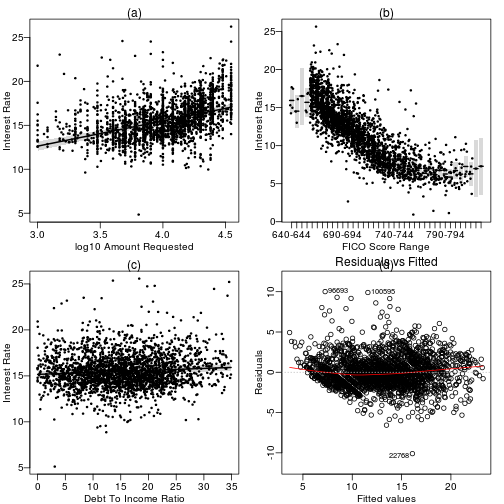

 Madrid Java User Group (Madrid JUG)

Loans Lending Club  (REGRESSION PROBLEM) MULTIVARIATE
========================================================
  This is a regression problem (machine learning)

******
#### May 9, 2013
#### Jose Maria Gomez Hidalgo [@jmgomez](http://twitter.com/jmgomez)
#### Guillermo Santos Garcia [@gsantosgo](http://twitter.com/gsantosgo)
#### This script is licensed under the GPLv2 license http://www.gnu.org/licenses/gpl.html
----------------------------------------------------------------

## Preliminaries
### Set Working Directory

```r
getwd()
```

```
## [1] "/home/gsantos/R/RStats/MadridJUG-DataMining"
```

```r
WORKING_DIR <- "~/R/RStats/MadridJUG-DataMining/"
# WORKING_DIR <- 'C:/Users/gsantos/R/RStats/MadridJUG-DataMining'
DATASET_FILE <- "./data/loansData.csv"
FIGURES_DIR <- "./figures/"
setwd(WORKING_DIR)
getwd()
```

```
## [1] "/home/gsantos/R/RStats/MadridJUG-DataMining"
```


### Load libraries/data/create new variables


```r
### Load Libraries
### install.packages(c('knitr','RColorBrewer','car','psych','stringr','visreg'))
library(knitr)
library(RColorBrewer)
library(car)
```

```
## Loading required package: MASS
```

```
## Loading required package: nnet
```

```r
library(psych)
```

```
## Attaching package: 'psych'
```

```
## The following object(s) are masked from 'package:car':
## 
## logit
```

```r
library(stringr)
library(visreg)
```

```
## Loading required package: lattice
```

```r

### Set Color colorRampPalette(COLORS) ( 4 ) ## (n)
CUSTOM_COLORS <- colorRampPalette(colors = COLORS)
```

```
## Error: objeto 'COLORS' no encontrado
```

```r
CUSTOM_COLORS_PLOT <- colorRampPalette(brewer.pal(10, "Set3"))
# Figures Label
opts_chunk$set(echo = TRUE, fig.path = "figures/plot-loans-")
# opts_chunk$set(echo=FALSE, fig.path='figures/plot-loans-', cache=TRUE)

### Load data
loansRaw <- read.csv(DATASET_FILE)
```


------

## Exploratory analysis

### Look at the TRAINING data set 


```r
head(loansRaw)
```

```
##       Amount.Requested Amount.Funded.By.Investors Interest.Rate
## 81174            20000                      20000         8.90%
## 99592            19200                      19200        12.12%
## 80059            35000                      35000        21.98%
## 15825            10000                       9975         9.99%
## 33182            12000                      12000        11.71%
## 62403             6000                       6000        15.31%
##       Loan.Length       Loan.Purpose Debt.To.Income.Ratio State
## 81174   36 months debt_consolidation               14.90%    SC
## 99592   36 months debt_consolidation               28.36%    TX
## 80059   60 months debt_consolidation               23.81%    CA
## 15825   36 months debt_consolidation               14.30%    KS
## 33182   36 months        credit_card               18.78%    NJ
## 62403   36 months              other               20.05%    CT
##       Home.Ownership Monthly.Income FICO.Range Open.CREDIT.Lines
## 81174       MORTGAGE           6542    735-739                14
## 99592       MORTGAGE           4583    715-719                12
## 80059       MORTGAGE          11500    690-694                14
## 15825       MORTGAGE           3833    695-699                10
## 33182           RENT           3195    695-699                11
## 62403            OWN           4892    670-674                17
##       Revolving.CREDIT.Balance Inquiries.in.the.Last.6.Months
## 81174                    14272                              2
## 99592                    11140                              1
## 80059                    21977                              1
## 15825                     9346                              0
## 33182                    14469                              0
## 62403                    10391                              2
##       Employment.Length
## 81174          < 1 year
## 99592           2 years
## 80059           2 years
## 15825           5 years
## 33182           9 years
## 62403           3 years
```

```r
summary(loansRaw)
```

```
##  Amount.Requested Amount.Funded.By.Investors Interest.Rate 
##  Min.   : 1000    Min.   :    0              12.12% : 122  
##  1st Qu.: 6000    1st Qu.: 6000              7.90%  : 119  
##  Median :10000    Median :10000              13.11% : 115  
##  Mean   :12406    Mean   :12002              15.31% :  76  
##  3rd Qu.:17000    3rd Qu.:16000              14.09% :  72  
##  Max.   :35000    Max.   :35000              14.33% :  69  
##                                              (Other):1927  
##     Loan.Length               Loan.Purpose  Debt.To.Income.Ratio
##  36 months:1952   debt_consolidation:1307   0%     :   8        
##  60 months: 548   credit_card       : 444   12.54% :   6        
##                   other             : 201   12.20% :   5        
##                   home_improvement  : 152   12.85% :   5        
##                   major_purchase    : 101   14.22% :   5        
##                   small_business    :  87   14.66% :   5        
##                   (Other)           : 208   (Other):2466        
##      State       Home.Ownership Monthly.Income     FICO.Range  
##  CA     : 433   MORTGAGE:1148   Min.   :   588   670-674: 171  
##  NY     : 255   NONE    :   1   1st Qu.:  3500   675-679: 166  
##  TX     : 174   OTHER   :   5   Median :  5000   680-684: 157  
##  FL     : 169   OWN     : 200   Mean   :  5689   695-699: 153  
##  IL     : 101   RENT    :1146   3rd Qu.:  6800   665-669: 145  
##  GA     :  98                   Max.   :102750   690-694: 140  
##  (Other):1270                   NA's   :1        (Other):1568  
##  Open.CREDIT.Lines Revolving.CREDIT.Balance Inquiries.in.the.Last.6.Months
##  Min.   : 2.0      Min.   :     0           Min.   :0.000                 
##  1st Qu.: 7.0      1st Qu.:  5586           1st Qu.:0.000                 
##  Median : 9.0      Median : 10962           Median :0.000                 
##  Mean   :10.1      Mean   : 15245           Mean   :0.906                 
##  3rd Qu.:13.0      3rd Qu.: 18889           3rd Qu.:1.000                 
##  Max.   :38.0      Max.   :270800           Max.   :9.000                 
##  NA's   :2         NA's   :2                NA's   :2                     
##  Employment.Length
##  10+ years:653    
##  < 1 year :250    
##  2 years  :244    
##  3 years  :235    
##  5 years  :202    
##  4 years  :192    
##  (Other)  :724
```

```r
sapply(loansRaw[1, ], class)
```

```
##               Amount.Requested     Amount.Funded.By.Investors 
##                      "integer"                      "numeric" 
##                  Interest.Rate                    Loan.Length 
##                       "factor"                       "factor" 
##                   Loan.Purpose           Debt.To.Income.Ratio 
##                       "factor"                       "factor" 
##                          State                 Home.Ownership 
##                       "factor"                       "factor" 
##                 Monthly.Income                     FICO.Range 
##                      "numeric"                       "factor" 
##              Open.CREDIT.Lines       Revolving.CREDIT.Balance 
##                      "integer"                      "integer" 
## Inquiries.in.the.Last.6.Months              Employment.Length 
##                      "integer"                       "factor"
```

```r
sapply(loansRaw[, 1:14], summary)
```

```
## $Amount.Requested
##    Min. 1st Qu.  Median    Mean 3rd Qu.    Max. 
##    1000    6000   10000   12400   17000   35000 
## 
## $Amount.Funded.By.Investors
##    Min. 1st Qu.  Median    Mean 3rd Qu.    Max. 
##       0    6000   10000   12000   16000   35000 
## 
## $Interest.Rate
##  12.12%   7.90%  13.11%  15.31%  14.09%  14.33%   8.90%  11.14%   6.03% 
##     122     119     115      76      72      69      64      58      57 
##  17.27%  16.29%   6.62%  10.16%  15.80%  17.77%  11.71%   7.62%  18.49% 
##      56      51      49      48      39      38      36      34      33 
##  13.99%  14.65%  19.05%  13.49%  10.74%  13.67%   7.49%  11.49%  12.69% 
##      29      29      26      25      24      23      23      21      21 
##   7.51%   9.76%  10.99%  18.25%  19.72%  14.27%  20.49%  12.42%  18.75% 
##      21      21      20      19      19      18      18      17      17 
##   7.88%  22.47%  10.65%  11.99%   5.79%  10.59%   9.91%  10.38%  17.99% 
##      17      15      14      14      14      13      13      12      12 
##  21.00%  21.49%  10.75%  16.77%   5.42%   9.63%   9.99%  12.53%  15.27% 
##      12      12      11      11      11      11      11      10      10 
##  15.81%  15.96%  17.49%  21.98%   5.99%   7.29%   8.49%  11.89%  16.89% 
##      10      10      10      10      10      10      10       9       9 
##  19.22%   6.91%   6.99%  10.00%  10.25%  10.36%  10.37%  11.12%  11.83% 
##       9       9       9       8       8       8       8       8       8 
##  13.06%  13.98%  16.32%  16.49%  18.64%  22.95%   7.66%  11.86%  12.68% 
##       8       8       8       8       8       8       8       7       7 
##  14.11%  15.23%  15.99%  18.55%  19.03%  19.99%  23.28%  23.76%   7.14% 
##       7       7       7       7       7       7       7       7       7 
##   8.59%   8.94%  11.11%  11.48%  12.99%  14.96%  17.58%  20.50%   6.54% 
##       7       7       6       6       6       6       6       6       6 
## (Other) 
##     398 
## 
## $Loan.Length
## 36 months 60 months 
##      1952       548 
## 
## $Loan.Purpose
##                car        credit_card debt_consolidation 
##                 50                444               1307 
##        educational   home_improvement              house 
##                 15                152                 20 
##     major_purchase            medical             moving 
##                101                 30                 29 
##              other   renewable_energy     small_business 
##                201                  4                 87 
##           vacation            wedding 
##                 21                 39 
## 
## $Debt.To.Income.Ratio
##      0%  12.54%  12.20%  12.85%  14.22%  14.66%  14.88%  15.60%  15.88% 
##       8       6       5       5       5       5       5       5       5 
##  16.15%  16.73%     17%  17.95%  18.75%  22.32%  22.74%  11.08%  11.18% 
##       5       5       5       5       5       5       5       4       4 
##  11.35%  13.30%  13.40%  13.42%  13.98%  14.11%  15.33%  15.74%  15.82% 
##       4       4       4       4       4       4       4       4       4 
##  16.98%  17.08%  17.37%  17.79%  17.97%     18%  18.28%  18.99%  19.10% 
##       4       4       4       4       4       4       4       4       4 
##  19.63%  20.07%  20.18%  20.96%  21.33%  21.54%  22.38%  24.85%  24.88% 
##       4       4       4       4       4       4       4       4       4 
##   8.40%   8.69%   9.30%   9.67%   9.73%  10.08%  10.29%  10.42%  10.69% 
##       4       4       4       4       4       3       3       3       3 
##  10.75%  10.76%  10.80%  11.03%  11.12%  11.23%  11.31%  11.34%  11.52% 
##       3       3       3       3       3       3       3       3       3 
##  11.80%  11.85%  11.91%  11.95%  12.03%  12.06%  12.13%  12.19%  12.21% 
##       3       3       3       3       3       3       3       3       3 
##  12.33%  12.36%  12.46%  12.51%  12.70%  13.07%  13.16%  13.59%  13.87% 
##       3       3       3       3       3       3       3       3       3 
##  13.94%  14.02%  14.08%  14.32%  14.36%  14.61%  14.74%  14.77%  14.85% 
##       3       3       3       3       3       3       3       3       3 
##  14.89%  14.90%  14.92%     15%  15.08%  15.32%  15.42%  15.68%  15.71% 
##       3       3       3       3       3       3       3       3       3 
## (Other) 
##    2133 
## 
## $State
##  AK  AL  AR  AZ  CA  CO  CT  DC  DE  FL  GA  HI  IA  IL  IN  KS  KY  LA 
##  11  38  13  46 433  61  50  11   8 169  98  12   1 101   3  21  23  22 
##  MA  MD  MI  MN  MO  MS  MT  NC  NH  NJ  NM  NV  NY  OH  OK  OR  PA  RI 
##  73  68  45  38  33   1   7  64  15  94  13  32 255  71  21  30  96  15 
##  SC  SD  TX  UT  VA  VT  WA  WI  WV  WY 
##  28   4 174  16  78   5  58  26  15   4 
## 
## $Home.Ownership
## MORTGAGE     NONE    OTHER      OWN     RENT 
##     1148        1        5      200     1146 
## 
## $Monthly.Income
##    Min. 1st Qu.  Median    Mean 3rd Qu.    Max.    NA's 
##     588    3500    5000    5690    6800  103000       1 
## 
## $FICO.Range
## 640-644 645-649 650-654 655-659 660-664 665-669 670-674 675-679 680-684 
##       5       3       1       4     125     145     171     166     157 
## 685-689 690-694 695-699 700-704 705-709 710-714 715-719 720-724 725-729 
##     138     140     153     131     134     112      93     114      94 
## 730-734 735-739 740-744 745-749 750-754 755-759 760-764 765-769 770-774 
##      94      65      53      54      61      46      46      36      17 
## 775-779 780-784 785-789 790-794 795-799 800-804 805-809 810-814 815-819 
##      22      28      19      20      13      13      11       8       6 
## 820-824 830-834 
##       1       1 
## 
## $Open.CREDIT.Lines
##    Min. 1st Qu.  Median    Mean 3rd Qu.    Max.    NA's 
##     2.0     7.0     9.0    10.1    13.0    38.0       2 
## 
## $Revolving.CREDIT.Balance
##    Min. 1st Qu.  Median    Mean 3rd Qu.    Max.    NA's 
##       0    5590   11000   15200   18900  271000       2 
## 
## $Inquiries.in.the.Last.6.Months
##    Min. 1st Qu.  Median    Mean 3rd Qu.    Max.    NA's 
##   0.000   0.000   0.000   0.906   1.000   9.000       2 
## 
## $Employment.Length
## 10+ years  < 1 year    1 year   2 years   3 years   4 years   5 years 
##       653       250       177       244       235       192       202 
##   6 years   7 years   8 years   9 years       n/a 
##       163       127       108        72        77
```


### Transformation. Variables - Factor to Numeric 

```r
loansRaw$Interest.Rate <- as.numeric(sub("[^0-9\\.]", "", loansRaw$Interest.Rate))
loansRaw$Debt.To.Income.Ratio <- as.numeric(sub("[^0-9\\.]", "", loansRaw$Debt.To.Income.Ratio))
```


### Find number of missing values/check ranges

```r
sum(is.na(loansRaw))
```

```
## [1] 7
```

```r
which(is.na(loansRaw), arr.ind = TRUE)
```

```
##         row col
## 101596  367   9
## 101596  367  11
## 101515 1595  11
## 101596  367  12
## 101515 1595  12
## 101596  367  13
## 101515 1595  13
```


### Remove missing values (NA) 

```r
loansRaw <- loansRaw[complete.cases(loansRaw), ]
dim(loansRaw)
```

```
## [1] 2498   14
```

```r
levels(loansRaw$Employment.Length)
```

```
##  [1] "10+ years" "< 1 year"  "1 year"    "2 years"   "3 years"  
##  [6] "4 years"   "5 years"   "6 years"   "7 years"   "8 years"  
## [11] "9 years"   "n/a"
```

```r
sum(loansRaw$Employment.Length == "n/a")
```

```
## [1] 77
```

```r
which(loansRaw == "n/a", arr.ind = TRUE)
```

```
##         row col
## 67629    92  14
## 51929    93  14
## 84563   106  14
## 64884   112  14
## 85644   117  14
## 19548   129  14
## 45941   141  14
## 33161   147  14
## 51833   212  14
## 84110   235  14
## 33093   282  14
## 35935   307  14
## 50460   356  14
## 97462   375  14
## 100469  390  14
## 83422   414  14
## 79611   422  14
## 61261   442  14
## 73010   466  14
## 47011   475  14
## 31573   479  14
## 14595   504  14
## 100086  512  14
## 53062   542  14
## 81788   553  14
## 51812   579  14
## 52548   586  14
## 46245   673  14
## 68487   732  14
## 71766   771  14
## 19344   819  14
## 10737   866  14
## 57986   987  14
## 54274  1029  14
## 89068  1043  14
## 63703  1069  14
## 32119  1125  14
## 83857  1212  14
## 27371  1257  14
## 91173  1265  14
## 71268  1283  14
## 45097  1327  14
## 32737  1339  14
## 41626  1355  14
## 87148  1411  14
## 87513  1451  14
## 32215  1514  14
## 85720  1518  14
## 89677  1545  14
## 15634  1567  14
## 58346  1591  14
## 87150  1623  14
## 11953  1659  14
## 103708 1675  14
## 55812  1733  14
## 63971  1737  14
## 101002 1744  14
## 103315 1887  14
## 35797  1910  14
## 46604  1921  14
## 96798  1943  14
## 68987  2008  14
## 10441  2023  14
## 60833  2119  14
## 97449  2145  14
## 14231  2179  14
## 58924  2205  14
## 35161  2210  14
## 100635 2212  14
## 19695  2227  14
## 70648  2269  14
## 63588  2286  14
## 72919  2333  14
## 103374 2422  14
## 79164  2448  14
## 45424  2464  14
## 78043  2490  14
```


### Transformation. Skewed 

```r
loansRaw$log10Amount.Requested <- log10(loansRaw$Amount.Requested + 1)
loansRaw$log10Amount.Funded.By.Investors <- log10(loansRaw$Amount.Funded.By.Investors + 
    1)
loansRaw$log10Monthly.Income <- log10(loansRaw$Monthly.Income + 1)
loansRaw$log10Open.CREDIT.Lines <- log10(loansRaw$Open.CREDIT.Lines + 1)
loansRaw$log10Revolving.CREDIT.Balance <- log10(loansRaw$Revolving.CREDIT.Balance + 
    1)
loansRaw$sqrtInquiries.in.the.Last.6.Months <- sqrt(loansRaw$Inquiries.in.the.Last.6.Months)
```


### Regression Model 

```r
lmFitFinal <- lm(Interest.Rate ~ log10Amount.Requested + log10Amount.Funded.By.Investors + 
    Debt.To.Income.Ratio + log10Open.CREDIT.Lines + log10Revolving.CREDIT.Balance + 
    sqrtInquiries.in.the.Last.6.Months + Loan.Length + FICO.Range, data = loansRaw)
```


### Get the estimates and confidence intervals. The estimate from summary 

```r
summary(lmFitFinal)
```

```
## 
## Call:
## lm(formula = Interest.Rate ~ log10Amount.Requested + log10Amount.Funded.By.Investors + 
##     Debt.To.Income.Ratio + log10Open.CREDIT.Lines + log10Revolving.CREDIT.Balance + 
##     sqrtInquiries.in.the.Last.6.Months + Loan.Length + FICO.Range, 
##     data = loansRaw)
## 
## Residuals:
##     Min      1Q  Median      3Q     Max 
## -10.098  -1.173  -0.201   0.991  10.019 
## 
## Coefficients:
##                                     Estimate Std. Error t value Pr(>|t|)
## (Intercept)                          4.66001    0.99913    4.66  3.3e-06
## log10Amount.Requested                2.86447    0.23744   12.06  < 2e-16
## log10Amount.Funded.By.Investors      0.62410    0.18854    3.31  0.00095
## Debt.To.Income.Ratio                 0.02155    0.00572    3.77  0.00017
## log10Open.CREDIT.Lines              -2.05830    0.24686   -8.34  < 2e-16
## log10Revolving.CREDIT.Balance       -0.23252    0.06459   -3.60  0.00032
## sqrtInquiries.in.the.Last.6.Months   0.77061    0.05607   13.74  < 2e-16
## Loan.Length60 months                 3.42685    0.10008   34.24  < 2e-16
## FICO.Range645-649                   -1.40689    1.39074   -1.01  0.31182
## FICO.Range650-654                    0.58052    2.08701    0.28  0.78092
## FICO.Range655-659                   -0.25037    1.28237   -0.20  0.84522
## FICO.Range660-664                    1.16944    0.87968    1.33  0.18384
## FICO.Range665-669                    0.55547    0.87795    0.63  0.52699
## FICO.Range670-674                   -0.45056    0.87490   -0.51  0.60661
## FICO.Range675-679                   -1.20952    0.87614   -1.38  0.16756
## FICO.Range680-684                   -1.99766    0.87683   -2.28  0.02280
## FICO.Range685-689                   -2.50545    0.87754   -2.86  0.00434
## FICO.Range690-694                   -2.61957    0.87890   -2.98  0.00291
## FICO.Range695-699                   -3.17827    0.87774   -3.62  0.00030
## FICO.Range700-704                   -4.03360    0.88010   -4.58  4.8e-06
## FICO.Range705-709                   -4.64302    0.87982   -5.28  1.4e-07
## FICO.Range710-714                   -4.94141    0.88304   -5.60  2.4e-08
## FICO.Range715-719                   -5.85881    0.88603   -6.61  4.6e-11
## FICO.Range720-724                   -6.19438    0.88229   -7.02  2.8e-12
## FICO.Range725-729                   -6.62113    0.88602   -7.47  1.1e-13
## FICO.Range730-734                   -7.37299    0.88488   -8.33  < 2e-16
## FICO.Range735-739                   -7.74164    0.89616   -8.64  < 2e-16
## FICO.Range740-744                   -7.69811    0.90285   -8.53  < 2e-16
## FICO.Range745-749                   -7.80532    0.90176   -8.66  < 2e-16
## FICO.Range750-754                   -8.32569    0.89700   -9.28  < 2e-16
## FICO.Range755-759                   -8.68863    0.90811   -9.57  < 2e-16
## FICO.Range760-764                   -8.44244    0.90732   -9.30  < 2e-16
## FICO.Range765-769                   -8.92593    0.92008   -9.70  < 2e-16
## FICO.Range770-774                   -9.57305    0.98033   -9.77  < 2e-16
## FICO.Range775-779                   -8.95498    0.95589   -9.37  < 2e-16
## FICO.Range780-784                   -9.74887    0.93591  -10.42  < 2e-16
## FICO.Range785-789                   -9.19716    0.96896   -9.49  < 2e-16
## FICO.Range790-794                   -9.67124    0.95995  -10.07  < 2e-16
## FICO.Range795-799                  -10.07882    1.01182   -9.96  < 2e-16
## FICO.Range800-804                   -9.22517    1.02441   -9.01  < 2e-16
## FICO.Range805-809                   -9.68728    1.03944   -9.32  < 2e-16
## FICO.Range810-814                   -8.68062    1.10035   -7.89  4.5e-15
## FICO.Range815-819                   -9.65415    1.16662   -8.28  < 2e-16
## FICO.Range820-824                   -8.95908    2.09349   -4.28  1.9e-05
## FICO.Range830-834                   -8.65521    2.09451   -4.13  3.7e-05
##                                       
## (Intercept)                        ***
## log10Amount.Requested              ***
## log10Amount.Funded.By.Investors    ***
## Debt.To.Income.Ratio               ***
## log10Open.CREDIT.Lines             ***
## log10Revolving.CREDIT.Balance      ***
## sqrtInquiries.in.the.Last.6.Months ***
## Loan.Length60 months               ***
## FICO.Range645-649                     
## FICO.Range650-654                     
## FICO.Range655-659                     
## FICO.Range660-664                     
## FICO.Range665-669                     
## FICO.Range670-674                     
## FICO.Range675-679                     
## FICO.Range680-684                  *  
## FICO.Range685-689                  ** 
## FICO.Range690-694                  ** 
## FICO.Range695-699                  ***
## FICO.Range700-704                  ***
## FICO.Range705-709                  ***
## FICO.Range710-714                  ***
## FICO.Range715-719                  ***
## FICO.Range720-724                  ***
## FICO.Range725-729                  ***
## FICO.Range730-734                  ***
## FICO.Range735-739                  ***
## FICO.Range740-744                  ***
## FICO.Range745-749                  ***
## FICO.Range750-754                  ***
## FICO.Range755-759                  ***
## FICO.Range760-764                  ***
## FICO.Range765-769                  ***
## FICO.Range770-774                  ***
## FICO.Range775-779                  ***
## FICO.Range780-784                  ***
## FICO.Range785-789                  ***
## FICO.Range790-794                  ***
## FICO.Range795-799                  ***
## FICO.Range800-804                  ***
## FICO.Range805-809                  ***
## FICO.Range810-814                  ***
## FICO.Range815-819                  ***
## FICO.Range820-824                  ***
## FICO.Range830-834                  ***
## ---
## Signif. codes:  0 '***' 0.001 '**' 0.01 '*' 0.05 '.' 0.1 ' ' 1 
## 
## Residual standard error: 1.9 on 2453 degrees of freedom
## Multiple R-squared: 0.796,	Adjusted R-squared: 0.792 
## F-statistic:  218 on 44 and 2453 DF,  p-value: <2e-16
```


## The confidence interval fron confint
#confint(lmFit)
#anova(lmFit)
#plot(lmFit)
#summary(lmFit)
#residualPlots(lmFit)

### Figure making 


```r
## Set up a function that makes colors prettier
mypar <- function(a = 1, b = 1, brewer.n = 8, brewer.name = "Dark2", ...) {
    par(mar = c(2.5, 2.5, 1.6, 1.1), mgp = c(1.5, 0.5, 0))
    par(mfrow = c(a, b), ...)
    palette(brewer.pal(brewer.n, brewer.name))
}

## Set size of axes
cx <- 1
pch <- 19

## Save figure to pdf file pdf(file=paste0(FIGURES_DIR,
## 'finalfigure.pdf'), height=2*6, width=2*6)
mypar(mfrow = c(2, 2))
# interestRate_FICORange_Means <- tapply(loansRaw$Interest.Rate,
# loansRaw$FICO.Range, mean, na.rm = TRUE)
# boxplot(interestRate_FICORange_Means ~
# names(interestRate_FICORange_Means), xlab='FICO Score Range ',
# ylab='Interest Rate',main='') rug(interestRate_FICORange_Means)
# points(interestRate_FICORange_Means,col='red',pch=pch)
# lines(interestRate_FICORange_Means)

visreg(lmFitFinal, "log10Amount.Requested", xlab = "log10 Amount Requested", 
    ylab = "Interest Rate")
mtext("(a)")

visreg(lmFitFinal, "FICO.Range", xlab = "FICO Score Range", ylab = "Interest Rate", 
    col = as.factor(loansRaw$FICO.Range))
mtext("(b)")

visreg(lmFitFinal, "Debt.To.Income.Ratio", xlab = "Debt To Income Ratio", ylab = "Interest Rate")
mtext("(c)")

plot(lmFitFinal, which = 1)
mtext("(d)")
```

 

```r
# dev.off()
```

