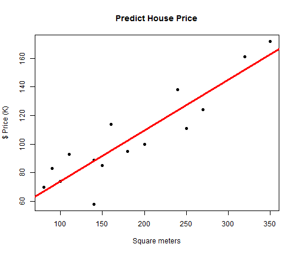
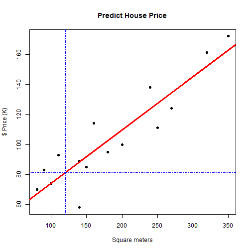
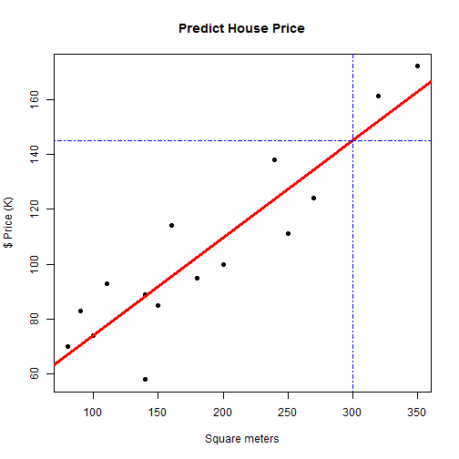

 Madrid Java User Group (Madrid JUG)


Predicting House Price (REGRESSION PROBLEM) UNIVARIATE
========================================================
This a regression problem (machine learning). The Predict **House Price** depends **House Size**
******
#### May 9, 2013
#### Jose Maria Gómez Hidalgo [@jmgomez](http://twitter.com/jmgomez)
#### Guillermo Santos Garcif­a [@gsantosgo](http://twitter.com/gsantosgo)
#### This script is licensed under the GPLv2 license http://www.gnu.org/licenses/gpl.html
----------------------------------------------------------------

### Data    

```r
size <- c(80, 90, 100, 110, 140, 140, 150, 160, 180, 200, 240, 250, 270, 320, 
    350)
price <- c(70, 83, 74, 93, 89, 58, 85, 114, 95, 100, 138, 111, 124, 161, 172)
housePrices <- data.frame(cbind(size, price))
```


### Linear Regression Model 
   
### y = ax + b 
   

```r
model.regression <- lm(housePrices$price ~ housePrices$size)
model.regression
```

```
## 
## Call:
## lm(formula = housePrices$price ~ housePrices$size)
## 
## Coefficients:
##      (Intercept)  housePrices$size  
##           38.885             0.354
```


Plot:

```r
plot(housePrices$size, housePrices$price, xlab = "Square meters", ylab = "$ Price (K)", 
    main = "Predict House Price", pch = 19)
abline(model.regression, col = 2, lwd = 3)
```

 


### Predicting House Price of 120 squared meters?

```r
sizequery <- 120
result <- model.regression$coefficients[1] + sizequery * model.regression$coefficients[2]
plot(housePrices$size, housePrices$price, xlab = "Square meters", ylab = "$ Price (K)", 
    main = "Predict House Price", pch = 19)
abline(model.regression, col = 2, lwd = 3)
abline(h = result, v = sizequery, col = "blue", lty = "dotdash")
```

 


### Predicting House Price of 300 squared meters?

```r
sizequery <- 300
result <- model.regression$coefficients[1] + sizequery * model.regression$coefficients[2]
plot(housePrices$size, housePrices$price, xlab = "Square meters", ylab = "$ Price (K)", 
    main = "Predict House Price", pch = 19)
abline(model.regression, col = 2, lwd = 3)
abline(h = result, v = sizequery, col = "blue", lty = "dotdash")
```

 

