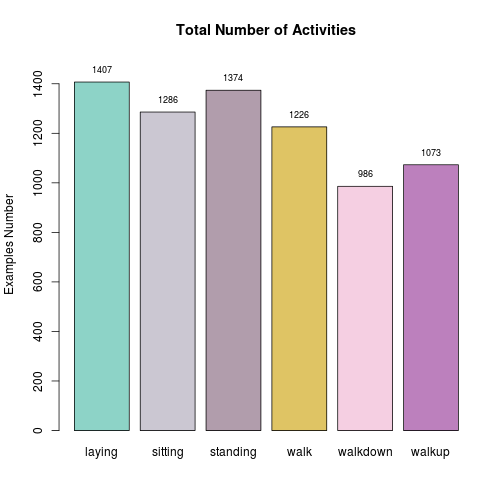
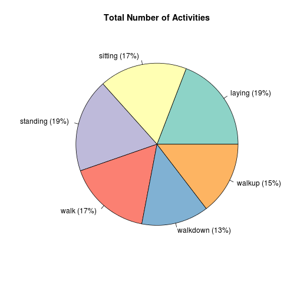
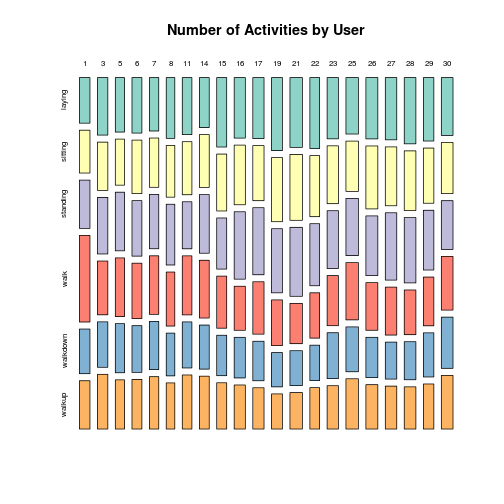
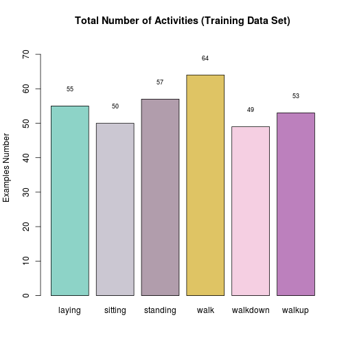
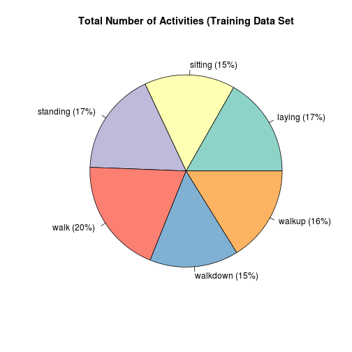
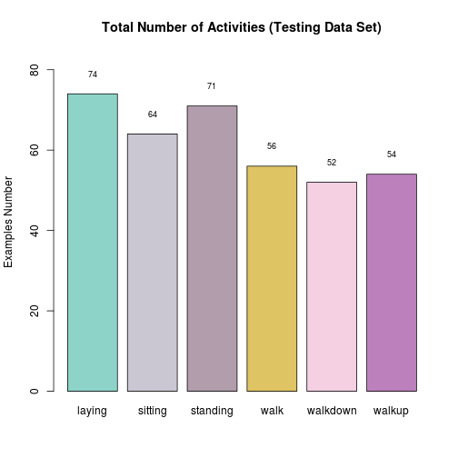
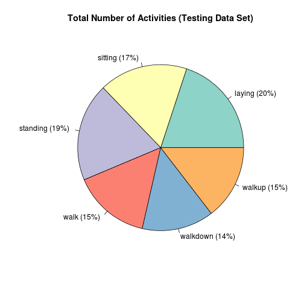

 Madrid Java User Group (Madrid JUG)

Human Activity Recognition (CLASSIFICATION PROBLEM)
========================================================
This is a classification problem (machine learning)

******
#### May 9, 2013
#### Jose Maria Gomez Hidalgo [@jmgomez](http://twitter.com/jmgomez)
#### Guillermo Santos Garcia [@gsantosgo](http://twitter.com/gsantosgo)
#### This script is licensed under the GPLv2 license http://www.gnu.org/licenses/gpl.html
----------------------------------------------------------------


## Preliminaries
### Set Working Directory

```r
getwd()
```

```
## [1] "/home/gsantos/R/RStats/MadridJUG-DataMining"
```

```r
WORKING_DIR <- "~/R/RStats/MadridJUG-DataMining/"
# WORKING_DIR <- 'C:/Users/gsantos/R/RStats/MadridJUG-DataMining'
DATASET_DIR <- "./data/"
FIGURES_DIR <- "./figures/"
setwd(WORKING_DIR)
getwd()
```

```
## [1] "/home/gsantos/R/RStats/MadridJUG-DataMining"
```


### Load libraries/data/create new variables


```r
### Load Libraries
### install.packages(c('knitr','RColorBrewer','tree','maptree','rpart','adabag','ipred','randomForest','e1071'))
library(knitr)
library(RColorBrewer)
library(tree)
library(maptree)
```

```
## Loading required package: cluster
```

```
## Loading required package: rpart
```

```r
library(rpart)
library(adabag)
```

```
## Loading required package: mlbench
```

```
## Loading required package: caret
```

```
## Loading required package: foreach
```

```
## Loading required package: lattice
```

```
## Loading required package: plyr
```

```
## Loading required package: reshape2
```

```r
library(ipred)
```

```
## Loading required package: MASS
```

```
## Loading required package: survival
```

```
## Loading required package: splines
```

```
## Loading required package: nnet
```

```
## Loading required package: class
```

```
## Loading required package: prodlim
```

```
## KernSmooth 2.23 loaded Copyright M. P. Wand 1997-2009
```

```
## Attaching package: 'ipred'
```

```
## The following object(s) are masked from 'package:adabag':
## 
## bagging
```

```r
library(randomForest)
```

```
## randomForest 4.6-7
```

```
## Type rfNews() to see new features/changes/bug fixes.
```

```r
library(e1071)

CUSTOM_COLORS_PLOT <- colorRampPalette(brewer.pal(10, "Set3"))
# Figures Label
opts_chunk$set(echo = TRUE, fig.path = "figures/plot-samsung-")
# opts_chunk$set(echo=FALSE, fig.path='figures/plot-samsung-', cache=TRUE)

### Load data
load(paste0(DATASET_DIR, "samsungData.rda"))
```

     
------

## Exploratory analysis

### Look at the TRAINING data set 


```r
head(samsungData)
```

```
##   tBodyAcc-mean()-X tBodyAcc-mean()-Y tBodyAcc-mean()-Z tBodyAcc-std()-X
## 1            0.2886          -0.02029           -0.1329          -0.9953
## 2            0.2784          -0.01641           -0.1235          -0.9982
## 3            0.2797          -0.01947           -0.1135          -0.9954
## 4            0.2792          -0.02620           -0.1233          -0.9961
## 5            0.2766          -0.01657           -0.1154          -0.9981
## 6            0.2772          -0.01010           -0.1051          -0.9973
##   tBodyAcc-std()-Y tBodyAcc-std()-Z tBodyAcc-mad()-X tBodyAcc-mad()-Y
## 1          -0.9831          -0.9135          -0.9951          -0.9832
## 2          -0.9753          -0.9603          -0.9988          -0.9749
## 3          -0.9672          -0.9789          -0.9965          -0.9637
## 4          -0.9834          -0.9907          -0.9971          -0.9827
## 5          -0.9808          -0.9905          -0.9983          -0.9797
## 6          -0.9905          -0.9954          -0.9976          -0.9902
##   tBodyAcc-mad()-Z tBodyAcc-max()-X tBodyAcc-max()-Y tBodyAcc-max()-Z
## 1          -0.9235          -0.9347          -0.5674          -0.7444
## 2          -0.9577          -0.9431          -0.5579          -0.8184
## 3          -0.9775          -0.9387          -0.5579          -0.8184
## 4          -0.9893          -0.9387          -0.5762          -0.8297
## 5          -0.9904          -0.9425          -0.5692          -0.8247
## 6          -0.9955          -0.9425          -0.5657          -0.8228
##   tBodyAcc-min()-X tBodyAcc-min()-Y tBodyAcc-min()-Z tBodyAcc-sma()
## 1           0.8529           0.6858           0.8143        -0.9655
## 2           0.8493           0.6858           0.8226        -0.9819
## 3           0.8436           0.6824           0.8393        -0.9835
## 4           0.8436           0.6824           0.8379        -0.9861
## 5           0.8491           0.6832           0.8379        -0.9927
## 6           0.8491           0.6956           0.8459        -0.9939
##   tBodyAcc-energy()-X tBodyAcc-energy()-Y tBodyAcc-energy()-Z
## 1             -0.9999             -0.9999             -0.9946
## 2             -1.0000             -0.9998             -0.9984
## 3             -1.0000             -0.9997             -0.9995
## 4             -1.0000             -0.9997             -0.9995
## 5             -1.0000             -0.9999             -0.9998
## 6             -1.0000             -0.9999             -0.9999
##   tBodyAcc-iqr()-X tBodyAcc-iqr()-Y tBodyAcc-iqr()-Z tBodyAcc-entropy()-X
## 1          -0.9942          -0.9876          -0.9432              -0.4077
## 2          -0.9992          -0.9779          -0.9482              -0.7149
## 3          -0.9971          -0.9648          -0.9747              -0.5922
## 4          -0.9972          -0.9838          -0.9860              -0.6274
## 5          -0.9980          -0.9812          -0.9913              -0.7866
## 6          -0.9976          -0.9918          -0.9954              -0.7519
##   tBodyAcc-entropy()-Y tBodyAcc-entropy()-Z tBodyAcc-arCoeff()-X,1
## 1              -0.6793              -0.6021                0.92929
## 2              -0.5009              -0.5710                0.61163
## 3              -0.4858              -0.5710                0.27302
## 4              -0.8509              -0.9119                0.06144
## 5              -0.5595              -0.7614                0.31328
## 6              -0.4548              -0.5509                0.39005
##   tBodyAcc-arCoeff()-X,2 tBodyAcc-arCoeff()-X,3 tBodyAcc-arCoeff()-X,4
## 1               -0.85301                 0.3599               -0.05853
## 2               -0.32955                 0.2842                0.28459
## 3               -0.08631                 0.3372               -0.16474
## 4                0.07484                 0.1982               -0.26431
## 5               -0.13121                 0.1912                0.08690
## 6               -0.18227                 0.1588                0.18731
##   tBodyAcc-arCoeff()-Y,1 tBodyAcc-arCoeff()-Y,2 tBodyAcc-arCoeff()-Y,3
## 1                0.25689               -0.22485                 0.2641
## 2                0.11571               -0.09096                 0.2943
## 3                0.01715               -0.07451                 0.3423
## 4                0.07255               -0.15532                 0.3232
## 5                0.25762               -0.27250                 0.4347
## 6                0.25995               -0.24323                 0.4217
##   tBodyAcc-arCoeff()-Y,4 tBodyAcc-arCoeff()-Z,1 tBodyAcc-arCoeff()-Z,2
## 1               -0.09525                0.27885               -0.46508
## 2               -0.28121                0.08599               -0.02215
## 3               -0.33256                0.23928               -0.13620
## 4               -0.17081                0.29494               -0.30608
## 5               -0.31538                0.43974               -0.26907
## 6               -0.41846                0.55846               -0.21834
##   tBodyAcc-arCoeff()-Z,3 tBodyAcc-arCoeff()-Z,4 tBodyAcc-correlation()-X,Y
## 1                0.49194               -0.19088                    0.37631
## 2               -0.01666               -0.22064                   -0.01343
## 3                0.17386               -0.29949                   -0.12470
## 4                0.48215               -0.47013                   -0.30569
## 5                0.17941               -0.08895                   -0.15580
## 6                0.16514                0.08092                   -0.20998
##   tBodyAcc-correlation()-X,Z tBodyAcc-correlation()-Y,Z
## 1                    0.43513                     0.6608
## 2                   -0.07269                     0.5794
## 3                   -0.18110                     0.6089
## 4                   -0.36265                     0.5075
## 5                   -0.18976                     0.5992
## 6                   -0.15106                     0.1804
##   tGravityAcc-mean()-X tGravityAcc-mean()-Y tGravityAcc-mean()-Z
## 1               0.9634              -0.1408              0.11537
## 2               0.9666              -0.1416              0.10938
## 3               0.9669              -0.1420              0.10188
## 4               0.9676              -0.1440              0.09985
## 5               0.9682              -0.1488              0.09449
## 6               0.9679              -0.1482              0.09191
##   tGravityAcc-std()-X tGravityAcc-std()-Y tGravityAcc-std()-Z
## 1             -0.9852             -0.9817             -0.8776
## 2             -0.9974             -0.9894             -0.9316
## 3             -0.9996             -0.9929             -0.9929
## 4             -0.9966             -0.9814             -0.9785
## 5             -0.9984             -0.9881             -0.9787
## 6             -0.9990             -0.9868             -0.9973
##   tGravityAcc-mad()-X tGravityAcc-mad()-Y tGravityAcc-mad()-Z
## 1             -0.9850             -0.9844             -0.8947
## 2             -0.9979             -0.9896             -0.9332
## 3             -0.9996             -0.9926             -0.9929
## 4             -0.9965             -0.9810             -0.9785
## 5             -0.9984             -0.9887             -0.9789
## 6             -0.9991             -0.9866             -0.9974
##   tGravityAcc-max()-X tGravityAcc-max()-Y tGravityAcc-max()-Z
## 1              0.8921             -0.1613             0.12466
## 2              0.8921             -0.1613             0.12259
## 3              0.8924             -0.1637             0.09457
## 4              0.8938             -0.1637             0.09342
## 5              0.8938             -0.1668             0.09168
## 6              0.8937             -0.1670             0.08335
##   tGravityAcc-min()-X tGravityAcc-min()-Y tGravityAcc-min()-Z
## 1              0.9774             -0.1232             0.05648
## 2              0.9845             -0.1149             0.10276
## 3              0.9868             -0.1149             0.10276
## 4              0.9868             -0.1213             0.09575
## 5              0.9874             -0.1218             0.09406
## 6              0.9877             -0.1218             0.09406
##   tGravityAcc-sma() tGravityAcc-energy()-X tGravityAcc-energy()-Y
## 1           -0.3754                 0.8995                -0.9709
## 2           -0.3834                 0.9078                -0.9706
## 3           -0.4016                 0.9087                -0.9704
## 4           -0.4003                 0.9106                -0.9694
## 5           -0.4005                 0.9122                -0.9671
## 6           -0.4094                 0.9115                -0.9673
##   tGravityAcc-energy()-Z tGravityAcc-iqr()-X tGravityAcc-iqr()-Y
## 1                -0.9755             -0.9843             -0.9888
## 2                -0.9785             -0.9992             -0.9900
## 3                -0.9817             -0.9997             -0.9921
## 4                -0.9824             -0.9960             -0.9807
## 5                -0.9844             -0.9983             -0.9906
## 6                -0.9853             -0.9993             -0.9866
##   tGravityAcc-iqr()-Z tGravityAcc-entropy()-X tGravityAcc-entropy()-Y
## 1             -0.9177                      -1                      -1
## 2             -0.9417                      -1                      -1
## 3             -0.9926                      -1                      -1
## 4             -0.9798                      -1                      -1
## 5             -0.9804                      -1                      -1
## 6             -0.9977                      -1                      -1
##   tGravityAcc-entropy()-Z tGravityAcc-arCoeff()-X,1
## 1                  0.1138                 -0.590425
## 2                 -0.2105                 -0.410056
## 3                 -0.9268                  0.002234
## 4                 -0.5961                 -0.064935
## 5                 -0.6166                 -0.257267
## 6                 -1.0000                 -0.302225
##   tGravityAcc-arCoeff()-X,2 tGravityAcc-arCoeff()-X,3
## 1                   0.59115                  -0.59177
## 2                   0.41386                  -0.41757
## 3                   0.02748                  -0.05673
## 4                   0.07543                  -0.08582
## 5                   0.26892                  -0.28067
## 6                   0.37903                  -0.45722
##   tGravityAcc-arCoeff()-X,4 tGravityAcc-arCoeff()-Y,1
## 1                   0.59247                   -0.7454
## 2                   0.42132                   -0.1964
## 3                   0.08553                   -0.3290
## 4                   0.09621                   -0.2950
## 5                   0.29262                   -0.1667
## 6                   0.53680                   -0.1981
##   tGravityAcc-arCoeff()-Y,2 tGravityAcc-arCoeff()-Y,3
## 1                   0.72086                  -0.71237
## 2                   0.12534                  -0.10557
## 3                   0.27050                  -0.25449
## 4                   0.22831                  -0.20628
## 5                   0.08994                  -0.06633
## 6                   0.12719                  -0.10755
##   tGravityAcc-arCoeff()-Y,4 tGravityAcc-arCoeff()-Z,1
## 1                   0.71130                   -0.9951
## 2                   0.10909                   -0.8339
## 3                   0.25760                   -0.7050
## 4                   0.20480                   -0.3854
## 5                   0.06713                   -0.2375
## 6                   0.11136                   -0.1579
##   tGravityAcc-arCoeff()-Z,2 tGravityAcc-arCoeff()-Z,3
## 1                    0.9957                   -0.9957
## 2                    0.8343                   -0.8342
## 3                    0.7144                   -0.7233
## 4                    0.3864                   -0.3871
## 5                    0.2393                   -0.2410
## 6                    0.1754                   -0.1928
##   tGravityAcc-arCoeff()-Z,4 tGravityAcc-correlation()-X,Y
## 1                    0.9917                        0.5702
## 2                    0.8305                       -0.8313
## 3                    0.7288                       -0.1811
## 4                    0.3853                       -0.9913
## 5                    0.2406                       -0.4083
## 6                    0.2080                       -0.5640
##   tGravityAcc-correlation()-X,Z tGravityAcc-correlation()-Y,Z
## 1                        0.4390                        0.9869
## 2                       -0.8657                        0.9744
## 3                        0.3379                        0.6434
## 4                       -0.9688                        0.9843
## 5                       -0.1848                        0.9648
## 6                        0.4665                        0.4431
##   tBodyAccJerk-mean()-X tBodyAccJerk-mean()-Y tBodyAccJerk-mean()-Z
## 1               0.07800              0.005001             -0.067831
## 2               0.07401              0.005771              0.029377
## 3               0.07364              0.003104             -0.009046
## 4               0.07732              0.020058             -0.009865
## 5               0.07344              0.019122              0.016780
## 6               0.07793              0.018684              0.009344
##   tBodyAccJerk-std()-X tBodyAccJerk-std()-Y tBodyAccJerk-std()-Z
## 1              -0.9935              -0.9884              -0.9936
## 2              -0.9955              -0.9811              -0.9918
## 3              -0.9907              -0.9810              -0.9897
## 4              -0.9927              -0.9876              -0.9935
## 5              -0.9964              -0.9884              -0.9925
## 6              -0.9948              -0.9887              -0.9923
##   tBodyAccJerk-mad()-X tBodyAccJerk-mad()-Y tBodyAccJerk-mad()-Z
## 1              -0.9945              -0.9862              -0.9928
## 2              -0.9956              -0.9789              -0.9913
## 3              -0.9909              -0.9793              -0.9872
## 4              -0.9943              -0.9857              -0.9915
## 5              -0.9966              -0.9865              -0.9907
## 6              -0.9952              -0.9868              -0.9911
##   tBodyAccJerk-max()-X tBodyAccJerk-max()-Y tBodyAccJerk-max()-Z
## 1              -0.9852              -0.9920              -0.9931
## 2              -0.9945              -0.9791              -0.9923
## 3              -0.9871              -0.9791              -0.9923
## 4              -0.9871              -0.9918              -0.9898
## 5              -0.9970              -0.9918              -0.9898
## 6              -0.9941              -0.9918              -0.9926
##   tBodyAccJerk-min()-X tBodyAccJerk-min()-Y tBodyAccJerk-min()-Z
## 1               0.9898               0.9920               0.9905
## 2               0.9926               0.9918               0.9885
## 3               0.9884               0.9918               0.9885
## 4               0.9884               0.9925               0.9932
## 5               0.9943               0.9925               0.9856
## 6               0.9943               0.9933               0.9856
##   tBodyAccJerk-sma() tBodyAccJerk-energy()-X tBodyAccJerk-energy()-Y
## 1            -0.9935                 -0.9999                 -0.9998
## 2            -0.9914                 -1.0000                 -0.9996
## 3            -0.9881                 -0.9999                 -0.9996
## 4            -0.9929                 -0.9999                 -0.9998
## 5            -0.9938                 -1.0000                 -0.9998
## 6            -0.9935                 -1.0000                 -0.9998
##   tBodyAccJerk-energy()-Z tBodyAccJerk-iqr()-X tBodyAccJerk-iqr()-Y
## 1                 -0.9999              -0.9944              -0.9860
## 2                 -0.9998              -0.9939              -0.9794
## 3                 -0.9998              -0.9878              -0.9801
## 4                 -0.9999              -0.9947              -0.9870
## 5                 -0.9999              -0.9959              -0.9865
## 6                 -0.9999              -0.9953              -0.9874
##   tBodyAccJerk-iqr()-Z tBodyAccJerk-entropy()-X tBodyAccJerk-entropy()-Y
## 1              -0.9892                  -0.8199                  -0.7930
## 2              -0.9934                  -0.8751                  -0.6554
## 3              -0.9819                  -0.7536                  -0.6733
## 4              -0.9889                  -0.8208                  -0.7550
## 5              -0.9906                  -0.8507                  -0.7463
## 6              -0.9896                  -0.7787                  -0.7550
##   tBodyAccJerk-entropy()-Z tBodyAccJerk-arCoeff()-X,1
## 1                  -0.8889                     1.0000
## 2                  -0.7674                     0.4897
## 3                  -0.7471                     0.2652
## 4                  -0.8253                     0.1229
## 5                  -0.7970                     0.2409
## 6                  -0.7909                     0.2807
##   tBodyAccJerk-arCoeff()-X,2 tBodyAccJerk-arCoeff()-X,3
## 1                    -0.2207                     0.6368
## 2                     0.0710                     0.3627
## 3                     0.1884                     0.4646
## 4                     0.2764                     0.4574
## 5                     0.1349                     0.2969
## 6                     0.1004                     0.2597
##   tBodyAccJerk-arCoeff()-X,4 tBodyAccJerk-arCoeff()-Y,1
## 1                     0.3876                    0.24140
## 2                     0.5273                    0.14940
## 3                     0.3717                    0.08266
## 4                     0.1934                    0.10240
## 5                     0.2872                    0.31897
## 6                     0.2019                    0.35058
##   tBodyAccJerk-arCoeff()-Y,2 tBodyAccJerk-arCoeff()-Y,3
## 1                  -0.052253                     0.2642
## 2                   0.062925                     0.3705
## 3                  -0.004622                     0.3275
## 4                  -0.099103                     0.1947
## 5                  -0.143364                     0.4775
## 6                  -0.077269                     0.5627
##   tBodyAccJerk-arCoeff()-Y,4 tBodyAccJerk-arCoeff()-Z,1
## 1                     0.3734                     0.3418
## 2                     0.4135                     0.1222
## 3                     0.4376                     0.2579
## 4                     0.4842                     0.3577
## 5                     0.4180                     0.3895
## 6                     0.3520                     0.3687
##   tBodyAccJerk-arCoeff()-Z,2 tBodyAccJerk-arCoeff()-Z,3
## 1                   -0.56979                    0.26540
## 2                    0.18061                    0.04742
## 3                    0.07003                    0.18697
## 4                   -0.18703                    0.29807
## 5                   -0.03031                    0.16326
## 6                    0.04339                    0.14731
##   tBodyAccJerk-arCoeff()-Z,4 tBodyAccJerk-correlation()-X,Y
## 1                    -0.4779                        -0.3853
## 2                     0.1666                        -0.2088
## 3                     0.2468                        -0.1201
## 4                     0.4519                        -0.1275
## 5                     0.1802                        -0.2729
## 6                     0.2992                        -0.3746
##   tBodyAccJerk-correlation()-X,Z tBodyAccJerk-correlation()-Y,Z
## 1                        0.03364                       -0.12651
## 2                        0.08410                       -0.26855
## 3                       -0.11003                       -0.03995
## 4                       -0.08328                        0.45706
## 5                        0.10306                        0.06473
## 6                        0.04183                       -0.11178
##   tBodyGyro-mean()-X tBodyGyro-mean()-Y tBodyGyro-mean()-Z
## 1          -0.006101           -0.03136            0.10773
## 2          -0.016112           -0.08389            0.10058
## 3          -0.031698           -0.10234            0.09613
## 4          -0.043410           -0.09139            0.08554
## 5          -0.033960           -0.07471            0.07739
## 6          -0.028776           -0.07039            0.07901
##   tBodyGyro-std()-X tBodyGyro-std()-Y tBodyGyro-std()-Z tBodyGyro-mad()-X
## 1           -0.9853           -0.9766           -0.9922           -0.9846
## 2           -0.9831           -0.9890           -0.9891           -0.9869
## 3           -0.9763           -0.9936           -0.9864           -0.9749
## 4           -0.9914           -0.9924           -0.9876           -0.9916
## 5           -0.9852           -0.9924           -0.9874           -0.9869
## 6           -0.9852           -0.9921           -0.9831           -0.9858
##   tBodyGyro-mad()-Y tBodyGyro-mad()-Z tBodyGyro-max()-X tBodyGyro-max()-Y
## 1           -0.9764           -0.9924           -0.8670           -0.9338
## 2           -0.9890           -0.9892           -0.8649           -0.9536
## 3           -0.9941           -0.9858           -0.8649           -0.9590
## 4           -0.9931           -0.9896           -0.8853           -0.9567
## 5           -0.9925           -0.9882           -0.8702           -0.9534
## 6           -0.9923           -0.9827           -0.8702           -0.9534
##   tBodyGyro-max()-Z tBodyGyro-min()-X tBodyGyro-min()-Y tBodyGyro-min()-Z
## 1           -0.7476            0.8473            0.9149            0.8308
## 2           -0.7459            0.8337            0.9081            0.8289
## 3           -0.7433            0.8337            0.9058            0.8289
## 4           -0.7433            0.8342            0.9058            0.8266
## 5           -0.7498            0.8391            0.9112            0.8214
## 6           -0.7464            0.8398            0.9112            0.8188
##   tBodyGyro-sma() tBodyGyro-energy()-X tBodyGyro-energy()-Y
## 1         -0.9672              -0.9996              -0.9994
## 2         -0.9806              -0.9998              -0.9999
## 3         -0.9763              -0.9997              -0.9998
## 4         -0.9823              -0.9998              -0.9999
## 5         -0.9853              -0.9998              -1.0000
## 6         -0.9852              -0.9999              -0.9999
##   tBodyGyro-energy()-Z tBodyGyro-iqr()-X tBodyGyro-iqr()-Y
## 1              -0.9998           -0.9834           -0.9786
## 2              -0.9998           -0.9928           -0.9893
## 3              -0.9998           -0.9724           -0.9951
## 4              -0.9999           -0.9910           -0.9942
## 5              -0.9998           -0.9898           -0.9933
## 6              -0.9998           -0.9853           -0.9930
##   tBodyGyro-iqr()-Z tBodyGyro-entropy()-X tBodyGyro-entropy()-Y
## 1           -0.9930              0.082632                0.2023
## 2           -0.9902              0.007469               -0.5312
## 3           -0.9868             -0.260943               -1.0000
## 4           -0.9946             -0.930551               -0.8266
## 5           -0.9912             -0.628861               -0.4678
## 6           -0.9837             -0.363801               -0.3705
##   tBodyGyro-entropy()-Z tBodyGyro-arCoeff()-X,1 tBodyGyro-arCoeff()-X,2
## 1               -0.1688                 0.09632               -0.274985
## 2               -0.1774                -0.38768                0.179138
## 3               -0.2484                -0.43716                0.238981
## 4               -0.5434                -0.16589               -0.012881
## 5               -0.6509                -0.21269                0.002111
## 6               -0.4621                -0.40283                0.242037
##   tBodyGyro-arCoeff()-X,3 tBodyGyro-arCoeff()-X,4 tBodyGyro-arCoeff()-Y,1
## 1                 0.49864                -0.22032                 1.00000
## 2                 0.21079                -0.14026                -0.04703
## 3                 0.14524                -0.11392                 0.03231
## 4                 0.32006                -0.16511                 0.04455
## 5                 0.38810                -0.23327                -0.16322
## 6                 0.05914                 0.03028                -0.11969
##   tBodyGyro-arCoeff()-Y,2 tBodyGyro-arCoeff()-Y,3 tBodyGyro-arCoeff()-Y,4
## 1                -0.97297                 0.31665                 0.37573
## 2                -0.06495                 0.11769                 0.08169
## 3                -0.12788                 0.11492                 0.12540
## 4                -0.12519                 0.07832                 0.17703
## 5                 0.18646                -0.43492                 0.65014
## 6                 0.15062                -0.38094                 0.57331
##   tBodyGyro-arCoeff()-Z,1 tBodyGyro-arCoeff()-Z,2 tBodyGyro-arCoeff()-Z,3
## 1                 0.72340                 -0.7711                  0.6902
## 2                 0.04236                 -0.1499                  0.2926
## 3                 0.11209                 -0.1656                  0.1346
## 4                 0.19340                 -0.2072                  0.1125
## 5                 0.23995                 -0.3395                  0.1325
## 6                 0.10377                 -0.2277                  0.1382
##   tBodyGyro-arCoeff()-Z,4 tBodyGyro-correlation()-X,Y
## 1                 -0.3318                     0.70958
## 2                 -0.1494                     0.04672
## 3                  0.1843                    -0.01013
## 4                  0.2021                     0.21019
## 5                  0.4733                    -0.14200
## 6                  0.3462                    -0.44810
##   tBodyGyro-correlation()-X,Z tBodyGyro-correlation()-Y,Z
## 1                     0.13487                      0.3011
## 2                    -0.25693                      0.1694
## 3                     0.04331                     -0.3506
## 4                     0.14110                     -0.7253
## 5                     0.48442                     -0.7246
## 6                     0.64501                     -0.7460
##   tBodyGyroJerk-mean()-X tBodyGyroJerk-mean()-Y tBodyGyroJerk-mean()-Z
## 1               -0.09917               -0.05552               -0.06199
## 2               -0.11050               -0.04482               -0.05924
## 3               -0.10849               -0.04241               -0.05583
## 4               -0.09117               -0.03633               -0.06046
## 5               -0.09077               -0.03763               -0.05829
## 6               -0.09425               -0.04336               -0.04194
##   tBodyGyroJerk-std()-X tBodyGyroJerk-std()-Y tBodyGyroJerk-std()-Z
## 1               -0.9921               -0.9925               -0.9921
## 2               -0.9899               -0.9973               -0.9939
## 3               -0.9885               -0.9956               -0.9915
## 4               -0.9911               -0.9966               -0.9933
## 5               -0.9914               -0.9965               -0.9945
## 6               -0.9916               -0.9960               -0.9931
##   tBodyGyroJerk-mad()-X tBodyGyroJerk-mad()-Y tBodyGyroJerk-mad()-Z
## 1               -0.9922               -0.9949               -0.9926
## 2               -0.9899               -0.9975               -0.9938
## 3               -0.9879               -0.9957               -0.9916
## 4               -0.9912               -0.9970               -0.9940
## 5               -0.9929               -0.9965               -0.9944
## 6               -0.9930               -0.9960               -0.9926
##   tBodyGyroJerk-max()-X tBodyGyroJerk-max()-Y tBodyGyroJerk-max()-Z
## 1               -0.9902               -0.9867               -0.9920
## 2               -0.9919               -0.9977               -0.9949
## 3               -0.9934               -0.9938               -0.9890
## 4               -0.9937               -0.9938               -0.9890
## 5               -0.9798               -0.9975               -0.9934
## 6               -0.9798               -0.9975               -0.9934
##   tBodyGyroJerk-min()-X tBodyGyroJerk-min()-Y tBodyGyroJerk-min()-Z
## 1                0.9944                0.9918                0.9894
## 2                0.9905                0.9971                0.9945
## 3                0.9893                0.9971                0.9941
## 4                0.9893                0.9981                0.9941
## 5                0.9937                0.9975                0.9965
## 6                0.9938                0.9975                0.9965
##   tBodyGyroJerk-sma() tBodyGyroJerk-energy()-X tBodyGyroJerk-energy()-Y
## 1             -0.9945                  -0.9999                       -1
## 2             -0.9953                  -0.9999                       -1
## 3             -0.9934                  -0.9999                       -1
## 4             -0.9955                  -0.9999                       -1
## 5             -0.9959                  -0.9999                       -1
## 6             -0.9952                  -0.9999                       -1
##   tBodyGyroJerk-energy()-Z tBodyGyroJerk-iqr()-X tBodyGyroJerk-iqr()-Y
## 1                  -0.9999               -0.9923               -0.9969
## 2                  -0.9999               -0.9907               -0.9973
## 3                  -0.9999               -0.9871               -0.9954
## 4                  -0.9999               -0.9909               -0.9971
## 5                  -1.0000               -0.9945               -0.9967
## 6                  -0.9999               -0.9937               -0.9961
##   tBodyGyroJerk-iqr()-Z tBodyGyroJerk-entropy()-X
## 1               -0.9922                   -0.5899
## 2               -0.9938                   -0.6009
## 3               -0.9928                   -0.5436
## 4               -0.9954                   -0.5620
## 5               -0.9940                   -0.6177
## 6               -0.9920                   -0.6279
##   tBodyGyroJerk-entropy()-Y tBodyGyroJerk-entropy()-Z
## 1                   -0.6885                   -0.5721
## 2                   -0.7482                   -0.6089
## 3                   -0.6730                   -0.5884
## 4                   -0.7313                   -0.6614
## 5                   -0.6831                   -0.6329
## 6                   -0.6806                   -0.5419
##   tBodyGyroJerk-arCoeff()-X,1 tBodyGyroJerk-arCoeff()-X,2
## 1                    0.292376                    -0.36200
## 2                   -0.193308                    -0.06741
## 3                   -0.241151                    -0.01138
## 4                    0.009895                    -0.13757
## 5                   -0.025679                    -0.18814
## 6                   -0.265496                     0.05580
##   tBodyGyroJerk-arCoeff()-X,3 tBodyGyroJerk-arCoeff()-X,4
## 1                     0.40554                    -0.03901
## 2                     0.18562                     0.04152
## 3                     0.11613                     0.08963
## 4                     0.12597                     0.31612
## 5                     0.23095                     0.20026
## 6                    -0.04564                     0.23628
##   tBodyGyroJerk-arCoeff()-Y,1 tBodyGyroJerk-arCoeff()-Y,2
## 1                     0.98928                   -0.414560
## 2                     0.07235                   -0.035378
## 3                     0.09599                    0.009604
## 4                     0.09433                    0.026171
## 5                    -0.14940                    0.271977
## 6                    -0.12220                    0.268114
##   tBodyGyroJerk-arCoeff()-Y,3 tBodyGyroJerk-arCoeff()-Y,4
## 1                     0.39160                    0.282251
## 2                     0.17761                    0.027498
## 3                     0.09513                    0.252887
## 4                     0.06966                    0.246653
## 5                    -0.27152                   -0.009937
## 6                    -0.19369                   -0.005320
##   tBodyGyroJerk-arCoeff()-Z,1 tBodyGyroJerk-arCoeff()-Z,2
## 1                      0.9273                     -0.5724
## 2                      0.1827                     -0.1675
## 3                      0.1816                     -0.1693
## 4                      0.2574                     -0.1368
## 5                      0.2351                     -0.3410
## 6                      0.2034                     -0.2967
##   tBodyGyroJerk-arCoeff()-Z,3 tBodyGyroJerk-arCoeff()-Z,4
## 1                     0.69162                    0.468290
## 2                     0.25325                    0.132334
## 3                     0.13201                    0.008197
## 4                     0.08732                    0.149096
## 5                    -0.08571                    0.163957
## 6                     0.06993                   -0.012262
##   tBodyGyroJerk-correlation()-X,Y tBodyGyroJerk-correlation()-X,Z
## 1                        -0.13108                        -0.08716
## 2                         0.29386                        -0.01808
## 3                         0.19333                         0.07372
## 4                         0.19666                         0.14045
## 5                         0.12059                         0.10749
## 6                         0.01791                         0.18667
##   tBodyGyroJerk-correlation()-Y,Z tBodyAccMag-mean() tBodyAccMag-std()
## 1                          0.3362            -0.9594           -0.9506
## 2                         -0.3433            -0.9793           -0.9761
## 3                         -0.3149            -0.9837           -0.9880
## 4                         -0.3059            -0.9865           -0.9864
## 5                         -0.2826            -0.9928           -0.9913
## 6                         -0.3212            -0.9943           -0.9952
##   tBodyAccMag-mad() tBodyAccMag-max() tBodyAccMag-min() tBodyAccMag-sma()
## 1           -0.9580           -0.9463           -0.9926           -0.9594
## 2           -0.9782           -0.9787           -0.9953           -0.9793
## 3           -0.9883           -0.9865           -0.9953           -0.9837
## 4           -0.9864           -0.9865           -0.9970           -0.9865
## 5           -0.9912           -0.9910           -0.9970           -0.9928
## 6           -0.9950           -0.9957           -0.9942           -0.9943
##   tBodyAccMag-energy() tBodyAccMag-iqr() tBodyAccMag-entropy()
## 1              -0.9985           -0.9576               -0.2326
## 2              -0.9995           -0.9812               -0.4419
## 3              -0.9997           -0.9858               -0.5999
## 4              -0.9997           -0.9835               -0.5890
## 5              -0.9999           -0.9896               -0.7046
## 6              -0.9999           -0.9935               -0.7853
##   tBodyAccMag-arCoeff()1 tBodyAccMag-arCoeff()2 tBodyAccMag-arCoeff()3
## 1               -0.17318               -0.02290              0.0948316
## 2                0.08157               -0.10937              0.3117577
## 3                0.03805               -0.07421              0.2540760
## 4               -0.09286                0.04640             -0.0004664
## 5                0.18044               -0.27766              0.5155624
## 6                0.37034               -0.39345              0.5634830
##   tBodyAccMag-arCoeff()4 tGravityAccMag-mean() tGravityAccMag-std()
## 1                0.19182               -0.9594              -0.9506
## 2               -0.41167               -0.9793              -0.9761
## 3               -0.29613               -0.9837              -0.9880
## 4                0.03714               -0.9865              -0.9864
## 5               -0.35585               -0.9928              -0.9913
## 6               -0.48155               -0.9943              -0.9952
##   tGravityAccMag-mad() tGravityAccMag-max() tGravityAccMag-min()
## 1              -0.9580              -0.9463              -0.9926
## 2              -0.9782              -0.9787              -0.9953
## 3              -0.9883              -0.9865              -0.9953
## 4              -0.9864              -0.9865              -0.9970
## 5              -0.9912              -0.9910              -0.9970
## 6              -0.9950              -0.9957              -0.9942
##   tGravityAccMag-sma() tGravityAccMag-energy() tGravityAccMag-iqr()
## 1              -0.9594                 -0.9985              -0.9576
## 2              -0.9793                 -0.9995              -0.9812
## 3              -0.9837                 -0.9997              -0.9858
## 4              -0.9865                 -0.9997              -0.9835
## 5              -0.9928                 -0.9999              -0.9896
## 6              -0.9943                 -0.9999              -0.9935
##   tGravityAccMag-entropy() tGravityAccMag-arCoeff()1
## 1                  -0.2326                  -0.17318
## 2                  -0.4419                   0.08157
## 3                  -0.5999                   0.03805
## 4                  -0.5890                  -0.09286
## 5                  -0.7046                   0.18044
## 6                  -0.7853                   0.37034
##   tGravityAccMag-arCoeff()2 tGravityAccMag-arCoeff()3
## 1                  -0.02290                 0.0948316
## 2                  -0.10937                 0.3117577
## 3                  -0.07421                 0.2540760
## 4                   0.04640                -0.0004664
## 5                  -0.27766                 0.5155624
## 6                  -0.39345                 0.5634830
##   tGravityAccMag-arCoeff()4 tBodyAccJerkMag-mean() tBodyAccJerkMag-std()
## 1                   0.19182                -0.9933               -0.9943
## 2                  -0.41167                -0.9913               -0.9917
## 3                  -0.29613                -0.9885               -0.9904
## 4                   0.03714                -0.9931               -0.9934
## 5                  -0.35585                -0.9935               -0.9959
## 6                  -0.48155                -0.9930               -0.9954
##   tBodyAccJerkMag-mad() tBodyAccJerkMag-max() tBodyAccJerkMag-min()
## 1               -0.9945               -0.9928               -0.9912
## 2               -0.9927               -0.9887               -0.9912
## 3               -0.9907               -0.9887               -0.9930
## 4               -0.9932               -0.9934               -0.9930
## 5               -0.9961               -0.9933               -0.9813
## 6               -0.9955               -0.9933               -0.9932
##   tBodyAccJerkMag-sma() tBodyAccJerkMag-energy() tBodyAccJerkMag-iqr()
## 1               -0.9933                  -0.9999               -0.9929
## 2               -0.9913                  -0.9998               -0.9935
## 3               -0.9885                  -0.9998               -0.9900
## 4               -0.9931                  -0.9999               -0.9917
## 5               -0.9935                  -0.9999               -0.9968
## 6               -0.9930                  -0.9999               -0.9950
##   tBodyAccJerkMag-entropy() tBodyAccJerkMag-arCoeff()1
## 1                   -0.8634                    0.28309
## 2                   -0.8199                    0.45881
## 3                   -0.7949                    0.64970
## 4                   -0.7923                    0.66160
## 5                   -0.8500                    0.31160
## 6                   -0.8713                    0.07271
##   tBodyAccJerkMag-arCoeff()2 tBodyAccJerkMag-arCoeff()3
## 1                   -0.23731                   -0.10543
## 2                   -0.24494                    0.05614
## 3                   -0.26009                   -0.12842
## 4                   -0.24745                   -0.23031
## 5                   -0.17012                    0.13437
## 6                    0.01782                   -0.06859
##   tBodyAccJerkMag-arCoeff()4 tBodyGyroMag-mean() tBodyGyroMag-std()
## 1                   -0.03821             -0.9690            -0.9643
## 2                   -0.45835             -0.9807            -0.9838
## 3                   -0.52054             -0.9763            -0.9861
## 4                   -0.43646             -0.9821            -0.9874
## 5                   -0.45830             -0.9852            -0.9891
## 6                   -0.16618             -0.9859            -0.9864
##   tBodyGyroMag-mad() tBodyGyroMag-max() tBodyGyroMag-min()
## 1            -0.9572            -0.9751            -0.9916
## 2            -0.9820            -0.9847            -0.9916
## 3            -0.9845            -0.9847            -0.9662
## 4            -0.9856            -0.9900            -0.9817
## 5            -0.9896            -0.9870            -0.9817
## 6            -0.9863            -0.9870            -0.9904
##   tBodyGyroMag-sma() tBodyGyroMag-energy() tBodyGyroMag-iqr()
## 1            -0.9690               -0.9993            -0.9498
## 2            -0.9807               -0.9997            -0.9829
## 3            -0.9763               -0.9996            -0.9835
## 4            -0.9821               -0.9998            -0.9840
## 5            -0.9852               -0.9998            -0.9923
## 6            -0.9859               -0.9998            -0.9893
##   tBodyGyroMag-entropy() tBodyGyroMag-arCoeff()1 tBodyGyroMag-arCoeff()2
## 1                0.07258                  0.5725               -0.738602
## 2               -0.19290                 -0.2253               -0.017060
## 3               -0.22283                 -0.2268                0.059681
## 4               -0.24072                 -0.2020                0.054712
## 5               -0.33870                 -0.2370                0.093820
## 6               -0.24495                 -0.1727               -0.007801
##   tBodyGyroMag-arCoeff()3 tBodyGyroMag-arCoeff()4 tBodyGyroJerkMag-mean()
## 1                 0.21258                 0.43340                 -0.9942
## 2                 0.15578                 0.08258                 -0.9951
## 3                 0.06148                 0.04170                 -0.9934
## 4                 0.11007                -0.07942                 -0.9955
## 5                 0.02333                 0.03904                 -0.9958
## 6                 0.09589                 0.06976                 -0.9953
##   tBodyGyroJerkMag-std() tBodyGyroJerkMag-mad() tBodyGyroJerkMag-max()
## 1                -0.9914                -0.9931                -0.9889
## 2                -0.9961                -0.9958                -0.9965
## 3                -0.9951                -0.9949                -0.9954
## 4                -0.9953                -0.9953                -0.9954
## 5                -0.9953                -0.9963                -0.9924
## 6                -0.9952                -0.9961                -0.9924
##   tBodyGyroJerkMag-min() tBodyGyroJerkMag-sma() tBodyGyroJerkMag-energy()
## 1                -0.9935                -0.9942                   -0.9999
## 2                -0.9920                -0.9951                   -1.0000
## 3                -0.9977                -0.9934                   -1.0000
## 4                -0.9977                -0.9955                   -1.0000
## 5                -0.9922                -0.9958                   -1.0000
## 6                -0.9928                -0.9953                   -1.0000
##   tBodyGyroJerkMag-iqr() tBodyGyroJerkMag-entropy()
## 1                -0.9945                    -0.6198
## 2                -0.9948                    -0.7307
## 3                -0.9940                    -0.6629
## 4                -0.9950                    -0.6830
## 5                -0.9965                    -0.7202
## 6                -0.9961                    -0.7511
##   tBodyGyroJerkMag-arCoeff()1 tBodyGyroJerkMag-arCoeff()2
## 1                      0.2928                     -0.1769
## 2                      0.2093                     -0.1781
## 3                      0.3280                     -0.1546
## 4                      0.5954                     -0.2646
## 5                      0.3319                     -0.2606
## 6                      0.1788                     -0.1814
##   tBodyGyroJerkMag-arCoeff()3 tBodyGyroJerkMag-arCoeff()4
## 1                    -0.14578                   -0.124072
## 2                    -0.10308                   -0.043824
## 3                    -0.22059                   -0.107514
## 4                    -0.31572                   -0.163826
## 5                    -0.14566                   -0.007368
## 6                     0.04957                   -0.168853
##   fBodyAcc-mean()-X fBodyAcc-mean()-Y fBodyAcc-mean()-Z fBodyAcc-std()-X
## 1           -0.9948           -0.9830           -0.9393          -0.9954
## 2           -0.9975           -0.9769           -0.9735          -0.9987
## 3           -0.9936           -0.9725           -0.9833          -0.9963
## 4           -0.9955           -0.9836           -0.9911          -0.9963
## 5           -0.9973           -0.9823           -0.9884          -0.9986
## 6           -0.9967           -0.9869           -0.9927          -0.9976
##   fBodyAcc-std()-Y fBodyAcc-std()-Z fBodyAcc-mad()-X fBodyAcc-mad()-Y
## 1          -0.9831          -0.9062          -0.9969          -0.9845
## 2          -0.9749          -0.9554          -0.9979          -0.9769
## 3          -0.9655          -0.9770          -0.9941          -0.9717
## 4          -0.9832          -0.9902          -0.9945          -0.9828
## 5          -0.9801          -0.9919          -0.9977          -0.9824
## 6          -0.9923          -0.9970          -0.9966          -0.9899
##   fBodyAcc-mad()-Z fBodyAcc-max()-X fBodyAcc-max()-Y fBodyAcc-max()-Z
## 1          -0.9321          -0.9938          -0.9832          -0.8851
## 2          -0.9684          -0.9994          -0.9738          -0.9488
## 3          -0.9822          -0.9982          -0.9631          -0.9686
## 4          -0.9890          -0.9974          -0.9873          -0.9878
## 5          -0.9909          -0.9993          -0.9808          -0.9891
## 6          -0.9950          -0.9986          -0.9934          -0.9983
##   fBodyAcc-min()-X fBodyAcc-min()-Y fBodyAcc-min()-Z fBodyAcc-sma()
## 1          -0.9940          -0.9934          -0.9234        -0.9747
## 2          -0.9983          -0.9927          -0.9895        -0.9858
## 3          -0.9971          -0.9899          -0.9909        -0.9858
## 4          -0.9944          -0.9903          -0.9966        -0.9928
## 5          -0.9950          -0.9918          -0.9745        -0.9924
## 6          -0.9957          -0.9952          -0.9863        -0.9950
##   fBodyAcc-energy()-X fBodyAcc-energy()-Y fBodyAcc-energy()-Z
## 1                  -1             -0.9997             -0.9949
## 2                  -1             -0.9994             -0.9986
## 3                  -1             -0.9991             -0.9994
## 4                  -1             -0.9997             -0.9998
## 5                  -1             -0.9996             -0.9998
## 6                  -1             -0.9999             -0.9999
##   fBodyAcc-iqr()-X fBodyAcc-iqr()-Y fBodyAcc-iqr()-Z fBodyAcc-entropy()-X
## 1          -0.9959          -0.9897          -0.9880              -0.9464
## 2          -0.9949          -0.9808          -0.9858              -1.0000
## 3          -0.9886          -0.9772          -0.9813              -1.0000
## 4          -0.9904          -0.9919          -0.9881              -1.0000
## 5          -0.9938          -0.9882          -0.9864              -1.0000
## 6          -0.9948          -0.9869          -0.9878              -1.0000
##   fBodyAcc-entropy()-Y fBodyAcc-entropy()-Z fBodyAcc-maxInds-X
## 1              -0.9047              -0.5913           -1.00000
## 2              -0.9047              -0.7584            0.09677
## 3              -0.8158              -0.8135           -0.93548
## 4              -0.8704              -0.9442           -1.00000
## 5              -0.8704              -0.9442            0.09677
## 6              -0.9449              -1.0000           -0.61290
##   fBodyAcc-maxInds-Y fBodyAcc-maxInds-Z fBodyAcc-meanFreq()-X
## 1                 -1                 -1               0.25248
## 2                 -1                 -1               0.27131
## 3                 -1                 -1               0.12453
## 4                 -1                 -1               0.02904
## 5                 -1                 -1               0.18109
## 6                 -1                 -1               0.15738
##   fBodyAcc-meanFreq()-Y fBodyAcc-meanFreq()-Z fBodyAcc-skewness()-X
## 1               0.13184              -0.05205                0.1421
## 2               0.04286              -0.01431               -0.6925
## 3              -0.06461               0.08268               -0.7272
## 4               0.08030               0.18569               -0.5991
## 5               0.05799               0.55979               -0.6770
## 6               0.31884               0.60560               -0.6311
##   fBodyAcc-kurtosis()-X fBodyAcc-skewness()-Y fBodyAcc-kurtosis()-Y
## 1               -0.1507              -0.22055              -0.55874
## 2               -0.9540              -0.04971              -0.33197
## 3               -0.9654               0.16306              -0.09215
## 4               -0.9084              -0.46091              -0.81306
## 5               -0.9514              -0.18038              -0.53373
## 6               -0.9349              -0.66078              -0.89938
##   fBodyAcc-skewness()-Z fBodyAcc-kurtosis()-Z fBodyAcc-bandsEnergy()-1,8
## 1               0.24677             -0.007416                         -1
## 2               0.05668             -0.289001                         -1
## 3              -0.04494             -0.288366                         -1
## 4              -0.56683             -0.771246                         -1
## 5              -0.58552             -0.790433                         -1
## 6              -0.88069             -0.963631                         -1
##   fBodyAcc-bandsEnergy()-9,16 fBodyAcc-bandsEnergy()-17,24
## 1                          -1                      -1.0000
## 2                          -1                      -0.9999
## 3                          -1                      -0.9998
## 4                          -1                      -0.9998
## 5                          -1                      -0.9999
## 6                          -1                      -0.9999
##   fBodyAcc-bandsEnergy()-25,32 fBodyAcc-bandsEnergy()-33,40
## 1                      -1.0000                      -0.9999
## 2                      -1.0000                      -0.9999
## 3                      -0.9998                      -0.9999
## 4                      -0.9999                      -1.0000
## 5                      -0.9999                      -1.0000
## 6                      -0.9999                      -0.9999
##   fBodyAcc-bandsEnergy()-41,48 fBodyAcc-bandsEnergy()-49,56
## 1                      -0.9997                      -0.9997
## 2                      -0.9999                      -1.0000
## 3                      -0.9999                      -0.9999
## 4                      -0.9999                      -1.0000
## 5                      -0.9999                      -1.0000
## 6                      -0.9999                      -1.0000
##   fBodyAcc-bandsEnergy()-57,64 fBodyAcc-bandsEnergy()-1,16
## 1                           -1                          -1
## 2                           -1                          -1
## 3                           -1                          -1
## 4                           -1                          -1
## 5                           -1                          -1
## 6                           -1                          -1
##   fBodyAcc-bandsEnergy()-17,32 fBodyAcc-bandsEnergy()-33,48
## 1                      -1.0000                      -0.9999
## 2                      -0.9999                      -0.9999
## 3                      -0.9998                      -0.9999
## 4                      -0.9998                      -1.0000
## 5                      -0.9999                      -1.0000
## 6                      -0.9999                      -0.9999
##   fBodyAcc-bandsEnergy()-49,64 fBodyAcc-bandsEnergy()-1,24
## 1                      -0.9998                          -1
## 2                      -1.0000                          -1
## 3                      -0.9999                          -1
## 4                      -1.0000                          -1
## 5                      -1.0000                          -1
## 6                      -1.0000                          -1
##   fBodyAcc-bandsEnergy()-25,48 fBodyAcc-bandsEnergy()-1,8
## 1                      -0.9999                    -0.9997
## 2                      -0.9999                    -0.9994
## 3                      -0.9999                    -0.9990
## 4                      -0.9999                    -0.9997
## 5                      -1.0000                    -0.9996
## 6                      -0.9999                    -0.9999
##   fBodyAcc-bandsEnergy()-9,16 fBodyAcc-bandsEnergy()-17,24
## 1                     -0.9999                      -0.9999
## 2                     -0.9998                      -0.9996
## 3                     -0.9997                      -0.9997
## 4                     -0.9997                      -0.9999
## 5                     -0.9999                      -0.9999
## 6                     -0.9999                      -0.9998
##   fBodyAcc-bandsEnergy()-25,32 fBodyAcc-bandsEnergy()-33,40
## 1                      -0.9999                      -0.9997
## 2                      -0.9999                      -0.9995
## 3                      -0.9998                      -0.9996
## 4                      -0.9999                      -0.9996
## 5                      -0.9999                      -0.9997
## 6                      -0.9998                      -0.9998
##   fBodyAcc-bandsEnergy()-41,48 fBodyAcc-bandsEnergy()-49,56
## 1                      -0.9997                      -0.9995
## 2                      -0.9997                      -0.9996
## 3                      -0.9997                      -0.9996
## 4                      -0.9999                      -0.9995
## 5                      -0.9997                      -0.9995
## 6                      -0.9997                      -0.9996
##   fBodyAcc-bandsEnergy()-57,64 fBodyAcc-bandsEnergy()-1,16
## 1                      -0.9998                     -0.9997
## 2                      -0.9999                     -0.9995
## 3                      -0.9999                     -0.9991
## 4                      -0.9999                     -0.9997
## 5                      -0.9999                     -0.9996
## 6                      -0.9999                     -0.9999
##   fBodyAcc-bandsEnergy()-17,32 fBodyAcc-bandsEnergy()-33,48
## 1                      -0.9998                      -0.9997
## 2                      -0.9996                      -0.9996
## 3                      -0.9996                      -0.9996
## 4                      -0.9999                      -0.9997
## 5                      -0.9998                      -0.9997
## 6                      -0.9998                      -0.9998
##   fBodyAcc-bandsEnergy()-49,64 fBodyAcc-bandsEnergy()-1,24
## 1                      -0.9996                     -0.9997
## 2                      -0.9997                     -0.9994
## 3                      -0.9997                     -0.9991
## 4                      -0.9996                     -0.9997
## 5                      -0.9997                     -0.9996
## 6                      -0.9997                     -0.9999
##   fBodyAcc-bandsEnergy()-25,48 fBodyAcc-bandsEnergy()-1,8
## 1                      -0.9998                    -0.9936
## 2                      -0.9998                    -0.9982
## 3                      -0.9998                    -0.9994
## 4                      -0.9999                    -0.9998
## 5                      -0.9998                    -0.9998
## 6                      -0.9998                    -0.9999
##   fBodyAcc-bandsEnergy()-9,16 fBodyAcc-bandsEnergy()-17,24
## 1                     -0.9995                      -0.9997
## 2                     -0.9998                      -0.9997
## 3                     -0.9997                      -0.9997
## 4                     -0.9998                      -0.9998
## 5                     -0.9998                      -0.9998
## 6                     -0.9998                      -0.9999
##   fBodyAcc-bandsEnergy()-25,32 fBodyAcc-bandsEnergy()-33,40
## 1                      -0.9996                      -0.9993
## 2                      -0.9999                      -0.9997
## 3                      -0.9998                      -0.9998
## 4                      -0.9999                      -0.9999
## 5                      -0.9998                      -0.9997
## 6                      -0.9998                      -0.9998
##   fBodyAcc-bandsEnergy()-41,48 fBodyAcc-bandsEnergy()-49,56
## 1                      -0.9979                      -0.9959
## 2                      -0.9994                      -0.9989
## 3                      -0.9996                      -0.9997
## 4                      -0.9997                      -0.9997
## 5                      -0.9997                      -0.9990
## 6                      -0.9995                      -0.9997
##   fBodyAcc-bandsEnergy()-57,64 fBodyAcc-bandsEnergy()-1,16
## 1                      -0.9951                     -0.9947
## 2                      -0.9988                     -0.9985
## 3                      -0.9999                     -0.9995
## 4                      -1.0000                     -0.9998
## 5                      -0.9994                     -0.9998
## 6                      -0.9999                     -0.9999
##   fBodyAcc-bandsEnergy()-17,32 fBodyAcc-bandsEnergy()-33,48
## 1                      -0.9997                      -0.9989
## 2                      -0.9998                      -0.9996
## 3                      -0.9998                      -0.9997
## 4                      -0.9999                      -0.9998
## 5                      -0.9998                      -0.9997
## 6                      -0.9999                      -0.9997
##   fBodyAcc-bandsEnergy()-49,64 fBodyAcc-bandsEnergy()-1,24
## 1                      -0.9957                     -0.9949
## 2                      -0.9989                     -0.9986
## 3                      -0.9998                     -0.9994
## 4                      -0.9998                     -0.9998
## 5                      -0.9991                     -0.9998
## 6                      -0.9998                     -0.9999
##   fBodyAcc-bandsEnergy()-25,48 fBodyAccJerk-mean()-X fBodyAccJerk-mean()-Y
## 1                      -0.9995               -0.9923               -0.9872
## 2                      -0.9998               -0.9950               -0.9813
## 3                      -0.9998               -0.9910               -0.9816
## 4                      -0.9999               -0.9944               -0.9887
## 5                      -0.9998               -0.9963               -0.9888
## 6                      -0.9998               -0.9949               -0.9882
##   fBodyAccJerk-mean()-Z fBodyAccJerk-std()-X fBodyAccJerk-std()-Y
## 1               -0.9897              -0.9958              -0.9909
## 2               -0.9897              -0.9967              -0.9821
## 3               -0.9876              -0.9912              -0.9814
## 4               -0.9914              -0.9914              -0.9869
## 5               -0.9906              -0.9969              -0.9886
## 6               -0.9902              -0.9952              -0.9902
##   fBodyAccJerk-std()-Z fBodyAccJerk-mad()-X fBodyAccJerk-mad()-Y
## 1              -0.9971              -0.9938              -0.9905
## 2              -0.9926              -0.9950              -0.9829
## 3              -0.9904              -0.9878              -0.9811
## 4              -0.9944              -0.9894              -0.9871
## 5              -0.9929              -0.9961              -0.9889
## 6              -0.9931              -0.9931              -0.9898
##   fBodyAccJerk-mad()-Z fBodyAccJerk-max()-X fBodyAccJerk-max()-Y
## 1              -0.9970              -0.9967              -0.9920
## 2              -0.9916              -0.9974              -0.9849
## 3              -0.9877              -0.9952              -0.9854
## 4              -0.9938              -0.9934              -0.9879
## 5              -0.9917              -0.9970              -0.9904
## 6              -0.9918              -0.9970              -0.9928
##   fBodyAccJerk-max()-Z fBodyAccJerk-min()-X fBodyAccJerk-min()-Y
## 1              -0.9932              -0.9983              -0.9911
## 2              -0.9932              -0.9979              -0.9825
## 3              -0.9939              -0.9975              -0.9986
## 4              -0.9942              -0.9979              -0.9998
## 5              -0.9951              -0.9958              -0.9961
## 6              -0.9942              -0.9961              -0.9991
##   fBodyAccJerk-min()-Z fBodyAccJerk-sma() fBodyAccJerk-energy()-X
## 1              -0.9599            -0.9905                 -0.9999
## 2              -0.9868            -0.9899                 -1.0000
## 3              -0.9976            -0.9872                 -0.9999
## 4              -0.9654            -0.9927                 -0.9999
## 5              -0.9960            -0.9933                 -1.0000
## 6              -0.9849            -0.9922                 -1.0000
##   fBodyAccJerk-energy()-Y fBodyAccJerk-energy()-Z fBodyAccJerk-iqr()-X
## 1                 -0.9998                 -0.9999              -0.9930
## 2                 -0.9996                 -0.9998              -0.9928
## 3                 -0.9996                 -0.9998              -0.9818
## 4                 -0.9998                 -0.9999              -0.9918
## 5                 -0.9998                 -0.9999              -0.9961
## 6                 -0.9998                 -0.9999              -0.9914
##   fBodyAccJerk-iqr()-Y fBodyAccJerk-iqr()-Z fBodyAccJerk-entropy()-X
## 1              -0.9914              -0.9962                       -1
## 2              -0.9852              -0.9910                       -1
## 3              -0.9848              -0.9824                       -1
## 4              -0.9907              -0.9933                       -1
## 5              -0.9924              -0.9862                       -1
## 6              -0.9911              -0.9878                       -1
##   fBodyAccJerk-entropy()-Y fBodyAccJerk-entropy()-Z fBodyAccJerk-maxInds-X
## 1                       -1                       -1                   1.00
## 2                       -1                       -1                  -0.32
## 3                       -1                       -1                  -0.16
## 4                       -1                       -1                  -0.12
## 5                       -1                       -1                  -0.32
## 6                       -1                       -1                  -0.32
##   fBodyAccJerk-maxInds-Y fBodyAccJerk-maxInds-Z fBodyAccJerk-meanFreq()-X
## 1                  -0.24                  -1.00                    0.8704
## 2                  -0.12                  -0.32                    0.6085
## 3                  -0.48                  -0.28                    0.1154
## 4                  -0.56                  -0.28                    0.0358
## 5                  -0.08                   0.04                    0.2734
## 6                  -0.36                   0.52                    0.3288
##   fBodyAccJerk-meanFreq()-Y fBodyAccJerk-meanFreq()-Z
## 1                   0.21070                   0.26371
## 2                  -0.05368                   0.06315
## 3                  -0.19344                   0.03825
## 4                  -0.09304                   0.16810
## 5                   0.07914                   0.29238
## 6                   0.05477                   0.32094
##   fBodyAccJerk-skewness()-X fBodyAccJerk-kurtosis()-X
## 1                   -0.7037                   -0.9037
## 2                   -0.6303                   -0.9104
## 3                   -0.5948                   -0.9235
## 4                   -0.2639                   -0.7572
## 5                   -0.5222                   -0.8130
## 6                   -0.5946                   -0.9053
##   fBodyAccJerk-skewness()-Y fBodyAccJerk-kurtosis()-Y
## 1                   -0.5826                   -0.9363
## 2                   -0.4144                   -0.8506
## 3                   -0.5289                   -0.9130
## 4                   -0.3960                   -0.8296
## 5                   -0.4966                   -0.9039
## 6                   -0.6650                   -0.9565
##   fBodyAccJerk-skewness()-Z fBodyAccJerk-kurtosis()-Z
## 1                   -0.5073                   -0.8055
## 2                   -0.6555                   -0.9160
## 3                   -0.8034                   -0.9801
## 4                   -0.5770                   -0.8934
## 5                   -0.7644                   -0.9662
## 6                   -0.7226                   -0.9433
##   fBodyAccJerk-bandsEnergy()-1,8 fBodyAccJerk-bandsEnergy()-9,16
## 1                             -1                         -1.0000
## 2                             -1                         -1.0000
## 3                             -1                         -0.9999
## 4                             -1                         -1.0000
## 5                             -1                         -1.0000
## 6                             -1                         -1.0000
##   fBodyAccJerk-bandsEnergy()-17,24 fBodyAccJerk-bandsEnergy()-25,32
## 1                          -1.0000                          -1.0000
## 2                          -0.9999                          -1.0000
## 3                          -0.9998                          -0.9998
## 4                          -0.9998                          -0.9999
## 5                          -0.9999                          -0.9999
## 6                          -0.9999                          -0.9999
##   fBodyAccJerk-bandsEnergy()-33,40 fBodyAccJerk-bandsEnergy()-41,48
## 1                          -0.9999                          -0.9996
## 2                          -0.9999                          -0.9998
## 3                          -0.9999                          -0.9999
## 4                          -1.0000                          -0.9999
## 5                          -1.0000                          -0.9999
## 6                          -0.9999                          -0.9999
##   fBodyAccJerk-bandsEnergy()-49,56 fBodyAccJerk-bandsEnergy()-57,64
## 1                          -0.9995                               -1
## 2                          -0.9999                               -1
## 3                          -0.9999                               -1
## 4                          -0.9999                               -1
## 5                          -1.0000                               -1
## 6                          -0.9999                               -1
##   fBodyAccJerk-bandsEnergy()-1,16 fBodyAccJerk-bandsEnergy()-17,32
## 1                              -1                          -1.0000
## 2                              -1                          -1.0000
## 3                              -1                          -0.9998
## 4                              -1                          -0.9998
## 5                              -1                          -0.9999
## 6                              -1                          -0.9999
##   fBodyAccJerk-bandsEnergy()-33,48 fBodyAccJerk-bandsEnergy()-49,64
## 1                          -0.9998                          -0.9995
## 2                          -0.9999                          -0.9999
## 3                          -0.9999                          -0.9999
## 4                          -1.0000                          -0.9999
## 5                          -1.0000                          -1.0000
## 6                          -0.9999                          -0.9999
##   fBodyAccJerk-bandsEnergy()-1,24 fBodyAccJerk-bandsEnergy()-25,48
## 1                         -1.0000                          -0.9999
## 2                         -1.0000                          -0.9999
## 3                         -0.9999                          -0.9998
## 4                         -0.9999                          -0.9999
## 5                         -1.0000                          -0.9999
## 6                         -1.0000                          -0.9999
##   fBodyAccJerk-bandsEnergy()-1,8 fBodyAccJerk-bandsEnergy()-9,16
## 1                        -0.9999                         -0.9999
## 2                        -0.9999                         -0.9998
## 3                        -0.9998                         -0.9997
## 4                        -0.9999                         -0.9998
## 5                        -0.9999                         -0.9999
## 6                        -0.9999                         -0.9999
##   fBodyAccJerk-bandsEnergy()-17,24 fBodyAccJerk-bandsEnergy()-25,32
## 1                          -0.9998                          -0.9999
## 2                          -0.9995                          -0.9998
## 3                          -0.9996                          -0.9998
## 4                          -0.9999                          -0.9999
## 5                          -0.9998                          -0.9999
## 6                          -0.9998                          -0.9998
##   fBodyAccJerk-bandsEnergy()-33,40 fBodyAccJerk-bandsEnergy()-41,48
## 1                          -0.9997                          -0.9997
## 2                          -0.9996                          -0.9997
## 3                          -0.9997                          -0.9996
## 4                          -0.9997                          -0.9998
## 5                          -0.9997                          -0.9998
## 6                          -0.9999                          -0.9997
##   fBodyAccJerk-bandsEnergy()-49,56 fBodyAccJerk-bandsEnergy()-57,64
## 1                          -0.9996                          -0.9998
## 2                          -0.9996                          -0.9999
## 3                          -0.9997                          -1.0000
## 4                          -0.9997                          -1.0000
## 5                          -0.9995                          -1.0000
## 6                          -0.9996                          -1.0000
##   fBodyAccJerk-bandsEnergy()-1,16 fBodyAccJerk-bandsEnergy()-17,32
## 1                         -0.9999                          -0.9998
## 2                         -0.9998                          -0.9995
## 3                         -0.9997                          -0.9996
## 4                         -0.9998                          -0.9999
## 5                         -0.9999                          -0.9998
## 6                         -0.9999                          -0.9998
##   fBodyAccJerk-bandsEnergy()-33,48 fBodyAccJerk-bandsEnergy()-49,64
## 1                          -0.9997                          -0.9996
## 2                          -0.9996                          -0.9996
## 3                          -0.9996                          -0.9997
## 4                          -0.9997                          -0.9997
## 5                          -0.9997                          -0.9996
## 6                          -0.9998                          -0.9996
##   fBodyAccJerk-bandsEnergy()-1,24 fBodyAccJerk-bandsEnergy()-25,48
## 1                         -0.9999                          -0.9998
## 2                         -0.9996                          -0.9998
## 3                         -0.9996                          -0.9998
## 4                         -0.9998                          -0.9999
## 5                         -0.9998                          -0.9999
## 6                         -0.9999                          -0.9998
##   fBodyAccJerk-bandsEnergy()-1,8 fBodyAccJerk-bandsEnergy()-9,16
## 1                        -0.9994                         -0.9998
## 2                        -0.9999                         -0.9998
## 3                        -0.9999                         -0.9998
## 4                        -0.9999                         -0.9997
## 5                        -0.9998                         -0.9999
## 6                        -0.9999                         -0.9998
##   fBodyAccJerk-bandsEnergy()-17,24 fBodyAccJerk-bandsEnergy()-25,32
## 1                          -1.0000                          -0.9999
## 2                          -0.9998                          -0.9998
## 3                          -0.9997                          -0.9998
## 4                          -0.9998                          -0.9999
## 5                          -0.9999                          -0.9998
## 6                          -0.9999                          -0.9998
##   fBodyAccJerk-bandsEnergy()-33,40 fBodyAccJerk-bandsEnergy()-41,48
## 1                          -0.9998                          -0.9998
## 2                          -0.9998                          -0.9998
## 3                          -0.9998                          -0.9996
## 4                          -0.9999                          -0.9997
## 5                          -0.9998                          -0.9997
## 6                          -0.9998                          -0.9996
##   fBodyAccJerk-bandsEnergy()-49,56 fBodyAccJerk-bandsEnergy()-57,64
## 1                          -0.9988                          -0.9986
## 2                          -0.9996                          -1.0000
## 3                          -0.9995                          -1.0000
## 4                          -0.9992                          -0.9997
## 5                          -0.9992                          -1.0000
## 6                          -0.9994                          -0.9999
##   fBodyAccJerk-bandsEnergy()-1,16 fBodyAccJerk-bandsEnergy()-17,32
## 1                         -0.9996                          -1.0000
## 2                         -0.9999                          -0.9998
## 3                         -0.9998                          -0.9998
## 4                         -0.9998                          -0.9999
## 5                         -0.9999                          -0.9999
## 6                         -0.9998                          -0.9999
##   fBodyAccJerk-bandsEnergy()-33,48 fBodyAccJerk-bandsEnergy()-49,64
## 1                          -0.9998                          -0.9987
## 2                          -0.9998                          -0.9997
## 3                          -0.9997                          -0.9995
## 4                          -0.9998                          -0.9992
## 5                          -0.9997                          -0.9992
## 6                          -0.9997                          -0.9994
##   fBodyAccJerk-bandsEnergy()-1,24 fBodyAccJerk-bandsEnergy()-25,48
## 1                         -0.9998                          -0.9999
## 2                         -0.9998                          -0.9998
## 3                         -0.9998                          -0.9998
## 4                         -0.9998                          -0.9999
## 5                         -0.9999                          -0.9998
## 6                         -0.9999                          -0.9998
##   fBodyGyro-mean()-X fBodyGyro-mean()-Y fBodyGyro-mean()-Z
## 1            -0.9866            -0.9818            -0.9895
## 2            -0.9774            -0.9925            -0.9896
## 3            -0.9754            -0.9937            -0.9868
## 4            -0.9871            -0.9936            -0.9872
## 5            -0.9824            -0.9930            -0.9887
## 6            -0.9849            -0.9928            -0.9808
##   fBodyGyro-std()-X fBodyGyro-std()-Y fBodyGyro-std()-Z fBodyGyro-mad()-X
## 1           -0.9850           -0.9739           -0.9940           -0.9865
## 2           -0.9849           -0.9872           -0.9898           -0.9794
## 3           -0.9766           -0.9934           -0.9873           -0.9756
## 4           -0.9928           -0.9916           -0.9887           -0.9897
## 5           -0.9860           -0.9920           -0.9879           -0.9826
## 6           -0.9853           -0.9917           -0.9854           -0.9834
##   fBodyGyro-mad()-Y fBodyGyro-mad()-Z fBodyGyro-max()-X fBodyGyro-max()-Y
## 1           -0.9836           -0.9924           -0.9805           -0.9723
## 2           -0.9918           -0.9880           -0.9874           -0.9848
## 3           -0.9937           -0.9850           -0.9729           -0.9950
## 4           -0.9935           -0.9865           -0.9945           -0.9918
## 5           -0.9933           -0.9865           -0.9880           -0.9932
## 6           -0.9929           -0.9841           -0.9830           -0.9932
##   fBodyGyro-max()-Z fBodyGyro-min()-X fBodyGyro-min()-Y fBodyGyro-min()-Z
## 1           -0.9949           -0.9976           -0.9841           -0.9943
## 2           -0.9902           -0.9869           -0.9991           -0.9944
## 3           -0.9913           -0.9883           -0.9972           -0.9936
## 4           -0.9923           -0.9897           -0.9943           -0.9931
## 5           -0.9914           -0.9937           -0.9937           -0.9948
## 6           -0.9876           -0.9994           -0.9978           -0.9816
##   fBodyGyro-sma() fBodyGyro-energy()-X fBodyGyro-energy()-Y
## 1         -0.9853              -0.9999              -0.9997
## 2         -0.9869              -0.9998              -0.9999
## 3         -0.9860              -0.9997              -1.0000
## 4         -0.9903              -0.9999              -1.0000
## 5         -0.9887              -0.9999              -1.0000
## 6         -0.9876              -0.9999              -0.9999
##   fBodyGyro-energy()-Z fBodyGyro-iqr()-X fBodyGyro-iqr()-Y
## 1              -0.9999           -0.9903           -0.9948
## 2              -0.9999           -0.9871           -0.9956
## 3              -0.9998           -0.9855           -0.9954
## 4              -0.9999           -0.9929           -0.9963
## 5              -0.9999           -0.9905           -0.9961
## 6              -0.9998           -0.9883           -0.9941
##   fBodyGyro-iqr()-Z fBodyGyro-entropy()-X fBodyGyro-entropy()-Y
## 1           -0.9944               -0.7124               -0.6448
## 2           -0.9873               -0.6111               -0.7646
## 3           -0.9926               -0.5910               -0.8083
## 4           -0.9902               -0.7237               -0.8038
## 5           -0.9974               -0.6526               -0.8272
## 6           -0.9904               -0.6782               -0.8083
##   fBodyGyro-entropy()-Z fBodyGyro-maxInds-X fBodyGyro-maxInds-Y
## 1               -0.8390             -1.0000             -1.0000
## 2               -0.7511             -1.0000             -1.0000
## 3               -0.7511             -1.0000             -0.8710
## 4               -0.8173             -1.0000             -1.0000
## 5               -0.7375             -1.0000             -0.8065
## 6               -0.7511             -0.9333             -0.9355
##   fBodyGyro-maxInds-Z fBodyGyro-meanFreq()-X fBodyGyro-meanFreq()-Y
## 1             -1.0000               -0.25755                0.09795
## 2             -1.0000               -0.04817               -0.40161
## 3             -1.0000               -0.21669               -0.01726
## 4             -0.7931                0.21686               -0.13525
## 5             -1.0000               -0.15334               -0.08840
## 6             -0.9310               -0.36304               -0.13324
##   fBodyGyro-meanFreq()-Z fBodyGyro-skewness()-X fBodyGyro-kurtosis()-X
## 1                0.54715               0.377311                 0.1341
## 2               -0.06818              -0.458553                -0.7970
## 3               -0.11072               0.090519                -0.2447
## 4               -0.04973              -0.572088                -0.8736
## 5               -0.16223              -0.339597                -0.7226
## 6                0.19483              -0.004028                -0.3232
##   fBodyGyro-skewness()-Y fBodyGyro-kurtosis()-Y fBodyGyro-skewness()-Z
## 1                 0.2734               -0.09126                -0.4843
## 2                 0.3876                0.14866                -0.1569
## 3                -0.4293               -0.81264                -0.3920
## 4                -0.1351               -0.54224                -0.3794
## 5                -0.2655               -0.68999                -0.2680
## 6                -0.2901               -0.70538                -0.2350
##   fBodyGyro-kurtosis()-Z fBodyGyro-bandsEnergy()-1,8
## 1                -0.7829                     -0.9999
## 2                -0.4518                     -0.9999
## 3                -0.7675                     -0.9997
## 4                -0.7565                     -1.0000
## 5                -0.6592                     -0.9999
## 6                -0.6081                     -0.9999
##   fBodyGyro-bandsEnergy()-9,16 fBodyGyro-bandsEnergy()-17,24
## 1                      -0.9999                       -1.0000
## 2                      -0.9998                       -0.9999
## 3                      -0.9998                       -0.9999
## 4                      -0.9999                       -0.9999
## 5                      -0.9999                       -0.9999
## 6                      -0.9999                       -1.0000
##   fBodyGyro-bandsEnergy()-25,32 fBodyGyro-bandsEnergy()-33,40
## 1                       -1.0000                       -0.9999
## 2                       -0.9999                       -0.9999
## 3                       -0.9999                       -0.9998
## 4                       -1.0000                       -0.9999
## 5                       -0.9999                       -0.9999
## 6                       -1.0000                       -1.0000
##   fBodyGyro-bandsEnergy()-41,48 fBodyGyro-bandsEnergy()-49,56
## 1                       -1.0000                       -0.9999
## 2                       -0.9999                       -0.9998
## 3                       -0.9998                       -0.9999
## 4                       -0.9999                       -0.9998
## 5                       -0.9999                       -0.9999
## 6                       -1.0000                       -1.0000
##   fBodyGyro-bandsEnergy()-57,64 fBodyGyro-bandsEnergy()-1,16
## 1                       -1.0000                      -0.9999
## 2                       -0.9998                      -0.9998
## 3                       -0.9999                      -0.9997
## 4                       -0.9999                      -1.0000
## 5                       -0.9999                      -0.9999
## 6                       -1.0000                      -0.9999
##   fBodyGyro-bandsEnergy()-17,32 fBodyGyro-bandsEnergy()-33,48
## 1                       -1.0000                       -0.9999
## 2                       -0.9999                       -0.9999
## 3                       -0.9999                       -0.9998
## 4                       -0.9999                       -0.9999
## 5                       -0.9999                       -0.9999
## 6                       -1.0000                       -1.0000
##   fBodyGyro-bandsEnergy()-49,64 fBodyGyro-bandsEnergy()-1,24
## 1                       -1.0000                      -0.9999
## 2                       -0.9998                      -0.9998
## 3                       -0.9999                      -0.9997
## 4                       -0.9999                      -0.9999
## 5                       -0.9999                      -0.9999
## 6                       -1.0000                      -0.9999
##   fBodyGyro-bandsEnergy()-25,48 fBodyGyro-bandsEnergy()-1,8
## 1                       -1.0000                     -0.9995
## 2                       -0.9999                     -0.9999
## 3                       -0.9999                     -1.0000
## 4                       -0.9999                     -0.9999
## 5                       -0.9999                     -0.9999
## 6                       -1.0000                     -0.9999
##   fBodyGyro-bandsEnergy()-9,16 fBodyGyro-bandsEnergy()-17,24
## 1                           -1                            -1
## 2                           -1                            -1
## 3                           -1                            -1
## 4                           -1                            -1
## 5                           -1                            -1
## 6                           -1                            -1
##   fBodyGyro-bandsEnergy()-25,32 fBodyGyro-bandsEnergy()-33,40
## 1                            -1                            -1
## 2                            -1                            -1
## 3                            -1                            -1
## 4                            -1                            -1
## 5                            -1                            -1
## 6                            -1                            -1
##   fBodyGyro-bandsEnergy()-41,48 fBodyGyro-bandsEnergy()-49,56
## 1                       -0.9998                       -0.9983
## 2                       -1.0000                       -1.0000
## 3                       -0.9999                       -1.0000
## 4                       -1.0000                       -1.0000
## 5                       -1.0000                       -1.0000
## 6                       -1.0000                       -1.0000
##   fBodyGyro-bandsEnergy()-57,64 fBodyGyro-bandsEnergy()-1,16
## 1                        -0.999                      -0.9996
## 2                        -1.000                      -0.9999
## 3                        -1.000                      -1.0000
## 4                        -1.000                      -0.9999
## 5                        -1.000                      -0.9999
## 6                        -1.000                      -0.9999
##   fBodyGyro-bandsEnergy()-17,32 fBodyGyro-bandsEnergy()-33,48
## 1                            -1                       -0.9999
## 2                            -1                       -1.0000
## 3                            -1                       -1.0000
## 4                            -1                       -1.0000
## 5                            -1                       -1.0000
## 6                            -1                       -1.0000
##   fBodyGyro-bandsEnergy()-49,64 fBodyGyro-bandsEnergy()-1,24
## 1                       -0.9984                      -0.9996
## 2                       -1.0000                      -0.9999
## 3                       -1.0000                      -1.0000
## 4                       -1.0000                      -0.9999
## 5                       -1.0000                      -0.9999
## 6                       -1.0000                      -0.9999
##   fBodyGyro-bandsEnergy()-25,48 fBodyGyro-bandsEnergy()-1,8
## 1                            -1                     -1.0000
## 2                            -1                     -0.9999
## 3                            -1                     -0.9999
## 4                            -1                     -0.9999
## 5                            -1                     -0.9999
## 6                            -1                     -0.9998
##   fBodyGyro-bandsEnergy()-9,16 fBodyGyro-bandsEnergy()-17,24
## 1                      -1.0000                       -0.9999
## 2                      -1.0000                       -0.9999
## 3                      -0.9999                       -0.9999
## 4                      -1.0000                       -1.0000
## 5                      -1.0000                       -1.0000
## 6                      -0.9999                       -1.0000
##   fBodyGyro-bandsEnergy()-25,32 fBodyGyro-bandsEnergy()-33,40
## 1                       -1.0000                       -0.9999
## 2                       -1.0000                       -1.0000
## 3                       -1.0000                       -1.0000
## 4                       -1.0000                       -0.9999
## 5                       -1.0000                       -0.9999
## 6                       -0.9999                       -0.9999
##   fBodyGyro-bandsEnergy()-41,48 fBodyGyro-bandsEnergy()-49,56
## 1                       -0.9998                       -0.9991
## 2                       -0.9999                       -1.0000
## 3                       -0.9999                       -0.9999
## 4                       -0.9999                       -0.9999
## 5                       -0.9999                       -0.9999
## 6                       -0.9999                       -0.9996
##   fBodyGyro-bandsEnergy()-57,64 fBodyGyro-bandsEnergy()-1,16
## 1                       -0.9999                      -1.0000
## 2                       -1.0000                      -0.9999
## 3                       -1.0000                      -0.9999
## 4                       -0.9999                      -0.9999
## 5                       -1.0000                      -0.9999
## 6                       -0.9996                      -0.9998
##   fBodyGyro-bandsEnergy()-17,32 fBodyGyro-bandsEnergy()-33,48
## 1                       -0.9999                       -0.9999
## 2                       -0.9999                       -1.0000
## 3                       -0.9999                       -0.9999
## 4                       -0.9999                       -0.9999
## 5                       -1.0000                       -0.9999
## 6                       -0.9999                       -0.9999
##   fBodyGyro-bandsEnergy()-49,64 fBodyGyro-bandsEnergy()-1,24
## 1                       -0.9994                      -0.9999
## 2                       -1.0000                      -0.9999
## 3                       -0.9999                      -0.9999
## 4                       -0.9999                      -0.9999
## 5                       -0.9999                      -0.9999
## 6                       -0.9996                      -0.9998
##   fBodyGyro-bandsEnergy()-25,48 fBodyAccMag-mean() fBodyAccMag-std()
## 1                       -1.0000            -0.9522           -0.9561
## 2                       -1.0000            -0.9809           -0.9759
## 3                       -1.0000            -0.9878           -0.9890
## 4                       -1.0000            -0.9875           -0.9867
## 5                       -1.0000            -0.9936           -0.9901
## 6                       -0.9999            -0.9948           -0.9953
##   fBodyAccMag-mad() fBodyAccMag-max() fBodyAccMag-min() fBodyAccMag-sma()
## 1           -0.9489           -0.9743           -0.9257           -0.9522
## 2           -0.9758           -0.9782           -0.9869           -0.9809
## 3           -0.9856           -0.9931           -0.9898           -0.9878
## 4           -0.9835           -0.9902           -0.9982           -0.9875
## 5           -0.9923           -0.9905           -0.9878           -0.9936
## 6           -0.9939           -0.9954           -0.9895           -0.9948
##   fBodyAccMag-energy() fBodyAccMag-iqr() fBodyAccMag-entropy()
## 1              -0.9983           -0.9733               -0.6464
## 2              -0.9995           -0.9845               -0.8167
## 3              -0.9998           -0.9892               -0.9070
## 4              -0.9998           -0.9832               -0.9070
## 5              -0.9999           -0.9973               -0.9070
## 6              -0.9999           -0.9922               -1.0000
##   fBodyAccMag-maxInds fBodyAccMag-meanFreq() fBodyAccMag-skewness()
## 1             -0.7931               -0.08844                -0.4365
## 2             -1.0000               -0.04415                -0.1220
## 3             -0.8621                0.25790                -0.6187
## 4             -1.0000                0.07358                -0.4684
## 5             -1.0000                0.39431                -0.1127
## 6             -1.0000                0.43796                -0.5946
##   fBodyAccMag-kurtosis() fBodyBodyAccJerkMag-mean()
## 1                -0.7968                    -0.9937
## 2                -0.4495                    -0.9903
## 3                -0.8797                    -0.9893
## 4                -0.7565                    -0.9928
## 5                -0.4818                    -0.9955
## 6                -0.8092                    -0.9947
##   fBodyBodyAccJerkMag-std() fBodyBodyAccJerkMag-mad()
## 1                   -0.9938                   -0.9920
## 2                   -0.9920                   -0.9897
## 3                   -0.9909                   -0.9873
## 4                   -0.9917                   -0.9891
## 5                   -0.9944                   -0.9933
## 6                   -0.9952                   -0.9943
##   fBodyBodyAccJerkMag-max() fBodyBodyAccJerkMag-min()
## 1                   -0.9934                   -0.9882
## 2                   -0.9945                   -0.9895
## 3                   -0.9932                   -0.9999
## 4                   -0.9945                   -0.9956
## 5                   -0.9955                   -0.9822
## 6                   -0.9945                   -0.9830
##   fBodyBodyAccJerkMag-sma() fBodyBodyAccJerkMag-energy()
## 1                   -0.9937                      -0.9999
## 2                   -0.9903                      -0.9999
## 3                   -0.9893                      -0.9998
## 4                   -0.9928                      -0.9999
## 5                   -0.9955                      -0.9999
## 6                   -0.9947                      -0.9999
##   fBodyBodyAccJerkMag-iqr() fBodyBodyAccJerkMag-entropy()
## 1                   -0.9914                            -1
## 2                   -0.9911                            -1
## 3                   -0.9867                            -1
## 4                   -0.9881                            -1
## 5                   -0.9942                            -1
## 6                   -0.9967                            -1
##   fBodyBodyAccJerkMag-maxInds fBodyBodyAccJerkMag-meanFreq()
## 1                     -0.9365                         0.3470
## 2                     -0.8413                         0.5321
## 3                     -0.9048                         0.6608
## 4                      1.0000                         0.6789
## 5                     -1.0000                         0.5591
## 6                     -1.0000                         0.2469
##   fBodyBodyAccJerkMag-skewness() fBodyBodyAccJerkMag-kurtosis()
## 1                        -0.5161                        -0.8028
## 2                        -0.6249                        -0.9002
## 3                        -0.7247                        -0.9285
## 4                        -0.7011                        -0.9096
## 5                        -0.5289                        -0.8589
## 6                        -0.5209                        -0.8025
##   fBodyBodyGyroMag-mean() fBodyBodyGyroMag-std() fBodyBodyGyroMag-mad()
## 1                 -0.9801                -0.9613                -0.9737
## 2                 -0.9883                -0.9833                -0.9827
## 3                 -0.9893                -0.9860                -0.9843
## 4                 -0.9894                -0.9878                -0.9868
## 5                 -0.9914                -0.9891                -0.9877
## 6                 -0.9905                -0.9859                -0.9855
##   fBodyBodyGyroMag-max() fBodyBodyGyroMag-min() fBodyBodyGyroMag-sma()
## 1                -0.9523                -0.9895                -0.9801
## 2                -0.9863                -0.9918                -0.9883
## 3                -0.9910                -0.9957                -0.9893
## 4                -0.9867                -0.9962                -0.9894
## 5                -0.9915                -0.9984                -0.9914
## 6                -0.9882                -0.9948                -0.9905
##   fBodyBodyGyroMag-energy() fBodyBodyGyroMag-iqr()
## 1                   -0.9992                -0.9927
## 2                   -0.9998                -0.9940
## 3                   -0.9999                -0.9932
## 4                   -0.9999                -0.9891
## 5                   -0.9999                -0.9893
## 6                   -0.9999                -0.9920
##   fBodyBodyGyroMag-entropy() fBodyBodyGyroMag-maxInds
## 1                    -0.7013                  -1.0000
## 2                    -0.7207                  -0.9487
## 3                    -0.7365                  -0.7949
## 4                    -0.7209                  -1.0000
## 5                    -0.7634                  -0.8974
## 6                    -0.7686                  -1.0000
##   fBodyBodyGyroMag-meanFreq() fBodyBodyGyroMag-skewness()
## 1                    -0.12899                      0.5862
## 2                    -0.27196                     -0.3363
## 3                    -0.21273                     -0.5354
## 4                    -0.03568                     -0.2301
## 5                    -0.27358                     -0.5103
## 6                    -0.29733                     -0.3460
##   fBodyBodyGyroMag-kurtosis() fBodyBodyGyroJerkMag-mean()
## 1                      0.3746                     -0.9920
## 2                     -0.7200                     -0.9959
## 3                     -0.8719                     -0.9950
## 4                     -0.5112                     -0.9952
## 5                     -0.8307                     -0.9951
## 6                     -0.7273                     -0.9951
##   fBodyBodyGyroJerkMag-std() fBodyBodyGyroJerkMag-mad()
## 1                    -0.9907                    -0.9899
## 2                    -0.9964                    -0.9954
## 3                    -0.9951                    -0.9946
## 4                    -0.9952                    -0.9957
## 5                    -0.9955                    -0.9953
## 6                    -0.9952                    -0.9944
##   fBodyBodyGyroJerkMag-max() fBodyBodyGyroJerkMag-min()
## 1                    -0.9924                    -0.9910
## 2                    -0.9969                    -0.9944
## 3                    -0.9961                    -0.9959
## 4                    -0.9953                    -0.9957
## 5                    -0.9956                    -0.9974
## 6                    -0.9961                    -0.9985
##   fBodyBodyGyroJerkMag-sma() fBodyBodyGyroJerkMag-energy()
## 1                    -0.9920                       -0.9999
## 2                    -0.9959                       -1.0000
## 3                    -0.9950                       -1.0000
## 4                    -0.9952                       -1.0000
## 5                    -0.9951                       -1.0000
## 6                    -0.9951                       -1.0000
##   fBodyBodyGyroJerkMag-iqr() fBodyBodyGyroJerkMag-entropy()
## 1                    -0.9905                        -0.8713
## 2                    -0.9945                        -1.0000
## 3                    -0.9938                        -1.0000
## 4                    -0.9952                        -0.9557
## 5                    -0.9955                        -1.0000
## 6                    -0.9945                        -1.0000
##   fBodyBodyGyroJerkMag-maxInds fBodyBodyGyroJerkMag-meanFreq()
## 1                      -1.0000                        -0.07432
## 2                      -1.0000                         0.15807
## 3                      -0.5556                         0.41450
## 4                      -0.9365                         0.40457
## 5                      -0.9365                         0.08775
## 6                      -1.0000                         0.01995
##   fBodyBodyGyroJerkMag-skewness() fBodyBodyGyroJerkMag-kurtosis()
## 1                         -0.2987                         -0.7103
## 2                         -0.5951                         -0.8615
## 3                         -0.3907                         -0.7601
## 4                         -0.1173                         -0.4828
## 5                         -0.3515                         -0.6992
## 6                         -0.5454                         -0.8446
##   angle(tBodyAccMean,gravity) angle(tBodyAccJerkMean),gravityMean)
## 1                    -0.11275                             0.030400
## 2                     0.05348                            -0.007435
## 3                    -0.11856                             0.177899
## 4                    -0.03679                            -0.012892
## 5                     0.12332                             0.122542
## 6                     0.08263                            -0.143439
##   angle(tBodyGyroMean,gravityMean) angle(tBodyGyroJerkMean,gravityMean)
## 1                          -0.4648                             -0.01845
## 2                          -0.7326                              0.70351
## 3                           0.1007                              0.80853
## 4                           0.6400                             -0.48537
## 5                           0.6936                             -0.61597
## 6                           0.2750                             -0.36822
##   angle(X,gravityMean) angle(Y,gravityMean) angle(Z,gravityMean) subject
## 1              -0.8412               0.1799             -0.05863       1
## 2              -0.8448               0.1803             -0.05432       1
## 3              -0.8489               0.1806             -0.04912       1
## 4              -0.8486               0.1819             -0.04766       1
## 5              -0.8479               0.1852             -0.04389       1
## 6              -0.8496               0.1848             -0.04213       1
##   activity
## 1 standing
## 2 standing
## 3 standing
## 4 standing
## 5 standing
## 6 standing
```

```r
dim(samsungData)
```

```
## [1] 7352  563
```

```r
nrow(samsungData)
```

```
## [1] 7352
```

```r
ncol(samsungData)
```

```
## [1] 563
```

```r
# summary(samsungData)
sapply(samsungData[1, ], class)
```

```
##                    tBodyAcc-mean()-X                    tBodyAcc-mean()-Y 
##                            "numeric"                            "numeric" 
##                    tBodyAcc-mean()-Z                     tBodyAcc-std()-X 
##                            "numeric"                            "numeric" 
##                     tBodyAcc-std()-Y                     tBodyAcc-std()-Z 
##                            "numeric"                            "numeric" 
##                     tBodyAcc-mad()-X                     tBodyAcc-mad()-Y 
##                            "numeric"                            "numeric" 
##                     tBodyAcc-mad()-Z                     tBodyAcc-max()-X 
##                            "numeric"                            "numeric" 
##                     tBodyAcc-max()-Y                     tBodyAcc-max()-Z 
##                            "numeric"                            "numeric" 
##                     tBodyAcc-min()-X                     tBodyAcc-min()-Y 
##                            "numeric"                            "numeric" 
##                     tBodyAcc-min()-Z                       tBodyAcc-sma() 
##                            "numeric"                            "numeric" 
##                  tBodyAcc-energy()-X                  tBodyAcc-energy()-Y 
##                            "numeric"                            "numeric" 
##                  tBodyAcc-energy()-Z                     tBodyAcc-iqr()-X 
##                            "numeric"                            "numeric" 
##                     tBodyAcc-iqr()-Y                     tBodyAcc-iqr()-Z 
##                            "numeric"                            "numeric" 
##                 tBodyAcc-entropy()-X                 tBodyAcc-entropy()-Y 
##                            "numeric"                            "numeric" 
##                 tBodyAcc-entropy()-Z               tBodyAcc-arCoeff()-X,1 
##                            "numeric"                            "numeric" 
##               tBodyAcc-arCoeff()-X,2               tBodyAcc-arCoeff()-X,3 
##                            "numeric"                            "numeric" 
##               tBodyAcc-arCoeff()-X,4               tBodyAcc-arCoeff()-Y,1 
##                            "numeric"                            "numeric" 
##               tBodyAcc-arCoeff()-Y,2               tBodyAcc-arCoeff()-Y,3 
##                            "numeric"                            "numeric" 
##               tBodyAcc-arCoeff()-Y,4               tBodyAcc-arCoeff()-Z,1 
##                            "numeric"                            "numeric" 
##               tBodyAcc-arCoeff()-Z,2               tBodyAcc-arCoeff()-Z,3 
##                            "numeric"                            "numeric" 
##               tBodyAcc-arCoeff()-Z,4           tBodyAcc-correlation()-X,Y 
##                            "numeric"                            "numeric" 
##           tBodyAcc-correlation()-X,Z           tBodyAcc-correlation()-Y,Z 
##                            "numeric"                            "numeric" 
##                 tGravityAcc-mean()-X                 tGravityAcc-mean()-Y 
##                            "numeric"                            "numeric" 
##                 tGravityAcc-mean()-Z                  tGravityAcc-std()-X 
##                            "numeric"                            "numeric" 
##                  tGravityAcc-std()-Y                  tGravityAcc-std()-Z 
##                            "numeric"                            "numeric" 
##                  tGravityAcc-mad()-X                  tGravityAcc-mad()-Y 
##                            "numeric"                            "numeric" 
##                  tGravityAcc-mad()-Z                  tGravityAcc-max()-X 
##                            "numeric"                            "numeric" 
##                  tGravityAcc-max()-Y                  tGravityAcc-max()-Z 
##                            "numeric"                            "numeric" 
##                  tGravityAcc-min()-X                  tGravityAcc-min()-Y 
##                            "numeric"                            "numeric" 
##                  tGravityAcc-min()-Z                    tGravityAcc-sma() 
##                            "numeric"                            "numeric" 
##               tGravityAcc-energy()-X               tGravityAcc-energy()-Y 
##                            "numeric"                            "numeric" 
##               tGravityAcc-energy()-Z                  tGravityAcc-iqr()-X 
##                            "numeric"                            "numeric" 
##                  tGravityAcc-iqr()-Y                  tGravityAcc-iqr()-Z 
##                            "numeric"                            "numeric" 
##              tGravityAcc-entropy()-X              tGravityAcc-entropy()-Y 
##                            "numeric"                            "numeric" 
##              tGravityAcc-entropy()-Z            tGravityAcc-arCoeff()-X,1 
##                            "numeric"                            "numeric" 
##            tGravityAcc-arCoeff()-X,2            tGravityAcc-arCoeff()-X,3 
##                            "numeric"                            "numeric" 
##            tGravityAcc-arCoeff()-X,4            tGravityAcc-arCoeff()-Y,1 
##                            "numeric"                            "numeric" 
##            tGravityAcc-arCoeff()-Y,2            tGravityAcc-arCoeff()-Y,3 
##                            "numeric"                            "numeric" 
##            tGravityAcc-arCoeff()-Y,4            tGravityAcc-arCoeff()-Z,1 
##                            "numeric"                            "numeric" 
##            tGravityAcc-arCoeff()-Z,2            tGravityAcc-arCoeff()-Z,3 
##                            "numeric"                            "numeric" 
##            tGravityAcc-arCoeff()-Z,4        tGravityAcc-correlation()-X,Y 
##                            "numeric"                            "numeric" 
##        tGravityAcc-correlation()-X,Z        tGravityAcc-correlation()-Y,Z 
##                            "numeric"                            "numeric" 
##                tBodyAccJerk-mean()-X                tBodyAccJerk-mean()-Y 
##                            "numeric"                            "numeric" 
##                tBodyAccJerk-mean()-Z                 tBodyAccJerk-std()-X 
##                            "numeric"                            "numeric" 
##                 tBodyAccJerk-std()-Y                 tBodyAccJerk-std()-Z 
##                            "numeric"                            "numeric" 
##                 tBodyAccJerk-mad()-X                 tBodyAccJerk-mad()-Y 
##                            "numeric"                            "numeric" 
##                 tBodyAccJerk-mad()-Z                 tBodyAccJerk-max()-X 
##                            "numeric"                            "numeric" 
##                 tBodyAccJerk-max()-Y                 tBodyAccJerk-max()-Z 
##                            "numeric"                            "numeric" 
##                 tBodyAccJerk-min()-X                 tBodyAccJerk-min()-Y 
##                            "numeric"                            "numeric" 
##                 tBodyAccJerk-min()-Z                   tBodyAccJerk-sma() 
##                            "numeric"                            "numeric" 
##              tBodyAccJerk-energy()-X              tBodyAccJerk-energy()-Y 
##                            "numeric"                            "numeric" 
##              tBodyAccJerk-energy()-Z                 tBodyAccJerk-iqr()-X 
##                            "numeric"                            "numeric" 
##                 tBodyAccJerk-iqr()-Y                 tBodyAccJerk-iqr()-Z 
##                            "numeric"                            "numeric" 
##             tBodyAccJerk-entropy()-X             tBodyAccJerk-entropy()-Y 
##                            "numeric"                            "numeric" 
##             tBodyAccJerk-entropy()-Z           tBodyAccJerk-arCoeff()-X,1 
##                            "numeric"                            "numeric" 
##           tBodyAccJerk-arCoeff()-X,2           tBodyAccJerk-arCoeff()-X,3 
##                            "numeric"                            "numeric" 
##           tBodyAccJerk-arCoeff()-X,4           tBodyAccJerk-arCoeff()-Y,1 
##                            "numeric"                            "numeric" 
##           tBodyAccJerk-arCoeff()-Y,2           tBodyAccJerk-arCoeff()-Y,3 
##                            "numeric"                            "numeric" 
##           tBodyAccJerk-arCoeff()-Y,4           tBodyAccJerk-arCoeff()-Z,1 
##                            "numeric"                            "numeric" 
##           tBodyAccJerk-arCoeff()-Z,2           tBodyAccJerk-arCoeff()-Z,3 
##                            "numeric"                            "numeric" 
##           tBodyAccJerk-arCoeff()-Z,4       tBodyAccJerk-correlation()-X,Y 
##                            "numeric"                            "numeric" 
##       tBodyAccJerk-correlation()-X,Z       tBodyAccJerk-correlation()-Y,Z 
##                            "numeric"                            "numeric" 
##                   tBodyGyro-mean()-X                   tBodyGyro-mean()-Y 
##                            "numeric"                            "numeric" 
##                   tBodyGyro-mean()-Z                    tBodyGyro-std()-X 
##                            "numeric"                            "numeric" 
##                    tBodyGyro-std()-Y                    tBodyGyro-std()-Z 
##                            "numeric"                            "numeric" 
##                    tBodyGyro-mad()-X                    tBodyGyro-mad()-Y 
##                            "numeric"                            "numeric" 
##                    tBodyGyro-mad()-Z                    tBodyGyro-max()-X 
##                            "numeric"                            "numeric" 
##                    tBodyGyro-max()-Y                    tBodyGyro-max()-Z 
##                            "numeric"                            "numeric" 
##                    tBodyGyro-min()-X                    tBodyGyro-min()-Y 
##                            "numeric"                            "numeric" 
##                    tBodyGyro-min()-Z                      tBodyGyro-sma() 
##                            "numeric"                            "numeric" 
##                 tBodyGyro-energy()-X                 tBodyGyro-energy()-Y 
##                            "numeric"                            "numeric" 
##                 tBodyGyro-energy()-Z                    tBodyGyro-iqr()-X 
##                            "numeric"                            "numeric" 
##                    tBodyGyro-iqr()-Y                    tBodyGyro-iqr()-Z 
##                            "numeric"                            "numeric" 
##                tBodyGyro-entropy()-X                tBodyGyro-entropy()-Y 
##                            "numeric"                            "numeric" 
##                tBodyGyro-entropy()-Z              tBodyGyro-arCoeff()-X,1 
##                            "numeric"                            "numeric" 
##              tBodyGyro-arCoeff()-X,2              tBodyGyro-arCoeff()-X,3 
##                            "numeric"                            "numeric" 
##              tBodyGyro-arCoeff()-X,4              tBodyGyro-arCoeff()-Y,1 
##                            "numeric"                            "numeric" 
##              tBodyGyro-arCoeff()-Y,2              tBodyGyro-arCoeff()-Y,3 
##                            "numeric"                            "numeric" 
##              tBodyGyro-arCoeff()-Y,4              tBodyGyro-arCoeff()-Z,1 
##                            "numeric"                            "numeric" 
##              tBodyGyro-arCoeff()-Z,2              tBodyGyro-arCoeff()-Z,3 
##                            "numeric"                            "numeric" 
##              tBodyGyro-arCoeff()-Z,4          tBodyGyro-correlation()-X,Y 
##                            "numeric"                            "numeric" 
##          tBodyGyro-correlation()-X,Z          tBodyGyro-correlation()-Y,Z 
##                            "numeric"                            "numeric" 
##               tBodyGyroJerk-mean()-X               tBodyGyroJerk-mean()-Y 
##                            "numeric"                            "numeric" 
##               tBodyGyroJerk-mean()-Z                tBodyGyroJerk-std()-X 
##                            "numeric"                            "numeric" 
##                tBodyGyroJerk-std()-Y                tBodyGyroJerk-std()-Z 
##                            "numeric"                            "numeric" 
##                tBodyGyroJerk-mad()-X                tBodyGyroJerk-mad()-Y 
##                            "numeric"                            "numeric" 
##                tBodyGyroJerk-mad()-Z                tBodyGyroJerk-max()-X 
##                            "numeric"                            "numeric" 
##                tBodyGyroJerk-max()-Y                tBodyGyroJerk-max()-Z 
##                            "numeric"                            "numeric" 
##                tBodyGyroJerk-min()-X                tBodyGyroJerk-min()-Y 
##                            "numeric"                            "numeric" 
##                tBodyGyroJerk-min()-Z                  tBodyGyroJerk-sma() 
##                            "numeric"                            "numeric" 
##             tBodyGyroJerk-energy()-X             tBodyGyroJerk-energy()-Y 
##                            "numeric"                            "numeric" 
##             tBodyGyroJerk-energy()-Z                tBodyGyroJerk-iqr()-X 
##                            "numeric"                            "numeric" 
##                tBodyGyroJerk-iqr()-Y                tBodyGyroJerk-iqr()-Z 
##                            "numeric"                            "numeric" 
##            tBodyGyroJerk-entropy()-X            tBodyGyroJerk-entropy()-Y 
##                            "numeric"                            "numeric" 
##            tBodyGyroJerk-entropy()-Z          tBodyGyroJerk-arCoeff()-X,1 
##                            "numeric"                            "numeric" 
##          tBodyGyroJerk-arCoeff()-X,2          tBodyGyroJerk-arCoeff()-X,3 
##                            "numeric"                            "numeric" 
##          tBodyGyroJerk-arCoeff()-X,4          tBodyGyroJerk-arCoeff()-Y,1 
##                            "numeric"                            "numeric" 
##          tBodyGyroJerk-arCoeff()-Y,2          tBodyGyroJerk-arCoeff()-Y,3 
##                            "numeric"                            "numeric" 
##          tBodyGyroJerk-arCoeff()-Y,4          tBodyGyroJerk-arCoeff()-Z,1 
##                            "numeric"                            "numeric" 
##          tBodyGyroJerk-arCoeff()-Z,2          tBodyGyroJerk-arCoeff()-Z,3 
##                            "numeric"                            "numeric" 
##          tBodyGyroJerk-arCoeff()-Z,4      tBodyGyroJerk-correlation()-X,Y 
##                            "numeric"                            "numeric" 
##      tBodyGyroJerk-correlation()-X,Z      tBodyGyroJerk-correlation()-Y,Z 
##                            "numeric"                            "numeric" 
##                   tBodyAccMag-mean()                    tBodyAccMag-std() 
##                            "numeric"                            "numeric" 
##                    tBodyAccMag-mad()                    tBodyAccMag-max() 
##                            "numeric"                            "numeric" 
##                    tBodyAccMag-min()                    tBodyAccMag-sma() 
##                            "numeric"                            "numeric" 
##                 tBodyAccMag-energy()                    tBodyAccMag-iqr() 
##                            "numeric"                            "numeric" 
##                tBodyAccMag-entropy()               tBodyAccMag-arCoeff()1 
##                            "numeric"                            "numeric" 
##               tBodyAccMag-arCoeff()2               tBodyAccMag-arCoeff()3 
##                            "numeric"                            "numeric" 
##               tBodyAccMag-arCoeff()4                tGravityAccMag-mean() 
##                            "numeric"                            "numeric" 
##                 tGravityAccMag-std()                 tGravityAccMag-mad() 
##                            "numeric"                            "numeric" 
##                 tGravityAccMag-max()                 tGravityAccMag-min() 
##                            "numeric"                            "numeric" 
##                 tGravityAccMag-sma()              tGravityAccMag-energy() 
##                            "numeric"                            "numeric" 
##                 tGravityAccMag-iqr()             tGravityAccMag-entropy() 
##                            "numeric"                            "numeric" 
##            tGravityAccMag-arCoeff()1            tGravityAccMag-arCoeff()2 
##                            "numeric"                            "numeric" 
##            tGravityAccMag-arCoeff()3            tGravityAccMag-arCoeff()4 
##                            "numeric"                            "numeric" 
##               tBodyAccJerkMag-mean()                tBodyAccJerkMag-std() 
##                            "numeric"                            "numeric" 
##                tBodyAccJerkMag-mad()                tBodyAccJerkMag-max() 
##                            "numeric"                            "numeric" 
##                tBodyAccJerkMag-min()                tBodyAccJerkMag-sma() 
##                            "numeric"                            "numeric" 
##             tBodyAccJerkMag-energy()                tBodyAccJerkMag-iqr() 
##                            "numeric"                            "numeric" 
##            tBodyAccJerkMag-entropy()           tBodyAccJerkMag-arCoeff()1 
##                            "numeric"                            "numeric" 
##           tBodyAccJerkMag-arCoeff()2           tBodyAccJerkMag-arCoeff()3 
##                            "numeric"                            "numeric" 
##           tBodyAccJerkMag-arCoeff()4                  tBodyGyroMag-mean() 
##                            "numeric"                            "numeric" 
##                   tBodyGyroMag-std()                   tBodyGyroMag-mad() 
##                            "numeric"                            "numeric" 
##                   tBodyGyroMag-max()                   tBodyGyroMag-min() 
##                            "numeric"                            "numeric" 
##                   tBodyGyroMag-sma()                tBodyGyroMag-energy() 
##                            "numeric"                            "numeric" 
##                   tBodyGyroMag-iqr()               tBodyGyroMag-entropy() 
##                            "numeric"                            "numeric" 
##              tBodyGyroMag-arCoeff()1              tBodyGyroMag-arCoeff()2 
##                            "numeric"                            "numeric" 
##              tBodyGyroMag-arCoeff()3              tBodyGyroMag-arCoeff()4 
##                            "numeric"                            "numeric" 
##              tBodyGyroJerkMag-mean()               tBodyGyroJerkMag-std() 
##                            "numeric"                            "numeric" 
##               tBodyGyroJerkMag-mad()               tBodyGyroJerkMag-max() 
##                            "numeric"                            "numeric" 
##               tBodyGyroJerkMag-min()               tBodyGyroJerkMag-sma() 
##                            "numeric"                            "numeric" 
##            tBodyGyroJerkMag-energy()               tBodyGyroJerkMag-iqr() 
##                            "numeric"                            "numeric" 
##           tBodyGyroJerkMag-entropy()          tBodyGyroJerkMag-arCoeff()1 
##                            "numeric"                            "numeric" 
##          tBodyGyroJerkMag-arCoeff()2          tBodyGyroJerkMag-arCoeff()3 
##                            "numeric"                            "numeric" 
##          tBodyGyroJerkMag-arCoeff()4                    fBodyAcc-mean()-X 
##                            "numeric"                            "numeric" 
##                    fBodyAcc-mean()-Y                    fBodyAcc-mean()-Z 
##                            "numeric"                            "numeric" 
##                     fBodyAcc-std()-X                     fBodyAcc-std()-Y 
##                            "numeric"                            "numeric" 
##                     fBodyAcc-std()-Z                     fBodyAcc-mad()-X 
##                            "numeric"                            "numeric" 
##                     fBodyAcc-mad()-Y                     fBodyAcc-mad()-Z 
##                            "numeric"                            "numeric" 
##                     fBodyAcc-max()-X                     fBodyAcc-max()-Y 
##                            "numeric"                            "numeric" 
##                     fBodyAcc-max()-Z                     fBodyAcc-min()-X 
##                            "numeric"                            "numeric" 
##                     fBodyAcc-min()-Y                     fBodyAcc-min()-Z 
##                            "numeric"                            "numeric" 
##                       fBodyAcc-sma()                  fBodyAcc-energy()-X 
##                            "numeric"                            "numeric" 
##                  fBodyAcc-energy()-Y                  fBodyAcc-energy()-Z 
##                            "numeric"                            "numeric" 
##                     fBodyAcc-iqr()-X                     fBodyAcc-iqr()-Y 
##                            "numeric"                            "numeric" 
##                     fBodyAcc-iqr()-Z                 fBodyAcc-entropy()-X 
##                            "numeric"                            "numeric" 
##                 fBodyAcc-entropy()-Y                 fBodyAcc-entropy()-Z 
##                            "numeric"                            "numeric" 
##                   fBodyAcc-maxInds-X                   fBodyAcc-maxInds-Y 
##                            "numeric"                            "numeric" 
##                   fBodyAcc-maxInds-Z                fBodyAcc-meanFreq()-X 
##                            "numeric"                            "numeric" 
##                fBodyAcc-meanFreq()-Y                fBodyAcc-meanFreq()-Z 
##                            "numeric"                            "numeric" 
##                fBodyAcc-skewness()-X                fBodyAcc-kurtosis()-X 
##                            "numeric"                            "numeric" 
##                fBodyAcc-skewness()-Y                fBodyAcc-kurtosis()-Y 
##                            "numeric"                            "numeric" 
##                fBodyAcc-skewness()-Z                fBodyAcc-kurtosis()-Z 
##                            "numeric"                            "numeric" 
##           fBodyAcc-bandsEnergy()-1,8          fBodyAcc-bandsEnergy()-9,16 
##                            "numeric"                            "numeric" 
##         fBodyAcc-bandsEnergy()-17,24         fBodyAcc-bandsEnergy()-25,32 
##                            "numeric"                            "numeric" 
##         fBodyAcc-bandsEnergy()-33,40         fBodyAcc-bandsEnergy()-41,48 
##                            "numeric"                            "numeric" 
##         fBodyAcc-bandsEnergy()-49,56         fBodyAcc-bandsEnergy()-57,64 
##                            "numeric"                            "numeric" 
##          fBodyAcc-bandsEnergy()-1,16         fBodyAcc-bandsEnergy()-17,32 
##                            "numeric"                            "numeric" 
##         fBodyAcc-bandsEnergy()-33,48         fBodyAcc-bandsEnergy()-49,64 
##                            "numeric"                            "numeric" 
##          fBodyAcc-bandsEnergy()-1,24         fBodyAcc-bandsEnergy()-25,48 
##                            "numeric"                            "numeric" 
##           fBodyAcc-bandsEnergy()-1,8          fBodyAcc-bandsEnergy()-9,16 
##                            "numeric"                            "numeric" 
##         fBodyAcc-bandsEnergy()-17,24         fBodyAcc-bandsEnergy()-25,32 
##                            "numeric"                            "numeric" 
##         fBodyAcc-bandsEnergy()-33,40         fBodyAcc-bandsEnergy()-41,48 
##                            "numeric"                            "numeric" 
##         fBodyAcc-bandsEnergy()-49,56         fBodyAcc-bandsEnergy()-57,64 
##                            "numeric"                            "numeric" 
##          fBodyAcc-bandsEnergy()-1,16         fBodyAcc-bandsEnergy()-17,32 
##                            "numeric"                            "numeric" 
##         fBodyAcc-bandsEnergy()-33,48         fBodyAcc-bandsEnergy()-49,64 
##                            "numeric"                            "numeric" 
##          fBodyAcc-bandsEnergy()-1,24         fBodyAcc-bandsEnergy()-25,48 
##                            "numeric"                            "numeric" 
##           fBodyAcc-bandsEnergy()-1,8          fBodyAcc-bandsEnergy()-9,16 
##                            "numeric"                            "numeric" 
##         fBodyAcc-bandsEnergy()-17,24         fBodyAcc-bandsEnergy()-25,32 
##                            "numeric"                            "numeric" 
##         fBodyAcc-bandsEnergy()-33,40         fBodyAcc-bandsEnergy()-41,48 
##                            "numeric"                            "numeric" 
##         fBodyAcc-bandsEnergy()-49,56         fBodyAcc-bandsEnergy()-57,64 
##                            "numeric"                            "numeric" 
##          fBodyAcc-bandsEnergy()-1,16         fBodyAcc-bandsEnergy()-17,32 
##                            "numeric"                            "numeric" 
##         fBodyAcc-bandsEnergy()-33,48         fBodyAcc-bandsEnergy()-49,64 
##                            "numeric"                            "numeric" 
##          fBodyAcc-bandsEnergy()-1,24         fBodyAcc-bandsEnergy()-25,48 
##                            "numeric"                            "numeric" 
##                fBodyAccJerk-mean()-X                fBodyAccJerk-mean()-Y 
##                            "numeric"                            "numeric" 
##                fBodyAccJerk-mean()-Z                 fBodyAccJerk-std()-X 
##                            "numeric"                            "numeric" 
##                 fBodyAccJerk-std()-Y                 fBodyAccJerk-std()-Z 
##                            "numeric"                            "numeric" 
##                 fBodyAccJerk-mad()-X                 fBodyAccJerk-mad()-Y 
##                            "numeric"                            "numeric" 
##                 fBodyAccJerk-mad()-Z                 fBodyAccJerk-max()-X 
##                            "numeric"                            "numeric" 
##                 fBodyAccJerk-max()-Y                 fBodyAccJerk-max()-Z 
##                            "numeric"                            "numeric" 
##                 fBodyAccJerk-min()-X                 fBodyAccJerk-min()-Y 
##                            "numeric"                            "numeric" 
##                 fBodyAccJerk-min()-Z                   fBodyAccJerk-sma() 
##                            "numeric"                            "numeric" 
##              fBodyAccJerk-energy()-X              fBodyAccJerk-energy()-Y 
##                            "numeric"                            "numeric" 
##              fBodyAccJerk-energy()-Z                 fBodyAccJerk-iqr()-X 
##                            "numeric"                            "numeric" 
##                 fBodyAccJerk-iqr()-Y                 fBodyAccJerk-iqr()-Z 
##                            "numeric"                            "numeric" 
##             fBodyAccJerk-entropy()-X             fBodyAccJerk-entropy()-Y 
##                            "numeric"                            "numeric" 
##             fBodyAccJerk-entropy()-Z               fBodyAccJerk-maxInds-X 
##                            "numeric"                            "numeric" 
##               fBodyAccJerk-maxInds-Y               fBodyAccJerk-maxInds-Z 
##                            "numeric"                            "numeric" 
##            fBodyAccJerk-meanFreq()-X            fBodyAccJerk-meanFreq()-Y 
##                            "numeric"                            "numeric" 
##            fBodyAccJerk-meanFreq()-Z            fBodyAccJerk-skewness()-X 
##                            "numeric"                            "numeric" 
##            fBodyAccJerk-kurtosis()-X            fBodyAccJerk-skewness()-Y 
##                            "numeric"                            "numeric" 
##            fBodyAccJerk-kurtosis()-Y            fBodyAccJerk-skewness()-Z 
##                            "numeric"                            "numeric" 
##            fBodyAccJerk-kurtosis()-Z       fBodyAccJerk-bandsEnergy()-1,8 
##                            "numeric"                            "numeric" 
##      fBodyAccJerk-bandsEnergy()-9,16     fBodyAccJerk-bandsEnergy()-17,24 
##                            "numeric"                            "numeric" 
##     fBodyAccJerk-bandsEnergy()-25,32     fBodyAccJerk-bandsEnergy()-33,40 
##                            "numeric"                            "numeric" 
##     fBodyAccJerk-bandsEnergy()-41,48     fBodyAccJerk-bandsEnergy()-49,56 
##                            "numeric"                            "numeric" 
##     fBodyAccJerk-bandsEnergy()-57,64      fBodyAccJerk-bandsEnergy()-1,16 
##                            "numeric"                            "numeric" 
##     fBodyAccJerk-bandsEnergy()-17,32     fBodyAccJerk-bandsEnergy()-33,48 
##                            "numeric"                            "numeric" 
##     fBodyAccJerk-bandsEnergy()-49,64      fBodyAccJerk-bandsEnergy()-1,24 
##                            "numeric"                            "numeric" 
##     fBodyAccJerk-bandsEnergy()-25,48       fBodyAccJerk-bandsEnergy()-1,8 
##                            "numeric"                            "numeric" 
##      fBodyAccJerk-bandsEnergy()-9,16     fBodyAccJerk-bandsEnergy()-17,24 
##                            "numeric"                            "numeric" 
##     fBodyAccJerk-bandsEnergy()-25,32     fBodyAccJerk-bandsEnergy()-33,40 
##                            "numeric"                            "numeric" 
##     fBodyAccJerk-bandsEnergy()-41,48     fBodyAccJerk-bandsEnergy()-49,56 
##                            "numeric"                            "numeric" 
##     fBodyAccJerk-bandsEnergy()-57,64      fBodyAccJerk-bandsEnergy()-1,16 
##                            "numeric"                            "numeric" 
##     fBodyAccJerk-bandsEnergy()-17,32     fBodyAccJerk-bandsEnergy()-33,48 
##                            "numeric"                            "numeric" 
##     fBodyAccJerk-bandsEnergy()-49,64      fBodyAccJerk-bandsEnergy()-1,24 
##                            "numeric"                            "numeric" 
##     fBodyAccJerk-bandsEnergy()-25,48       fBodyAccJerk-bandsEnergy()-1,8 
##                            "numeric"                            "numeric" 
##      fBodyAccJerk-bandsEnergy()-9,16     fBodyAccJerk-bandsEnergy()-17,24 
##                            "numeric"                            "numeric" 
##     fBodyAccJerk-bandsEnergy()-25,32     fBodyAccJerk-bandsEnergy()-33,40 
##                            "numeric"                            "numeric" 
##     fBodyAccJerk-bandsEnergy()-41,48     fBodyAccJerk-bandsEnergy()-49,56 
##                            "numeric"                            "numeric" 
##     fBodyAccJerk-bandsEnergy()-57,64      fBodyAccJerk-bandsEnergy()-1,16 
##                            "numeric"                            "numeric" 
##     fBodyAccJerk-bandsEnergy()-17,32     fBodyAccJerk-bandsEnergy()-33,48 
##                            "numeric"                            "numeric" 
##     fBodyAccJerk-bandsEnergy()-49,64      fBodyAccJerk-bandsEnergy()-1,24 
##                            "numeric"                            "numeric" 
##     fBodyAccJerk-bandsEnergy()-25,48                   fBodyGyro-mean()-X 
##                            "numeric"                            "numeric" 
##                   fBodyGyro-mean()-Y                   fBodyGyro-mean()-Z 
##                            "numeric"                            "numeric" 
##                    fBodyGyro-std()-X                    fBodyGyro-std()-Y 
##                            "numeric"                            "numeric" 
##                    fBodyGyro-std()-Z                    fBodyGyro-mad()-X 
##                            "numeric"                            "numeric" 
##                    fBodyGyro-mad()-Y                    fBodyGyro-mad()-Z 
##                            "numeric"                            "numeric" 
##                    fBodyGyro-max()-X                    fBodyGyro-max()-Y 
##                            "numeric"                            "numeric" 
##                    fBodyGyro-max()-Z                    fBodyGyro-min()-X 
##                            "numeric"                            "numeric" 
##                    fBodyGyro-min()-Y                    fBodyGyro-min()-Z 
##                            "numeric"                            "numeric" 
##                      fBodyGyro-sma()                 fBodyGyro-energy()-X 
##                            "numeric"                            "numeric" 
##                 fBodyGyro-energy()-Y                 fBodyGyro-energy()-Z 
##                            "numeric"                            "numeric" 
##                    fBodyGyro-iqr()-X                    fBodyGyro-iqr()-Y 
##                            "numeric"                            "numeric" 
##                    fBodyGyro-iqr()-Z                fBodyGyro-entropy()-X 
##                            "numeric"                            "numeric" 
##                fBodyGyro-entropy()-Y                fBodyGyro-entropy()-Z 
##                            "numeric"                            "numeric" 
##                  fBodyGyro-maxInds-X                  fBodyGyro-maxInds-Y 
##                            "numeric"                            "numeric" 
##                  fBodyGyro-maxInds-Z               fBodyGyro-meanFreq()-X 
##                            "numeric"                            "numeric" 
##               fBodyGyro-meanFreq()-Y               fBodyGyro-meanFreq()-Z 
##                            "numeric"                            "numeric" 
##               fBodyGyro-skewness()-X               fBodyGyro-kurtosis()-X 
##                            "numeric"                            "numeric" 
##               fBodyGyro-skewness()-Y               fBodyGyro-kurtosis()-Y 
##                            "numeric"                            "numeric" 
##               fBodyGyro-skewness()-Z               fBodyGyro-kurtosis()-Z 
##                            "numeric"                            "numeric" 
##          fBodyGyro-bandsEnergy()-1,8         fBodyGyro-bandsEnergy()-9,16 
##                            "numeric"                            "numeric" 
##        fBodyGyro-bandsEnergy()-17,24        fBodyGyro-bandsEnergy()-25,32 
##                            "numeric"                            "numeric" 
##        fBodyGyro-bandsEnergy()-33,40        fBodyGyro-bandsEnergy()-41,48 
##                            "numeric"                            "numeric" 
##        fBodyGyro-bandsEnergy()-49,56        fBodyGyro-bandsEnergy()-57,64 
##                            "numeric"                            "numeric" 
##         fBodyGyro-bandsEnergy()-1,16        fBodyGyro-bandsEnergy()-17,32 
##                            "numeric"                            "numeric" 
##        fBodyGyro-bandsEnergy()-33,48        fBodyGyro-bandsEnergy()-49,64 
##                            "numeric"                            "numeric" 
##         fBodyGyro-bandsEnergy()-1,24        fBodyGyro-bandsEnergy()-25,48 
##                            "numeric"                            "numeric" 
##          fBodyGyro-bandsEnergy()-1,8         fBodyGyro-bandsEnergy()-9,16 
##                            "numeric"                            "numeric" 
##        fBodyGyro-bandsEnergy()-17,24        fBodyGyro-bandsEnergy()-25,32 
##                            "numeric"                            "numeric" 
##        fBodyGyro-bandsEnergy()-33,40        fBodyGyro-bandsEnergy()-41,48 
##                            "numeric"                            "numeric" 
##        fBodyGyro-bandsEnergy()-49,56        fBodyGyro-bandsEnergy()-57,64 
##                            "numeric"                            "numeric" 
##         fBodyGyro-bandsEnergy()-1,16        fBodyGyro-bandsEnergy()-17,32 
##                            "numeric"                            "numeric" 
##        fBodyGyro-bandsEnergy()-33,48        fBodyGyro-bandsEnergy()-49,64 
##                            "numeric"                            "numeric" 
##         fBodyGyro-bandsEnergy()-1,24        fBodyGyro-bandsEnergy()-25,48 
##                            "numeric"                            "numeric" 
##          fBodyGyro-bandsEnergy()-1,8         fBodyGyro-bandsEnergy()-9,16 
##                            "numeric"                            "numeric" 
##        fBodyGyro-bandsEnergy()-17,24        fBodyGyro-bandsEnergy()-25,32 
##                            "numeric"                            "numeric" 
##        fBodyGyro-bandsEnergy()-33,40        fBodyGyro-bandsEnergy()-41,48 
##                            "numeric"                            "numeric" 
##        fBodyGyro-bandsEnergy()-49,56        fBodyGyro-bandsEnergy()-57,64 
##                            "numeric"                            "numeric" 
##         fBodyGyro-bandsEnergy()-1,16        fBodyGyro-bandsEnergy()-17,32 
##                            "numeric"                            "numeric" 
##        fBodyGyro-bandsEnergy()-33,48        fBodyGyro-bandsEnergy()-49,64 
##                            "numeric"                            "numeric" 
##         fBodyGyro-bandsEnergy()-1,24        fBodyGyro-bandsEnergy()-25,48 
##                            "numeric"                            "numeric" 
##                   fBodyAccMag-mean()                    fBodyAccMag-std() 
##                            "numeric"                            "numeric" 
##                    fBodyAccMag-mad()                    fBodyAccMag-max() 
##                            "numeric"                            "numeric" 
##                    fBodyAccMag-min()                    fBodyAccMag-sma() 
##                            "numeric"                            "numeric" 
##                 fBodyAccMag-energy()                    fBodyAccMag-iqr() 
##                            "numeric"                            "numeric" 
##                fBodyAccMag-entropy()                  fBodyAccMag-maxInds 
##                            "numeric"                            "numeric" 
##               fBodyAccMag-meanFreq()               fBodyAccMag-skewness() 
##                            "numeric"                            "numeric" 
##               fBodyAccMag-kurtosis()           fBodyBodyAccJerkMag-mean() 
##                            "numeric"                            "numeric" 
##            fBodyBodyAccJerkMag-std()            fBodyBodyAccJerkMag-mad() 
##                            "numeric"                            "numeric" 
##            fBodyBodyAccJerkMag-max()            fBodyBodyAccJerkMag-min() 
##                            "numeric"                            "numeric" 
##            fBodyBodyAccJerkMag-sma()         fBodyBodyAccJerkMag-energy() 
##                            "numeric"                            "numeric" 
##            fBodyBodyAccJerkMag-iqr()        fBodyBodyAccJerkMag-entropy() 
##                            "numeric"                            "numeric" 
##          fBodyBodyAccJerkMag-maxInds       fBodyBodyAccJerkMag-meanFreq() 
##                            "numeric"                            "numeric" 
##       fBodyBodyAccJerkMag-skewness()       fBodyBodyAccJerkMag-kurtosis() 
##                            "numeric"                            "numeric" 
##              fBodyBodyGyroMag-mean()               fBodyBodyGyroMag-std() 
##                            "numeric"                            "numeric" 
##               fBodyBodyGyroMag-mad()               fBodyBodyGyroMag-max() 
##                            "numeric"                            "numeric" 
##               fBodyBodyGyroMag-min()               fBodyBodyGyroMag-sma() 
##                            "numeric"                            "numeric" 
##            fBodyBodyGyroMag-energy()               fBodyBodyGyroMag-iqr() 
##                            "numeric"                            "numeric" 
##           fBodyBodyGyroMag-entropy()             fBodyBodyGyroMag-maxInds 
##                            "numeric"                            "numeric" 
##          fBodyBodyGyroMag-meanFreq()          fBodyBodyGyroMag-skewness() 
##                            "numeric"                            "numeric" 
##          fBodyBodyGyroMag-kurtosis()          fBodyBodyGyroJerkMag-mean() 
##                            "numeric"                            "numeric" 
##           fBodyBodyGyroJerkMag-std()           fBodyBodyGyroJerkMag-mad() 
##                            "numeric"                            "numeric" 
##           fBodyBodyGyroJerkMag-max()           fBodyBodyGyroJerkMag-min() 
##                            "numeric"                            "numeric" 
##           fBodyBodyGyroJerkMag-sma()        fBodyBodyGyroJerkMag-energy() 
##                            "numeric"                            "numeric" 
##           fBodyBodyGyroJerkMag-iqr()       fBodyBodyGyroJerkMag-entropy() 
##                            "numeric"                            "numeric" 
##         fBodyBodyGyroJerkMag-maxInds      fBodyBodyGyroJerkMag-meanFreq() 
##                            "numeric"                            "numeric" 
##      fBodyBodyGyroJerkMag-skewness()      fBodyBodyGyroJerkMag-kurtosis() 
##                            "numeric"                            "numeric" 
##          angle(tBodyAccMean,gravity) angle(tBodyAccJerkMean),gravityMean) 
##                            "numeric"                            "numeric" 
##     angle(tBodyGyroMean,gravityMean) angle(tBodyGyroJerkMean,gravityMean) 
##                            "numeric"                            "numeric" 
##                 angle(X,gravityMean)                 angle(Y,gravityMean) 
##                            "numeric"                            "numeric" 
##                 angle(Z,gravityMean)                              subject 
##                            "numeric"                            "integer" 
##                             activity 
##                          "character"
```

```r
numericColumn <- sapply(samsungData[1, ], class)
sum(numericColumn == "numeric")
```

```
## [1] 561
```

```r
names(samsungData)
```

```
##   [1] "tBodyAcc-mean()-X"                   
##   [2] "tBodyAcc-mean()-Y"                   
##   [3] "tBodyAcc-mean()-Z"                   
##   [4] "tBodyAcc-std()-X"                    
##   [5] "tBodyAcc-std()-Y"                    
##   [6] "tBodyAcc-std()-Z"                    
##   [7] "tBodyAcc-mad()-X"                    
##   [8] "tBodyAcc-mad()-Y"                    
##   [9] "tBodyAcc-mad()-Z"                    
##  [10] "tBodyAcc-max()-X"                    
##  [11] "tBodyAcc-max()-Y"                    
##  [12] "tBodyAcc-max()-Z"                    
##  [13] "tBodyAcc-min()-X"                    
##  [14] "tBodyAcc-min()-Y"                    
##  [15] "tBodyAcc-min()-Z"                    
##  [16] "tBodyAcc-sma()"                      
##  [17] "tBodyAcc-energy()-X"                 
##  [18] "tBodyAcc-energy()-Y"                 
##  [19] "tBodyAcc-energy()-Z"                 
##  [20] "tBodyAcc-iqr()-X"                    
##  [21] "tBodyAcc-iqr()-Y"                    
##  [22] "tBodyAcc-iqr()-Z"                    
##  [23] "tBodyAcc-entropy()-X"                
##  [24] "tBodyAcc-entropy()-Y"                
##  [25] "tBodyAcc-entropy()-Z"                
##  [26] "tBodyAcc-arCoeff()-X,1"              
##  [27] "tBodyAcc-arCoeff()-X,2"              
##  [28] "tBodyAcc-arCoeff()-X,3"              
##  [29] "tBodyAcc-arCoeff()-X,4"              
##  [30] "tBodyAcc-arCoeff()-Y,1"              
##  [31] "tBodyAcc-arCoeff()-Y,2"              
##  [32] "tBodyAcc-arCoeff()-Y,3"              
##  [33] "tBodyAcc-arCoeff()-Y,4"              
##  [34] "tBodyAcc-arCoeff()-Z,1"              
##  [35] "tBodyAcc-arCoeff()-Z,2"              
##  [36] "tBodyAcc-arCoeff()-Z,3"              
##  [37] "tBodyAcc-arCoeff()-Z,4"              
##  [38] "tBodyAcc-correlation()-X,Y"          
##  [39] "tBodyAcc-correlation()-X,Z"          
##  [40] "tBodyAcc-correlation()-Y,Z"          
##  [41] "tGravityAcc-mean()-X"                
##  [42] "tGravityAcc-mean()-Y"                
##  [43] "tGravityAcc-mean()-Z"                
##  [44] "tGravityAcc-std()-X"                 
##  [45] "tGravityAcc-std()-Y"                 
##  [46] "tGravityAcc-std()-Z"                 
##  [47] "tGravityAcc-mad()-X"                 
##  [48] "tGravityAcc-mad()-Y"                 
##  [49] "tGravityAcc-mad()-Z"                 
##  [50] "tGravityAcc-max()-X"                 
##  [51] "tGravityAcc-max()-Y"                 
##  [52] "tGravityAcc-max()-Z"                 
##  [53] "tGravityAcc-min()-X"                 
##  [54] "tGravityAcc-min()-Y"                 
##  [55] "tGravityAcc-min()-Z"                 
##  [56] "tGravityAcc-sma()"                   
##  [57] "tGravityAcc-energy()-X"              
##  [58] "tGravityAcc-energy()-Y"              
##  [59] "tGravityAcc-energy()-Z"              
##  [60] "tGravityAcc-iqr()-X"                 
##  [61] "tGravityAcc-iqr()-Y"                 
##  [62] "tGravityAcc-iqr()-Z"                 
##  [63] "tGravityAcc-entropy()-X"             
##  [64] "tGravityAcc-entropy()-Y"             
##  [65] "tGravityAcc-entropy()-Z"             
##  [66] "tGravityAcc-arCoeff()-X,1"           
##  [67] "tGravityAcc-arCoeff()-X,2"           
##  [68] "tGravityAcc-arCoeff()-X,3"           
##  [69] "tGravityAcc-arCoeff()-X,4"           
##  [70] "tGravityAcc-arCoeff()-Y,1"           
##  [71] "tGravityAcc-arCoeff()-Y,2"           
##  [72] "tGravityAcc-arCoeff()-Y,3"           
##  [73] "tGravityAcc-arCoeff()-Y,4"           
##  [74] "tGravityAcc-arCoeff()-Z,1"           
##  [75] "tGravityAcc-arCoeff()-Z,2"           
##  [76] "tGravityAcc-arCoeff()-Z,3"           
##  [77] "tGravityAcc-arCoeff()-Z,4"           
##  [78] "tGravityAcc-correlation()-X,Y"       
##  [79] "tGravityAcc-correlation()-X,Z"       
##  [80] "tGravityAcc-correlation()-Y,Z"       
##  [81] "tBodyAccJerk-mean()-X"               
##  [82] "tBodyAccJerk-mean()-Y"               
##  [83] "tBodyAccJerk-mean()-Z"               
##  [84] "tBodyAccJerk-std()-X"                
##  [85] "tBodyAccJerk-std()-Y"                
##  [86] "tBodyAccJerk-std()-Z"                
##  [87] "tBodyAccJerk-mad()-X"                
##  [88] "tBodyAccJerk-mad()-Y"                
##  [89] "tBodyAccJerk-mad()-Z"                
##  [90] "tBodyAccJerk-max()-X"                
##  [91] "tBodyAccJerk-max()-Y"                
##  [92] "tBodyAccJerk-max()-Z"                
##  [93] "tBodyAccJerk-min()-X"                
##  [94] "tBodyAccJerk-min()-Y"                
##  [95] "tBodyAccJerk-min()-Z"                
##  [96] "tBodyAccJerk-sma()"                  
##  [97] "tBodyAccJerk-energy()-X"             
##  [98] "tBodyAccJerk-energy()-Y"             
##  [99] "tBodyAccJerk-energy()-Z"             
## [100] "tBodyAccJerk-iqr()-X"                
## [101] "tBodyAccJerk-iqr()-Y"                
## [102] "tBodyAccJerk-iqr()-Z"                
## [103] "tBodyAccJerk-entropy()-X"            
## [104] "tBodyAccJerk-entropy()-Y"            
## [105] "tBodyAccJerk-entropy()-Z"            
## [106] "tBodyAccJerk-arCoeff()-X,1"          
## [107] "tBodyAccJerk-arCoeff()-X,2"          
## [108] "tBodyAccJerk-arCoeff()-X,3"          
## [109] "tBodyAccJerk-arCoeff()-X,4"          
## [110] "tBodyAccJerk-arCoeff()-Y,1"          
## [111] "tBodyAccJerk-arCoeff()-Y,2"          
## [112] "tBodyAccJerk-arCoeff()-Y,3"          
## [113] "tBodyAccJerk-arCoeff()-Y,4"          
## [114] "tBodyAccJerk-arCoeff()-Z,1"          
## [115] "tBodyAccJerk-arCoeff()-Z,2"          
## [116] "tBodyAccJerk-arCoeff()-Z,3"          
## [117] "tBodyAccJerk-arCoeff()-Z,4"          
## [118] "tBodyAccJerk-correlation()-X,Y"      
## [119] "tBodyAccJerk-correlation()-X,Z"      
## [120] "tBodyAccJerk-correlation()-Y,Z"      
## [121] "tBodyGyro-mean()-X"                  
## [122] "tBodyGyro-mean()-Y"                  
## [123] "tBodyGyro-mean()-Z"                  
## [124] "tBodyGyro-std()-X"                   
## [125] "tBodyGyro-std()-Y"                   
## [126] "tBodyGyro-std()-Z"                   
## [127] "tBodyGyro-mad()-X"                   
## [128] "tBodyGyro-mad()-Y"                   
## [129] "tBodyGyro-mad()-Z"                   
## [130] "tBodyGyro-max()-X"                   
## [131] "tBodyGyro-max()-Y"                   
## [132] "tBodyGyro-max()-Z"                   
## [133] "tBodyGyro-min()-X"                   
## [134] "tBodyGyro-min()-Y"                   
## [135] "tBodyGyro-min()-Z"                   
## [136] "tBodyGyro-sma()"                     
## [137] "tBodyGyro-energy()-X"                
## [138] "tBodyGyro-energy()-Y"                
## [139] "tBodyGyro-energy()-Z"                
## [140] "tBodyGyro-iqr()-X"                   
## [141] "tBodyGyro-iqr()-Y"                   
## [142] "tBodyGyro-iqr()-Z"                   
## [143] "tBodyGyro-entropy()-X"               
## [144] "tBodyGyro-entropy()-Y"               
## [145] "tBodyGyro-entropy()-Z"               
## [146] "tBodyGyro-arCoeff()-X,1"             
## [147] "tBodyGyro-arCoeff()-X,2"             
## [148] "tBodyGyro-arCoeff()-X,3"             
## [149] "tBodyGyro-arCoeff()-X,4"             
## [150] "tBodyGyro-arCoeff()-Y,1"             
## [151] "tBodyGyro-arCoeff()-Y,2"             
## [152] "tBodyGyro-arCoeff()-Y,3"             
## [153] "tBodyGyro-arCoeff()-Y,4"             
## [154] "tBodyGyro-arCoeff()-Z,1"             
## [155] "tBodyGyro-arCoeff()-Z,2"             
## [156] "tBodyGyro-arCoeff()-Z,3"             
## [157] "tBodyGyro-arCoeff()-Z,4"             
## [158] "tBodyGyro-correlation()-X,Y"         
## [159] "tBodyGyro-correlation()-X,Z"         
## [160] "tBodyGyro-correlation()-Y,Z"         
## [161] "tBodyGyroJerk-mean()-X"              
## [162] "tBodyGyroJerk-mean()-Y"              
## [163] "tBodyGyroJerk-mean()-Z"              
## [164] "tBodyGyroJerk-std()-X"               
## [165] "tBodyGyroJerk-std()-Y"               
## [166] "tBodyGyroJerk-std()-Z"               
## [167] "tBodyGyroJerk-mad()-X"               
## [168] "tBodyGyroJerk-mad()-Y"               
## [169] "tBodyGyroJerk-mad()-Z"               
## [170] "tBodyGyroJerk-max()-X"               
## [171] "tBodyGyroJerk-max()-Y"               
## [172] "tBodyGyroJerk-max()-Z"               
## [173] "tBodyGyroJerk-min()-X"               
## [174] "tBodyGyroJerk-min()-Y"               
## [175] "tBodyGyroJerk-min()-Z"               
## [176] "tBodyGyroJerk-sma()"                 
## [177] "tBodyGyroJerk-energy()-X"            
## [178] "tBodyGyroJerk-energy()-Y"            
## [179] "tBodyGyroJerk-energy()-Z"            
## [180] "tBodyGyroJerk-iqr()-X"               
## [181] "tBodyGyroJerk-iqr()-Y"               
## [182] "tBodyGyroJerk-iqr()-Z"               
## [183] "tBodyGyroJerk-entropy()-X"           
## [184] "tBodyGyroJerk-entropy()-Y"           
## [185] "tBodyGyroJerk-entropy()-Z"           
## [186] "tBodyGyroJerk-arCoeff()-X,1"         
## [187] "tBodyGyroJerk-arCoeff()-X,2"         
## [188] "tBodyGyroJerk-arCoeff()-X,3"         
## [189] "tBodyGyroJerk-arCoeff()-X,4"         
## [190] "tBodyGyroJerk-arCoeff()-Y,1"         
## [191] "tBodyGyroJerk-arCoeff()-Y,2"         
## [192] "tBodyGyroJerk-arCoeff()-Y,3"         
## [193] "tBodyGyroJerk-arCoeff()-Y,4"         
## [194] "tBodyGyroJerk-arCoeff()-Z,1"         
## [195] "tBodyGyroJerk-arCoeff()-Z,2"         
## [196] "tBodyGyroJerk-arCoeff()-Z,3"         
## [197] "tBodyGyroJerk-arCoeff()-Z,4"         
## [198] "tBodyGyroJerk-correlation()-X,Y"     
## [199] "tBodyGyroJerk-correlation()-X,Z"     
## [200] "tBodyGyroJerk-correlation()-Y,Z"     
## [201] "tBodyAccMag-mean()"                  
## [202] "tBodyAccMag-std()"                   
## [203] "tBodyAccMag-mad()"                   
## [204] "tBodyAccMag-max()"                   
## [205] "tBodyAccMag-min()"                   
## [206] "tBodyAccMag-sma()"                   
## [207] "tBodyAccMag-energy()"                
## [208] "tBodyAccMag-iqr()"                   
## [209] "tBodyAccMag-entropy()"               
## [210] "tBodyAccMag-arCoeff()1"              
## [211] "tBodyAccMag-arCoeff()2"              
## [212] "tBodyAccMag-arCoeff()3"              
## [213] "tBodyAccMag-arCoeff()4"              
## [214] "tGravityAccMag-mean()"               
## [215] "tGravityAccMag-std()"                
## [216] "tGravityAccMag-mad()"                
## [217] "tGravityAccMag-max()"                
## [218] "tGravityAccMag-min()"                
## [219] "tGravityAccMag-sma()"                
## [220] "tGravityAccMag-energy()"             
## [221] "tGravityAccMag-iqr()"                
## [222] "tGravityAccMag-entropy()"            
## [223] "tGravityAccMag-arCoeff()1"           
## [224] "tGravityAccMag-arCoeff()2"           
## [225] "tGravityAccMag-arCoeff()3"           
## [226] "tGravityAccMag-arCoeff()4"           
## [227] "tBodyAccJerkMag-mean()"              
## [228] "tBodyAccJerkMag-std()"               
## [229] "tBodyAccJerkMag-mad()"               
## [230] "tBodyAccJerkMag-max()"               
## [231] "tBodyAccJerkMag-min()"               
## [232] "tBodyAccJerkMag-sma()"               
## [233] "tBodyAccJerkMag-energy()"            
## [234] "tBodyAccJerkMag-iqr()"               
## [235] "tBodyAccJerkMag-entropy()"           
## [236] "tBodyAccJerkMag-arCoeff()1"          
## [237] "tBodyAccJerkMag-arCoeff()2"          
## [238] "tBodyAccJerkMag-arCoeff()3"          
## [239] "tBodyAccJerkMag-arCoeff()4"          
## [240] "tBodyGyroMag-mean()"                 
## [241] "tBodyGyroMag-std()"                  
## [242] "tBodyGyroMag-mad()"                  
## [243] "tBodyGyroMag-max()"                  
## [244] "tBodyGyroMag-min()"                  
## [245] "tBodyGyroMag-sma()"                  
## [246] "tBodyGyroMag-energy()"               
## [247] "tBodyGyroMag-iqr()"                  
## [248] "tBodyGyroMag-entropy()"              
## [249] "tBodyGyroMag-arCoeff()1"             
## [250] "tBodyGyroMag-arCoeff()2"             
## [251] "tBodyGyroMag-arCoeff()3"             
## [252] "tBodyGyroMag-arCoeff()4"             
## [253] "tBodyGyroJerkMag-mean()"             
## [254] "tBodyGyroJerkMag-std()"              
## [255] "tBodyGyroJerkMag-mad()"              
## [256] "tBodyGyroJerkMag-max()"              
## [257] "tBodyGyroJerkMag-min()"              
## [258] "tBodyGyroJerkMag-sma()"              
## [259] "tBodyGyroJerkMag-energy()"           
## [260] "tBodyGyroJerkMag-iqr()"              
## [261] "tBodyGyroJerkMag-entropy()"          
## [262] "tBodyGyroJerkMag-arCoeff()1"         
## [263] "tBodyGyroJerkMag-arCoeff()2"         
## [264] "tBodyGyroJerkMag-arCoeff()3"         
## [265] "tBodyGyroJerkMag-arCoeff()4"         
## [266] "fBodyAcc-mean()-X"                   
## [267] "fBodyAcc-mean()-Y"                   
## [268] "fBodyAcc-mean()-Z"                   
## [269] "fBodyAcc-std()-X"                    
## [270] "fBodyAcc-std()-Y"                    
## [271] "fBodyAcc-std()-Z"                    
## [272] "fBodyAcc-mad()-X"                    
## [273] "fBodyAcc-mad()-Y"                    
## [274] "fBodyAcc-mad()-Z"                    
## [275] "fBodyAcc-max()-X"                    
## [276] "fBodyAcc-max()-Y"                    
## [277] "fBodyAcc-max()-Z"                    
## [278] "fBodyAcc-min()-X"                    
## [279] "fBodyAcc-min()-Y"                    
## [280] "fBodyAcc-min()-Z"                    
## [281] "fBodyAcc-sma()"                      
## [282] "fBodyAcc-energy()-X"                 
## [283] "fBodyAcc-energy()-Y"                 
## [284] "fBodyAcc-energy()-Z"                 
## [285] "fBodyAcc-iqr()-X"                    
## [286] "fBodyAcc-iqr()-Y"                    
## [287] "fBodyAcc-iqr()-Z"                    
## [288] "fBodyAcc-entropy()-X"                
## [289] "fBodyAcc-entropy()-Y"                
## [290] "fBodyAcc-entropy()-Z"                
## [291] "fBodyAcc-maxInds-X"                  
## [292] "fBodyAcc-maxInds-Y"                  
## [293] "fBodyAcc-maxInds-Z"                  
## [294] "fBodyAcc-meanFreq()-X"               
## [295] "fBodyAcc-meanFreq()-Y"               
## [296] "fBodyAcc-meanFreq()-Z"               
## [297] "fBodyAcc-skewness()-X"               
## [298] "fBodyAcc-kurtosis()-X"               
## [299] "fBodyAcc-skewness()-Y"               
## [300] "fBodyAcc-kurtosis()-Y"               
## [301] "fBodyAcc-skewness()-Z"               
## [302] "fBodyAcc-kurtosis()-Z"               
## [303] "fBodyAcc-bandsEnergy()-1,8"          
## [304] "fBodyAcc-bandsEnergy()-9,16"         
## [305] "fBodyAcc-bandsEnergy()-17,24"        
## [306] "fBodyAcc-bandsEnergy()-25,32"        
## [307] "fBodyAcc-bandsEnergy()-33,40"        
## [308] "fBodyAcc-bandsEnergy()-41,48"        
## [309] "fBodyAcc-bandsEnergy()-49,56"        
## [310] "fBodyAcc-bandsEnergy()-57,64"        
## [311] "fBodyAcc-bandsEnergy()-1,16"         
## [312] "fBodyAcc-bandsEnergy()-17,32"        
## [313] "fBodyAcc-bandsEnergy()-33,48"        
## [314] "fBodyAcc-bandsEnergy()-49,64"        
## [315] "fBodyAcc-bandsEnergy()-1,24"         
## [316] "fBodyAcc-bandsEnergy()-25,48"        
## [317] "fBodyAcc-bandsEnergy()-1,8"          
## [318] "fBodyAcc-bandsEnergy()-9,16"         
## [319] "fBodyAcc-bandsEnergy()-17,24"        
## [320] "fBodyAcc-bandsEnergy()-25,32"        
## [321] "fBodyAcc-bandsEnergy()-33,40"        
## [322] "fBodyAcc-bandsEnergy()-41,48"        
## [323] "fBodyAcc-bandsEnergy()-49,56"        
## [324] "fBodyAcc-bandsEnergy()-57,64"        
## [325] "fBodyAcc-bandsEnergy()-1,16"         
## [326] "fBodyAcc-bandsEnergy()-17,32"        
## [327] "fBodyAcc-bandsEnergy()-33,48"        
## [328] "fBodyAcc-bandsEnergy()-49,64"        
## [329] "fBodyAcc-bandsEnergy()-1,24"         
## [330] "fBodyAcc-bandsEnergy()-25,48"        
## [331] "fBodyAcc-bandsEnergy()-1,8"          
## [332] "fBodyAcc-bandsEnergy()-9,16"         
## [333] "fBodyAcc-bandsEnergy()-17,24"        
## [334] "fBodyAcc-bandsEnergy()-25,32"        
## [335] "fBodyAcc-bandsEnergy()-33,40"        
## [336] "fBodyAcc-bandsEnergy()-41,48"        
## [337] "fBodyAcc-bandsEnergy()-49,56"        
## [338] "fBodyAcc-bandsEnergy()-57,64"        
## [339] "fBodyAcc-bandsEnergy()-1,16"         
## [340] "fBodyAcc-bandsEnergy()-17,32"        
## [341] "fBodyAcc-bandsEnergy()-33,48"        
## [342] "fBodyAcc-bandsEnergy()-49,64"        
## [343] "fBodyAcc-bandsEnergy()-1,24"         
## [344] "fBodyAcc-bandsEnergy()-25,48"        
## [345] "fBodyAccJerk-mean()-X"               
## [346] "fBodyAccJerk-mean()-Y"               
## [347] "fBodyAccJerk-mean()-Z"               
## [348] "fBodyAccJerk-std()-X"                
## [349] "fBodyAccJerk-std()-Y"                
## [350] "fBodyAccJerk-std()-Z"                
## [351] "fBodyAccJerk-mad()-X"                
## [352] "fBodyAccJerk-mad()-Y"                
## [353] "fBodyAccJerk-mad()-Z"                
## [354] "fBodyAccJerk-max()-X"                
## [355] "fBodyAccJerk-max()-Y"                
## [356] "fBodyAccJerk-max()-Z"                
## [357] "fBodyAccJerk-min()-X"                
## [358] "fBodyAccJerk-min()-Y"                
## [359] "fBodyAccJerk-min()-Z"                
## [360] "fBodyAccJerk-sma()"                  
## [361] "fBodyAccJerk-energy()-X"             
## [362] "fBodyAccJerk-energy()-Y"             
## [363] "fBodyAccJerk-energy()-Z"             
## [364] "fBodyAccJerk-iqr()-X"                
## [365] "fBodyAccJerk-iqr()-Y"                
## [366] "fBodyAccJerk-iqr()-Z"                
## [367] "fBodyAccJerk-entropy()-X"            
## [368] "fBodyAccJerk-entropy()-Y"            
## [369] "fBodyAccJerk-entropy()-Z"            
## [370] "fBodyAccJerk-maxInds-X"              
## [371] "fBodyAccJerk-maxInds-Y"              
## [372] "fBodyAccJerk-maxInds-Z"              
## [373] "fBodyAccJerk-meanFreq()-X"           
## [374] "fBodyAccJerk-meanFreq()-Y"           
## [375] "fBodyAccJerk-meanFreq()-Z"           
## [376] "fBodyAccJerk-skewness()-X"           
## [377] "fBodyAccJerk-kurtosis()-X"           
## [378] "fBodyAccJerk-skewness()-Y"           
## [379] "fBodyAccJerk-kurtosis()-Y"           
## [380] "fBodyAccJerk-skewness()-Z"           
## [381] "fBodyAccJerk-kurtosis()-Z"           
## [382] "fBodyAccJerk-bandsEnergy()-1,8"      
## [383] "fBodyAccJerk-bandsEnergy()-9,16"     
## [384] "fBodyAccJerk-bandsEnergy()-17,24"    
## [385] "fBodyAccJerk-bandsEnergy()-25,32"    
## [386] "fBodyAccJerk-bandsEnergy()-33,40"    
## [387] "fBodyAccJerk-bandsEnergy()-41,48"    
## [388] "fBodyAccJerk-bandsEnergy()-49,56"    
## [389] "fBodyAccJerk-bandsEnergy()-57,64"    
## [390] "fBodyAccJerk-bandsEnergy()-1,16"     
## [391] "fBodyAccJerk-bandsEnergy()-17,32"    
## [392] "fBodyAccJerk-bandsEnergy()-33,48"    
## [393] "fBodyAccJerk-bandsEnergy()-49,64"    
## [394] "fBodyAccJerk-bandsEnergy()-1,24"     
## [395] "fBodyAccJerk-bandsEnergy()-25,48"    
## [396] "fBodyAccJerk-bandsEnergy()-1,8"      
## [397] "fBodyAccJerk-bandsEnergy()-9,16"     
## [398] "fBodyAccJerk-bandsEnergy()-17,24"    
## [399] "fBodyAccJerk-bandsEnergy()-25,32"    
## [400] "fBodyAccJerk-bandsEnergy()-33,40"    
## [401] "fBodyAccJerk-bandsEnergy()-41,48"    
## [402] "fBodyAccJerk-bandsEnergy()-49,56"    
## [403] "fBodyAccJerk-bandsEnergy()-57,64"    
## [404] "fBodyAccJerk-bandsEnergy()-1,16"     
## [405] "fBodyAccJerk-bandsEnergy()-17,32"    
## [406] "fBodyAccJerk-bandsEnergy()-33,48"    
## [407] "fBodyAccJerk-bandsEnergy()-49,64"    
## [408] "fBodyAccJerk-bandsEnergy()-1,24"     
## [409] "fBodyAccJerk-bandsEnergy()-25,48"    
## [410] "fBodyAccJerk-bandsEnergy()-1,8"      
## [411] "fBodyAccJerk-bandsEnergy()-9,16"     
## [412] "fBodyAccJerk-bandsEnergy()-17,24"    
## [413] "fBodyAccJerk-bandsEnergy()-25,32"    
## [414] "fBodyAccJerk-bandsEnergy()-33,40"    
## [415] "fBodyAccJerk-bandsEnergy()-41,48"    
## [416] "fBodyAccJerk-bandsEnergy()-49,56"    
## [417] "fBodyAccJerk-bandsEnergy()-57,64"    
## [418] "fBodyAccJerk-bandsEnergy()-1,16"     
## [419] "fBodyAccJerk-bandsEnergy()-17,32"    
## [420] "fBodyAccJerk-bandsEnergy()-33,48"    
## [421] "fBodyAccJerk-bandsEnergy()-49,64"    
## [422] "fBodyAccJerk-bandsEnergy()-1,24"     
## [423] "fBodyAccJerk-bandsEnergy()-25,48"    
## [424] "fBodyGyro-mean()-X"                  
## [425] "fBodyGyro-mean()-Y"                  
## [426] "fBodyGyro-mean()-Z"                  
## [427] "fBodyGyro-std()-X"                   
## [428] "fBodyGyro-std()-Y"                   
## [429] "fBodyGyro-std()-Z"                   
## [430] "fBodyGyro-mad()-X"                   
## [431] "fBodyGyro-mad()-Y"                   
## [432] "fBodyGyro-mad()-Z"                   
## [433] "fBodyGyro-max()-X"                   
## [434] "fBodyGyro-max()-Y"                   
## [435] "fBodyGyro-max()-Z"                   
## [436] "fBodyGyro-min()-X"                   
## [437] "fBodyGyro-min()-Y"                   
## [438] "fBodyGyro-min()-Z"                   
## [439] "fBodyGyro-sma()"                     
## [440] "fBodyGyro-energy()-X"                
## [441] "fBodyGyro-energy()-Y"                
## [442] "fBodyGyro-energy()-Z"                
## [443] "fBodyGyro-iqr()-X"                   
## [444] "fBodyGyro-iqr()-Y"                   
## [445] "fBodyGyro-iqr()-Z"                   
## [446] "fBodyGyro-entropy()-X"               
## [447] "fBodyGyro-entropy()-Y"               
## [448] "fBodyGyro-entropy()-Z"               
## [449] "fBodyGyro-maxInds-X"                 
## [450] "fBodyGyro-maxInds-Y"                 
## [451] "fBodyGyro-maxInds-Z"                 
## [452] "fBodyGyro-meanFreq()-X"              
## [453] "fBodyGyro-meanFreq()-Y"              
## [454] "fBodyGyro-meanFreq()-Z"              
## [455] "fBodyGyro-skewness()-X"              
## [456] "fBodyGyro-kurtosis()-X"              
## [457] "fBodyGyro-skewness()-Y"              
## [458] "fBodyGyro-kurtosis()-Y"              
## [459] "fBodyGyro-skewness()-Z"              
## [460] "fBodyGyro-kurtosis()-Z"              
## [461] "fBodyGyro-bandsEnergy()-1,8"         
## [462] "fBodyGyro-bandsEnergy()-9,16"        
## [463] "fBodyGyro-bandsEnergy()-17,24"       
## [464] "fBodyGyro-bandsEnergy()-25,32"       
## [465] "fBodyGyro-bandsEnergy()-33,40"       
## [466] "fBodyGyro-bandsEnergy()-41,48"       
## [467] "fBodyGyro-bandsEnergy()-49,56"       
## [468] "fBodyGyro-bandsEnergy()-57,64"       
## [469] "fBodyGyro-bandsEnergy()-1,16"        
## [470] "fBodyGyro-bandsEnergy()-17,32"       
## [471] "fBodyGyro-bandsEnergy()-33,48"       
## [472] "fBodyGyro-bandsEnergy()-49,64"       
## [473] "fBodyGyro-bandsEnergy()-1,24"        
## [474] "fBodyGyro-bandsEnergy()-25,48"       
## [475] "fBodyGyro-bandsEnergy()-1,8"         
## [476] "fBodyGyro-bandsEnergy()-9,16"        
## [477] "fBodyGyro-bandsEnergy()-17,24"       
## [478] "fBodyGyro-bandsEnergy()-25,32"       
## [479] "fBodyGyro-bandsEnergy()-33,40"       
## [480] "fBodyGyro-bandsEnergy()-41,48"       
## [481] "fBodyGyro-bandsEnergy()-49,56"       
## [482] "fBodyGyro-bandsEnergy()-57,64"       
## [483] "fBodyGyro-bandsEnergy()-1,16"        
## [484] "fBodyGyro-bandsEnergy()-17,32"       
## [485] "fBodyGyro-bandsEnergy()-33,48"       
## [486] "fBodyGyro-bandsEnergy()-49,64"       
## [487] "fBodyGyro-bandsEnergy()-1,24"        
## [488] "fBodyGyro-bandsEnergy()-25,48"       
## [489] "fBodyGyro-bandsEnergy()-1,8"         
## [490] "fBodyGyro-bandsEnergy()-9,16"        
## [491] "fBodyGyro-bandsEnergy()-17,24"       
## [492] "fBodyGyro-bandsEnergy()-25,32"       
## [493] "fBodyGyro-bandsEnergy()-33,40"       
## [494] "fBodyGyro-bandsEnergy()-41,48"       
## [495] "fBodyGyro-bandsEnergy()-49,56"       
## [496] "fBodyGyro-bandsEnergy()-57,64"       
## [497] "fBodyGyro-bandsEnergy()-1,16"        
## [498] "fBodyGyro-bandsEnergy()-17,32"       
## [499] "fBodyGyro-bandsEnergy()-33,48"       
## [500] "fBodyGyro-bandsEnergy()-49,64"       
## [501] "fBodyGyro-bandsEnergy()-1,24"        
## [502] "fBodyGyro-bandsEnergy()-25,48"       
## [503] "fBodyAccMag-mean()"                  
## [504] "fBodyAccMag-std()"                   
## [505] "fBodyAccMag-mad()"                   
## [506] "fBodyAccMag-max()"                   
## [507] "fBodyAccMag-min()"                   
## [508] "fBodyAccMag-sma()"                   
## [509] "fBodyAccMag-energy()"                
## [510] "fBodyAccMag-iqr()"                   
## [511] "fBodyAccMag-entropy()"               
## [512] "fBodyAccMag-maxInds"                 
## [513] "fBodyAccMag-meanFreq()"              
## [514] "fBodyAccMag-skewness()"              
## [515] "fBodyAccMag-kurtosis()"              
## [516] "fBodyBodyAccJerkMag-mean()"          
## [517] "fBodyBodyAccJerkMag-std()"           
## [518] "fBodyBodyAccJerkMag-mad()"           
## [519] "fBodyBodyAccJerkMag-max()"           
## [520] "fBodyBodyAccJerkMag-min()"           
## [521] "fBodyBodyAccJerkMag-sma()"           
## [522] "fBodyBodyAccJerkMag-energy()"        
## [523] "fBodyBodyAccJerkMag-iqr()"           
## [524] "fBodyBodyAccJerkMag-entropy()"       
## [525] "fBodyBodyAccJerkMag-maxInds"         
## [526] "fBodyBodyAccJerkMag-meanFreq()"      
## [527] "fBodyBodyAccJerkMag-skewness()"      
## [528] "fBodyBodyAccJerkMag-kurtosis()"      
## [529] "fBodyBodyGyroMag-mean()"             
## [530] "fBodyBodyGyroMag-std()"              
## [531] "fBodyBodyGyroMag-mad()"              
## [532] "fBodyBodyGyroMag-max()"              
## [533] "fBodyBodyGyroMag-min()"              
## [534] "fBodyBodyGyroMag-sma()"              
## [535] "fBodyBodyGyroMag-energy()"           
## [536] "fBodyBodyGyroMag-iqr()"              
## [537] "fBodyBodyGyroMag-entropy()"          
## [538] "fBodyBodyGyroMag-maxInds"            
## [539] "fBodyBodyGyroMag-meanFreq()"         
## [540] "fBodyBodyGyroMag-skewness()"         
## [541] "fBodyBodyGyroMag-kurtosis()"         
## [542] "fBodyBodyGyroJerkMag-mean()"         
## [543] "fBodyBodyGyroJerkMag-std()"          
## [544] "fBodyBodyGyroJerkMag-mad()"          
## [545] "fBodyBodyGyroJerkMag-max()"          
## [546] "fBodyBodyGyroJerkMag-min()"          
## [547] "fBodyBodyGyroJerkMag-sma()"          
## [548] "fBodyBodyGyroJerkMag-energy()"       
## [549] "fBodyBodyGyroJerkMag-iqr()"          
## [550] "fBodyBodyGyroJerkMag-entropy()"      
## [551] "fBodyBodyGyroJerkMag-maxInds"        
## [552] "fBodyBodyGyroJerkMag-meanFreq()"     
## [553] "fBodyBodyGyroJerkMag-skewness()"     
## [554] "fBodyBodyGyroJerkMag-kurtosis()"     
## [555] "angle(tBodyAccMean,gravity)"         
## [556] "angle(tBodyAccJerkMean),gravityMean)"
## [557] "angle(tBodyGyroMean,gravityMean)"    
## [558] "angle(tBodyGyroJerkMean,gravityMean)"
## [559] "angle(X,gravityMean)"                
## [560] "angle(Y,gravityMean)"                
## [561] "angle(Z,gravityMean)"                
## [562] "subject"                             
## [563] "activity"
```


### Transformation. Column names are not syntactically valid variable names

```r
sum(names(samsungData) == "fBodyAccJerk-bandsEnergy()-1,16")
```

```
## [1] 3
```

```r
# Syntactically valid variable names
samsungData <- data.frame(samsungData)
# fBodyAccJerk-bandsEnergy()-1,16 fBodyAccJerk-bandsEnergy()-1,16.1
# fBodyAccJerk-bandsEnergy()-1,16.2
```


### Subject number 

```r
length(unique(samsungData$subject))
```

```
## [1] 21
```

```r
summary(samsungData$subject)
```

```
##    Min. 1st Qu.  Median    Mean 3rd Qu.    Max. 
##     1.0     8.0    19.0    17.4    26.0    30.0
```


### Find number of missing values/check ranges

```r
sum(is.na(samsungData))
```

```
## [1] 0
```

```r
# apply(samsungData, 2, function(x) length(which(is.na(x))))
```


### Transformation. Transform Label as Factor (Categorical) 

```r
class(samsungData$activity)
```

```
## [1] "character"
```

```r
summary(samsungData$activity)
```

```
##    Length     Class      Mode 
##      7352 character character
```

```r
samsungData$activity <- as.factor(samsungData$activity)
class(samsungData$activity)
```

```
## [1] "factor"
```

```r
levels(samsungData$activity)
```

```
## [1] "laying"   "sitting"  "standing" "walk"     "walkdown" "walkup"
```


### Total Number of Activities

```r
resTable <- table(samsungData$activity)
par(mfrow = c(1, 1))
par(mar = c(5, 4, 4, 2) + 0.1)  # increase y-axis margin.
plot <- plot(samsungData$activity, col = CUSTOM_COLORS_PLOT(6), main = "Total Number of Activities", 
    ylim = c(0, 1500), ylab = "Examples Number")
text(x = plot, y = resTable + 50, labels = resTable, cex = 0.75)
```

 

```r
par(mfrow = c(1, 1))
percentage <- round(resTable/sum(resTable) * 100)
labels <- paste0(row.names(resTable), " (", percentage, "%) ")  # add percents to labels
pie(resTable, labels = labels, col = CUSTOM_COLORS_PLOT(10), main = "Total Number of Activities")
```

 


### Number of Activities by User in data set

```r
tableResults <- table(samsungData$subject, samsungData$activity)
tableResults
```

```
##     
##      laying sitting standing walk walkdown walkup
##   1      50      47       53   95       49     53
##   3      62      52       61   58       49     59
##   5      52      44       56   56       47     47
##   6      57      55       57   57       48     51
##   7      52      48       53   57       47     51
##   8      54      46       54   48       38     41
##   11     57      53       47   59       46     54
##   14     51      54       60   59       45     54
##   15     72      59       53   54       42     48
##   16     70      69       78   51       47     51
##   17     71      64       78   61       46     48
##   19     83      73       73   52       39     40
##   21     90      85       89   52       45     47
##   22     72      62       63   46       36     42
##   23     72      68       68   59       54     51
##   25     73      65       74   74       58     65
##   26     76      78       74   59       50     55
##   27     74      70       80   57       44     51
##   28     80      72       79   54       46     51
##   29     69      60       65   53       48     49
##   30     70      62       59   65       62     65
```

```r
plot(tableResults, main = "Number of Activities by User", col = CUSTOM_COLORS_PLOT(10))
```

 


------

## TRAINING and TESTING for Classification 

### TRAINING data set 

```r
print("Training Dataset for subject 1, 3, 5, 6: ")
```

```
## [1] "Training Dataset for subject 1, 3, 5, 6: "
```

```r
samsungData.training <- samsungData[samsungData$subject == c(1, 3, 5, 6), ]
print(paste0("Percentage: ", round(((nrow(samsungData.training)/nrow(samsungData)) * 
    100), 2), "%"))
```

```
## [1] "Percentage: 4.46%"
```

```r

# Total Number of Activities
resTable <- table(samsungData.training$activity)
par(mfrow = c(1, 1))
par(mar = c(5, 4, 4, 2) + 0.1)  # increase y-axis margin.
plot <- plot(samsungData.training$activity, col = CUSTOM_COLORS_PLOT(6), main = "Total Number of Activities (Training Data Set)", 
    ylim = c(0, max(resTable) + 10), ylab = "Examples Number")
text(x = plot, y = resTable + 5, labels = resTable, cex = 0.75)
```

 

```r
par(mfrow = c(1, 1))
percentage <- round(resTable/sum(resTable) * 100)
labels <- paste0(row.names(resTable), " (", percentage, "%) ")  # add percents to labels
pie(resTable, labels = labels, col = CUSTOM_COLORS_PLOT(10), main = "Total Number of Activities (Training Data Set")
```

 


### TESTING data set 

```r
print("Training Dataset for subject 27, 28, 29, 30: ")
```

```
## [1] "Training Dataset for subject 27, 28, 29, 30: "
```

```r
samsungData.test <- samsungData[samsungData$subject == c(27, 28, 29, 30), ]
print(paste0("Percentage: ", round(((nrow(samsungData.test)/nrow(samsungData)) * 
    100), 2), "%"))
```

```
## [1] "Percentage: 5.05%"
```

```r

# Total Number of Activities
resTable <- table(samsungData.test$activity)
par(mfrow = c(1, 1))
par(mar = c(5, 4, 4, 2) + 0.1)  # increase y-axis margin.
plot <- plot(samsungData.test$activity, col = CUSTOM_COLORS_PLOT(6), main = "Total Number of Activities (Testing Data Set)", 
    ylim = c(0, max(resTable) + 10), ylab = "Examples Number")
text(x = plot, y = resTable + 5, labels = resTable, cex = 0.75)
```

 

```r
par(mfrow = c(1, 1))
percentage <- round(resTable/sum(resTable) * 100)
labels <- paste0(row.names(resTable), " (", percentage, "%) ")  # add percents to labels
pie(resTable, labels = labels, col = CUSTOM_COLORS_PLOT(10), main = "Total Number of Activities (Testing Data Set)")
```

 


------

## Classification. Predictive Model. RPart (Recursive Partitioning and Regression Trees) Algorithm 


```r
pc <- proc.time()
model.rpart <- rpart(samsungData.training$activity ~ ., method = "class", data = samsungData.training)
proc.time() - pc
```

```
##    user  system elapsed 
##   1.512   0.000   1.515
```

```r
# summary(model.rpart) printcp(model.rpart)

plot(model.rpart, uniform = TRUE, main = "Classification (RPART). Tree of Human Activity Recognition")
text(model.rpart, all = TRUE, cex = 0.75)
```

 

```r
draw.tree(model.rpart, cex = 0.5, nodeinfo = TRUE, col = gray(0:8/8))
```

 


### Confusion Matrix (RPart)

```r
prediction.rpart <- predict(model.rpart, newdata = samsungData.test, type = "class")
table(`Actual Class` = samsungData.test$activity, `Predicted Class` = prediction.rpart)
```

```
##             Predicted Class
## Actual Class laying sitting standing walk walkdown walkup
##     laying       74       0        0    0        0      0
##     sitting       0      43       21    0        0      0
##     standing      0       8       63    0        0      0
##     walk          0       0        0   32        4     20
##     walkdown      0       0        0    0       45      7
##     walkup        0       0        0    1        7     46
```

```r
error.rate.rpart <- sum(samsungData.test$activity != prediction.rpart)/nrow(samsungData.test)
print(paste0("Accuary (Precision): ", 1 - error.rate.rpart))
```

```
## [1] "Accuary (Precision): 0.816711590296496"
```


------

## Classification. Predictive Model. Bagging 


```r
pc <- proc.time()
model.bagging <- bagging(formula = activity ~ . - subject, data = samsungData.training, 
    coob = TRUE)
proc.time() - pc
```

```
##    user  system elapsed 
##   32.58    1.02   33.98
```

```r
# summary(model.bagging)
```


### Confusion Matrix (Bagging)

```r
prediction.bagging <- predict(model.bagging, newdata = samsungData.test, type = "class")
table(`Actual Class` = samsungData.test$activity, `Predicted Class` = prediction.bagging)
```

```
##             Predicted Class
## Actual Class laying sitting standing walk walkdown walkup
##     laying       74       0        0    0        0      0
##     sitting       0      43       21    0        0      0
##     standing      0       9       62    0        0      0
##     walk          0       0        0   51        2      3
##     walkdown      0       0        0    0       49      3
##     walkup        0       0        0    2       10     42
```

```r
error.rate.bagging <- sum(samsungData.test$activity != prediction.bagging)/nrow(samsungData.test)
print(paste0("Accuary (Precision): ", 1 - error.rate.bagging))
```

```
## [1] "Accuary (Precision): 0.865229110512129"
```


------

## Classification. Predictive Model. Random Forest  Algorithm 


```r
pc <- proc.time()
model.rf <- randomForest(formula = activity ~ . - subject, data = samsungData.training)
proc.time() - pc
```

```
##    user  system elapsed 
##   6.824   0.060   7.060
```

```r
summary(model.rf)
```

```
##                 Length Class  Mode     
## call               3   -none- call     
## type               1   -none- character
## predicted        328   factor numeric  
## err.rate        3500   -none- numeric  
## confusion         42   -none- numeric  
## votes           1968   matrix numeric  
## oob.times        328   -none- numeric  
## classes            6   -none- character
## importance       561   -none- numeric  
## importanceSD       0   -none- NULL     
## localImportance    0   -none- NULL     
## proximity          0   -none- NULL     
## ntree              1   -none- numeric  
## mtry               1   -none- numeric  
## forest            14   -none- list     
## y                328   factor numeric  
## test               0   -none- NULL     
## inbag              0   -none- NULL     
## terms              3   terms  call
```


### Confusion Matrix (Random Forest)

```r
prediction.rf <- predict(model.rf, newdata = samsungData.test, type = "class")
table(`Actual Class` = samsungData.test$activity, `Predicted Class` = prediction.rf)
```

```
##             Predicted Class
## Actual Class laying sitting standing walk walkdown walkup
##     laying       74       0        0    0        0      0
##     sitting       0      54       10    0        0      0
##     standing      0       8       63    0        0      0
##     walk          0       0        0   52        0      4
##     walkdown      0       0        0    0       47      5
##     walkup        0       0        0    0        2     52
```

```r
error.rate.rf <- sum(samsungData.test$activity != prediction.rf)/nrow(samsungData.test)
print(paste0("Accuary (Precision): ", 1 - error.rate.rf))
```

```
## [1] "Accuary (Precision): 0.921832884097035"
```


------

## Classification. Predictive Model. SVM (Support Vector Machine) Algorithm 


```r
pc <- proc.time()
model.svm <- svm(samsungData.training$activity ~ ., method = "class", data = samsungData.training)
proc.time() - pc
```

```
##    user  system elapsed 
##   1.073   0.024   1.132
```

```r
summary(model.svm)
```

```
## 
## Call:
## svm(formula = samsungData.training$activity ~ ., data = samsungData.training, 
##     method = "class")
## 
## 
## Parameters:
##    SVM-Type:  C-classification 
##  SVM-Kernel:  radial 
##        cost:  1 
##       gamma:  0.001779 
## 
## Number of Support Vectors:  278
## 
##  ( 48 49 46 45 46 44 )
## 
## 
## Number of Classes:  6 
## 
## Levels: 
##  laying sitting standing walk walkdown walkup
```


### Confusion Matrix (SVM)

```r
prediction.svm <- predict(model.svm, newdata = samsungData.test, type = "class")
table(`Actual Class` = samsungData.test$activity, `Predicted Class` = prediction.svm)
```

```
##             Predicted Class
## Actual Class laying sitting standing walk walkdown walkup
##     laying       66       2        6    0        0      0
##     sitting       0      47       17    0        0      0
##     standing      0       6       65    0        0      0
##     walk          0       0        0   21       10     25
##     walkdown      0       0        0    0       47      5
##     walkup        0       0        0    0        0     54
```

```r
error.rate.svm <- sum(samsungData.test$activity != prediction.svm)/nrow(samsungData.test)
print(paste0("Accuary (Precision): ", 1 - error.rate.svm))
```

```
## [1] "Accuary (Precision): 0.808625336927224"
```

