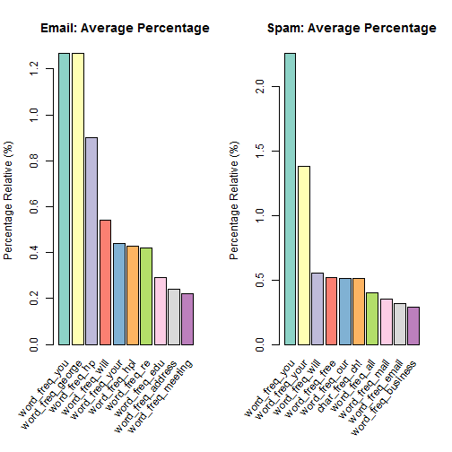

 Madrid Java User Group (Madrid JUG)

Email: Spam or Not Spam  (CLASSIFICATION PROBLEM)
========================================================
This a classification problem (machine learning). 

More info:  
  http://archive.ics.uci.edu/ml/machine-learning-databases/spambase/  
  http://archive.ics.uci.edu/ml/machine-learning-databases/spambase/spambase.names  
  
  57 predictors  
  1 class (spam=1,email=0)   

******
#### May 9, 2013
#### Jose Maria Gomez Hidalgo [@jmgomez](http://twitter.com/jmgomez)
#### Guillermo Santos Garcia [@gsantosgo](http://twitter.com/gsantosgo)
#### This script is licensed under the GPLv2 license http://www.gnu.org/licenses/gpl.html
----------------------------------------------------------------

## Preliminaries
### Set Working Directory

```r
getwd()
```

```
## [1] "C:/Users/gsantos/R/RStats/MadridJUG-DataMining"
```

```r
WORKING_DIR <- "C:/Users/gsantos/R/RStats/MadridJUG-DataMining"
setwd(WORKING_DIR)
getwd()
```

```
## [1] "C:/Users/gsantos/R/RStats/MadridJUG-DataMining"
```


### Load libraries/data/create new variables


```r
#
# install.packages(c('RColorBrewer','gridBase',ElemStatLearn','foreign','tree','rpart','maptree','class','ROCR))
library(RColorBrewer)
library(gridBase)
```

```
## Warning: package 'gridBase' was built under R version 2.15.3
```

```
## Loading required package: grid
```

```r
library(RColorBrewer)
library(ElemStatLearn)
```

```
## Warning: package 'ElemStatLearn' was built under R version 2.15.3
```

```r
library(foreign)
```

```
## Warning: package 'foreign' was built under R version 2.15.3
```

```r
library(tree)
```

```
## Warning: package 'tree' was built under R version 2.15.3
```

```r
library(rpart)
library(maptree)
```

```
## Warning: package 'maptree' was built under R version 2.15.3
```

```
## Loading required package: cluster
```

```r
# install.packages('class') #not work in 2.15.2 library(class) #k Nearest
# Neighbors
library(e1071)  # Support Vector Machine
```

```
## Warning: package 'e1071' was built under R version 2.15.3
```

```
## Loading required package: class
```

```
## Warning: package 'class' was built under R version 2.15.3
```

```r
library(ROCR)
```

```
## Warning: package 'ROCR' was built under R version 2.15.3
```

```
## Loading required package: gplots
```

```
## Loading required package: gtools
```

```
## Attaching package: 'gtools'
```

```
## The following object(s) are masked from 'package:e1071':
## 
## permutations
```

```
## Loading required package: gdata
```

```
## gdata: Unable to locate valid perl interpreter gdata: gdata: read.xls()
## will be unable to read Excel XLS and XLSX files gdata: unless the 'perl='
## argument is used to specify the location gdata: of a valid perl
## intrpreter. gdata: gdata: (To avoid display of this message in the future,
## please gdata: ensure perl is installed and available on the executable
## gdata: search path.)
```

```
## gdata: Unable to load perl libaries needed by read.xls() gdata: to support
## 'XLX' (Excel 97-2004) files.
```

```
## ```

```
## gdata: Unable to load perl libaries needed by read.xls() gdata: to support
## 'XLSX' (Excel 2007+) files.
```

```
## ```

```
## gdata: Run the function 'installXLSXsupport()' gdata: to automatically
## download and install the perl gdata: libaries needed to support Excel XLS
## and XLSX formats.
```

```
## Attaching package: 'gdata'
```

```
## The following object(s) are masked from 'package:stats':
## 
## nobs
```

```
## The following object(s) are masked from 'package:utils':
## 
## object.size
```

```
## Loading required package: caTools
```

```
## Loading required package: bitops
```

```
## Loading required package: KernSmooth
```

```
## KernSmooth 2.23 loaded Copyright M. P. Wand 1997-2009
```

```
## Loading required package: MASS
```

```
## Attaching package: 'gplots'
```

```
## The following object(s) are masked from 'package:stats':
## 
## lowess
```

```r

### Load data
DATASET <- spam
```


### Set Color

```r
COLOR_SYSTEM <- "Set3"
COLORS <- brewer.pal(10, COLOR_SYSTEM)
PAL <- colorRampPalette(COLORS)
```


------

## Exploratory analysis

### Look at the data set


```r
head(DATASET)
```

```
##    A.1  A.2  A.3 A.4  A.5  A.6  A.7  A.8  A.9 A.10 A.11 A.12 A.13 A.14
## 1 0.00 0.64 0.64   0 0.32 0.00 0.00 0.00 0.00 0.00 0.00 0.64 0.00 0.00
## 2 0.21 0.28 0.50   0 0.14 0.28 0.21 0.07 0.00 0.94 0.21 0.79 0.65 0.21
## 3 0.06 0.00 0.71   0 1.23 0.19 0.19 0.12 0.64 0.25 0.38 0.45 0.12 0.00
## 4 0.00 0.00 0.00   0 0.63 0.00 0.31 0.63 0.31 0.63 0.31 0.31 0.31 0.00
## 5 0.00 0.00 0.00   0 0.63 0.00 0.31 0.63 0.31 0.63 0.31 0.31 0.31 0.00
## 6 0.00 0.00 0.00   0 1.85 0.00 0.00 1.85 0.00 0.00 0.00 0.00 0.00 0.00
##   A.15 A.16 A.17 A.18 A.19 A.20 A.21 A.22 A.23 A.24 A.25 A.26 A.27 A.28
## 1 0.00 0.32 0.00 1.29 1.93 0.00 0.96    0 0.00 0.00    0    0    0    0
## 2 0.14 0.14 0.07 0.28 3.47 0.00 1.59    0 0.43 0.43    0    0    0    0
## 3 1.75 0.06 0.06 1.03 1.36 0.32 0.51    0 1.16 0.06    0    0    0    0
## 4 0.00 0.31 0.00 0.00 3.18 0.00 0.31    0 0.00 0.00    0    0    0    0
## 5 0.00 0.31 0.00 0.00 3.18 0.00 0.31    0 0.00 0.00    0    0    0    0
## 6 0.00 0.00 0.00 0.00 0.00 0.00 0.00    0 0.00 0.00    0    0    0    0
##   A.29 A.30 A.31 A.32 A.33 A.34 A.35 A.36 A.37 A.38 A.39 A.40 A.41 A.42
## 1    0    0    0    0    0    0    0    0 0.00    0    0 0.00    0    0
## 2    0    0    0    0    0    0    0    0 0.07    0    0 0.00    0    0
## 3    0    0    0    0    0    0    0    0 0.00    0    0 0.06    0    0
## 4    0    0    0    0    0    0    0    0 0.00    0    0 0.00    0    0
## 5    0    0    0    0    0    0    0    0 0.00    0    0 0.00    0    0
## 6    0    0    0    0    0    0    0    0 0.00    0    0 0.00    0    0
##   A.43 A.44 A.45 A.46 A.47 A.48 A.49  A.50 A.51  A.52  A.53  A.54  A.55
## 1 0.00    0 0.00 0.00    0    0 0.00 0.000    0 0.778 0.000 0.000 3.756
## 2 0.00    0 0.00 0.00    0    0 0.00 0.132    0 0.372 0.180 0.048 5.114
## 3 0.12    0 0.06 0.06    0    0 0.01 0.143    0 0.276 0.184 0.010 9.821
## 4 0.00    0 0.00 0.00    0    0 0.00 0.137    0 0.137 0.000 0.000 3.537
## 5 0.00    0 0.00 0.00    0    0 0.00 0.135    0 0.135 0.000 0.000 3.537
## 6 0.00    0 0.00 0.00    0    0 0.00 0.223    0 0.000 0.000 0.000 3.000
##   A.56 A.57 spam
## 1   61  278 spam
## 2  101 1028 spam
## 3  485 2259 spam
## 4   40  191 spam
## 5   40  191 spam
## 6   15   54 spam
```

```r
dim(DATASET)
```

```
## [1] 4601   58
```

```r
nrow(DATASET)
```

```
## [1] 4601
```

```r
ncol(DATASET)
```

```
## [1] 58
```

```r
colnames(DATASET)
```

```
##  [1] "A.1"  "A.2"  "A.3"  "A.4"  "A.5"  "A.6"  "A.7"  "A.8"  "A.9"  "A.10"
## [11] "A.11" "A.12" "A.13" "A.14" "A.15" "A.16" "A.17" "A.18" "A.19" "A.20"
## [21] "A.21" "A.22" "A.23" "A.24" "A.25" "A.26" "A.27" "A.28" "A.29" "A.30"
## [31] "A.31" "A.32" "A.33" "A.34" "A.35" "A.36" "A.37" "A.38" "A.39" "A.40"
## [41] "A.41" "A.42" "A.43" "A.44" "A.45" "A.46" "A.47" "A.48" "A.49" "A.50"
## [51] "A.51" "A.52" "A.53" "A.54" "A.55" "A.56" "A.57" "spam"
```

```r
sapply(DATASET[1, ], class)
```

```
##       A.1       A.2       A.3       A.4       A.5       A.6       A.7 
## "numeric" "numeric" "numeric" "numeric" "numeric" "numeric" "numeric" 
##       A.8       A.9      A.10      A.11      A.12      A.13      A.14 
## "numeric" "numeric" "numeric" "numeric" "numeric" "numeric" "numeric" 
##      A.15      A.16      A.17      A.18      A.19      A.20      A.21 
## "numeric" "numeric" "numeric" "numeric" "numeric" "numeric" "numeric" 
##      A.22      A.23      A.24      A.25      A.26      A.27      A.28 
## "numeric" "numeric" "numeric" "numeric" "numeric" "numeric" "numeric" 
##      A.29      A.30      A.31      A.32      A.33      A.34      A.35 
## "numeric" "numeric" "numeric" "numeric" "numeric" "numeric" "numeric" 
##      A.36      A.37      A.38      A.39      A.40      A.41      A.42 
## "numeric" "numeric" "numeric" "numeric" "numeric" "numeric" "numeric" 
##      A.43      A.44      A.45      A.46      A.47      A.48      A.49 
## "numeric" "numeric" "numeric" "numeric" "numeric" "numeric" "numeric" 
##      A.50      A.51      A.52      A.53      A.54      A.55      A.56 
## "numeric" "numeric" "numeric" "numeric" "numeric" "numeric" "integer" 
##      A.57      spam 
## "integer"  "factor"
```


### Find number of missing values/check ranges (Results paragraph 1)


```r
sum(is.na(DATASET))
```

```
## [1] 0
```

```r
summary(DATASET)
```

```
##       A.1             A.2              A.3             A.4       
##  Min.   :0.000   Min.   : 0.000   Min.   :0.000   Min.   : 0.00  
##  1st Qu.:0.000   1st Qu.: 0.000   1st Qu.:0.000   1st Qu.: 0.00  
##  Median :0.000   Median : 0.000   Median :0.000   Median : 0.00  
##  Mean   :0.105   Mean   : 0.213   Mean   :0.281   Mean   : 0.07  
##  3rd Qu.:0.000   3rd Qu.: 0.000   3rd Qu.:0.420   3rd Qu.: 0.00  
##  Max.   :4.540   Max.   :14.280   Max.   :5.100   Max.   :42.81  
##       A.5              A.6             A.7             A.8        
##  Min.   : 0.000   Min.   :0.000   Min.   :0.000   Min.   : 0.000  
##  1st Qu.: 0.000   1st Qu.:0.000   1st Qu.:0.000   1st Qu.: 0.000  
##  Median : 0.000   Median :0.000   Median :0.000   Median : 0.000  
##  Mean   : 0.312   Mean   :0.096   Mean   :0.114   Mean   : 0.105  
##  3rd Qu.: 0.380   3rd Qu.:0.000   3rd Qu.:0.000   3rd Qu.: 0.000  
##  Max.   :10.000   Max.   :5.880   Max.   :7.270   Max.   :11.110  
##       A.9            A.10             A.11             A.12      
##  Min.   :0.00   Min.   : 0.000   Min.   :0.0000   Min.   :0.000  
##  1st Qu.:0.00   1st Qu.: 0.000   1st Qu.:0.0000   1st Qu.:0.000  
##  Median :0.00   Median : 0.000   Median :0.0000   Median :0.100  
##  Mean   :0.09   Mean   : 0.239   Mean   :0.0598   Mean   :0.542  
##  3rd Qu.:0.00   3rd Qu.: 0.160   3rd Qu.:0.0000   3rd Qu.:0.800  
##  Max.   :5.26   Max.   :18.180   Max.   :2.6100   Max.   :9.670  
##       A.13            A.14             A.15            A.16       
##  Min.   :0.000   Min.   : 0.000   Min.   :0.000   Min.   : 0.000  
##  1st Qu.:0.000   1st Qu.: 0.000   1st Qu.:0.000   1st Qu.: 0.000  
##  Median :0.000   Median : 0.000   Median :0.000   Median : 0.000  
##  Mean   :0.094   Mean   : 0.059   Mean   :0.049   Mean   : 0.249  
##  3rd Qu.:0.000   3rd Qu.: 0.000   3rd Qu.:0.000   3rd Qu.: 0.100  
##  Max.   :5.550   Max.   :10.000   Max.   :4.410   Max.   :20.000  
##       A.17            A.18            A.19            A.20       
##  Min.   :0.000   Min.   :0.000   Min.   : 0.00   Min.   : 0.000  
##  1st Qu.:0.000   1st Qu.:0.000   1st Qu.: 0.00   1st Qu.: 0.000  
##  Median :0.000   Median :0.000   Median : 1.31   Median : 0.000  
##  Mean   :0.143   Mean   :0.185   Mean   : 1.66   Mean   : 0.086  
##  3rd Qu.:0.000   3rd Qu.:0.000   3rd Qu.: 2.64   3rd Qu.: 0.000  
##  Max.   :7.140   Max.   :9.090   Max.   :18.75   Max.   :18.180  
##       A.21            A.22             A.23            A.24       
##  Min.   : 0.00   Min.   : 0.000   Min.   :0.000   Min.   : 0.000  
##  1st Qu.: 0.00   1st Qu.: 0.000   1st Qu.:0.000   1st Qu.: 0.000  
##  Median : 0.22   Median : 0.000   Median :0.000   Median : 0.000  
##  Mean   : 0.81   Mean   : 0.121   Mean   :0.102   Mean   : 0.094  
##  3rd Qu.: 1.27   3rd Qu.: 0.000   3rd Qu.:0.000   3rd Qu.: 0.000  
##  Max.   :11.11   Max.   :17.100   Max.   :5.450   Max.   :12.500  
##       A.25            A.26             A.27            A.28      
##  Min.   : 0.00   Min.   : 0.000   Min.   : 0.00   Min.   :0.000  
##  1st Qu.: 0.00   1st Qu.: 0.000   1st Qu.: 0.00   1st Qu.:0.000  
##  Median : 0.00   Median : 0.000   Median : 0.00   Median :0.000  
##  Mean   : 0.55   Mean   : 0.265   Mean   : 0.77   Mean   :0.125  
##  3rd Qu.: 0.00   3rd Qu.: 0.000   3rd Qu.: 0.00   3rd Qu.:0.000  
##  Max.   :20.83   Max.   :16.660   Max.   :33.33   Max.   :9.090  
##       A.29             A.30            A.31             A.32      
##  Min.   : 0.000   Min.   :0.000   Min.   : 0.000   Min.   :0.000  
##  1st Qu.: 0.000   1st Qu.:0.000   1st Qu.: 0.000   1st Qu.:0.000  
##  Median : 0.000   Median :0.000   Median : 0.000   Median :0.000  
##  Mean   : 0.099   Mean   :0.103   Mean   : 0.065   Mean   :0.047  
##  3rd Qu.: 0.000   3rd Qu.:0.000   3rd Qu.: 0.000   3rd Qu.:0.000  
##  Max.   :14.280   Max.   :5.880   Max.   :12.500   Max.   :4.760  
##       A.33             A.34            A.35             A.36      
##  Min.   : 0.000   Min.   :0.000   Min.   : 0.000   Min.   :0.000  
##  1st Qu.: 0.000   1st Qu.:0.000   1st Qu.: 0.000   1st Qu.:0.000  
##  Median : 0.000   Median :0.000   Median : 0.000   Median :0.000  
##  Mean   : 0.097   Mean   :0.048   Mean   : 0.105   Mean   :0.097  
##  3rd Qu.: 0.000   3rd Qu.:0.000   3rd Qu.: 0.000   3rd Qu.:0.000  
##  Max.   :18.180   Max.   :4.760   Max.   :20.000   Max.   :7.690  
##       A.37            A.38            A.39             A.40      
##  Min.   :0.000   Min.   :0.000   Min.   : 0.000   Min.   :0.000  
##  1st Qu.:0.000   1st Qu.:0.000   1st Qu.: 0.000   1st Qu.:0.000  
##  Median :0.000   Median :0.000   Median : 0.000   Median :0.000  
##  Mean   :0.137   Mean   :0.013   Mean   : 0.079   Mean   :0.065  
##  3rd Qu.:0.000   3rd Qu.:0.000   3rd Qu.: 0.000   3rd Qu.:0.000  
##  Max.   :6.890   Max.   :8.330   Max.   :11.110   Max.   :4.760  
##       A.41            A.42             A.43            A.44       
##  Min.   :0.000   Min.   : 0.000   Min.   :0.000   Min.   : 0.000  
##  1st Qu.:0.000   1st Qu.: 0.000   1st Qu.:0.000   1st Qu.: 0.000  
##  Median :0.000   Median : 0.000   Median :0.000   Median : 0.000  
##  Mean   :0.044   Mean   : 0.132   Mean   :0.046   Mean   : 0.079  
##  3rd Qu.:0.000   3rd Qu.: 0.000   3rd Qu.:0.000   3rd Qu.: 0.000  
##  Max.   :7.140   Max.   :14.280   Max.   :3.570   Max.   :20.000  
##       A.45             A.46            A.47             A.48       
##  Min.   : 0.000   Min.   : 0.00   Min.   :0.0000   Min.   : 0.000  
##  1st Qu.: 0.000   1st Qu.: 0.00   1st Qu.:0.0000   1st Qu.: 0.000  
##  Median : 0.000   Median : 0.00   Median :0.0000   Median : 0.000  
##  Mean   : 0.301   Mean   : 0.18   Mean   :0.0054   Mean   : 0.032  
##  3rd Qu.: 0.110   3rd Qu.: 0.00   3rd Qu.:0.0000   3rd Qu.: 0.000  
##  Max.   :21.420   Max.   :22.05   Max.   :2.1700   Max.   :10.000  
##       A.49            A.50            A.51            A.52      
##  Min.   :0.000   Min.   :0.000   Min.   :0.000   Min.   : 0.00  
##  1st Qu.:0.000   1st Qu.:0.000   1st Qu.:0.000   1st Qu.: 0.00  
##  Median :0.000   Median :0.065   Median :0.000   Median : 0.00  
##  Mean   :0.039   Mean   :0.139   Mean   :0.017   Mean   : 0.27  
##  3rd Qu.:0.000   3rd Qu.:0.188   3rd Qu.:0.000   3rd Qu.: 0.32  
##  Max.   :4.385   Max.   :9.752   Max.   :4.081   Max.   :32.48  
##       A.53            A.54             A.55             A.56     
##  Min.   :0.000   Min.   : 0.000   Min.   :   1.0   Min.   :   1  
##  1st Qu.:0.000   1st Qu.: 0.000   1st Qu.:   1.6   1st Qu.:   6  
##  Median :0.000   Median : 0.000   Median :   2.3   Median :  15  
##  Mean   :0.076   Mean   : 0.044   Mean   :   5.2   Mean   :  52  
##  3rd Qu.:0.052   3rd Qu.: 0.000   3rd Qu.:   3.7   3rd Qu.:  43  
##  Max.   :6.003   Max.   :19.829   Max.   :1102.5   Max.   :9989  
##       A.57          spam     
##  Min.   :    1   email:2788  
##  1st Qu.:   35   spam :1813  
##  Median :   95               
##  Mean   :  283               
##  3rd Qu.:  266               
##  Max.   :15841
```


### Change Column Names 

```r
newColNames <- c("word_freq_make", "word_freq_address", "word_freq_all", "word_freq_3d", 
    "word_freq_our", "word_freq_over", "word_freq_remove", "word_freq_internet", 
    "word_freq_order", "word_freq_mail", "word_freq_receive", "word_freq_will", 
    "word_freq_people", "word_freq_report", "word_freq_addresses", "word_freq_free", 
    "word_freq_business", "word_freq_email", "word_freq_you", "word_freq_credit", 
    "word_freq_your", "word_freq_font", "word_freq_000", "word_freq_money", 
    "word_freq_hp", "word_freq_hpl", "word_freq_george", "word_freq_650", "word_freq_lab", 
    "word_freq_labs", "word_freq_telnet", "word_freq_857", "word_freq_data", 
    "word_freq_415", "word_freq_85", "word_freq_technology", "word_freq_1999", 
    "word_freq_parts", "word_freq_pm", "word_freq_direct", "word_freq_cs", "word_freq_meeting", 
    "word_freq_original", "word_freq_project", "word_freq_re", "word_freq_edu", 
    "word_freq_table", "word_freq_conference", "char_freq_ch;", "char_freq_ch(", 
    "char_freq_ch[", "char_freq_ch!", "char_freq_ch$", "char_freq_ch#", "capital_run_length_average", 
    "capital_run_length_longest", "capital_run_length_total", "spam")
length(newColNames)
```

```
## [1] 58
```

```r
colnames(DATASET) <- newColNames
colnames(DATASET)
```

```
##  [1] "word_freq_make"             "word_freq_address"         
##  [3] "word_freq_all"              "word_freq_3d"              
##  [5] "word_freq_our"              "word_freq_over"            
##  [7] "word_freq_remove"           "word_freq_internet"        
##  [9] "word_freq_order"            "word_freq_mail"            
## [11] "word_freq_receive"          "word_freq_will"            
## [13] "word_freq_people"           "word_freq_report"          
## [15] "word_freq_addresses"        "word_freq_free"            
## [17] "word_freq_business"         "word_freq_email"           
## [19] "word_freq_you"              "word_freq_credit"          
## [21] "word_freq_your"             "word_freq_font"            
## [23] "word_freq_000"              "word_freq_money"           
## [25] "word_freq_hp"               "word_freq_hpl"             
## [27] "word_freq_george"           "word_freq_650"             
## [29] "word_freq_lab"              "word_freq_labs"            
## [31] "word_freq_telnet"           "word_freq_857"             
## [33] "word_freq_data"             "word_freq_415"             
## [35] "word_freq_85"               "word_freq_technology"      
## [37] "word_freq_1999"             "word_freq_parts"           
## [39] "word_freq_pm"               "word_freq_direct"          
## [41] "word_freq_cs"               "word_freq_meeting"         
## [43] "word_freq_original"         "word_freq_project"         
## [45] "word_freq_re"               "word_freq_edu"             
## [47] "word_freq_table"            "word_freq_conference"      
## [49] "char_freq_ch;"              "char_freq_ch("             
## [51] "char_freq_ch["              "char_freq_ch!"             
## [53] "char_freq_ch$"              "char_freq_ch#"             
## [55] "capital_run_length_average" "capital_run_length_longest"
## [57] "capital_run_length_total"   "spam"
```


### The Class Label

```r
class(DATASET$spam)
```

```
## [1] "factor"
```

```r
levels(DATASET$spam)
```

```
## [1] "email" "spam"
```


### Numbers of Email in Dataset

```r
result <- table(DATASET$spam)
numEmail <- result[["email"]]
numEmail
```

```
## [1] 2788
```

```r
(numEmail/nrow(DATASET)) * 100
```

```
## [1] 60.6
```


### Numbers of Spam in Dataset

```r
numSpam <- result[["spam"]]
numSpam
```

```
## [1] 1813
```

```r
(numSpam/nrow(DATASET)) * 100
```

```
## [1] 39.4
```


### Numbers of Email vs. Numbers of Spam in DataSet

```r
resTable <- table(DATASET$spam)
par(mfrow = c(1, 2))
par(mar = c(5, 4, 4, 2) + 0.1)  # increase y-axis margin.
plot <- plot(DATASET$spam, col = PAL(2), main = "Email vs. Spam", ylim = c(0, 
    4000), ylab = "Examples Number")
text(x = plot, y = resTable + 200, labels = resTable)
percentage <- round(resTable/sum(resTable) * 100)
labels <- paste(row.names(resTable), percentage)  # add percents to labels
labels <- paste(labels, "%", sep = "")  # ad % to labels
pie(resTable, labels = labels, col = PAL(2), main = "Email vs. Spam")
```

 


### Average percentage of words or characters 
 Average percentage of words or characters in an email message
 equal to the indicated word or character. We have chosen the words and characters
 showing the largest difference between spam and email.

```r
dataset.email <- sapply(DATASET[which(DATASET$spam == "email"), 1:54], function(x) ifelse(is.numeric(x), 
    round(mean(x), 2), NA))
dataset.spam <- sapply(DATASET[which(DATASET$spam == "spam"), 1:54], function(x) ifelse(is.numeric(x), 
    round(mean(x), 2), NA))

dataset.email.order <- dataset.email[order(-dataset.email)[1:10]]
dataset.spam.order <- dataset.spam[order(-dataset.spam)[1:10]]

par(mfrow = c(1, 2))
par(mar = c(8, 4, 4, 2) + 0.1)  # increase y-axis margin.
plot <- barplot(dataset.email.order, col = PAL(10), main = "Email: Average Percentage", 
    names.arg = "", ylab = "Percentage Relative (%)")
# text(x=plot,y=dataset.email.order-0.1, labels=dataset.email.order,
# cex=0.6)
vps <- baseViewports()
pushViewport(vps$inner, vps$figure, vps$plot)
grid.text(names(dataset.email.order), x = unit(plot, "native"), y = unit(-1, 
    "lines"), just = "right", rot = 50)
popViewport(3)

plot <- barplot(dataset.spam.order, col = PAL(10), main = "Spam: Average Percentage", 
    names.arg = "", ylab = "Percentage Relative (%)")
# text(x=plot,y=dataset.spam.order-0.1, labels=dataset.spam.order,
# cex=0.6)
vps <- baseViewports()
pushViewport(vps$inner, vps$figure, vps$plot)
grid.text(names(dataset.spam.order), x = unit(plot, "native"), y = unit(-1, 
    "lines"), just = "right", rot = 50)
popViewport(3)
```

 

